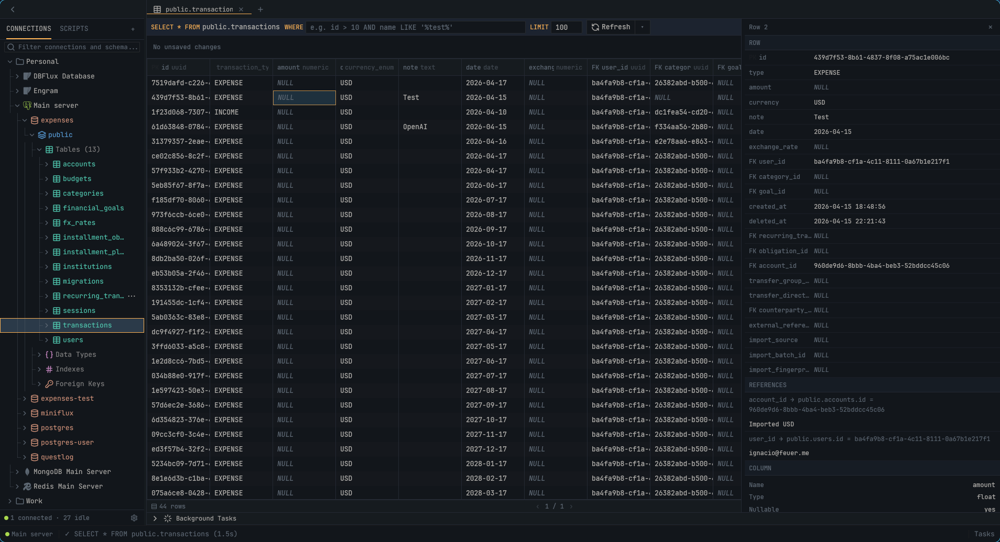

# DBFlux

[English](README.md) · [Español](README.es.md) · **简体中文**

一个可扩展、以键盘操作为先的数据平台，以 Rust + GPUI 桌面客户端的形式交付。

**[dbflux.dev](https://dbflux.dev)** &middot; [文档](https://docs.dbflux.dev/) &middot; [安装](https://docs.dbflux.dev/install/)

## 概览

DBFlux 是一个开源桌面客户端，为关系型与非关系型数据库提供内置驱动。它的核心契约与具体驱动无关，外部驱动可以通过 RPC 接入。

客户端关注性能、简洁的 UX 与以键盘为先的工作流。长期目标是让每一个你使用的数据库，都由一个完全开源的客户端来承载。



## 文档

下面这些内容都会发布在 **[docs.dbflux.dev](https://docs.dbflux.dev/)**，由这些源文件渲染而成，并提供搜索与版本选择器。此处的链接指向源文件；如果你更习惯在站点上阅读，可以直接去站点看。

选择与你目标相符的路径。

### 从这里开始

| 目标                   | 指南                                                                                                                                                         |
|------------------------|--------------------------------------------------------------------------------------------------------------------------------------------------------------|
| 创建连接               | 从[使用指南](docs/USAGE.md#1-first-launch-and-creating-a-connection)开始。SSH 隧道、代理、AWS SSO 与值来源参见[连接数据库 — 高级配置](docs/CONNECTIONS.md)。 |
| 执行查询并掌握常用流程 | 按[使用指南](docs/USAGE.md)执行查询、浏览结果、绘制图表、导出结果并使用键盘导航。                                                                            |
| 查看审计事件           | 按[仪表盘与审计查看器使用指南](docs/DASHBOARDS_AND_AUDIT.md#audit-viewer)打开审计查看器。                                                                    |
| 使用 MCP               | 参见[AI + MCP 集成指南](docs/MCP_AI_INTEGRATION.md)。                                                                                                        |
| 查看驱动支持与限制     | 参见[驱动概览](docs/DRIVERS.md)，它是能力与限制的权威说明。                                                                                                  |

### 更多用户指南

- [设置与 Hooks](docs/SETTINGS.md) — 设置项、连接 Hook 与认证配置文件
- [数据与隐私](docs/DATA_AND_PRIVACY.md) — 数据与密钥的存储、备份与重置
- [Lua 脚本](docs/LUA.md) — 用于 Hook 的内嵌 Lua 运行时

### 贡献者

- [贡献指南](CONTRIBUTING.md) — 环境搭建、检查项与贡献流程
- [核心概念](docs/CONCEPTS.md) — 关于契约与子系统边界的简明心智模型
- [驱动开发](docs/DRIVER_AUTHORING.md) — 选择并实现内置 Rust 驱动或外部 RPC 驱动
- [架构](ARCHITECTURE.md) — 权威的架构与 crate 地图，包含 crate 边界与跨 crate 流程

### 翻译

DBFlux 的翻译工作在 [Hosted Weblate](https://hosted.weblate.org/engage/dbflux/) 上进行。翻译目录位于 `crates/dbflux_i18n/locales/`，每种语言一个 YAML 文件，翻译更新以来自 Weblate 的拉取请求形式送达。[贡献翻译](docs/TRANSLATIONS.md)涵盖了所有可翻译的界面：应用 UI、文档与网站。

<a href="https://hosted.weblate.org/engage/dbflux/"></a>

### 参考

- [图表](docs/CHARTS.md) — 图表类型、列类型与轴的自动检测
- [仪表盘](docs/DASHBOARDS.md) — 仪表盘、已保存图表、实例指标与检查器
- [审计](docs/AUDIT.md) — 审计事件 schema 与脱敏
- [驱动 RPC 协议](docs/DRIVER_RPC_PROTOCOL.md)
- [RPC 服务配置](docs/RPC_SERVICES_CONFIG.md)
- [发布流程](docs/RELEASE.md)
- [代码风格](CODE_STYLE.md)
- [Agent 说明](AGENTS.md)
- [Claude 说明](CLAUDE.md)

## 安装

```bash
# Linux — 安装到 /usr/local
curl -fsSL https://raw.githubusercontent.com/0xErwin1/dbflux/main/scripts/install.sh | sudo bash
```

各平台都有对应的安装包 — tarball、AUR、`.deb`、`.rpm`、AppImage、Nix、macOS DMG 与 Windows 安装程序 — 都放在 [Releases](https://github.com/0xErwin1/dbflux/releases) 页面。完整指南（包括未签名的 macOS 与 Windows 构建所需的 Gatekeeper 与 SmartScreen 步骤）见[安装 DBFlux](docs/INSTALL.md)。

## 功能

### 数据库支持

- **PostgreSQL**，支持 SSL/TLS 模式（Disable、Prefer、Require）
- **Amazon Redshift**，基于 PostgreSQL 线协议的只读 SQL，支持 SSH 隧道与 TLS / 客户端证书
- **MySQL** / MariaDB
- **SQLite**，用于本地数据库文件
- **Microsoft SQL Server**（TDS），支持 TLS、经 SQL Browser 的命名实例路由与多 Schema 检查
- **MongoDB**，支持集合浏览、文档增删改查与 shell 查询生成
- **Redis**，支持全部类型的键浏览（String、Hash、List、Set、Sorted Set、Stream）
- **DynamoDB**，支持表浏览、条目增删改查与 AWS 身份验证
- **InfluxDB** v1 与 v2（v1 为 InfluxQL，v2 为 InfluxQL + Flux）
- **ClickHouse** 与 ClickHouse Cloud，基于 HTTP(S)，支持数据库 / 表发现、可视化 SELECT 与显式的原始 SQL 执行
- **CloudWatch Logs**，支持日志组 / 流浏览与事件流
- **Amazon S3**，支持存储桶浏览、对象预览 / 编辑、完整增删改查与预签名 URL，并兼容 S3 端点（Cloudflare R2、MinIO）
- **基于 RPC 的外部驱动**（通过[驱动 RPC 协议](docs/DRIVER_RPC_PROTOCOL.md)注册进程外驱动）

完整能力矩阵与各驱动限制参见 [docs/DRIVERS.md](docs/DRIVERS.md)。

### 用户界面

- 基于文档的工作区，支持多个结果标签页（类似 DBeaver / VS Code）
- 可折叠、可调整大小的侧边栏，配合 ToggleSidebar 命令（Ctrl+B）
- Schema 树浏览器，针对大型数据库采用延迟加载
- Schema 级元数据：索引、外键、约束、自定义类型（PostgreSQL）
- 每个 Schema 下的存储过程 / 例程文件夹（取决于驱动是否暴露）
- 多标签页 SQL 编辑器，支持语法高亮与多语句执行（驱动支持时，每条语句一个结果集）
- 虚拟化数据表，支持列宽调整、横向滚动与排序
- 表浏览器，支持 `WHERE` 筛选、自定义 `LIMIT` 与分页
- 工作区检查器侧栏，用于查看行 / 文档详情
- 「复制为查询」上下文菜单，可将 INSERT / UPDATE / DELETE 复制为 SQL、MongoDB shell 或 Redis 命令
- 查询预览模态框，按语言提供语法高亮
- 命令面板，支持模糊搜索
- 自定义 toast 通知，支持自动消失
- 后台任务面板
- 会话恢复：启动时恢复已打开的标签页，并对外部修改过的文件做冲突检测

### 可视化查询构建器

- 右侧栏 SELECT 构建器：投影、连接、可嵌套的 `WHERE` 谓词树、`ORDER BY` 与 `LIMIT` / `OFFSET`，并带实时参数化 SQL 预览
- `GROUP BY` 与聚合（`COUNT`、`SUM`、`AVG`、`MIN`、`MAX`）及 `HAVING`
- 可视化 UPDATE / DELETE 构建器，带变更策略（只读 / 需要审批）与可分块、可取消的执行
- 构建器输入框与结果 `WHERE` 筛选框均提供 Schema 感知自动补全
- 结果筛选栏支持关系型筛选：通过点分外键路径（例如 `created_by.email LIKE '%@acme.com'`）
- 当构建器生成的结果与单一表 1:1 映射时，支持内联编辑单元格与删除行
- 按连接保存可视化查询
- 仅支持 SQL 驱动（SQLite、PostgreSQL、MySQL/MariaDB、SQL Server）；架构上与驱动无关

### 图表与可视化

- 可为任意查询或集合结果绘制图表：Line（折线图）、Bar（柱状图）、Scatter（散点图）、Area（面积图）、Stacked Bar（堆叠图）与 Pie（饼图）
- 依据列类型自动检测轴（时间列作 X 轴，数值列作 Y 序列）— 不依赖任何按驱动定制的启发式规则
- 已保存的图表会作为独立的文档标签页重新打开
- 仪表盘：在 12 列网格上排布已保存图表、分隔线与检查器面板，共享同一时间范围
- 每个连接的只读实例概览 — 实时服务器指标与表格化检查器，支持「另存为可编辑」；PostgreSQL、MySQL/MariaDB、MongoDB、Redis 与 SQL Server 均随附实例目录
- 浏览并导入上游提供商的仪表盘（CloudWatch）
- 详见 [docs/CHARTS.md](docs/CHARTS.md) 与 [docs/DASHBOARDS.md](docs/DASHBOARDS.md)

### 连接与访问

- SSH 隧道支持密钥、密码与 agent 认证；SSH 隧道配置可复用
- SOCKS5 / HTTP CONNECT 代理隧道，代理配置可复用
- 托管访问提供程序（AWS SSM），无需暴露端口即可连接
- 由提供程序驱动的认证配置文件（例如 AWS SSO / shared / static），支持从 `~/.aws/config` 导入
- 在预连接（PreConnect）、后连接（PostConnect）、预断开（PreDisconnect）与后断开（PostDisconnect）阶段执行的连接 Hook，可作为命令、脚本或进程内 Lua 执行

### AI 与 MCP 集成

- 内置 Model Context Protocol（MCP）服务器（`dbflux mcp`），供 AI 客户端使用
- 治理层：操作分类、角色 / 策略引擎、受信客户端，以及对写入 / 破坏性操作的人工审批流程
- 参见 [docs/MCP_AI_INTEGRATION.md](docs/MCP_AI_INTEGRATION.md)

### 审计与脚本

- 基于 SQLite 的审计日志，记录查询、连接、Hook、脚本、MCP、治理与配置事件，支持脱敏与查询指纹 — 参见 [docs/AUDIT.md](docs/AUDIT.md)
- 集中式的用户错误上报：失败以 toast 呈现，附带关联 ID 与「在审计中查看」操作，驱动状态栏的错误徽标，并与对应的审计记录相关联
- Lua、Python 与 Bash 脚本以文档形式执行，输出实时流式呈现 — 参见 [docs/LUA.md](docs/LUA.md)

### 键盘导航

- 全局采用 Vim 风格导航（`j` / `k` / `h` / `l`）
- 随上下文变化的快捷键（文档、侧边栏、后台任务）
- 文档聚焦，可在编辑器 / 结果之间导航
- 结果工具栏：`f` 聚焦，`h` / `l` 导航，`Enter` 编辑 / 执行，`Esc` 退出
- `Ctrl+B` 切换侧边栏
- `Ctrl+Tab` / `Ctrl+Shift+Tab` 按最近使用顺序切换标签页

### 查询管理

- 带时间戳的查询历史
- 已保存的查询与收藏
- 在历史与已保存查询中搜索

### 导出

- 按结果形态导出：CSV、JSON（美化 / 紧凑）、文本、二进制（原始 / Hex / Base64）
- 导出格式由结果类型决定（表格、JSON、文本、二进制）

## 开发

### 前置条件

在 Linux 上，本地构建**必须**安装 `mold` 链接器：仓库的 `.cargo/config.toml` 为 `x86_64-unknown-linux-gnu` 目标指定了 `-fuse-ld=mold`，以降低 60 多个 workspace crate 的链接时间与内存占用。Nix 开发 Shell 会自动提供它；非 Nix 环境请用包管理器安装（下方已包含）。Windows 与 macOS 使用各自的默认链接器，不受影响。

**Ubuntu/Debian：**

```bash
sudo apt install pkg-config libssl-dev libdbus-1-dev libxkbcommon-dev mold
```

**Fedora：**

```bash
sudo dnf install pkg-config openssl-devel dbus-devel libxkbcommon-devel mold
```

**Arch：**

```bash
sudo pacman -S pkg-config openssl dbus libxkbcommon mold
```

**macOS：**

```bash
# Xcode Command Line Tools（必需）
xcode-select --install
```

**Windows：**

```powershell
# Visual Studio Build Tools 的 C++ 工作负载（必需）
# 下载地址：https://visualstudio.microsoft.com/visual-cpp-build-tools/
```

### 构建

```bash
cargo build -p dbflux --release
```

### 运行

```bash
cargo run -p dbflux
```

### 命令

```bash
cargo check --workspace                    # 类型检查
cargo clippy --workspace -- -D warnings    # Lint
cargo fmt --all                            # 格式化
cargo test --workspace                     # 测试
```

### 用 nextest 加速测试

[`cargo-nextest`](https://nexte.st) 是本 workspace 推荐的测试运行器：它让每个测试在自己的进程中运行，并统一调度到全局进程池，在这个体量的 workspace 上明显快于 `cargo test`。Nix 开发 Shell 已内置；否则请从 <https://nexte.st/docs/installation> 安装。

```bash
cargo nextest run --workspace              # 单元测试 + 集成测试
cargo test --doc --workspace               # 文档测试（nextest 不运行这些）
```

实时集成测试（通常带 `#[ignore]`）在 nextest 下使用另一个开关：

```bash
cargo nextest run -p dbflux_driver_sqlite --run-ignored all
```

### 网站

`web/` 下的站点是 Astro 静态构建。它从 git 中读取 `docs/`、各驱动的 README、`ARCHITECTURE.md` 与 `CONTRIBUTING.md`，每个已发布版本各读一套，因此只要编辑文档，站点展示的内容就会随之改变。

```bash
cd web
pnpm install
pnpm dev          # 本地服务器
pnpm build        # 静态产物输出到 web/dist
pnpm check        # 类型检查
pnpm format       # prettier
```

发布哪些版本在 `web/versions.json` 中声明。每个条目指定一个 git ref，展示的产品版本号从该 ref 的 `Cargo.toml` 读取。

`DOCS_MODE` 决定文档从哪里提供：`embedded`（默认值，全部内容位于同一源站下的 `/docs/`），或者 `site` 与 `docs`（拆分部署到两个主机）。本地开发使用默认值，因此一条命令即可启动整个站点。

### Nix 开发 Shell

如果你使用 Nix，可以进入包含全部依赖的开发 Shell：

```bash
# 使用 flakes
nix develop

# 传统方式
nix-shell
```

## 许可证

MIT 与 Apache-2.0
