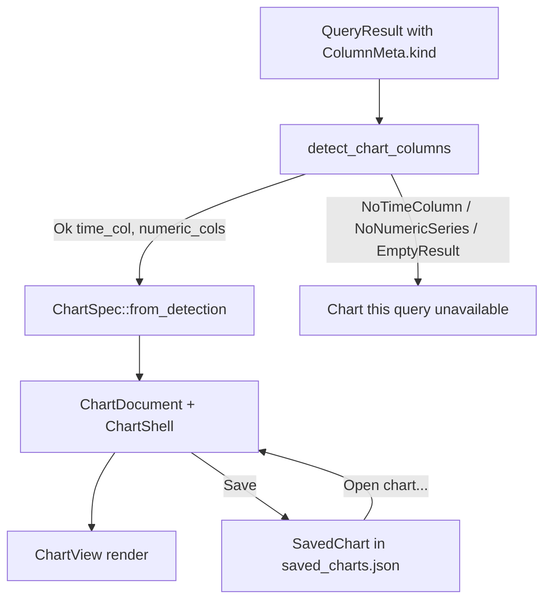

# DBFlux Charting

DBFlux can turn a query result into a chart. The charting engine is fully
driver-agnostic: it inspects only the structured column metadata that every
driver populates, never a driver identifier or a database-specific type-name
string. This document describes the supported chart types, how the engine
auto-detects axes, how charts are persisted, and how a chart is created from
the UI.

## Overview

The chart engine lives in the `dbflux_components` crate under
`crates/dbflux_components/src/chart/`. Its `mod.rs` describes the full
pipeline:

1. `detect` — auto-detects suitable columns from a `QueryResult` using
   `ColumnKind` semantics only.
2. `spec` — chart and series specification types, plus constructors for
   detection-driven and manual column selection.
3. `decimate` — LTTB (Largest-Triangle-Three-Buckets) downsampling to keep
   painting fast on large datasets.
4. `axis` — tick generation and label formatting for numeric and time axes.
5. `legend` — element factory for the legend row.
6. `engine` — `ChartView`, the GPUI entity that owns chart state and renders
   the canvas.

The standalone chart document UI lives in
`crates/dbflux_ui/src/ui/document/chart_document/` (`mod.rs`, `render.rs`,
`pane.rs`). A `ChartDocument` owns a query, a connection, a chart spec, and a
`ChartShell`, and hosts its rendering through the shared `ResultPanel` chrome
in `crates/dbflux_components/src/result_panel/`.

## Chart types

Chart kinds are defined by the `ChartKind` enum in
`crates/dbflux_components/src/chart/spec.rs`:

| Variant | Description |
|---------|-------------|
| `Line` | Line chart. The default kind (`#[default]`); also the kind chosen by every `ChartSpec` constructor. |
| `Bar` | Bar chart. |
| `Scatter` | Scatter chart. |
| `Area` | Filled line chart; the area between the series line and the baseline is shaded. Shares Line's geometry and hover behaviour. |
| `StackedBar` | Stacked vertical bars. Each X position shows one bar per series, stacked cumulatively rather than grouped side-by-side. The Y axis is re-scaled at render time to the maximum stack sum. |
| `Pie` | Pie chart. No X/Y axes; each visible series becomes one wedge sized by the sum of that series' Y values. |

`ChartKind` carries `#[serde(default)]` semantics on the containing
`ChartSpec.kind` field, so serialized chart specs that predate the `kind` field
deserialize to `Line`.

## ColumnKind and axis auto-detection

### ColumnKind

Auto-detection is driven entirely by the `ColumnKind` enum defined in
`crates/dbflux_core/src/query/types.rs`:

| Variant | Meaning |
|---------|---------|
| `Timestamp` | A date/time or timestamp column. |
| `Float` | A floating-point numeric column. |
| `Integer` | An integer numeric column. |
| `Text` | A text/string column. |
| `Unknown` | The driver could not classify this column. |

Each driver is responsible for setting `ColumnMeta::kind` on every column it
returns (see the "Adding a New Driver" rules in `CLAUDE.md`). Columns left as
`Unknown` are never used as chart axes or series.

### Auto-detection rules

`detect_chart_columns` in `crates/dbflux_components/src/chart/detect.rs` applies
these rules, in order, to a `QueryResult`:

1. If the result has zero rows, return `EmptyResult`.
2. Pick the leftmost column with `kind == Timestamp` as the X axis. If none
   exists, return `NoTimeColumn`.
3. Collect every other column with `kind == Float` or `kind == Integer`, in
   column order, as the numeric Y series. If none remain, return
   `NoNumericSeries`.
4. Otherwise return `Ok { time_col, numeric_cols }`.

The outcome is the `ChartDetection` enum, whose variants are `Ok`,
`NoTimeColumn`, `NoNumericSeries`, and `EmptyResult`.

### Why `type_name` and driver IDs are never inspected

The module-level documentation in `detect.rs` states that the detection module
is the boundary between the query-result model and the chart engine, and that it
inspects `ColumnKind` values — never `type_name` strings or driver identifiers.
The `detect_chart_columns` function reads only `column.kind`; it never reads
`column.type_name`, `column.name`, or any driver ID. This keeps the engine
fully decoupled from specific drivers, matching the driver/UI decoupling rule in
`CLAUDE.md`: a driver makes its columns chartable purely by classifying them
with the correct `ColumnKind`.

Because `Unknown` is neither `Timestamp` nor `Float`/`Integer`, an unclassified
column can be neither an auto-detected X axis nor an auto-detected series. This
is intentional: it forces drivers to classify columns rather than letting the
engine guess from type strings.

### Axis-kind inference

When a `ChartSpec` is built, the X axis kind is inferred from the X column's
`ColumnKind`: `Timestamp` maps to `AxisKind::Time` (ticks formatted as
dates/times), everything else maps to `AxisKind::Numeric` (decimal ticks). The
`AxisSpec.unit` field is currently always `None`; it is a forward-compatibility
seam for future driver-supplied unit metadata.

### Numeric value extraction

When the engine extracts a numeric value from a cell (`extract_f64` in
`engine.rs`), it handles several `Value` shapes:

- `Value::Int` → cast to `f64`.
- `Value::Float` → used directly when finite; non-finite values are dropped.
- `Value::Decimal` (stored as a string to preserve precision) → parsed lossily
  to `f64`, dropping non-finite or unparseable values. Drivers that classify
  `NUMERIC`/`DECIMAL` columns as `ColumnKind::Float` (for example PostgreSQL
  `NUMERIC`, MSSQL `DECIMAL`) flow through this path.
- `Value::Bool` → `true` maps to `1.0`, `false` to `0.0`, so `BIT`/`BOOLEAN`
  columns that some drivers classify as `Integer` (for example MSSQL `BIT`)
  remain plottable.
- `Value::Text` is parsed only for the time axis, as an RFC 3339 timestamp.
- `Value::Null` and all other shapes yield no value.

## Saved charts

A persisted chart is a `SavedChart` record, defined in
`crates/dbflux_components/src/saved_chart.rs`. Saved charts are stored as JSON
in `~/.config/dbflux/saved_charts.json` through `SavedChartStore` (a
`JsonStore<SavedChart>` type alias) and managed by `SavedChartManager`.

A `SavedChart` persists:

- `id`, `name`, `profile_id` — identity, display name, and owning connection
  profile.
- `source` — a `SavedChartSource`, either `Query { query }` (a query string
  executed inside a `ChartDocument`) or `Collection { collection_ref,
  time_window }` (a collection-browse source).
- `chart_spec` and `bindings` — the full rendering configuration (`ChartSpec`
  and `BindingSpec`).
- `time_range_preset`, `refresh_policy`, `created_at`, `updated_at`.

Only the query string (or collection reference) is persisted; raw result data
is never stored.

### Opening a saved chart

`Workspace::open_saved_chart` (in
`crates/dbflux_ui/src/ui/views/workspace/actions.rs`) routes by source type:

- `Query` sources open a standalone `ChartDocument` via
  `ChartDocument::from_saved`. `from_saved` and `validate_saved_source` reject
  `Collection` sources; the workspace validates the source before allocating the
  entity.
- `Collection` sources do not open a `ChartDocument`; they re-open the
  underlying `DataDocument` in chart mode via `open_collection_document`.

### Deduplication

Open chart documents are deduplicated through the `DocumentKey::Chart {
saved_chart_id: Uuid }` variant in
`crates/dbflux_ui/src/ui/document/dedup.rs`. Before opening a saved chart,
`open_saved_chart` calls `tab_manager.find_by_key(&DocumentKey::Chart { ... })`
and activates the existing tab instead of opening a duplicate. A chart document
created from an ad-hoc "Chart this query" action is not yet linked to a saved ID
and therefore is not deduplicated until it is saved.

## Creating a chart in the UI

There are two entry points.

### Chart this query

A data grid's context menu offers a "Chart this query" item. The item is gated
by `can_chart_from_context_menu` in
`crates/dbflux_ui/src/ui/document/data_grid_panel/context_menu.rs`, which
requires both:

1. The panel's source is a `QueryResult` with a non-empty original query, and
2. `detect_chart_columns` on the current result returns `Ok`.

Selecting the item calls `Workspace::open_chart_from_query`, which constructs a
`ChartDocument::new` seeded with the query and connection, wraps it in a
`PaneHandle` via `ChartDocument::into_pane`, and opens it as a new tab. A
non-empty query causes the document to auto-execute on its first render.

### Open chart...

The "Open chart..." command lists saved charts (built by
`build_saved_chart_palette_items`) for the active profile, and opens the
selected chart via `open_saved_chart` as described above.

### Saving

Inside a `ChartDocument`, the Save toolbar button opens a name prompt and then
calls `confirm_save`, which builds a `ChartSpec` from the last result (using
`detect_chart_columns` / `ChartSpec::from_detection` when detection succeeds)
and upserts a `SavedChart` into the app state's `saved_charts` manager. Saving
reuses the existing `saved_chart_id` when present so the record is overwritten
rather than duplicated.

## Limitations

These limitations are grounded in the current code, not assumptions:

- Auto-detection requires at least one `Timestamp` column to pick an X axis;
  without one, `detect_chart_columns` returns `NoTimeColumn` and "Chart this
  query" is unavailable. (Manual selection through `BindingSpec` /
  `ChartSpec::from_bindings` can use a non-timestamp X column, which is then
  classified as an `AxisKind::Numeric` axis.)
- Columns with `ColumnKind::Unknown` are excluded from auto-detection entirely.
- `Collection`-source saved charts cannot be opened as a `ChartDocument`; they
  re-open the underlying `DataDocument` in chart mode instead. Passing a
  `Collection` source to `ChartDocument::from_saved` returns an error.
- `AxisSpec.unit` is always `None` in this version; drivers do not yet supply
  unit metadata.
- Every `ChartSpec` constructor (`from_detection`, `from_bindings`,
  `from_manual_selection`) produces a spec with `kind = ChartKind::Line`; the
  other chart kinds are selected after construction.
- Series decimation uses an LTTB threshold whose default is 10,000 points
  (`default_decimation_threshold`).
</content>
</invoke>
