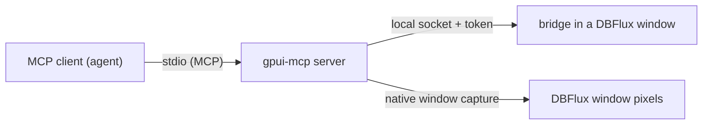

# UI automation for agents

DBFlux can be built with an automation bridge that lets an AI agent, or any MCP
client, drive a running DBFlux window the way a browser automation tool drives a
web page: read the element tree, click, type, press keys and take screenshots.

This is a development and testing tool. It is off by default, it is not part of
any release build, and it must never be shipped to users.

It is separate from the database MCP server described in
[AI + MCP](MCP_AI_INTEGRATION.md). `dbflux mcp` gives an agent governed access to
your databases. The UI automation server gives an agent control of the DBFlux
interface itself.

## How it works

Two pieces are involved, both vendored from
[themixednuts/gpui-mcp](https://github.com/themixednuts/gpui-mcp) under
`vendor/gpui-mcp/`:

- **The bridge** (`gpui-mcp`), compiled into DBFlux by the `ui-automation`
  feature. Each DBFlux window (main window, settings, connection manager, SSO
  wizard) gets its own bridge. It observes every rendered frame, builds a
  semantic element tree from GPUI's accessibility data and injects synthetic
  input through GPUI's normal event pipeline.
- **The MCP server** (`gpui-mcp-server`, binary `gpui-mcp`), a separate program
  the agent starts over stdio. It discovers running bridges, forwards tool calls
  to the selected one and captures screenshots of the window from outside the
  process.



## Trust model

- The bridge listens on a local socket that only the user running DBFlux can
  open. On Linux it lives under `$XDG_RUNTIME_DIR/gpui-mcp/`, which is private to
  that user.
- Each bridge writes a discovery descriptor (mode `0600`) with a random 256-bit
  token. The server must present the token on every request, and the bridge also
  checks that the connecting process runs as the same user.
- Any process running as your user can therefore read the descriptor and control
  DBFlux. That includes every string DBFlux draws: connection names, hosts, query
  text and query results. Only enable the feature on a machine and account you
  trust, and only for development or testing.
- The bridge acts as the user. A query an agent types into an editor and runs
  goes through the same path as one you type yourself, not through the database
  MCP server, so the MCP policies, approvals and MCP audit trail do not apply to
  it. Do not point an automation session at a connection whose data you would
  not let an unattended script modify.
- The descriptor is removed when the window closes or DBFlux exits.

## Building

The bridge is behind the `ui-automation` Cargo feature, which no release build
enables:

```sh
cargo build -p dbflux --features ui-automation
cargo build -p gpui-mcp-server
```

The first command builds DBFlux with its default features plus the bridge. The
second builds the server as `target/debug/gpui-mcp`. A plain
`cargo build -p dbflux` does not compile the server, its screen capture backend
or its MCP stack.

On Linux the server's capture backend links PipeWire, libgbm, EGL and xcb-randr,
and generates bindings with bindgen, so it needs their development packages and
libclang. The Nix dev shell (`nix develop`) provides them. On Debian or Ubuntu:

```sh
sudo apt-get install libpipewire-0.3-dev libgbm-dev libegl-dev libxcb-randr0-dev libclang-dev
```

## Running DBFlux for automation

Start DBFlux as usual. The bridge starts with the first window and logs the path
of its descriptor at `info` level.

### Wayland compositors: run under XWayland

Screenshots are taken from outside the process with the operating system's
window capture. On Linux that works for X11 windows only: Wayland compositors do
not let one program capture another program's window without an interactive
permission prompt. The element tree and input go through GPUI itself and do not
use window capture, but screenshots need DBFlux to run as an X11 client.

On a Wayland session (Hyprland, Sway, GNOME, KDE), run DBFlux under XWayland by
clearing `WAYLAND_DISPLAY`, which makes GPUI pick its X11 backend:

```sh
WAYLAND_DISPLAY= GPUI_X11_SCALE_FACTOR=1 cargo run -p dbflux --features ui-automation
```

`GPUI_X11_SCALE_FACTOR` sets the UI scale. Without it, and without an `Xft.dpi`
X resource, GPUI's X11 backend derives the scale from the monitor's reported
physical size, which can differ from the scale your compositor uses for native
Wayland windows (a 1920x1080 laptop panel at compositor scale 1 was measured at
1.5). Set it to the scale your compositor applies to the monitor.

To keep a test run away from your real configuration and database, point the XDG
directories at a scratch location:

```sh
export XDG_DATA_HOME=/tmp/dbflux-test/data XDG_CONFIG_HOME=/tmp/dbflux-test/config \
       XDG_STATE_HOME=/tmp/dbflux-test/state XDG_CACHE_HOME=/tmp/dbflux-test/cache
```

`XDG_RUNTIME_DIR` must stay the same for DBFlux and the server, because both use
it to find the bridge descriptors.

## Registering the server with an MCP client

The server speaks MCP over stdio. With Claude Code:

```sh
claude mcp add dbflux-ui -- /absolute/path/to/dbflux/target/debug/gpui-mcp --app-id dbflux
```

For clients configured with a JSON file:

```json
{
  "mcpServers": {
    "dbflux-ui": {
      "command": "/absolute/path/to/dbflux/target/debug/gpui-mcp",
      "args": ["--app-id", "dbflux"]
    }
  }
}
```

The server finds every instrumented GPUI application of the current user by
itself. Its options narrow or relocate that search:

| Option | Effect |
|---|---|
| `--app-id <ID>` | Only discover applications with this identifier. DBFlux uses `dbflux` (stable, release candidate and development builds) or `dbflux-nightly`. |
| `--endpoint <PATH>` | Only use this one descriptor file. Cannot be combined with `--app-id` or `--endpoint-dir`. |
| `--endpoint-dir <DIR>` | Look for descriptors in this directory instead of the default one. |
| `--artifact-dir <DIR>` | Where video recordings are written. Defaults to a private directory under `$XDG_RUNTIME_DIR/gpui-mcp/artifacts/`. |

On Linux the server needs `DISPLAY` to reach the X server DBFlux runs on. An
agent started from a terminal in a Wayland session normally inherits it.

## Tools

Every DBFlux window is a separate target. When only one is open it is selected
automatically. With several (for example the main window and the settings
window), call `list_apps` and then `select_app`.

- **Connection**: `list_apps`, `select_app`, `ping`, `check_connection`.
- **Element tree**: `get_ui_tree`, `find_elements`, `get_element`,
  `get_element_bounds`, `get_element_state`, `get_text_info`, `get_value`,
  `get_selection_count`, `wait_for_element`, `wait_for_state`.
- **Tree snapshots**: `save_ui_snapshot`, `load_ui_snapshot`,
  `diff_ui_snapshots`, `diff_current_ui`.
- **Element input**: `click_element`, `double_click_element`, `hover_element`,
  `focus_element`, `drag_element`, `scroll`, `set_text`, `set_value`.
- **Pointer input**: `click_coordinates`, `drag_coordinates`, `pointer_click`,
  `pointer_down`, `pointer_up`, `pointer_move`, `pointer_drag`,
  `pointer_scroll`, `pointer_location`.
- **Keyboard**: `keyboard` (one keystroke in GPUI syntax, such as `ctrl-a` or
  `enter`), `type_text`.
- **Screenshots**: `screenshot`, `screenshot_region`, `screenshot_element`,
  `capture_screenshot_snapshot`, `compare_screenshots`, `diff_screenshots`.
- **Visual aids and video**: `highlight_elements`, `clear_highlights`,
  `start_video_recording`, `stop_video_recording` (H.264 in MP4).
- **Diagnostics**: `get_frame_stats`, `get_performance_report`,
  `record_performance`, `get_logs`, `clear_logs`.
- **Not used by DBFlux**: `list_app_commands`, `execute_app_command`,
  `get_live_document` and `preview_live_document` depend on application opt-ins
  that DBFlux does not provide, and DBFlux publishes no application logs to the
  bridge, so `get_logs` returns nothing.

Coordinates are logical window pixels, the same units as the bounds in the
element tree. Screenshots are in physical pixels, so they are larger by the UI
scale.

## Secrets

Inputs that hold a secret (passwords, tokens, keys, any connection-form field a
driver marks as secret) use GPUI's password content type, which keeps their
value out of the accessibility data the bridge reads. The value does not appear
in any label, text or value that `get_ui_tree`, `get_text_info` or `get_value`
return, even while the show-password toggle displays it in plain text.

Screenshots and recordings are pixels. A secret drawn in plain text on screen is
visible in them.

## Limitations

- No screenshots of native Wayland windows. Run under XWayland as described
  above.
- Running under XWayland exercises GPUI's X11 backend, not its Wayland backend.
  Behavior that differs between the two (input methods, window decorations,
  clipboard, scaling) is not covered by an automated session.
- A disabled auth-profile password field that shows an inherited value is drawn
  as plain text and is not marked as secret, so that value is visible on screen
  and in the element tree. RPC service environment values and connection value
  source inputs carry no secret metadata and are not redacted either.
- On Linux the server may log `Ignoring a wl_output with version < 4` errors from
  its capture library at startup. They do not affect X11 capture.
- The macOS and Windows capture paths come from upstream (CoreGraphics and
  Windows Graphics Capture) and have not been exercised with DBFlux.
