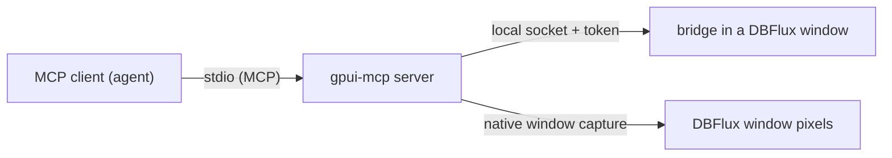
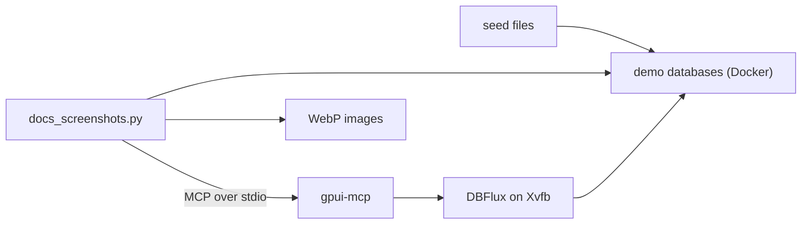

# UI automation for agents

DBFlux can be built with an automation bridge that lets an AI agent, or any MCP
client, drive a running DBFlux window the way a browser automation tool drives a
web page: read the element tree, click, type, press keys and take screenshots.

This is a development and testing tool. It is off by default, it is not part of
any release build, and it must never be shipped to users.

It is separate from the database MCP server described in
[AI + MCP](MCP_AI_INTEGRATION.md). `dbflux mcp` gives an agent governed access to
your databases. The UI automation server gives an agent control of the DBFlux
interface itself.

## How it works

Two pieces are involved, both vendored from
[themixednuts/gpui-mcp](https://github.com/themixednuts/gpui-mcp) under
`vendor/gpui-mcp/`:

- **The bridge** (`gpui-mcp`), compiled into DBFlux by the `ui-automation`
  feature. Each DBFlux window (main window, settings, connection manager, SSO
  wizard) gets its own bridge. It observes every rendered frame, builds a
  semantic element tree from GPUI's accessibility data and injects synthetic
  input through GPUI's normal event pipeline.
- **The MCP server** (`gpui-mcp-server`, binary `gpui-mcp`), a separate program
  the agent starts over stdio. It discovers running bridges, forwards tool calls
  to the selected one and captures screenshots of the window from outside the
  process.


```mermaid
flowchart LR
    Agent["MCP client (agent)"] -- "stdio (MCP)" --> Server["gpui-mcp server"]
    Server -- "local socket + token" --> Bridge["bridge in a DBFlux window"]
    Server -- "native window capture" --> Window["DBFlux window pixels"]
```

## Trust model

- The bridge listens on a local socket that only the user running DBFlux can
  open. On Linux it lives under `$XDG_RUNTIME_DIR/gpui-mcp/`, which is private to
  that user.
- Each bridge writes a discovery descriptor (mode `0600`) with a random 256-bit
  token. The server must present the token on every request, and the bridge also
  checks that the connecting process runs as the same user.
- Any process running as your user can therefore read the descriptor and control
  DBFlux. That includes every string DBFlux draws: connection names, hosts, query
  text and query results. Only enable the feature on a machine and account you
  trust, and only for development or testing.
- The bridge acts as the user. A query an agent types into an editor and runs
  goes through the same path as one you type yourself, not through the database
  MCP server, so the MCP policies, approvals and MCP audit trail do not apply to
  it. Do not point an automation session at a connection whose data you would
  not let an unattended script modify.
- The descriptor is removed when the window closes or DBFlux exits.

## Building

The bridge is behind the `ui-automation` Cargo feature, which no release build
enables:

```sh
cargo build -p dbflux --features ui-automation
cargo build -p gpui-mcp-server
```

The first command builds DBFlux with its default features plus the bridge. The
second builds the server as `target/debug/gpui-mcp`. A plain
`cargo build -p dbflux` does not compile the server, its screen capture backend
or its MCP stack.

On Linux the server's capture backend links PipeWire, libgbm, EGL and xcb-randr,
and generates bindings with bindgen, so it needs their development packages and
libclang. The Nix dev shell (`nix develop`) provides them. On Debian or Ubuntu:

```sh
sudo apt-get install libpipewire-0.3-dev libgbm-dev libegl-dev libxcb-randr0-dev libclang-dev
```

## Running DBFlux for automation

Start DBFlux as usual. The bridge starts with the first window and logs the path
of its descriptor at `info` level.

### Wayland compositors: run under XWayland

Screenshots are taken from outside the process with the operating system's
window capture. On Linux that works for X11 windows only: Wayland compositors do
not let one program capture another program's window without an interactive
permission prompt. The element tree and input go through GPUI itself and do not
use window capture, but screenshots need DBFlux to run as an X11 client.

On a Wayland session (Hyprland, Sway, GNOME, KDE), run DBFlux under XWayland by
clearing `WAYLAND_DISPLAY`, which makes GPUI pick its X11 backend:

```sh
WAYLAND_DISPLAY= GPUI_X11_SCALE_FACTOR=1 cargo run -p dbflux --features ui-automation
```

`GPUI_X11_SCALE_FACTOR` sets the UI scale. Without it, and without an `Xft.dpi`
X resource, GPUI's X11 backend derives the scale from the monitor's reported
physical size, which can differ from the scale your compositor uses for native
Wayland windows (a 1920x1080 laptop panel at compositor scale 1 was measured at
1.5). Set it to the scale your compositor applies to the monitor.

To keep a test run away from your real configuration and database, point the XDG
directories at a scratch location:

```sh
export XDG_DATA_HOME=/tmp/dbflux-test/data XDG_CONFIG_HOME=/tmp/dbflux-test/config \
       XDG_STATE_HOME=/tmp/dbflux-test/state XDG_CACHE_HOME=/tmp/dbflux-test/cache
```

`XDG_RUNTIME_DIR` must stay the same for DBFlux and the server, because both use
it to find the bridge descriptors.

## Registering the server with an MCP client

The server speaks MCP over stdio. With Claude Code:

```sh
claude mcp add dbflux-ui -- /absolute/path/to/dbflux/target/debug/gpui-mcp --app-id dbflux
```

For clients configured with a JSON file:

```json
{
  "mcpServers": {
    "dbflux-ui": {
      "command": "/absolute/path/to/dbflux/target/debug/gpui-mcp",
      "args": ["--app-id", "dbflux"]
    }
  }
}
```

The server finds every instrumented GPUI application of the current user by
itself. Its options narrow or relocate that search:

| Option | Effect |
|---|---|
| `--app-id <ID>` | Only discover applications with this identifier. DBFlux uses `dbflux` (stable, release candidate and development builds) or `dbflux-nightly`. |
| `--endpoint <PATH>` | Only use this one descriptor file. Cannot be combined with `--app-id` or `--endpoint-dir`. |
| `--endpoint-dir <DIR>` | Look for descriptors in this directory instead of the default one. |
| `--artifact-dir <DIR>` | Where video recordings are written. Defaults to a private directory under `$XDG_RUNTIME_DIR/gpui-mcp/artifacts/`. |

On Linux the server needs `DISPLAY` to reach the X server DBFlux runs on. An
agent started from a terminal in a Wayland session normally inherits it.

## Tools

Every DBFlux window is a separate target. When only one is open it is selected
automatically. With several (for example the main window and the settings
window), call `list_apps` and then `select_app`.

- **Connection**: `list_apps`, `select_app`, `ping`, `check_connection`.
- **Element tree**: `get_ui_tree`, `find_elements`, `get_element`,
  `get_element_bounds`, `get_element_state`, `get_text_info`, `get_value`,
  `get_selection_count`, `wait_for_element`, `wait_for_state`, `wait_for_idle`.
- **Tree snapshots**: `save_ui_snapshot`, `load_ui_snapshot`,
  `diff_ui_snapshots`, `diff_current_ui`.
- **Element input**: `click_element`, `double_click_element`, `hover_element`,
  `focus_element`, `drag_element`, `scroll`, `set_text`, `set_value`.
- **Pointer input**: `click_coordinates`, `drag_coordinates`, `pointer_click`,
  `pointer_down`, `pointer_up`, `pointer_move`, `pointer_drag`,
  `pointer_scroll`, `pointer_location`.
- **Keyboard**: `keyboard` (one keystroke in GPUI syntax, such as `ctrl-a` or
  `enter`), `type_text`.
- **Screenshots**: `screenshot`, `screenshot_region`, `screenshot_element`,
  `capture_screenshot_snapshot`, `compare_screenshots`, `diff_screenshots`.
- **Visual aids and video**: `highlight_elements`, `clear_highlights`,
  `start_video_recording`, `stop_video_recording` (H.264 in MP4).
- **Diagnostics**: `get_frame_stats`, `get_performance_report`,
  `record_performance`, `get_logs`, `clear_logs`.
- **Not used by DBFlux**: `list_app_commands`, `execute_app_command`,
  `get_live_document` and `preview_live_document` depend on application opt-ins
  that DBFlux does not provide, and DBFlux publishes no application logs to the
  bridge, so `get_logs` returns nothing.

Text inputs are addressed by the id of the input element (for example
`cm-field-host`). `set_text` and `set_value` replace the whole value through the
input's accessibility action, so the input does not need to be focused first.
To type into an input instead, call `focus_element` or `click_element` on it,
and then `type_text`. Both click inside the text area, a third of the input's
width from its left edge and at most 40 pixels from it, which focuses the editor
and stays clear of a leading icon and of the clear and show-password buttons at
the right edge. The caret lands where the click did, so `type_text` inserts
there. Send `keyboard` with `end` first to append. On any other element
`focus_element` moves focus without clicking.

Read-only inputs, such as the audit viewer's event details, the object
browser's decoded preview and the query builder's SQL preview, report
`read_only: true` in `get_element_state` and in the element tree. `set_text` and
`set_value` refuse them with an error that says the element is read-only, and
DBFlux itself ignores a value sent to them, so their text does not change. They
can still be clicked, focused and selected.

Coordinates are logical window pixels, the same units as the bounds in the
element tree. Screenshots are in physical pixels, so they are larger by the UI
scale.

A screenshot is taken only after DBFlux has presented a new frame to the display
server. On Linux the server then captures the window every 16 ms until two
consecutive captures are identical, so a screenshot taken right after an action
shows the result of that action rather than the previous frame. A window that
keeps changing, for example because of a spinner, is captured as it is after
about one second instead of failing.

To wait until the interface has settled before a screenshot or an assertion,
call `wait_for_idle`. It succeeds once the element tree has not changed and the
window has drawn at most one frame over 500 ms, so the blinking caret of a
focused input does not keep it waiting. `timeout_ms` defaults to 5000 and must
be between 500 and 30000.

## Secrets

Inputs that hold a secret (passwords, tokens, keys, any connection-form field a
driver marks as secret) use GPUI's password content type, which keeps their
value out of the accessibility data the bridge reads. The value does not appear
in any label, text or value that `get_ui_tree`, `get_text_info` or `get_value`
return, even while the show-password toggle displays it in plain text.

Screenshots and recordings are pixels. A secret drawn in plain text on screen is
visible in them.

## Regenerating documentation screenshots

`scripts/docs_screenshots.py` produces the screenshots used by the
documentation. It starts demo databases in Docker, runs DBFlux on a headless X
server, drives it through `gpui-mcp` and writes one light and one dark WebP per
shot to `docs/images/<page>/<name>-light.webp` and `<name>-dark.webp`. No window
opens on your desktop.


```mermaid
flowchart LR
    Seed["seed files"] --> Docker["demo databases (Docker)"]
    Script["docs_screenshots.py"] --> Docker
    Script -- "MCP over stdio" --> Server["gpui-mcp"]
    Server --> App["DBFlux on Xvfb"]
    App --> Docker
    Script --> Images["WebP images"]
```

The images show the English interface. Every locale of the documentation uses
the same files.

### Prerequisites

- Docker, with its daemon running. The script starts PostgreSQL, MongoDB and
  Redis containers named `dbflux-docs-*`, bound to `127.0.0.1` on ports 55432,
  57017 and 56379, and removes them when it finishes or fails.
- The Nix dev shell, which provides Xvfb, xdotool, `cwebp` and Mesa's software
  Vulkan driver. The script reads the driver's ICD file from
  `DBFLUX_DOCS_VULKAN_ICD`, which the dev shell sets. Outside it, install those
  tools and pass `--vulkan-icd <mesa>/share/vulkan/icd.d/lvp_icd.x86_64.json`.
- The two binaries:

  ```sh
  cargo build --release -p dbflux --features ui-automation
  cargo build -p gpui-mcp-server
  ```

- No other DBFlux release build running on the machine. A second instance of the
  same build profile hands over to the running one through the app-control
  socket and exits, and the script reports that.

### Running

```sh
nix develop -c python3 scripts/docs_screenshots.py
```

| Option | Effect |
|---|---|
| `--out <DIR>` | Where the images go. Defaults to `docs/images`. |
| `--only <PAGE/NAME>` | Take only this shot, such as `usage/main-window`. Repeat it for several. |
| `--theme light\|dark\|both` | Which themes to capture. Defaults to both. |
| `--keep-running` | Leave the containers, Xvfb and the DBFlux process of the last or the failed shot running, to inspect them. |
| `--dbflux <PATH>`, `--gpui-mcp <PATH>` | The binaries. Default to `target/release/dbflux` and `target/debug/gpui-mcp`. |
| `--launcher "<COMMAND>"` | A command that prefixes both binaries. Use it to start them through a specific dynamic loader when they were built against a different glibc than the shell provides, for example `--launcher "$GLIBC/lib/ld-linux-x86-64.so.2 --library-path $GLIBC/lib:$LD_LIBRARY_PATH"`. |
| `--vulkan-icd <PATH>` | The ICD file of a software Vulkan driver, when `DBFLUX_DOCS_VULKAN_ICD` is not set. |
| `--work-dir <DIR>` | Scratch directory for the DBFlux profile, the SQLite demo file and the logs. Defaults to `/tmp/dbflux-docs` and is wiped at the start of every run. |

A run takes a few minutes. Under software rendering DBFlux draws about one frame
per second, so every step waits for the state it expects instead of for a fixed
time, and repeats an input that did not take effect.

The run first launches DBFlux to dismiss the first-run dialog, turn off the
update check and select the theme in Settings, and saves that profile. It then
launches DBFlux again to create one connection per demo database through the
Connection Manager, and saves a second profile with the connections. Every shot
starts in a fresh DBFlux process from a copy of one of the two, so a shot looks
the same whether it runs alone or with the others. The profile without
connections is only built for the other theme when a selected shot needs it. The main window is resized to 1600 by
900 logical pixels at a UI scale of 2, and each image is scaled down to one
pixel per logical pixel.

Two runs give the same images except for values DBFlux measures, such as the
connection latency and query durations in the sidebar, the result footer and the
status bar.

When a step fails, the script saves the window at that moment next to the logs
in `<work-dir>/logs/` and prints its path.

### Adding a shot

Shots are declared in `scripts/docs_screenshots/shots.py`. A shot is one `Shot`
entry: the documentation page, a name, and the steps that bring a freshly
started DBFlux, with the demo connections saved and nothing connected unless the
shot asks otherwise, into the state to capture.

```python
Shot(
    page="usage",
    name="main-window",
    steps=(
        *open_sidebar_item(POSTGRES, "customers", exact=True),
        *open_sidebar_item("customers", "Ada Hayashi", exact=True),
    ),
),
```

- A step is a call to one of the [tools](#tools) above, such as
  `key("ctrl-n")` or `call("set_text", id="...", text="...")`, or a step of the
  runner: `open_window` and `close_window` for the Connection Manager and
  Settings, `click_label`, `wait_gone`, `wait_selected`, `wait_value` and
  `pause`. A tool step can name its element by `label` when its id changes from
  run to run.
- Wrap every action whose effect matters in `ensure(check, *actions)`, which
  repeats the actions until the check passes. It checks before acting and again
  after the window settles, so a click that took effect late is not repeated.
- `crop=Region(x, y, width, height)` keeps part of the window, in logical
  pixels. `region=` captures only that part with `screenshot_region` instead.
- `demo_connections=False` starts the shot from the profile without any saved
  connection, as on a fresh install.
- Xvfb starts the pointer at the center of the screen, where it can leave an
  element in its hover state. Move it out of the way with
  `call("pointer_move", x=..., y=...)` when that happens.
- The demo data lives in `scripts/docs_screenshots/seed/`. It is synthetic and
  derived from fixed values, so seeding it twice gives the same rows.

To find the ids and labels of the elements a new shot needs, add the shot with
the steps you have so far and run it with `--only <page/name> --keep-running`.
DBFlux stays open on the screen the steps reached, and the script prints its
display and descriptor. Connect an MCP client to it with
`DISPLAY=<display> gpui-mcp --endpoint <descriptor>` and read the element tree.
Run the shot again until the images are right, and look at both themes before
committing them.

## Limitations

- No screenshots of native Wayland windows. Run under XWayland as described
  above.
- Running under XWayland exercises GPUI's X11 backend, not its Wayland backend.
  Behavior that differs between the two (input methods, window decorations,
  clipboard, scaling) is not covered by an automated session.
- A disabled auth-profile password field that shows an inherited value is drawn
  as plain text and is not marked as secret, so that value is visible on screen
  and in the element tree. RPC service environment values and connection value
  source inputs carry no secret metadata and are not redacted either.
- On Linux the server may log `Ignoring a wl_output with version < 4` errors from
  its capture library at startup. They do not affect X11 capture.
- The macOS and Windows capture paths come from upstream (CoreGraphics and
  Windows Graphics Capture) and have not been exercised with DBFlux.
