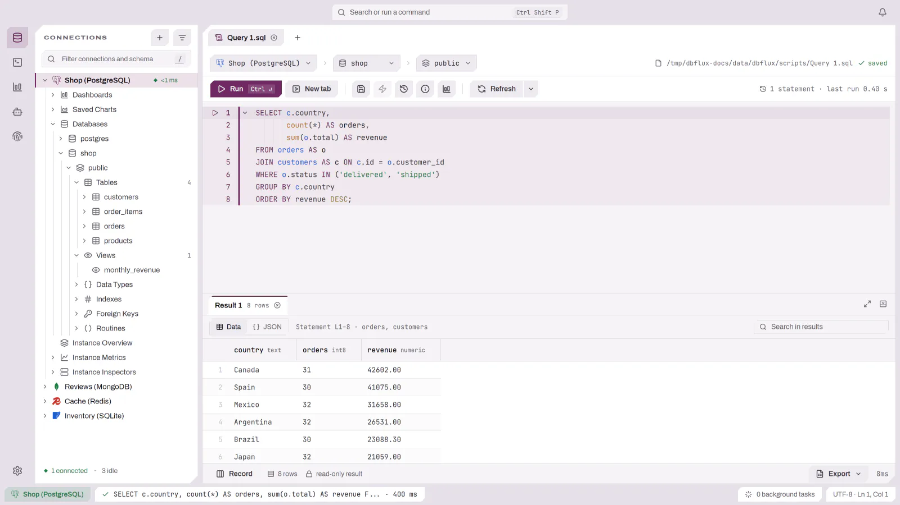
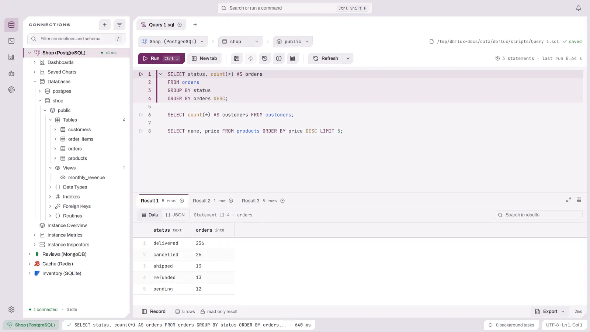
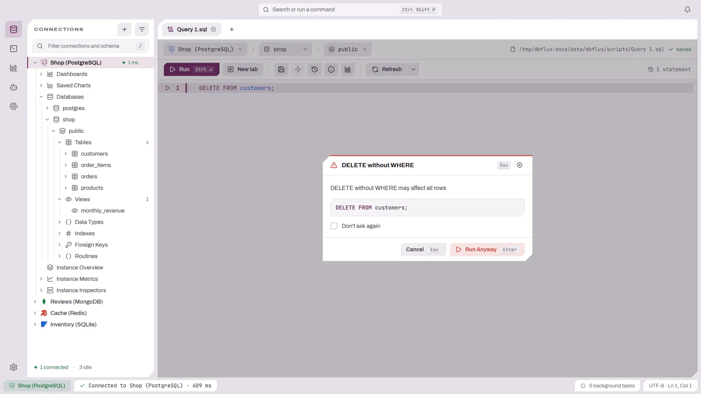

# Ejecutar queries

Abre una nueva pestaña de query con `Ctrl+n` (`Cmd+n` en macOS), o abre un
archivo de script con `Ctrl+o`. El lenguaje de query del editor (SQL, sintaxis
de queries de MongoDB, comandos de Redis, etc.) lo determina el driver de la
conexión activa, que también controla el resaltado de sintaxis y el texto de
placeholder. Un archivo `.csv` o `.tsv` se abre como tabla; ver
[Archivos CSV y TSV](CSV_FILES.md).

Para conexiones SQL, el [Constructor visual de queries](QUERY_BUILDER.md)
compone queries sin escribir SQL.

<picture>
  <source media="(prefers-color-scheme: dark)" srcset="../images/editor/query-result-dark.webp">
  
</picture>

## Guardar y cerrar pestañas

Una pestaña de query nueva (`Ctrl+n`) queda respaldada por un archivo real en tu
carpeta de scripts, igual que un script abierto con `Ctrl+o`. Los editores
abiertos se auto-guardan en ese archivo según el intervalo configurado, y
`Ctrl+s` / **Save file as…** usan la misma cola. El auto-guardado y el cierre
nunca sobrescriben un archivo que cambió fuera de DBFlux: tu versión sigue en
el editor y DBFlux informa de la escritura rechazada. `Ctrl+s` y **Save file as…**
son deliberados y escriben el archivo incluso entonces.

Cerrar una pestaña con ediciones pendientes las guarda primero y después la
cierra; si la escritura no puede aterrizar (por ejemplo, el archivo cambió
fuera de DBFlux o es read-only), la pestaña queda abierta con tus cambios y
DBFlux te indica `Ctrl+s` / **Save file as…** como la escritura deliberada. Un
buffer que todavía no tiene archivo es la excepción: al cerrarlo se te pregunta
primero, así que puedes guardarlo, cerrarlo sin guardar o cancelar. Al salir,
DBFlux guarda las ediciones pendientes de la misma forma antes de apagarse. Si
la carpeta de scripts no pudo crearse al arrancar, las queries
nuevas se conservan en el session store y **Save file as…** se ofrece al
cerrarlas.

## Ejecutar

- `Ctrl+Enter` (`Cmd+Enter`) — **Run query**.
- `Ctrl+Shift+Enter` (`Cmd+Shift+Enter`) — **Run query in new tab**.

Si existe una selección de texto no vacía, solo se ejecuta el texto
seleccionado. Sin selección, se usa el buffer completo del editor.

Cuando la ejecución omite filas efectivamente, el editor muestra una advertencia por consulta y la cuadrícula señala el conjunto de resultados afectado, aunque no se haya conservado ninguna fila. Un resultado que alcanza exactamente el límite sin omitir filas no genera la advertencia. Un límite de filas conservadas solo restringe las filas almacenadas; los límites de bytes y tiempo son controles de ejecución independientes. Esto no implica que el editor tenga un límite de filas predeterminado.

## Scripts multi-statement

Cuando ejecutas sin selección y el buffer contiene varias sentencias separadas
por `;`, y el driver activo declara soporte de batch, DBFlux muestra un diálogo
de confirmación (`Run entire script (N statements)?`) antes de ejecutar. Al
confirmar, el conjunto de resultados de cada sentencia se renderiza en su propia
pestaña de resultado.

La división en sentencias es consciente del lenguaje para los lenguajes de la
familia SQL: los separadores dentro de strings, identificadores, comentarios de
línea/bloque y los cuerpos dollar-quoted de PostgreSQL no se tratan como límites
de sentencia. Los lenguajes no SQL siguen siendo de sentencia única. El soporte
de batch es por driver — entre los drivers SQL integrados, PostgreSQL,
MySQL/MariaDB, SQLite y Microsoft SQL Server lo soportan. Una selección siempre
se ejecuta tal cual y nunca dispara la confirmación de script.

<picture>
  <source media="(prefers-color-scheme: dark)" srcset="../images/editor/multi-statement-dark.webp">
  
</picture>

## Confirmación de queries peligrosas

DBFlux detecta operaciones peligrosas entre lenguajes — `DELETE`/`DROP`/
`TRUNCATE` de SQL y `DELETE`/`UPDATE` sin `WHERE`, `deleteMany`/`drop` de
MongoDB, `FLUSHALL`/`FLUSHDB`/`KEYS` de Redis — y pide confirmación antes de
ejecutar. Este comportamiento se controla desde settings: la confirmación de
queries peligrosas se puede desactivar, se puede requerir una cláusula `WHERE`
para `DELETE`/`UPDATE`, y `FLUSHALL`/`FLUSHDB` de Redis se puede deshabilitar
por completo (en cuyo caso esos comandos quedan bloqueados en lugar de
confirmados).

<picture>
  <source media="(prefers-color-scheme: dark)" srcset="../images/editor/dangerous-query-dark.webp">
  
</picture>

## Scripts (Lua / Python / Bash)

Los documentos Lua, Python y Bash se ejecutan como scripts en lugar de queries
de base de datos. Su salida se transmite en vivo al área de salida del documento
mientras se ejecutan, y la salida final se conserva como un resultado de texto.
Ver `docs/LUA.md` para el runtime de Lua embebido.

## Queries guardadas e historial

DBFlux mantiene un historial de las queries completadas y te permite guardar
queries con nombre.

- `Alt+h` (en el editor), o el botón History de la barra de herramientas, abre y
  cierra el panel de historial de queries junto al editor.
- `Ctrl+s` (`Cmd+s`) — **Save** la query actual.
- `Ctrl+Shift+s` (`Cmd+Shift+s`) — **Save file as…**.
- `Ctrl+p` (`Cmd+p`, en el editor) — abre el explorador de queries guardadas.

El panel de historial lista las queries recientes y guardadas y queda abierto
mientras editas. Hacer clic en una entrada o pulsar `Enter` la carga en el
editor. Con el foco en el panel puedes navegar con `Ctrl+j`/`Ctrl+k` (o las
flechas), guardar una query reciente con `Ctrl+s`, y usar los mnemónicos locales
`Ctrl+f` (marcar como favorito), `Ctrl+r` (renombrar) y `Ctrl+d` (eliminar). `/`
o el botón de búsqueda del encabezado del panel abre el campo de búsqueda, y
`Esc` cierra el panel.
