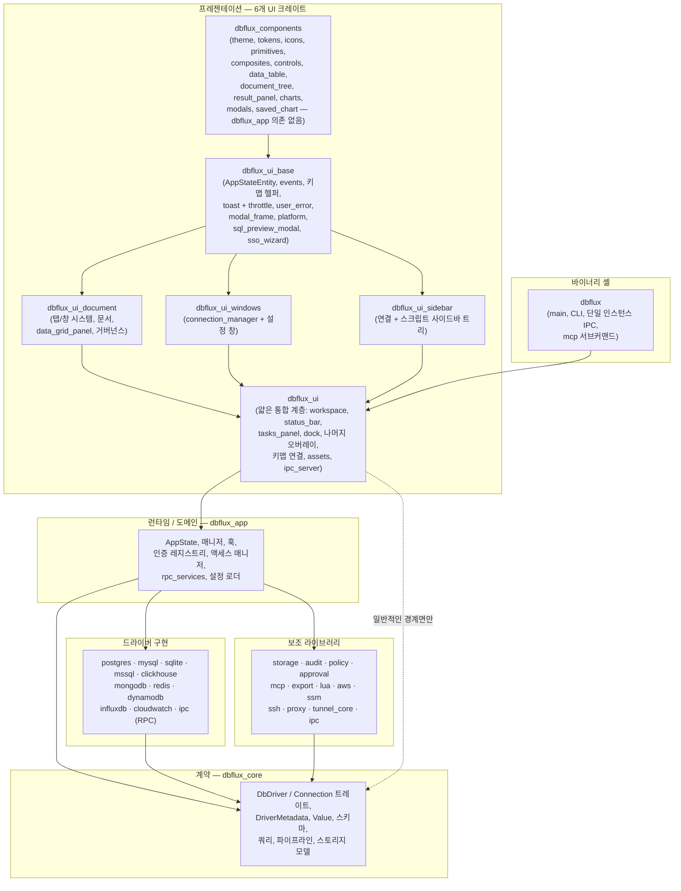
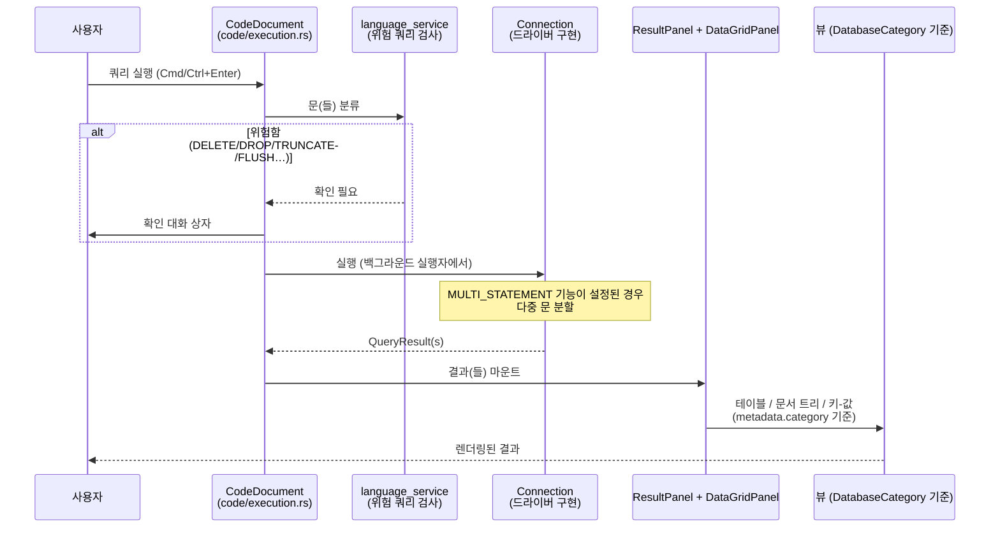
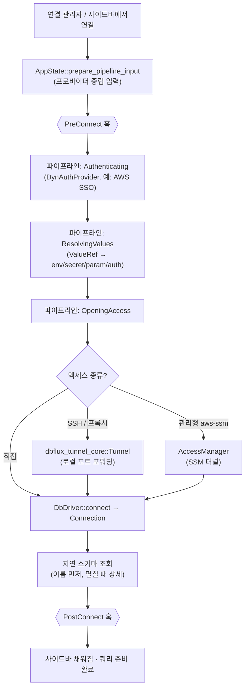

# 아키텍처

개념 모델과 계약 경계에 대해서는 [핵심 개념](docs/CONCEPTS.md)에서 시작하세요. 이 문서는 크레이트 경계와 핵심 파일에 관한 표준 문서로 남습니다.

## 개요

- DBFlux는 Rust와 GPUI로 만들어진 키보드 우선 데이터베이스 클라이언트로, 빠른 워크플로와 깔끔한 데스크톱 UI에 중점을 둡니다 (README.md).
- 리포지토리는 UI 앱 크레이트와 공유 코어 타입, 드라이버 구현, 보조 라이브러리로 이루어진 Rust 워크스페이스입니다 (Cargo.toml, crates/).
- 여러 데이터베이스 패러다임을 지원합니다: 관계형 (SQL), 문서 (MongoDB, DynamoDB), 키-값 (Redis), 시계열 (InfluxDB), 로그 스트림 (CloudWatch Logs), 그래프, 와이드 컬럼 스토어.
- 이 문서는 프로젝트 구조, 아키텍처 개요, 크레이트 경계, 핵심 파일, 크로스 크레이트 맵에 관한 표준 최상위 문서입니다. 다른 최상위 문서에서는 해당 내용을 중복해서 다루지 말고 여기로 링크해야 합니다.

## 아키텍처 한눈에 보기

아래의 본문은 방대하지만 밀도가 높습니다; 먼저 이 세 다이어그램으로 멘탈 모델을 잡습니다. 다이어그램은 개념적인 수준이며 — 정확한 심볼 이름은 뒤따르는 절에 나옵니다.

### 계층별 크레이트 맵

종속성은 아래를 향합니다. `dbflux_core`는 다른 모든 크레이트가 기반으로 삼는 종속성 없는 계약 계층이며, UI는 구체적인 드라이버 크레이트에 의존하지 않습니다 ([드라이버/UI 분리](#드라이버-체계) 참조).



### 쿼리 흐름

쿼리는 편집기 문서에서 드라이버 `Connection`으로 이동한 뒤 `DatabaseCategory`가 고른 결과 뷰로 돌아옵니다 — UI는 드라이버 id를 기준으로 분기하지 않습니다.



### 연결 흐름

연결 시 드라이버가 열리기 전에 프로바이더 중립적인 사전 연결 파이프라인이 실행되며, 각 단계에서 선택적인 터널링/관리형 액세스와 수명 주기 훅이 동작합니다.



## 기술 스택

- 언어: Rust 2024 에디션 (crates/dbflux/Cargo.toml).
- UI: `gpui`, `gpui-component` (Cargo.toml).
- 데이터베이스: `tokio-postgres` (PostgreSQL), `rusqlite` (SQLite), `mysql` (MySQL/MariaDB), `mongodb` (MongoDB), `redis` (Redis), `aws-sdk-dynamodb` (DynamoDB), 그리고 `reqwest`를 통한 HTTP (ClickHouse) (Cargo.toml).
- AWS 인증/통합: `aws-config`, `aws-sdk-sso`, `aws-sdk-ssooidc`, `aws-sdk-sts`, `aws-sdk-secretsmanager`, `aws-sdk-ssm` (`dbflux_aws`).
- IPC/RPC: `interprocess` 로컬 소켓 + `bincode` 메시지 프레이밍 (`dbflux_ipc`, `dbflux_driver_ipc`, `dbflux_driver_host`).
- SSH: `dbflux_ssh`를 통한 `ssh2` (crates/dbflux_ssh/src/lib.rs).
- 내보내기: `dbflux_export`를 통한 `csv` + `hex` + `base64` + `serde_json` (crates/dbflux_export/src/lib.rs).
- 직렬화/설정: `serde`, `serde_json`, `dirs` (Cargo.toml).
- 로깅: `log`, `env_logger` (crates/dbflux/src/main.rs).

## 디렉터리 구조

```
crates/
  dbflux/                   # 바이너리 셸: 메인 진입점, CLI, 단일 인스턴스 IPC
    src/
      main.rs               # 애플리케이션 진입점, 로깅, 창 부트스트랩, IPC 소켓
      cli.rs                # CLI 인수 파싱, 단일 인스턴스 IPC 클라이언트
  dbflux_components/        # 도메인 독립 리프: 테마, 토큰, 아이콘, 프리미티브, 컴포지트,
    src/                    # 컨트롤, 타이포그래피, data_table, document_tree, tree_nav,
      theme.rs              # 테마 정의
      tokens.rs             # 디자인 토큰 (간격, 크기 상수)
      icons/                # SVG 아이콘 시스템 (AppIcon 열거형)
        mod.rs
      icon.rs               # 아이콘 렌더링 헬퍼
      primitives/           # 저수준 빌딩 블록 (배지, 배너, 레이블, 버튼 등)
      controls/             # 입력 컨트롤 (버튼, 확인란, 드롭다운, 입력 필드, 선택 등)
      composites/           # 조합 패턴 (modal_frame, tab_strip, section_header 등)
      components/           # 도메인 컴포넌트
        data_table/         # 커스텀 가상화 데이터 테이블
          mod.rs
          table.rs          # 팬텀 스크롤러가 있는 메인 테이블 컴포넌트
          state.rs          # 테이블 상태 관리
          model.rs          # CellValue 및 데이터 모델
          selection.rs      # 선택 처리
          events.rs         # 이벤트 처리
          clipboard.rs      # 복사/붙여넣기 지원
          theme.rs          # 테이블 스타일링
        document_tree/      # 계층형 문서/JSON 뷰어
          mod.rs
          state.rs          # 커서, 확장, 검색을 갖춘 트리 상태
          tree.rs           # 키보드 내비게이션이 있는 트리 렌더링
          node.rs           # 노드 유형 (문서, 필드, 배열 항목)
          events.rs         # 문서 트리 이벤트 (선택, 상황에 맞는 메뉴)
        tree_nav/           # 재사용 가능한 트리 내비게이션 컴포넌트
          mod.rs
          gutter.rs
        filter_bar.rs       # 범용 필터 바 컴포넌트
        form_navigation.rs  # FormNavigation / FormEditState 트레이트
        form_renderer.rs    # 범용 폼 필드 렌더링
        json_editor_view.rs # 인라인 JSON 편집기 컴포넌트
        multi_select.rs     # 다중 선택 드롭다운 컴포넌트
        value_source_selector.rs # 값 소스 드롭다운 (환경 변수/비밀/매개변수/인증)
      modals/               # 재사용 가능한 모달 컴포넌트 (cell_editor, document_preview 등)
      result_panel/         # ResultPanel + ViewHandle 범용 크롬 호스트
      chart/                # 차트 엔진 (detect, spec, decimate, axis, legend, engine)
      saved_chart.rs        # SavedChart + SavedChartStore 타입 별칭
      common/               # 공유 헬퍼 (time_range 피커 등)
      actions.rs            # 공유 액션 정의
      typography.rs
  dbflux_ui_base/           # AppStateEntity + 이벤트, 키맵 헬퍼, 플랫폼 유틸리티
    src/
      app_state_entity.rs   # AppStateEntity 래퍼 (Deref + EventEmitter), AppStateGlobal,
                            # UserErrorReported + OpenAuditRequested 이벤트, unread_error_count
      keymap.rs             # default_keymap, key_chord_from_gpui
      async_ext.rs          # AsyncUpdateResultExt
      toast.rs              # 심각도 인식 토큰 버킷 스로틀이 있는 Toast + ToastHost
      user_error/           # 중앙화된 사용자 대면 오류 보고 (UserFacingError,
                            # ErrorKind, report_error, report_error_async) + 스로틀
      modal_frame.rs        # 재사용 가능한 모달 크롬/프레임
      platform.rs           # X11/Wayland 감지, 창 옵션
      sql_preview_modal.rs  # SQL/쿼리 미리보기 모달 (이중 모드: SQL 및 범용)
      sso_wizard.rs         # SSO 계정/역할 탐색 마법사 [cfg aws]
  dbflux_ui_document/       # 탭/창 시스템, 모든 문서 타입, data_grid_panel, 거버넌스
    src/
      pane.rs               # PaneHandle: 타입화된 Entity<T> 문서를 위한 클로저 소거 셸
      tab_manager.rs        # Tab 열거형, TabManager (Vec<Tab> + MRU 순서), TabManagerEvent
      tab_bar.rs            # 시각적 탭 바 렌더링
      handle.rs             # DocumentEvent 열거형 (통합 — 문서별 이벤트 열거형을 대체)
      dedup.rs              # DocumentKey 열거형: 탭 중복 제거를 위한 식별 키
      types.rs              # DocumentId, DocumentKind, DocumentMetaSnapshot, DocumentState
      result_view.rs        # ResultViewMode 열거형 (Table, LiveOutput 등)
      task_runner.rs        # 문서용 백그라운드 작업 추적
      data_view.rs          # DataViewMode 추상화 (Table 대 Document)
      data_view_trait.rs    # DataView 트레이트 (available_view_modes, focus_handle, active_context)
      chrome.rs             # 공유 크롬 유틸리티
      governance.rs         # 대기 중 실행을 위한 MCP 승인 뷰
      history_modal.rs      # 최근/저장된 쿼리 모달
      add_member_modal.rs   # Redis set/list/sorted-set 멤버 추가 모달
      new_key_modal.rs      # 새 Redis 키 생성 모달
      chart_document/       # ChartDocument: 저장된/대화형 차트 탭
        mod.rs              # ChartDocument 엔티티
        pane.rs             # ChartDocument::into_pane 생성자
        render.rs           # impl Render for ChartDocument
      data_document/        # DataDocument: 독립형 데이터 탐색 탭
        mod.rs              # DataDocument 엔티티 (DataGridPanel + ResultPanel을 감싸는 얇은 셸)
        pane.rs             # DataDocument::into_pane 생성자
      data_grid_panel/      # 테이블/문서 뷰 모드가 있는 데이터 그리드
        mod.rs
        context_menu.rs
        filter_bar.rs
        mutation_confirm.rs
        mutation_executor.rs
        mutations.rs
        navigation.rs
        query.rs
        render.rs
        row_inspector.rs
        utils.rs
      code/                 # CodeDocument: 쿼리/스크립트 편집기
        mod.rs
        pane.rs             # CodeDocument::into_pane 생성자
        completion.rs       # 언어 인식 자동 완성
        context_bar.rs      # 실행 컨텍스트 드롭다운 (연결/데이터베이스/스키마)
        diagnostics.rs      # 실시간 쿼리 진단
        execution.rs        # 쿼리 및 스크립트 실행 흐름 (위험 쿼리 확인 포함)
        file_ops.rs         # 자동 저장, scratch/shadow 파일 관리
        focus.rs            # 내부 포커스 관리
        live_output.rs      # 문서가 소유한 스트리밍 스크립트 출력 버퍼
        render.rs           # 도구 모음, 편집기, 실시간 출력 렌더링
      key_value/            # Redis/키-값 전용 문서 탭
        mod.rs              # KeyValueDocument 엔티티
        pane.rs             # KeyValueDocument::into_pane 생성자
        view.rs             # KeyValueView 경계 구조체 (파일 수준 렌더 헬퍼)
        commands.rs
        context_menu.rs
        copy_command.rs
        document_view.rs
        mutations.rs
        pagination.rs
        parsing.rs
        render.rs           # impl Render for KeyValueDocument
      audit/                # AuditDocument: 통합 이벤트/감사 뷰어 탭
        mod.rs              # AuditDocument 엔티티
        pane.rs             # AuditDocument::into_pane 생성자
        view.rs             # LogStreamView 경계 구조체
        render.rs           # 추출된 렌더 코드 (~1300 LOC)
        commands.rs         # 추출된 명령 디스패치 (~560 LOC)
        filters.rs
        saved_filter.rs
        source_adapter.rs
      chart/                # 지표/인스턴스 차트를 위한 ChartShell 호스트 (chart_document/와 별개)
        mod.rs
        shell.rs            # ChartShell 호스트 엔티티
        host.rs
        metric_picker.rs
        metric_picker_render.rs
        toolbar.rs
      instance_inspector/   # InstanceInspectorDocument (DocumentKey::InstanceInspector을 뒷받침)
        mod.rs
        pane.rs             # into_pane 생성자
  dbflux_ui_sidebar/        # 폴더와 드래그 앤 드롭을 갖춘 연결 + 스크립트 사이드바 트리
    src/
      lib.rs                # SidebarView 엔티티 (dbflux_ui가 재노출)
      code_generation.rs
      context_menu.rs
      deletion.rs
      drag_drop.rs
      expansion.rs
      operations.rs
      render.rs
      render_footer.rs
      render_overlays.rs
      render_tree.rs
      selection.rs
      table_loading.rs
      tree_builder.rs
  dbflux_ui_windows/        # 설정 창 + 연결 관리자 창
    src/
      ssh_shared.rs         # 공유 SSH 인증 UI 컴포넌트
      settings/             # 설정 창 섹션
        mod.rs
        render.rs           # 최상위 설정 창 렌더링
        lifecycle.rs        # 설정 창 열기/닫기/저장 로직
        sidebar_nav.rs      # 설정 사이드바 내비게이션 (TreeNav)
        dirty_state.rs      # 설정 폼의 저장되지 않은 변경 사항 추적
        form_nav.rs         # FormGridNav<F> 범용 2D 그리드 내비게이션
        form_section.rs     # 키보드 내비게이션을 위한 FormSection 트레이트
        section_trait.rs    # SettingsSection 트레이트
        general.rs          # 일반 설정 (테마, 안전 토글)
        keybindings.rs      # 키 바인딩 설정 섹션
        auth_profiles_section.rs # 공급자 폼 정의별 동적 인증 프로필 CRUD
        proxies.rs          # FormGridNav를 사용한 프록시 CRUD 폼
        ssh_tunnels.rs      # FormGridNav를 사용한 SSH 터널 CRUD 폼
        hooks.rs            # 훅 정의 CRUD
        drivers.rs          # 드라이버별 설정 재정의
        rpc_services.rs     # RPC 서비스 설정 UI (드라이버/인증 공급자 디스크립터)
        audit_section.rs    # 감사 설정 섹션
        about_section.rs    # 정보 섹션
        mcp_section.rs      # MCP 설정 (신뢰할 수 있는 클라이언트, 역할, 정책, 감사; 기능 플래그 게이트)
      connection_manager/   # 연결 관리자 창
        mod.rs
        access_tab.rs       # 통합 액세스 모드 편집기 (직접/SSH/프록시/SSM)
        form.rs             # 연결 폼 상태 및 필드 관리
        navigation.rs       # 연결 관리자 내 키보드 내비게이션
        render.rs           # 최상위 연결 관리자 렌더링
        render_driver_select.rs
        render_tabs.rs
        hooks_tab.rs        # 프로필별 훅 바인딩
  dbflux_ui/                # 얇은 통합자 (~13.5k LOC): 여섯 UI 크레이트를 서로 연결
    src/                    # 이동된 하위 시스템을 이전 모듈 경로의 shim을 통해 재노출
      lib.rs                # 크레이트 루트; shim 모듈을 통한 재노출
      app.rs                # GPUI 앱 부트스트랩
      ipc_server.rs         # 앱 제어 IPC 서버 (Focus, OpenScript)
      assets.rs             # 임베디드 SVG 아이콘을 위한 GPUI AssetSource 구현
      platform.rs           # Shim: pub use dbflux_ui_base::platform::*
      keymap/               # 키보드 접착 코드 (액션, 디스패처)
        mod.rs
        actions.rs
        dispatcher.rs
      ui/
        views/
          workspace/        # 메인 레이아웃, 명령 디스패치, 포커스 라우팅
            mod.rs
            actions.rs      # 워크스페이스 수준 액션 핸들러
            dispatch.rs     # 명령 디스패치 로직
            render.rs       # 워크스페이스 렌더링
          status_bar.rs     # 상태 표시줄 렌더링
          tasks_panel.rs    # 백그라운드 작업 패널
        dock/
          sidebar_dock.rs   # 접을 수 있고 크기 조절이 가능한 사이드바
        overlays/           # dbflux_ui에 남아 있는 나머지 오버레이
          command_palette.rs       # 퍼지 명령 팔레트
          login_modal.rs           # 타임아웃이 있는 SSO 로그인 대기 모달
          shutdown_overlay.rs      # 정상 종료 오버레이
          # 이전 오버레이 경로의 shim이 dbflux_ui_base / dbflux_components에서 재노출:
          sql_preview_modal.rs     # → dbflux_ui_base::sql_preview_modal
          sso_wizard.rs            # → dbflux_ui_base::sso_wizard
          cell_editor_modal.rs     # → dbflux_components::modals::cell_editor
          document_preview_modal.rs # → dbflux_components::modals::document_preview
        document.rs         # Shim: pub use dbflux_ui_document::*
        icons/mod.rs        # Shim: AppIcon + embedded_bytes 재노출 (SVG 리소스는 여기에 위치)
        theme.rs            # Shim: pub use dbflux_components::theme::*
        tokens.rs           # Shim: pub use dbflux_components::tokens::*
        components/
          modal_frame.rs    # Shim: → dbflux_ui_base::modal_frame
          toast.rs          # Shim: → dbflux_ui_base::toast
        windows/mod.rs      # Shim: pub use dbflux_ui_windows::*
        views/sidebar/mod.rs # Shim: pub use dbflux_ui_sidebar::*
  dbflux_app/               # 런타임/도메인: AppState (일반 구조체), 매니저, 훅, 인증
    src/
      app_state.rs          # AppState (일반 구조체, GPUI 종속성 없음)
      access_manager.rs      # 직접/관리형 액세스를 위한 AppAccessManager
      auth_provider_registry.rs # 런타임 인증 공급자 레지스트리
      hook_executor.rs       # 컴포지트 훅 실행기 라우팅
      proxy.rs               # CreateTunnelFn을 위한 create_proxy_tunnel 콜백
      config_loader.rs       # SQLite 기반 구성 영속성
      rpc_services/          # 런타임 부트스트랩을 위한 RPC 서비스 탐색/어댑테이션 경계 (external_audit, ...)
      history_manager_sqlite.rs # SQLite 기반 쿼리 기록
      mcp_command.rs         # MCP 하위 명령 통합 및 인수 파싱
      keymap/                # 키보드 시스템 (순수 도메인 타입)
        mod.rs               # dbflux_core::keymap_types에서 Command/ContextId 재노출
        focus.rs             # FocusTarget 열거형 (순수 도메인)
  dbflux_core/              # 트레이트, 핵심 타입, 스토리지, 오류
    src/access/             # AccessKind, AccessManager 및 관리형 액세스 직렬화
      mod.rs
    src/auth/               # AuthProfile + DynAuthProvider 계약
      mod.rs
      types.rs
    src/core/               # 기본 타입과 트레이트
      traits.rs             # DbDriver + Connection 트레이트
      error.rs              # DbError 타입
      error_formatter.rs    # 드라이버별 오류 메시지를 위한 ErrorFormatter 트레이트
      value.rs              # 데이터베이스 간 데이터를 위한 범용 Value 타입
      shutdown.rs           # ShutdownCoordinator
      task.rs               # 백그라운드 작업 추적
    src/driver/             # 드라이버 메타데이터 및 폼 정의
      capabilities.rs       # DatabaseCategory, QueryLanguage, DriverCapabilities, DriverMetadata
      form.rs               # 드라이버별 동적 폼 정의
    src/schema/             # 데이터베이스 스키마 타입
      types.rs              # 스키마 타입 (테이블, 컬렉션, 인덱스, FK)
      builder.rs            # 스키마 구성을 위한 빌더 헬퍼
      node_id.rs            # 트리 식별을 위한 SchemaNodeId
    src/sql/                # SQL 생성 및 방언
      dialect.rs            # SQL 방언 차이를 위한 SqlDialect 트레이트
      generation.rs         # SQL INSERT/UPDATE/DELETE 생성
      query_builder.rs      # 안전한 쿼리 구성을 위한 SqlQueryBuilder
      code_generation.rs    # DDL 코드 생성 (인덱스, 타입, FK)
    src/query/              # 쿼리 타입 및 언어 서비스
      types.rs              # QueryRequest, QueryResult, Row, ColumnMeta
      generator.rs          # QueryGenerator 트레이트, 변경/읽기 템플릿, 시맨틱 미리보기 헬퍼
      language_service.rs   # 위험 쿼리 감지 (SQL, MongoDB, Redis)
      safety.rs             # 안전한 읽기 쿼리 감지
      table_browser.rs      # 테이블 탐색 상태 및 페이지 나누기
    src/connection/         # 연결 관리 및 프로필
      profile.rs            # 연결/SSH 프로필
      profile_manager.rs    # ProfileManager
      manager.rs            # ConnectionManager, 스키마 캐싱, 연결 흐름
      hook.rs               # 훅 정의, HookRunner, 단계 오케스트레이션
      tree.rs               # 폴더/연결 트리 모델
      tree_manager.rs       # ConnectionTreeManager
      context.rs            # 탭별 실행 컨텍스트 (연결/데이터베이스/스키마)
      proxy.rs              # ProxyProfile, ProxyKind, ProxyAuth, no_proxy 매칭
      proxy_manager.rs      # ProxyManager (ItemManager<ProxyProfile>의 타입 별칭)
      ssh_tunnel_manager.rs # SshTunnelManager
      item_manager.rs       # 범용 ItemManager<T>, Identifiable, DefaultFilename 트레이트
    src/storage/            # 영속성 및 상태
      session.rs            # 세션 매니페스트 타입 및 scratch/shadow 경로 헬퍼
      history.rs            # 기록 영속성
      saved_query.rs        # 저장된 쿼리 영속성
      recent_files.rs       # 최근 파일 추적
      secrets.rs            # 키링 비밀 저장
      secret_manager.rs     # HasSecretRef 트레이트가 있는 SecretManager
      ui_state.rs           # 영속화된 UI 상태를 위한 UiStateStore (사이드바 접기)
    src/data/               # 데이터 타입 및 작업
      crud.rs               # 모든 데이터베이스 패러다임을 위한 CRUD 변경 타입
      key_value.rs          # 키-값 작업 타입 (Hash, Set, List, ZSet, Stream)
      view.rs               # DataViewMode (Table/Document) 추상화
    src/config/             # 애플리케이션 구성
      app.rs                # 레거시 config.json 가져오기 (지원 중단)
      refresh_policy.rs     # 스키마 새로고침 정책
      scripts_directory.rs  # 스크립트 폴더 트리 (파일/폴더 CRUD)
    src/pipeline/           # 연결 전 파이프라인 (인증/값/액세스 단계)
      mod.rs
      resolve.rs
    src/values/             # ValueRef 해석 + 공급자 레지스트리 + 캐시
      resolver.rs
    src/facade/             # 세션 파사드
      session.rs            # 연결 관리를 위한 세션 파사드
  dbflux_ipc/               # 버전화된 IPC 계약 및 프레이밍
    src/auth.rs             # IPC 인증 토큰 생성 및 파일 저장
    src/envelope.rs         # ProtocolVersion + 앱/드라이버 프로토콜 상수
    src/protocol.rs         # 단일 인스턴스 앱 제어 메시지
    src/driver_protocol.rs  # 드라이버 RPC 요청/응답 스키마 (DTO + 오류)
    src/framing.rs          # 길이 접두사 bincode 전송 프레이밍
    src/socket.rs           # 크로스 플랫폼 소켓 이름 지정 헬퍼
  dbflux_driver_ipc/        # 외부 RPC 서비스를 위한 DbDriver 어댑터
    src/driver.rs           # IpcDriver + 관리형 호스트 수명 주기
    src/transport.rs        # RPC 클라이언트 전송 및 핸드셰이크
    src/connection.rs       # 드라이버 RPC 위의 연결 프록시
  dbflux_driver_host/       # RPC를 통해 드라이버를 서빙하는 호스트 프로세스
    src/main.rs             # 드라이버 RPC 서버 진입점
    src/session.rs          # 세션 매니저 및 메서드 디스패치
  dbflux_driver_postgres/   # PostgreSQL 드라이버 구현
  dbflux_driver_sqlite/     # SQLite 드라이버 구현
  dbflux_driver_mysql/      # MySQL/MariaDB 드라이버 구현
  dbflux_driver_mssql/      # Microsoft SQL Server 드라이버 구현
  dbflux_driver_mongodb/    # MongoDB 드라이버 구현
    src/driver.rs           # 연결, 스키마 탐색, CRUD 작업
    src/query_parser.rs     # MongoDB 쿼리 문법 파서 (db.collection.method())
    src/query_generator.rs  # MongoDB 셸 쿼리 생성기 (insertOne, updateOne 등)
  dbflux_driver_redis/      # Redis 드라이버 구현
    src/driver.rs           # 연결, 키-값 API, 스키마 탐색
    src/command_generator.rs # Redis 명령 생성기 (SET, HSET, SADD 등)
  dbflux_driver_dynamodb/   # DynamoDB 드라이버 구현
    src/driver.rs           # 연결, 스키마 탐색, scan/query/put/update/delete
    src/query_parser.rs     # DynamoDB 작업을 위한 JSON 명령 엔벨로프 파서
    src/query_generator.rs  # 변경 -> DynamoDB 명령 엔벨로프 생성기
    tests/live_integration.rs # Docker 기반 통합 테스트 (DynamoDB Local)
  dbflux_driver_influxdb/   # InfluxDB 드라이버 (v1 + v2)
    src/driver.rs           # 연결, 버킷/측정 탐색, 쿼리 실행
    src/query_generator.rs  # InfluxQL (v1) 및 Flux (v2) 쿼리/템플릿 생성
  dbflux_driver_clickhouse/ # ClickHouse HTTP(S) 관계형 드라이버
    src/driver.rs           # 메타데이터, 연결 폼, 연결 구성
    src/connection.rs       # 쿼리 실행 및 시스템 카탈로그 탐색
    src/types.rs            # ClickHouse 타입 파싱 및 값 디코딩
    src/dialect.rs          # SQL 생성 방언
  dbflux_driver_turso/      # Hrana HTTP 기반 TursoDB / libSQL 원격 드라이버
    src/driver.rs           # 메타데이터, 연결 폼, URL 검증, 연결
    src/connection.rs       # Tokio 브리지, 일괄 처리 실행, 스키마 탐색, CRUD, 오류 매핑
    src/session.rs          # 스트림별 연결 위의 ExecutionSessionFactory/ExecutionSession
    src/dialect.rs          # SQLite 방언, 값 변환, DDL 코드 생성
  dbflux_driver_cloudwatch/ # AWS CloudWatch Logs 드라이버 (DatabaseCategory::LogStream)
    src/driver.rs           # 로그 그룹/스트림 탐색, EventStreamTarget, CollectionPresentation::EventStream
  dbflux_driver_s3/         # AWS S3 개체 스토리지 드라이버 (DatabaseCategory::ObjectStorage)
    src/driver.rs           # 버킷/개체 탐색, ObjectStoreConnection 구현, presign/copy/versions
  dbflux_aws/               # AWS 인증 공급자 + Secrets Manager/SSM 값 공급자
    src/auth.rs             # AWS SSO/shared/static 공급자 및 SSO 로그인 흐름
    src/config.rs           # ~/.aws/config 파서/캐시 및 프로필 쓰기 반환 헬퍼
    src/accounts.rs         # AWS SSO 계정 및 역할 탐색
  dbflux_ssm/               # 관리형 액세스를 위한 AWS SSM 터널 팩토리
  dbflux_lua/               # 인프로세스 훅을 위한 임베디드 Lua 런타임
    src/executor.rs         # Lua HookExecutor 구현
    src/engine.rs           # Lua VM 생성 및 공유 런타임 상태
    src/api/dbflux.rs       # dbflux.log/env/process Lua API
    src/api/connection.rs   # Lua connection.* API (HookContext 노출)
    src/api/hook.rs         # Lua hook.* API (단계, 실패 정책)
  dbflux_tunnel_core/       # 공유 RAII 터널 인프라
    src/lib.rs              # Tunnel, TunnelConnector, ForwardingConnection<R>
  dbflux_proxy/             # SOCKS5/HTTP CONNECT 프록시 터널
    src/lib.rs              # ProxyTunnelConfig, SOCKS5/HTTP 핸드셰이크, 터널 루프
  dbflux_ssh/               # SSH 터널 지원
  dbflux_export/            # 내보내기 (CSV, JSON, Text, Binary)
    src/lib.rs              # 형태 기반 내보내기 API 및 형식 디스패치
    src/binary.rs           # Binary/hex/base64 내보내기
    src/csv.rs              # CSV 내보내기
    src/json.rs             # JSON pretty/compact 내보내기
    src/text.rs             # Text 테이블 내보내기
  dbflux_mcp/               # MCP 런타임 및 거버넌스
    src/lib.rs              # 런타임, 거버넌스 서비스, 도구 카탈로그 내보내기
    src/runtime.rs          # McpGovernanceService를 구현하는 McpRuntime
    src/governance_service.rs # McpGovernanceService 트레이트 및 DTO
    src/tool_catalog.rs     # 표준 MCP 도구 및 지연 도구 정의
    src/built_ins.rs        # 내장 역할 및 정책
     src/handlers/           # MCP 도구 핸들러 (쿼리, 승인, 탐색, 스크립트)
    src/server/             # MCP 서버 인프라 (라우터, 권한 부여, 부트스트랩)
  dbflux_mcp_server/        # 독립형 MCP 서버 바이너리
    src/main.rs             # --client-id 및 --config-dir가 있는 CLI 진입점
    src/server.rs           # stdin/stdout 위의 JSON-RPC 요청 루프
    src/bootstrap.rs        # 런타임 초기화 및 상태
    src/transport.rs        # 줄 기반 stdin/stdout 전송
    src/connection_cache.rs # 독립형 서버용 연결 풀
    src/handlers/           # 독립형 작동에 맞춘 도구 핸들러
  dbflux_policy/            # 정책 엔진 및 분류
    src/lib.rs              # 엔진, 분류, 신뢰할 수 있는 클라이언트 내보내기
    src/classification.rs   # ExecutionClassification 열거형 (Metadata/Read/Write/Destructive/AdminSafe/Admin/AdminDestructive)
    src/engine.rs           # PolicyRole과 ToolPolicy를 갖춘 PolicyEngine
    src/trusted_clients.rs  # 알려진 AI 클라이언트를 위한 TrustedClientRegistry
    src/assignments.rs      # ConnectionPolicyAssignment and PolicyBindingScope
  dbflux_approval/           # 지연 실행을 위한 승인 서비스
    src/lib.rs              # ApprovalService 및 대기 저장소 내보내기
    src/service.rs          # ApprovalService (승인/거부 수명 주기)
    src/store.rs            # InMemoryPendingExecutionStore 및 ExecutionPlan
  dbflux_audit/             # 감사 로깅
    src/lib.rs              # AuditService: 검증, 지문 생성, 마스킹, 기록
    src/query.rs            # AuditQueryFilter (행위자, 범주, 작업, 결과, 날짜 범위)
    src/export.rs           # JSON/CSV로의 감사 내보내기 (기본 및 확장 스키마)
    src/redaction.rs        # details_json 및 error_message의 민감한 값 마스킹
    src/purge.rs            # 보존 기반 이벤트 제거 (일괄 삭제)
    src/store/sqlite.rs     # AuditRepository에 위임하는 SqliteAuditStore
  dbflux_storage/            # 통합 SQLite 스토리지
    src/bootstrap.rs        # 단일 dbflux.db 연결을 갖춘 StorageRuntime
    src/paths.rs            # dbflux_db_path()는 ~/.local/share/dbflux/dbflux.db를 반환
    src/migrations/         # 트레이트 기반 마이그레이션 시스템
      mod.rs                # MigrationRegistry, Migration 트레이트
      *.rs                  # 개별 마이그레이션 파일 (001_initial.rs 등)
    src/repositories/       # 모든 도메인 리포지토리
      traits.rs             # Repository 트레이트 (all(), find_by_id(), upsert(), delete())
      audit.rs              # AuditEventDto가 있는 AuditRepository
      *.rs                  # 기타 도메인 리포지토리
    src/legacy.rs           # JSON-to-SQLite 가져오기
  dbflux_test_support/       # 통합 테스트용 Docker 컨테이너 및 픽스처
    src/containers.rs       # Docker 컨테이너 수명 주기 (Postgres, MySQL, MongoDB, Redis, DynamoDB Local)
    src/fixtures.rs         # 테스트 픽스처 헬퍼
    src/fake_driver.rs      # 단위 테스트용 FakeDriver
```

## 핵심 컴포넌트

### 애플리케이션 계층

- 앱 진입점: `crates/dbflux/src/main.rs`는 로깅, 테마, 메인 GPUI 창을 초기화합니다.
- 전역 앱 상태: `crates/dbflux_app/src/app_state.rs`(일반 struct, GPUI 종속성 없음)는 드라이버, 프로필, 활성 연결, 기록, 작업 관리자, 시크릿 저장소 접근을 보유합니다.
- CLI와 단일 인스턴스: `crates/dbflux/src/cli.rs`가 인수를 파싱하고, `crates/dbflux_ui/src/ipc_server.rs`가 `Focus` 및 `OpenScript` 명령을 위한 앱 제어 IPC 서버를 실행합니다.
- 에셋: `crates/dbflux_ui/src/assets.rs`는 GPUI의 `AssetSource`를 구현하여 내장된 SVG 아이콘을 제공합니다.
- 워크스페이스 UI 셸: `crates/dbflux_ui/src/ui/views/workspace/`는 창(사이드바/독, 문서 영역, 하단 독), 명령 팔레트, 포커스 라우팅을 연결합니다. `mod.rs`, `actions.rs`, `dispatch.rs`, `render.rs`로 분할되어 있습니다. 이 모듈은 `dbflux_ui`에 남아 있습니다.

### 사용자 대면 오류 보고

사용자가 유발한 실패는 `crates/dbflux_ui_base/src/user_error/mod.rs`의 단일 접점(seam)을 통해 처리되어, 실행 가능한 모든 오류가 토스트, 감사 로그 행, 상태 표시줄 배지 증가를 만들어 냅니다. 이 모두는 동일한 UUID v7 상관 관계 ID로 연결됩니다.

- **진입점**: `report_error(UserFacingError, &mut App)`(포그라운드)과 `report_error_async(UserFacingError, &AsyncApp)`(백그라운드 / `cx.spawn` / `background_executor`)입니다. 동기 변형은 백그라운드 컨텍스트에서 호출해서는 안 됩니다. `&mut App`이 필요하기 때문입니다.
- **분류 체계**: `ErrorKind { Storage, Network, Auth, Hook, Driver, User, Config }`가 배지/토스트 스타일과 감사 `action` 판별자를 결정합니다. 심각도는 `dbflux_core::observability::EventSeverity`를 재사용하며, `report_error`는 별도의 열거형을 추가하지 않습니다.
- **드라이버 입력**: `UserFacingError::from_formatted(kind, FormattedError)`는 기존 드라이버 `ErrorFormatter` 출력을 소비합니다. UI 코드는 드라이버 id로 분기하지 않습니다.
- **감사 브리지**: 접점은 `tracing::error!(target = "dbflux_ui::user_error", correlation_id = %id, kind, action = "user_error", outcome = "failure", ...)`를 방출합니다. `AuditFieldVisitor`(`crates/dbflux_core/src/observability/tracing_bridge/layer.rs`)는 `record_str`과 `record_debug`을 모두 `record_string_by_name`으로 라우팅하여, 필드가 `%`(Display) 기호로 기록되든 `?`(Debug) 기호로 기록되든 관계없이 타입화된 `EventRecord.correlation_id` 슬롯이 채워지도록 합니다.
- **토스트 스로틀링**: `ToastHost`는 Info와 Warn에 대해 심각도별 토큰 버킷(용량 5, 보충 1 토큰 / 2 s)을 유지하여 연결 끊김 폭풍이 화면을 뒤덮지 않도록 합니다. Error와 Fatal은 스로틀을 우회합니다. 버킷의 클록은 결정론적 테스트를 위해 주입 가능합니다.
- **배지 + 탐색**: `AppStateEntity::note_user_error`는 `unread_error_count`를 증가시키고 `UserErrorReported`를 방출합니다. 상태 표시줄 배지는 이를 구독하고, 클릭 시 `AppStateEntity::request_open_audit(None, cx)`를 호출하여 `OpenAuditRequested`를 방출합니다. 토스트의 "View in Audit" 액션은 `Some(correlation_id)`와 함께 동일한 이벤트를 방출합니다. 워크스페이스는 `OpenAuditRequested`를 한 번 구독하고 `set_correlation_filter` 또는 `new_with_correlation_id`를 통해 `AuditDocument`를 안내합니다.
- **규칙**: 첫 번째 처리 지점(catch site)만 보고합니다. 상위 전파 경로는 다시 보고해서는 안 됩니다. 런타임 중복 제거가 없어 이중 토스트는 코드 리뷰의 관심사입니다(AGENTS.md § Error Handling 참조).

### 문서 시스템

`crates/dbflux_ui_document/src/`는 5개의 계층으로 이루어진 탭 기반 문서 아키텍처를 구현합니다:

**계층 (가장 바깥쪽부터 가장 안쪽까지)**

1. **`Tab`** (`tab_manager.rs`) — 단일 `Pane(Box<PaneHandle>)` 변형을 가진 `#[non_exhaustive]` 열거형입니다. 미래 버전과의 호환성(예: 이후 분리 가능한 창 변형)을 위해 열거형으로 유지됩니다. `TabManager`는 `Vec<Tab>`과 MRU 순서를 보유합니다.

2. **`PaneHandle`** (`pane.rs`) — 기존의 닫힌(closed) `DocumentHandle` 열거형을 대체하는, 클로저를 지우는(closure-erasing) 셸입니다. 각 연산(render, focus, dispatch_command, meta_snapshot, tab_title, can_close, connection_id, active_context, change_summary, refresh_policy, set_active_tab, set_refresh_policy, flush_auto_save, matches_dedup_key, subscribe와 `resolve_close`, `save_for_close`, `flush_for_shutdown`, `is_file_backed_empty` 같은 선택적 헬퍼)은 타입화된 `Entity<T>`를 캡처하는 `Box<dyn Fn>` 클로저입니다. `PaneHandle`은 `!Clone`입니다. 각 문서 타입은 자체 `pane.rs` 파일(모두 `crates/dbflux_ui_document/src/` 아래)에서 `XxxDocument::into_pane(entity, cx) -> PaneHandle`을 제공합니다. 새 문서 타입을 추가해도 `workspace/mod.rs`, `tab_manager.rs`, `tab_bar.rs`, `handle.rs`는 변경할 필요가 없습니다.

3. **`DocumentKey`** (`dedup.rs`) — 탭 중복 제거에 사용되는 식별 열거형입니다. 변형: `Table`, `Collection`, `File`, `KeyValueDb`, `Chart`, `Audit`, `EventStream`, `Routine`, `MetricChart`, `Dashboard`, `InstanceMetric`, `InstanceInspector`, `InstanceOverview`, `ObjectStoreBucketsRoot`, `ObjectBrowser`, `ObjectEditor`. 기존 `DocumentHandle`의 `is_*` 메서드를 대체합니다. 호출 지점은 `tab_manager.find_by_key(&DocumentKey::Table { ... }, cx)`를 사용합니다.

4. **`DocumentEvent`** (`handle.rs`, 약 30 LOC) — 삭제된 네 개의 문서별 이벤트 열거형을 대체하는 통합 이벤트 열거형입니다. 변형: `MetaChanged`, `ExecutionStarted`, `ExecutionFinished`, `RequestClose`, `RequestFocus`, `RequestSqlPreview`, `OpenInspector`, `ChartThisQuery`.

5. **`ResultPanel` + `ViewHandle`** (`crates/dbflux_components/src/result_panel/mod.rs`) — 범용 UI 프레임(chrome) 호스트입니다. `ResultPanel`은 프레임 행을 소유하고 본문 렌더링을 `ViewHandle`(render, focus, focus_handle, toolbar_segments, available_modes, current_mode, set_mode의 7개 클로저)에 위임합니다. 슬롯 시스템(`ToolbarSegment { position: SegmentPosition::{Left,Center,Right}, index: u16, builder }`)은 뷰가 임의의 프레임 요소를 기여할 수 있게 합니다. `ResultPanel`은 내장 세그먼트(`available_modes.len() >= 2`일 때 Left/0의 모드 바)와 뷰가 제공한 세그먼트를 병합하고, `(position, index)`로 정렬하여 `flex_wrap` 행으로 렌더링합니다.

**문서 타입**

- `DataDocument` (`crates/dbflux_ui_document/src/data_document/`) — `DataGridPanel` + `ResultPanel`을 감싸는 얇은 셸입니다. DataGridPanel은 `ViewHandle`로 마운트되고, 필터 바는 Center/0 세그먼트로 주입됩니다.
- `ChartDocument` (`crates/dbflux_ui_document/src/chart_document/`) — `ChartShell` 엔티티 + 지연(lazy) `Option<Entity<ResultPanel>>`입니다. 차트 영역, 축 바, 액션 버튼은 Left/Center/Right 세그먼트로 마운트됩니다. 독립적으로 또는 `DashboardDocument` 패널 안에 내장되어 렌더링됩니다.
- `DashboardDocument` (`crates/dbflux_ui_document/src/dashboard/`) — 공유 `TimeRangePanel`과 새로고침 정책을 갖춘, 이름이 지정된 차트 패널 그리드입니다. 각 패널은 `Loaded` `ChartDocument` 엔티티이거나 삭제된 차트를 위한 `Orphan` 자리 표시자입니다. 패널 재실행은 `PANEL_REEXEC_CAP`으로 제한됩니다. `docs/DASHBOARDS.md`를 참조하세요.
- `CodeDocument` (`crates/dbflux_ui_document/src/code/`) — 멀티 탭 편집기입니다. 각 결과 탭은 자신의 `DataGridPanel`을 자체 `ResultPanel`로 감쌉니다. 외부 프레임(편집기, 컨텍스트 바, 탭 스트립)은 자체 렌더링됩니다.
- `KeyValueDocument` (`crates/dbflux_ui_document/src/key_value/`) — 자체 렌더링합니다. `KeyValueView`는 `key_value/render.rs`에서 추출된 렌더 헬퍼를 묶는 파일 수준 경계 struct입니다(별개의 GPUI 엔티티가 아님).
- `AuditDocument` (`crates/dbflux_ui_document/src/audit/`) — 자체 렌더링합니다. `LogStreamView`는 파일 수준 경계 struct입니다. 본문은 형제 `impl AuditDocument` 파일인 `audit/render.rs`와 `audit/commands.rs`로 추출되었습니다.
- `InstanceInspectorDocument` (`crates/dbflux_ui_document/src/instance_inspector/`) — 표 형태의 인스턴스 검사기 스냅샷 탭이며, `DocumentKey::InstanceInspector`로 키가 지정됩니다.
- `chart/` (`crates/dbflux_ui_document/src/chart/`) — `chart_document/`과 별개인 `ChartShell` 호스트(`shell.rs`, `host.rs`)와 지표 선택기(`metric_picker*.rs`), `toolbar.rs`입니다. 지표/인스턴스 차트를 지원합니다.
- `BucketsTableDocument` (`crates/dbflux_ui_document/src/buckets_table/`) — 연결 루트 개체 스토리지 뷰(이름, 리전, 개체 수, 크기, 버저닝, 생성일)이며, `DataGridPanel` 대신 `dbflux_components::data_table`을 재사용합니다. `DocumentKey::ObjectStoreBucketsRoot`로 키가 지정됩니다.
- `ObjectBrowserDocument` (`crates/dbflux_ui_document/src/object_browser/`) — 페이지 나누기와 지연 트리 탐색, 미리보기, 메타데이터, 업로드, 삭제, 이름 바꾸기, 사전 서명(presign)을 갖춘 분할 트리/미리보기 개체 스토리지 브라우저입니다. `DocumentKey::ObjectBrowser`로 키가 지정됩니다.
- `ObjectEditorDocument` (`crates/dbflux_ui_document/src/object_editor/`) — S3 텍스트 개체를 위한 독립형 "open in editor" 탭이며, `ObjectBrowserDocument`의 인라인 편집기와 `object_text` 모듈(줄바꿈 감지, 언어 강조, 저장 감사)을 공유합니다. `DocumentKey::ObjectEditor`로 키가 지정됩니다.

**새 문서 타입 추가** (새 모듈 외부에서는 변경이 필요 없습니다):
1. 엔티티를 담은 `crates/dbflux_ui_document/src/<name>/mod.rs`를 만듭니다.
2. `into_pane(entity, cx) -> PaneHandle`을 담은 `crates/dbflux_ui_document/src/<name>/pane.rs`를 만듭니다.
3. 중복 제거가 필요하면 `crates/dbflux_ui_document/src/dedup.rs`에 `DocumentKey` 변형을 추가합니다.
4. `crates/dbflux_ui/src/ui/views/workspace/actions.rs`에 `open_<name>` 함수를 추가합니다.

**편집기 세션 수명**

`CodeDocument`는 `Connection::execution_session_factory()`를 노출하는 드라이버를 위한 선택적 고립 실행 세션 바인딩을 소유합니다. 이 바인딩은 확인된 루트 `Arc` 아이덴티티와 데이터베이스를 비교하고, 백그라운드 실행자(executor)에서 열기와 실행을 직렬화하며, 컨텍스트 변경이 닫기를 예약하기 전에 세대(generation)를 진행시킵니다. 세션은 `BEGIN`, 문 실행, `COMMIT` 또는 `ROLLBACK`, 그 이후의 자동 커밋까지 하나의 편집기와 함께 유지됩니다. 지원되지 않거나 다중 문 트랜잭션 제어는 세션 I/O 전에 거부됩니다. 팩토리가 없는 드라이버는 루트 실행을 유지합니다. `PaneHandle::on_close`는 모든 탭 제거 경로가 창을 제거하기 전에 `TabManager::close`가 정리를 시작할 수 있게 합니다.

**아키텍처 노트**

- `KeyValueView`와 `LogStreamView`는 별개의 GPUI 엔티티가 아니라 파일 수준 경계 struct입니다. 문서 내 40개 이상의 `cx.listener()` 클로저가 `Self`를 캡처할 때 GPUI의 단일 `Context<T>` 대여 모델은 엔티티 간 `impl Render` 분할을 불가능하게 만듭니다. 분할하려면 모든 도메인 상태를 뷰 엔티티로 옮겨야 합니다. 달성된 경계는 파일 수준입니다.
- `DataView` 트레잇(`data_view_trait.rs`)에는 `render` 메서드가 포함되어 있지 않습니다. 명세는 트레잇에 `render`를 요구했지만, `impl IntoElement`는 트레잇 객체 안전(trait-object-safe)하지 않고 `AnyElement`로 박싱하는 것은 GPUI 관용구와 충돌합니다. 렌더링은 대신 `ViewHandle.render`를 통해 이루어집니다.
- 자동 저장과 닫기: 파일 기반 코드 문서는 구성된 간격으로, Ctrl+S 및 다른 이름으로 저장(Save As)과 동일한 문서별 쓰기 큐를 통해 자체 스크립트 파일에 자동 저장합니다. 쓰기는 스테이지 후 교체 방식(권한 유지, 읽기 전용 대상은 거부)이며, dbflux 외부에서 변경된 파일을 덮어쓸 자동 쓰기는 거부되어 버퍼를 변경된 상태로 남겨둡니다(Ctrl+S와 다른 이름으로 저장은 의도적인 동작이며 실제로 씁니다). 모든 닫기 경로는 탭이 제거되기 전에 대기 중인 편집을 저장합니다. 쓰기가 완료될 수 없으면 탭은 열린 상태로 유지되며, 종료 시에도 이를 플러시하므로 저장하지 않은 변경 사항 대화 상자는 더 이상 코드 문서에 적용되지 않습니다. 제목 없는 콘텐츠는 스크래치 파일에 자동 저장되고, 저장되지 않은 편집은 복구 수단으로 세션 폴더에 섀도 복사본을 유지합니다.
- 닫을 때 스테이징된 그리드 편집 적용: 스테이징되었으나 아직 적용되지 않은 편집을 보유한 테이블 탭은 제목 없는 버퍼를 보호하는 것과 동일한 저장하지 않은 변경 사항 대화 상자로 확인을 요청받습니다. 각 항목은 자신의 동사를 이름으로 갖습니다. 파일 기반 문서는 저장, 테이블은 적용이며, 적용 액션은 그리드의 **Save all**을 실행하므로 변경 사항은 버튼과 동일한 정책 게이트와 삭제 확인을 통과합니다. 탭은 모든 스테이징된 편집이 반영된 후에만 닫힙니다. 실패한 문, 누락된 연결, 취소된 삭제 확인은 편집과 함께 탭을 열어 두고, 종료 시에는 아무것도 묻지 않습니다.
- 세션 복원: 열린 탭 매니페스트는 `dbflux.db`(`st_sessions` / `st_session_tabs`, `crates/dbflux_storage/src/repositories/state/sessions.rs` 경유)에 있습니다. 세션 폴더(`~/.local/share/dbflux/sessions/`)는 복원과 복구에 사용되는 스크래치/섀도 아티팩트를 보관합니다. 코드 문서만 `CodeSessionTabSnapshot`을 생성하며, 다른 문서 타입은 세션에 저장되지 않습니다.
- 중복 방지: `tab_manager.find_by_key`는 새 탭을 열기 전에 `PaneHandle::matches_dedup_key`를 검사하여, 기존 탭이 있으면 그 탭에 포커스를 맞춥니다.

### 시각적 쿼리 빌더

오른쪽 레일 빌더는 SQL을 작성하지 않고 SELECT/UPDATE/DELETE 문을 구성하여 DataView로 전달합니다. 구조적으로 드라이버 중립적입니다. `QueryLanguage::Sql`로 게이트되며 경로 어디에도 드라이버별 분기가 없습니다.

**핵심 스펙 타입** (`crates/dbflux_core/src/query/visual_query.rs`, `dbflux_core::query`에서 재노출):
- `VisualQuerySpec` — SELECT 모델: 프로젝션, 별칭이 있는 FROM, JOIN, 재귀적 `WHERE` 술어 트리(`FilterNode` / `Predicate`), GROUP BY / 집계 / HAVING, `ORDER BY`(`SortEntry`), `LIMIT`/`OFFSET`.
- `VisualMutationSpec` (`MutationKind`, `ColumnAssignment` / `Assignment`, `AssignmentValue` 포함) — UPDATE/DELETE 모델입니다. 원시 표현식 할당은 텍스트 마커 대신 `used_raw_expression` 플래그로 추적됩니다.
- `EditableBinding` — SELECT 결과가 *편집 안전*함에 대한 증명입니다(아래 인라인 편집 참조).

**SQL 생성** (`crates/dbflux_core/src/query/generator.rs`): `QueryGenerator` 트레잇에 기본 구현이 제공되는 세 메서드인 `generate_select`, `generate_update_from_spec`, `generate_delete_from_spec`이 추가됩니다. 이들은 크레이트 내부의 `SqlSelectBuilder`(자유 함수 `build_select_query` / `build_grouped_count_query`)에 위임하며, 이 빌더는 SQLite, PostgreSQL, MySQL/MariaDB, SQL Server용 방언별 SQL을 렌더링합니다. 그룹화된 쿼리는 `build_group_by` / `build_having` / `build_count_of_grouped`를 재사용하여, 페이지 나누기가 그룹화된 SELECT 위에서 `COUNT(*)` 서브쿼리를 실행합니다. UPDATE/DELETE는 테이블 PK에 대해 키셋 페이지 나누기 방식의 청크 분할 DML을 방출합니다.

**변경 정책** (`crates/dbflux_core/src/connection/manager.rs`): `MutationPolicy { Allowed | ReadOnly | ApprovalRequired }`는 MCP 액터 거버넌스, 프로필별 읽기 전용, 기본 `Allowed` 결정을 조합합니다. `WHERE` 없는 UPDATE/DELETE는 추가로 스펙 수준 + 텍스트 수준의 이중 `DangerousQueryKind` 검사로 게이트됩니다.

**UI** (`crates/dbflux_ui_document/src/query_builder/`): `QueryBuilderPanel`(`panel.rs`, `view.rs`)는 모드 선택기와 `sections/` 아래의 절별 섹션(`columns`, `joins`, `filters`, `group_by`, `sort`, `assignments`, `execution`)이 있는 레일을 렌더링합니다. `mutation_state.rs`, `completion.rs`(스키마 인식 자동 완성), `events.rs`, `tree_ops.rs`가 이를 지원합니다. SQL 미리보기는 항상 표시되며 모든 변경 시 동기적으로 재생성됩니다.

**실행** (`crates/dbflux_ui_document/src/data_grid_panel/`): 빌더는 DataView에 통합됩니다. `MutationExecutor`(`mutation_executor.rs`)는 `ExecutionMode` 상태 머신(`SingleTransaction`, `ChunkedTransaction`, `DirectAutocommit`)을 구동하며, 개수 추정치, `TRANSACTIONS` 기능, 기본 키 가용성을 바탕으로 자동 제안됩니다(사용자가 재정의하면 트레이드오프 모달이 표시됩니다). 청크 실행은 키셋 페이지 나누기를 사용하고(청크 크기는 `[1000, 10000]`으로 제한, 기본값 5000), 청크별 작업 패널 항목을 청크 간 취소와 함께 제공하며, 청크 실패 시 `ROLLBACK`합니다.

**빌더 결과의 인라인 편집**: SELECT 결과가 증명 가능하게 편집 안전할 때, 즉 단일 기반 테이블에 1:1로 대응하고 모든 PK 열을 원래 이름으로 프로젝션할 때, 빌더는 커밋된 `VisualQuerySpec`에서 `EditableBinding`을 계산하여 DataView로 전달하고, 프로젝션된 PK 값으로 만든 `WHERE`와 함께 단일 테이블 변경 경로를 재사용합니다(SQL 파싱 없음). JOIN은 허용됩니다. 원본 테이블 열은 편집 가능하고, 조인된 열은 읽기 전용입니다. 집계 / `GROUP BY` / `HAVING`, 별칭으로 프로젝션되거나 누락된 PK, 아직 로드되지 않은 스키마 키는 읽기 전용으로 폴백합니다. 이 증명은 일반 스펙/메타데이터 타입에 대한 것으로 `dbflux_core`에 있으므로 모든 관계형 드라이버가 이를 활용합니다.

**영속성**: 마이그레이션 `017_qry_saved_queries`는 `qry_*` 테이블 계열(루트 + columns/sorts/joins 하위 테이블, 계단식 FK, `UNIQUE (profile_id, name)`)을 추가하며, `SavedQueryRepo`(`crates/dbflux_storage/src/repositories/qry_saved_queries.rs`)와 인메모리 `SavedQueryManager`(`crates/dbflux_ui_base/src/saved_query_manager.rs`)가 이를 앞단에서 지원합니다. `TableProbe` 접점은 저장된 쿼리를 다른 연결로 가져올 때 드라이버 코드에 들어가지 않고 테이블 존재 여부를 검증합니다.

### 데이터 시각화

- **데이터 테이블**: `crates/dbflux_components/src/components/data_table/` — 정렬, 선택, phantom scroller 패턴을 통한 가로 스크롤, 키보드 탐색, 열 크기 조정, CRUD 작업이 있는 상황에 맞는 메뉴를 갖춘 사용자 정의 가상화 테이블입니다.
- **문서 트리**: `crates/dbflux_components/src/components/document_tree/` — 키보드 탐색(j/k/h/l), 검색(Ctrl+F 또는 /), 접을 수 있는 노드, 뷰 모드(Keys Only, Keys+Preview, Full Values)를 갖춘 문서 데이터베이스용 계층적 JSON/BSON 뷰어입니다.
- **키-값 뷰**: `crates/dbflux_ui_document/src/key_value/` — 타입별 렌더링(String, Hash, List, Set, SortedSet, Stream), 페이지 나누기, 변경, 상황에 맞는 메뉴를 갖춘 Redis 전용 문서 탭입니다. `key_value/pane.rs`에서 생성된 `PaneHandle`을 통해 워크스페이스와 통합됩니다.
- 셀 편집기 모달: `crates/dbflux_components/src/modals/cell_editor.rs`는 JSON 검증과 포맷팅을 갖춘, JSON 열과 길거나 여러 줄인 텍스트용 모달 편집기를 제공합니다. (`dbflux_ui`의 기존 오버레이 경로에 셰임(shim)이 있습니다.)
- 문서 미리보기 모달: `crates/dbflux_components/src/modals/document_preview.rs` — 인라인 JSON 편집기가 있는 전체 화면 JSON 문서 미리보기입니다. (`dbflux_ui`의 기존 오버레이 경로에 셰임(shim)이 있습니다.)
- 명령 팔레트: `crates/dbflux_ui/src/ui/overlays/command_palette.rs` — 모든 앱 액션을 위한 퍼지 검색 명령 팔레트입니다.

### 대시보드 및 저장된 차트

DBFlux는 차트 구성을 **저장된 차트(Saved Charts)**로 영속화하고 이를 **대시보드(Dashboards)**로 묶습니다(차트 패널의 그리드와 선택적 마크다운 구분선, 공유 시간 범위 + 새로고침 정책). 드라이버는 일반 코어 접점을 통해 대시보드 가져오기/탐색에 참여하며, UI는 드라이버 ID로 분기하지 않습니다.

- **저장소**: `~/.local/share/dbflux/dbflux.db`의 `viz_*` 테이블. 리포지토리는 `crates/dbflux_storage/src/repositories/viz_dashboards.rs`, `viz_dashboard_panels.rs`, `viz_saved_charts.rs`에 있습니다. `SavedChartDto`는 세 테이블에 원자적으로 쓰기하는 애그리게이트 루트입니다.
- **매니저** (리포지토리 위의 인메모리 캐시): `Dashboard`, `DashboardPanel`, `DashboardPanelKind { Chart { saved_chart_id } | Divider { markdown } | Inspector { metric_id } }`, `DashboardPanelDraft`를 갖춘 `DashboardManager`(`crates/dbflux_ui_base/src/dashboard_manager.rs`), 그리고 `SavedChart` 수명 주기와 `SavedChartRefreshPolicy`(`Off` | `Interval { every_secs }`)를 소유한 `SavedChartManager`(`crates/dbflux_ui_base/src/saved_chart_manager.rs`).
- **원격 목록의 세션 캐시**: `RemoteDashboardCache`(`crates/dbflux_app/src/remote_dashboard_cache.rs`) — 재시작 간에 영속화되지 않습니다.
- **문서**: `DocumentKey::Chart`로 키가 지정되는 `ChartDocument`(`crates/dbflux_ui_document/src/chart_document/`), `DocumentKey::Dashboard`로 키가 지정되는 `DashboardDocument`(`crates/dbflux_ui_document/src/dashboard/`). 대시보드 패널은 `ChartDocument` 엔티티(`Loaded` / `Orphan`)를 내장하며, 공유 `TimeRangePanel`은 구독을 통해 시간 창(window)의 변경을 로드된 모든 패널에 전파합니다.
- **드라이버 접점**:
  - `DashboardImporter` (`crates/dbflux_core/src/connection/dashboard_import.rs`) — 드라이버는 업스트림 대시보드 JSON을 `WidgetImportSpec`으로 파싱합니다. `MetricView { TimeSeries | StackedArea | SingleValue }`, `ImportedMetricSeries`, 네이티브 `WidgetLayout` 좌표를 전달합니다. `DriverCapabilities::DASHBOARD_IMPORT`로 게이트됩니다.
  - `DashboardSource` (`crates/dbflux_core/src/connection/dashboard_source.rs`) — 드라이버는 `RemoteDashboard` / `DashboardRef`(선택적 ISO8601 `last_modified`)로 업스트림 대시보드를 나열합니다. `DriverCapabilities::DASHBOARD_SYNC`로 게이트됩니다.
  - `crates/dbflux_driver_cloudwatch/`의 `CloudWatchDashboardSource` + `CloudWatchDashboardImporter`가 읽기 전용 탐색 + 가져오기를 위해 둘 다를 구현합니다. DBFlux는 CloudWatch 대시보드에 절대 쓰기하지 않습니다.
  - `InstanceCatalog` (`crates/dbflux_core/src/connection/instance_catalog.rs`) — 드라이버는 실시간 서버 지표(시계열), 표 형태 검사기(sessions, processlist, currentOp, CLIENT LIST), 기본 **인스턴스 개요(Instance Overview)** 설명자, 드라이버별 권한 검사(probe)로 게이트되는 선택적 검사기 행 액션을 게시합니다. `DriverCapabilities::INSTANCE_METRICS`(시계열)와 `INSTANCE_INSPECTOR`(표 형태)로 게이트됩니다. PostgreSQL, MySQL/MariaDB, MongoDB, Redis, SQL Server가 구현합니다.
- **인스턴스 개요**: `DocumentKey::InstanceOverview { profile_id }`로 키가 지정되고 드라이버의 `InstanceCatalog` 설명자로 구성된, 자동 생성된 읽기 전용 대시보드입니다. "Save as editable"은 이를 영속화된 사용자 소유 `Dashboard`로 복제합니다. `Inspector` `DashboardPanelKind`는 표 형태 검사기를 호스팅하며 `viz_dashboard_panels.panel_kind`를 통해 영속화됩니다.

전체 참조(인스턴스 지표와 검사기 포함)는 `docs/DASHBOARDS.md`를, 차트 엔진은 `docs/CHARTS.md`를 참조하세요.

### 스키마 및 탐색

- 사이드바: `crates/dbflux_ui_sidebar/src/`는 두 개의 탭을 표시합니다. 연결(폴더 구성, 드래그 앤 드롭, 다중 선택이 있는 스키마 트리)과 스크립트(저장된 쿼리 파일, 스크립트 훅, 기타 사용자 파일을 위한 파일/폴더 관리)입니다. `q` 또는 `e` 키로 탭을 전환합니다. 데이터베이스 카테고리별로 테이블/컬렉션, 열, 인덱스를 지연 로딩으로 표시합니다. `crates/dbflux_ui/src/ui/views/sidebar/mod.rs`의 셰임(shim)을 통해 재노출됩니다.
- 컬렉션/컨테이너 아래의 드라이버 소유 하위 리소스는 일반 `CollectionChildInfo` 메타데이터를 통해 게시됩니다. 사이드바는 이름, 필드 타입, 드라이버 ID로부터 드라이버별 하위 항목을 추론해서는 안 됩니다.
- 루틴(함수, 프로시저, 집계, 창 함수)은 드라이버가 `ROUTINES` 기능을 설정하고 `schema_routines` 접점을 채울 때 스키마별 "Routines" 폴더로 나타납니다. UI는 이 폴더를 일반적으로 렌더링하며 어떤 드라이버도 특별 취급하지 않습니다.
- 사이드바 독: `crates/dbflux_ui/src/ui/dock/sidebar_dock.rs`는 ToggleSidebar 명령(Ctrl+B)이 있는 접을 수 있고 크기 조절 가능한 사이드바를 제공합니다.
- 연결 트리: `crates/dbflux_core/src/connection/tree.rs`는 폴더와 연결을 트리 구조로 모델링하고, `tree_manager.rs`가 인메모리 관리를 담당합니다.

### 드라이버 체계

- **드라이버 기능**: `crates/dbflux_core/src/driver/capabilities.rs`는 다음을 정의합니다:
  - `DatabaseCategory`: Relational, Document, KeyValue, Graph, TimeSeries, WideColumn, LogStream, ObjectStorage
  - `QueryLanguage`: Sql, CloudWatchLogsInsightsQl, OpenSearchPpl, OpenSearchSql, MongoQuery, RedisCommands, Cypher, InfluxQuery, Flux, Cql, Lua, Python, Bash (각각 편집기 모드, 자리 표시자, 주석 접두어를 전달합니다)
  - `DriverCapabilities`: PAGINATION, TRANSACTIONS, NESTED_DOCUMENTS, MULTI_STATEMENT, ROUTINES, STORED_PROCEDURES, DASHBOARD_IMPORT, DASHBOARD_SYNC 등의 기능을 위한 `u64` 비트플래그
  - `DriverMetadata`: 정적 드라이버 정보(id, name, category, query_language, capabilities, icon)
- **드라이버 소유 연결 폼**: 각 `DbDriver`는 `form_definition()`에서 자신의 `&DriverFormDef`를 반환합니다. 폼 정의는 코어가 아닌 드라이버 크레이트(예: `dbflux_driver_cloudwatch::driver::CLOUDWATCH_FORM`)에 있습니다. `DriverFormDef`는 탭 → 섹션 → 필드를 전달하며, `FormFieldKind`는 `Text`, `Password`, `WriteOnly`(시크릿), `FilePath`, `Select`, `DynamicSelect`(런타임에 가져오는 옵션, `depends_on` + `RefreshTrigger`), `AuthProfileRef { provider_id }`를 다룹니다.
- **오류 포맷팅**: `crates/dbflux_core/src/core/error_formatter.rs`는 상세(detail), 힌트, 열, 테이블, 제약 조건 컨텍스트가 있는 드라이버별 오류 메시지를 위한 `ErrorFormatter` 트레잇을 제공합니다.
- 코어 도메인 API: `crates/dbflux_core/src/core/traits.rs`는 `DbDriver`, `Connection`, SQL 생성, 취소 계약, 그리고 `EventStreamTarget`과 `SourceContextSpec` 같은 일반 드라이버→UI 접점을 정의합니다.
- **쿼리 생성**: `crates/dbflux_core/src/query/generator.rs`는 `QueryGenerator`를 변경 텍스트와 읽기/쿼리 템플릿에 대한 드라이버 소유의 단일 출처(source of truth)로 정의합니다. SQL 드라이버는 `SqlMutationGenerator`를 사용하고, MongoDB, Redis, DynamoDB는 자체 네이티브 제너레이터를 노출합니다. UI와 MCP는 `Connection::query_generator()`를 통해 제너레이터에 접근하므로 미리보기와 복사된 쿼리는 UI 로컬 포매터가 아닌 드라이버에서 나옵니다.
- 드라이버 폼: `crates/dbflux_core/src/driver/form.rs`는 드라이버가 연결 구성을 위해 제공하는 동적 폼 스키마를 정의합니다. 폼 기반과 URI 연결 모드를 모두 지원합니다.
- **드라이버/UI 분리**: UI와 앱 오케스트레이션 계층은 구체적인 드라이버 ID로 분기하거나 드라이버별 라우팅을 내장해서는 안 됩니다. 코어가 접점을 노출하고 드라이버가 이를 채웁니다.
  - `DriverMetadata`는 폭넓은 적응(`DatabaseCategory`, `QueryLanguage`, `DriverCapabilities`)을 담당합니다.
  - `CollectionPresentation`은 컬렉션/컨테이너가 어떻게 열리는지(예: 데이터 그리드 vs 이벤트 스트림) UI에 알려줍니다.
  - `CollectionChildInfo`는 드라이버가 UI 휴리스틱 없이 컬렉션/컨테이너 아래에 하위 소스를 게시할 수 있게 합니다.
  - `EventStreamTarget`는 워크스페이스/감사에 드라이버 지원 이벤트 스트림의 일반 식별자를 제공합니다.
  - `SourceContextSpec`는 드라이버가 `dbflux_ui`에 드라이버 이름을 하드코딩하지 않고 추가 쿼리 컨텍스트 컨트롤을 선언할 수 있게 합니다.
  - `Connection::object_store_api()`를 통해 도달하는 `ObjectStoreConnection`(`crates/dbflux_core/src/core/traits.rs`)은 개체 스토리지 접점(버킷/개체 나열, CRUD, presign, 복사, 버전)입니다. `CollectionPresentation::ObjectBrowser`와 `PaneHandle::status_segments()`는 UI가 드라이버 ID로 분기하지 않고 개체 스토리지 문서를 열고 프레임(chrome)을 입힐 수 있게 합니다.
  - UI에 새 동작이 필요하면 먼저 일반 코어 추상화를 추가합니다. `dbflux_ui`나 앱 대면 워크플로 코드에 `if driver_id == ...`를 추가하지 않습니다.
### 인증 및 접근 파이프라인

- `crates/dbflux_app/src/auth_provider_registry.rs`는 앱 크레이트에서 런타임 `DynAuthProvider` 등록을 관리하며, 연결 UI 흐름에 AWS 공급자 로직을 하드코딩하지 않습니다.
- `crates/dbflux_core/src/auth/`는 공급자 계약(`AuthFormDef`, `DynAuthProvider`, `ImportableProfile`, `after_profile_saved`)과 직렬화 가능한 인증 프로필/세션 타입을 정의합니다.
- `AuthProfile`은 공급자에 구애받지 않는 평면적인 `fields: HashMap<String, String>`을 사용합니다(중첩된 `config` 페이로드에서 마이그레이션되었으며, 레거시 항목에 대한 호환 역직렬화를 포함합니다). 두 개의 추가 플래그가 실시간 반사 계층을 모델링합니다:
  - `read_only: bool` — 프로필이 외부 진실의 원천(예: `~/.aws/config`)에서 반사된 경우 설정됩니다. DBFlux는 반사된 프로필을 편집하지 않습니다.
  - `dangling_origin: Option<String>` — 백킹 소스를 잃은 저장된 프로필을 표시합니다. 값: `"keyring-only"`(키링 비밀만 남음), `"file-gone"`(파일 항목이 사라짐).
- **AWS 실시간 프로필 반사**: `dbflux_aws/src/config.rs`는 `CachedAwsConfig`(파일별 하나씩, mtime 키 기반 이중 캐시)를 통해 `~/.aws/config`와 `~/.aws/credentials`를 진실의 원천으로 읽어들입니다. `AwsProfileInfo`는 `is_sso`, `is_sso_session`, `sso_session`(이름으로 참조), `sso_start_url`, `sso_region`, `sso_account_id`, `sso_role_name`을 담습니다. AWS SSO 세션은 일급 인증 프로필 항목(`[sso-session <name>]`)으로 나타나며, 이를 참조하는 프로필은 로그인/검증 전에 확장됩니다.
- `crates/dbflux_core/src/access/mod.rs`는 공급자에 구애받지 않는 `AccessKind::Managed { provider, params }`를 도입하며, 레거시 `method = "ssm"` 프로필 JSON에서 투명하게 마이그레이션합니다.
- `crates/dbflux_core/src/pipeline/mod.rs`는 연결 전 단계(`Authenticating` -> `ResolvingValues` -> `OpeningAccess`)를 실행하고 `PipelineState` 업데이트를 UI 감시자에게 게시합니다.
- `crates/dbflux_app/src/access_manager.rs`는 직접 및 관리형 접근 공급자를 위한 앱 측 `AccessManager` 구현을 제공합니다(현재는 `aws-ssm`).
- **인증 프로필 드롭다운 분리 (DEC-1)**: 연결 관리자는 일반적인 `FormFieldKind::AuthProfileRef { provider_id: Option<String> }` 폼 필드 경계에서 인증 프로필 선택기를 렌더링하며, 드라이버 id를 대조하는 방식은 절대 사용하지 않습니다. 선택기가 필요한 드라이버(예: DynamoDB, CloudWatch)는 `profile` 필드를 `AuthProfileRef { provider_id: None }`으로 선언합니다. `None` 필터는 공급자에 구애받지 않고 프로필을 나열하므로, 내장 공급자와 외부 RPC 기반 공급자가 모두 표시됩니다. 폼 필드 종류는 영속화되지 않으므로, 추가/제거에 저장소 마이그레이션이 필요하지 않습니다.

### 터널 인프라

- `crates/dbflux_tunnel_core/`는 로컬 포트를 바인딩하고 연결을 검증하며, drop 시 종료되는 백그라운드 포워딩 스레드를 생성하는 공유 RAII `Tunnel` 구조체를 제공합니다.
- `TunnelConnector` 트레이트: 구현체는 프로토콜별 포워딩(SOCKS5, HTTP CONNECT, SSH)을 위해 `test_connection()`과 `run_tunnel_loop()`을 제공합니다.
- `ForwardingConnection<R>`: 로컬 `TcpStream`과 일반적인 원격 `R`(프록시는 `TcpStream`, SSH는 `ssh2::Channel`) 사이의 양방향 포워딩입니다. 쓰기 전략은 함수 포인터로 주입됩니다.
- `adaptive_sleep()`: 유휴 시 50ms, 연결이 있을 때 1ms, 데이터가 전송된 경우 건너뜁니다.
- `crates/dbflux_proxy/`: `TunnelConnector` 구현을 통한 SOCKS5 및 HTTP CONNECT 프록시 터널입니다.
- `crates/dbflux_ssh/`: `TunnelConnector` 구현을 통한 SSH 터널입니다. libssh2 안전성을 위해 모든 SSH 작업은 단일 스레드로 직렬화됩니다.
- 연결당 프록시와 SSH는 상호 배타적입니다(`ConnectProfileParams::execute()`에서 강제됩니다).
- `dbflux_core`의 `CreateTunnelFn` 콜백은 순환 종속성을 피합니다: 실제 프록시 구현은 앱 크레이트가 제공합니다.

### 연결 훅

- `crates/dbflux_core/src/connection/hook.rs`는 세 가지 실행 모드(`Command`, `Script`, `Lua`)를 가진 재사용 가능한 훅 정의를 담습니다.
- 프로세스 기반 훅은 인라인 또는 파일 기반일 수 있으며, Bash/Python과 임의의 명령을 지원합니다.
- Lua 훅은 `dbflux_lua`를 통해 프로세스 내에서 실행되며, `hook.*`, `connection.*`, `dbflux.log.*`, `dbflux.env.*`, `dbflux.process.run()`에 대한 접근은 기능 게이트로 제어됩니다.
- 프로필 단계 바인딩: `PreConnect`, `PostConnect`, `PreDisconnect`, `PostDisconnect`.
- `HookRunner`는 `HookPhaseOutcome`(성공/경고/중단)으로 실행을 조율합니다.
- 프로세스 기반 훅과 Lua가 트리거한 하위 프로세스는 공통 스트리밍 실행기를 공유합니다. 출력은 수명 주기 훅의 경우 작업 패널에서, 편집기에서 실행한 스크립트의 경우 문서 결과 패널에서 볼 수 있습니다.
- 실패 정책: `Disconnect`(흐름 중단), `Warn`(경고와 함께 계속), `Ignore`(기록만 수행).
- 설정 UI: 전역 정의는 `crates/dbflux_ui_windows/src/settings/hooks.rs`, 프로필별 단계 바인딩은 `crates/dbflux_ui_windows/src/connection_manager/hooks_tab.rs`입니다.

### 설정 창

- 설정은 다음 섹션으로 구성됩니다: 일반, 키 바인딩, 인증 프로필, 프록시, SSH 터널, 서비스, 훅, 드라이버, 감사, 정보. MCP 섹션(신뢰할 수 있는 클라이언트, 역할, 정책)은 `mcp` 기능 플래그로 게이트됩니다.
- 사이드바는 접을 수 있는 네트워크/연결 카테고리와 함께 `TreeNav` 컴포넌트를 사용합니다.
- `UiStateStore`는 사이드바 접기 상태를 `~/.local/share/dbflux/dbflux.db`의 `st_ui_state` 테이블에 저장합니다.
- 인증 프로필 섹션은 공급자 주도(`DynAuthProvider::form_def`)이며, 공급자가 발견한 프로필 가져오기를 지원합니다(AWS의 경우 `~/.aws/config`에서 가져옵니다).
- 프록시 및 SSH 터널 폼은 키보드 기반 2D 그리드 탐색에 `FormGridNav<F>`를 사용합니다.
- 드라이버 섹션은 `DatabaseCategory`로 필터링된 드라이버별 설정 재정의를 표시합니다.

### IPC/RPC 통합

- `crates/dbflux_ipc/`는 버전 관리되는 앱 제어 및 드라이버 RPC 계약, 전송 프레이밍, 크로스 플랫폼 소켓 명명, IPC 인증 토큰(`auth.rs`)을 정의합니다.
- `crates/dbflux_ui/src/ipc_server.rs`(`dbflux_ui`에 유지됨)는 단일 인스턴스 동작(`Focus`, `OpenScript`)을 위한 앱 제어 IPC 서버를 실행합니다. 두 번째 인스턴스가 실행되면 `crates/dbflux/src/cli.rs`가 IPC 클라이언트로 동작합니다.
- `crates/dbflux_core/src/config/app.rs`는 레거시 config.json 가져오기만 처리합니다(지원 중단됨).
- `crates/dbflux_app/src/app_state.rs`는 시작 시 구성된 각 RPC 서비스를 프로브(`Hello`)하고 이를 인메모리 드라이버 키 `rpc:<socket_id>`로 등록합니다.
- `crates/dbflux_driver_ipc/src/driver.rs`는 `DbDriver`를 RPC 프록시로 구현하며, DBFlux가 직접 생성한 관리형 호스트만 종료합니다.
- 외부 연결 프로필은 `DbConfig::External { kind, values }`를 사용하며, 폼 값은 `Hello` 동안 반환된 원격 `form_definition`에서 옵니다.

### SQL 생성

- **SQL 방언**: `crates/dbflux_core/src/sql/dialect.rs`는 데이터베이스별 SQL 구문(인용, LIMIT/OFFSET, 타입 매핑)을 위한 `SqlDialect` 트레이트를 정의합니다.
- **SQL 생성**: `crates/dbflux_core/src/sql/generation.rs`는 INSERT/UPDATE/DELETE 문 생성을 제공합니다.
- **쿼리 빌더**: `crates/dbflux_core/src/sql/query_builder.rs`는 안전하고 매개변수화된 쿼리 구성을 위한 `SqlQueryBuilder`를 제공합니다.

### CRUD 작업

- **변경 타입**: `crates/dbflux_core/src/data/crud.rs`는 모든 데이터베이스 패러다임을 다루는 `MutationRequest` 열거형을 정의합니다:
  - SQL: WHERE 절이 있는 INSERT/UPDATE/DELETE
  - 문서: insertOne/updateOne/deleteOne/deleteMany
  - 키-값: SET/DELETE/HASH_SET/SET_ADD/LIST_PUSH/ZSET_ADD 및 그에 대응하는 제거 명령, 그리고 STREAM_ADD
- **키-값 타입**: `crates/dbflux_core/src/data/key_value.rs`는 가변 인자 Redis 명령을 위한 Vec 기반 요청 구조체를 정의합니다(예: `HashSetRequest.fields: Vec<(String, String)>`, `SetAddRequest.members: Vec<String>`).
- **쿼리 안전성 / `LanguageService`**: `crates/dbflux_core/src/query/language_service.rs`는 `LanguageService` 트레이트(`validate`, `detect_dangerous`, `editor_diagnostics`)와 관계형 드라이버가 재사용하는 기본 `SqlLanguageService` 구현을 정의합니다. 비 SQL 방언(MongoDB, Redis, T-SQL)은 해당 드라이버 크레이트에서 자체 구현을 제공합니다(예: `TSqlLanguageService`는 `dbflux_driver_mssql`에 있습니다). `DangerousQueryKind`는 SQL `DeleteNoWhere` / `UpdateNoWhere` / `Truncate` / `Drop` / `Alter` / `Script`, MongoDB `deleteMany` / `updateMany` / `dropCollection` / `dropDatabase`, Redis `FlushAll` / `FlushDb` / `MultiDelete` / `KeysPattern`을 다룹니다. 디스패처 `classify_query_for_language(&QueryLanguage, &str)`가 올바른 분류기로 라우팅하므로 UI는 드라이버 id로 분기하지 않습니다.

### 저장소 및 구성

**통합 SQLite 저장소**: 모든 런타임 데이터는 `~/.local/share/dbflux/dbflux.db`의 단일 SQLite 데이터베이스에 저장됩니다. 이는 세 개의 개별 저장소(config.db, state.db, audit.sqlite)를 대체했습니다.

**도메인 테이블 접두사**:
- `cfg_*` — 구성 도메인(프로필, 인증, 프록시, SSH, 훅, 서비스, 거버넌스, 드라이버, 폴더)
- `st_*` — 상태 도메인(세션, 탭, 쿼리 기록, 저장된 쿼리, 최근 항목, UI 상태, 스키마 캐시)
- `aud_*` — 감사 도메인(감사 이벤트, 엔티티, 속성)
- `viz_*` — 시각화 도메인(대시보드, 대시보드 패널, 저장된 차트와 그 바인딩/시리즈)
- `qry_*` — 저장된 시각적 쿼리 빌더 스펙(루트 + 프로젝션된 열, 정렬, 조인)
- `sys_*` — 시스템 도메인(마이그레이션, 메타데이터, 레거시 가져오기)

**저장소 크레이트** (`dbflux_storage/`):
- `bootstrap.rs`: `StorageRuntime`는 지연 초기화로 단일 `dbflux.db` 연결을 관리합니다
- `paths.rs`: `dbflux_db_path()`는 채널을 인식하는 데이터베이스 경로를 반환합니다(`dbflux.db`, 또는 `nightly_shares_stable_db()`가 `set_nightly_shares_stable_db`를 통해 안정 버전 파일 사용을 선택하지 않는 한 나이틀리 채널에서는 `dbflux-nightly.db`). § 릴리스 채널 및 브랜딩 참조
- `migrations/`: 트레이트 기반 마이그레이션 시스템(`name()`과 `run(&Transaction)`을 가진 `Migration` 트레이트). `MigrationRegistry`는 모든 마이그레이션을 보유하고 순서대로 실행하며, 완료 여부를 `sys_migrations`에 기록합니다. 멱등적입니다 — 실행 전에 `sys_migrations`를 확인합니다.
- `repositories/`: 모든 도메인 리포지토리는 `Repository` 트레이트(`all()`, `find_by_id()`, `upsert()`, `delete()`)를 구현합니다. `AuditRepository`는 `AuditEventDto`로 감사 이벤트를 처리합니다.
- `legacy.rs`: 첫 시작 시 레거시 JSON 파일을 SQLite로 가져옵니다(멱등적이며 `sys_legacy_imports`에 기록됨)

**레거시 JSON 가져오기 순서**: 인증/프록시/SSH를 먼저 가져오고, 그다음 연결 프로필을 가져옵니다(FK 종속성 순서). 가져오기 원본:
- `profiles.json` → `cfg_connection_profiles` + 하위 테이블
- `auth_profiles.json` → `cfg_auth_profiles`
- `ssh_tunnels.json` → `cfg_ssh_tunnel_profiles`
- `config.json` → `cfg_services` (RPC 서비스만 해당)

**비밀**: `SecretManager`는 키링 작업에 `HasSecretRef` 트레이트를 사용합니다. 비밀은 OS 키링에 저장되고, 참조는 SQLite에 저장됩니다.

**세션 영속화**: 세션 매니페스트는 `dbflux.db`(`st_sessions` / `st_session_tabs`)에 있으며, 탭 복원을 위한 스크래치/섀도 파일은 `~/.local/share/dbflux/sessions/`에 유지됩니다.

**실행 컨텍스트**: `crates/dbflux_core/src/connection/context.rs`는 탭별 연결, 데이터베이스, 스키마와 드라이버가 선언한 일반 소스 컨텍스트를 추적합니다. 현재의 일반 소스 윈도우 형태는 `ExecutionSourceContext::CollectionWindow { targets, start_ms, end_ms }`입니다. 연결/데이터베이스/스키마 주석만 저장된 파일 헤더에 직렬화됩니다.

**기록 모달**: `crates/dbflux_ui_document/src/history_modal.rs`는 검색, 즐겨찾기, 이름 바꾸기를 지원하는 최근 쿼리 및 저장된 쿼리 탐색용 통합 모달을 제공합니다.

### 릴리스 채널 및 브랜딩

**채널 경계** (`crates/dbflux_core/src/release_channel.rs`): `ReleaseChannel`(`Stable`, `Rc`, `Nightly`)은 컴파일된 `CARGO_PKG_VERSION`에서 `ReleaseChannel::current()`를 통해 한 번 도출됩니다. CI 릴리스 파이프라인이 빌드 전에 워크스페이스 버전을 스탬프하므로, 채널은 바이너리 자체에 인코딩됩니다: `-nightly` → `Nightly`, `-rc.N` → `Rc`, 일반 `MAJOR.MINOR.PATCH` → `Stable`(두 마커가 모두 있으면 나이틀리가 우선합니다). 이 단일 신호가 런타임에 필요한 채널별 아이덴티티를 공급합니다:

- `app_id()` — GPUI `app_id`(Wayland app id / X11 `WM_CLASS`). 나이틀리는 작업 표시줄 항목과 아이콘을 안정 버전과 공유하지 않고 공존할 수 있도록 `dbflux-nightly`를 반환합니다. `Stable`/`Rc`는 `dbflux`를 반환합니다. `crates/dbflux/src/main.rs`에서 사용됩니다.
- `display_name()` — 창 제목과 번들 이름(`DBFlux Nightly` vs `DBFlux`).
- `db_file_name()` — `dbflux-nightly.db` vs `dbflux.db`. 두 채널이 나란히 실행될 때 프리릴리스 빌드에서 깨지는 마이그레이션이 안정 버전 데이터베이스를 손상시킬 수 없습니다. 나이틀리 빌드는 `set_nightly_shares_stable_db` 마커를 통해 안정 버전 데이터베이스 사용을 선택할 수 있습니다(§ 저장소 및 구성 참조).

**브랜딩 자산**: 풀 컬러 브랜드 마크는 `resources/branding/{stable,nightly}/`(`mark.svg`, `mark-256.png`, `mark-small.svg`, `wordmark.svg`) 아래에 있으며, 공유 `resources/branding/glyph.svg`가 함께 있습니다. `crates/dbflux_ui/src/assets.rs`는 `img(...)`를 위해 채널별로 미리 렌더링된 PNG 마크를 제공합니다. 플랫폼 아이콘 파일은 `packaging/icons/`(Windows용 `dbflux.ico` / `dbflux-nightly.ico`, macOS 번들용 `dbflux.icns` / `dbflux-nightly.icns`)에 커밋되어 있으며, 아트워크가 변경되면 SVG에서 다시 생성됩니다. `crates/dbflux/build.rs`는 Windows 아이콘과 `VERSIONINFO`를 `dbflux.exe`에 삽입하며, `ReleaseChannel`과 동일한 버전 규칙으로 채널을 선택합니다. 패키징 메타데이터(`packaging/*.yaml`, `resources/desktop/dbflux.desktop`, `resources/macos/Info.plist`, `resources/windows/installer.iss`)와 Nix 빌드(`nix/binary.nix`, `nix/nightly-info.nix`, `nix/release-info.nix`)는 채널 플레이스홀더를 치환하여 데스크톱 항목, MIME 연결, 런처 아이콘이 실행 중인 채널과 일치하도록 합니다.

채널/브랜딩 모델은 런타임 경계입니다: UI와 앱 코드는 `ReleaseChannel` 접근자를 읽고, 원시 버전 문자열로 분기하거나 `dbflux`/`dbflux-nightly` 식별자를 하드코딩하지 않습니다. 릴리스/나이틀리 흐름 자체는 `docs/RELEASE.md`에 문서화되어 있습니다.

### 드라이버 구현

- **PostgreSQL**: `crates/dbflux_driver_postgres/` — TLS, 취소, 상세 오류 추출을 갖춘 `tokio-postgres` 기반 드라이버입니다.
- **MySQL/MariaDB**: `crates/dbflux_driver_mysql/` — 이중 연결 아키텍처(스키마 작업에는 동기, 쿼리에는 비동기)를 사용합니다.
- **SQLite**: `crates/dbflux_driver_sqlite/` — 파일 기반 연결을 위한 `rusqlite`를 사용합니다.
- **Microsoft SQL Server**: `crates/dbflux_driver_mssql/` — TLS, SSH 터널, SQL Browser 명명된 인스턴스 라우팅, 다중 스키마 인트로스펙션, `OUTPUT INSERTED.*` / `OUTPUT DELETED.*`를 통한 CRUD, 세션 자동 복원이 따르는 `KILL` 기반 사이드 채널 취소를 갖춘 `tiberius` TDS 클라이언트입니다.
- **MongoDB**: `crates/dbflux_driver_mongodb/` — `mongodb` 비동기 드라이버이며 다음을 제공합니다:
  - BSON 값 처리 및 변환
  - `db.collection.method()` 구문용 쿼리 파서
  - 페이지 나누기가 있는 컬렉션 탐색
  - 인덱스 탐색
  - 문서 CRUD 작업
  - insertOne/updateOne/deleteOne을 위한 셸 쿼리 생성기(`MongoShellGenerator`)
- **Redis**: `crates/dbflux_driver_redis/` — `redis` 드라이버이며 다음을 제공합니다:
  - String, Hash, List, Set, SortedSet, Stream 타입을 위한 키-값 API
  - 가변 인수 명령(여러 필드를 갖는 HSET, 여러 멤버를 갖는 SADD 등)
  - 키스페이스(데이터베이스 인덱스) 지원
  - 키 스캔, TTL 관리, 이름 바꾸기, 타입 탐색
  - 모든 키-값 변경 유형을 위한 명령 생성기(`RedisCommandGenerator`)
- **DynamoDB**: `crates/dbflux_driver_dynamodb/` — `aws-sdk-dynamodb` 드라이버이며 다음을 제공합니다:
  - PK/SK + GSI/LSI 키 메타데이터를 DBFlux 문서 추상화에 매핑하는 네이티브 테이블 탐색(`ListTables`, `DescribeTable`)
  - 읽기 옵션(`index`, `consistent_read`)과 서버 필터 변환/폴백 제어가 있는 읽기 경로 계획(`Scan` vs `Query`)
  - 단일 및 다중 항목 경로(`put`, `update`, `delete`)에 대한 변경 지원, 단일 항목 업서트, 처리되지 않은 일괄 쓰기에 대한 제한된 재시도 처리
  - execute 모드(`scan`, `query`, `put`, `update`, `delete`)를 위한 JSON 명령 봉투 파서와 변경 쿼리 생성(`DynamoQueryGenerator`)
  - 현재 제한: 쿼리 취소 없음, PartiQL/트랜잭션 API 노출 없음, `update many + upsert` 조합 없음
- **InfluxDB**: `crates/dbflux_driver_influxdb/` — InfluxDB v1과 v2를 모두 다루는 `DatabaseCategory::TimeSeries` 드라이버입니다:
  - v1은 InfluxQL을 사용하고, v2는 InfluxQL 외에 Flux를 노출합니다(`QueryGenerator`는 `version == V2`일 때만 Flux를 생성합니다)
  - 버킷/데이터베이스와 측정값(measurement) 탐색을 스키마 모델에 매핑하며, 페이지 나누기와 CSV/JSON 내보내기를 지원합니다
  - 읽기 중심: 트랜잭션이 없으며, 변경 생성은 관계형 드라이버에 비해 제한적입니다
- **ClickHouse**: `crates/dbflux_driver_clickhouse/` — 자체 호스팅 ClickHouse와 ClickHouse Cloud를 위한 `DatabaseCategory::Relational`, `QueryLanguage::Sql` 드라이버입니다:
  - 임의의 스키마를 위해 ClickHouse의 HTTP(S) 인터페이스와 동적 JSON 결과 디코딩을 사용합니다
  - 데이터베이스를 스키마로 표현하지 않고 데이터베이스, 테이블, 뷰, 열, 엔진 메타데이터를 탐색합니다
  - 읽기 중심 SQL과 시각적 SELECT 생성을 지원하며, 구조화된 변경, DDL, 트랜잭션, SSH 터널링, 일반 쿼리 매개변수는 노출되지 않습니다
- **TursoDB**: `crates/dbflux_driver_turso/` — Turso Cloud와 자체 호스팅 `sqld`를 위한 `DatabaseCategory::Relational`, `QueryLanguage::Sql` 드라이버입니다:
  - 비동기 `turso_serverless` SDK를 프로필당 하나의 Tokio 런타임과 함께 동기 `Connection` 계약 뒤로 감쌉니다; 호출자가 이미 Tokio 컨텍스트 안에 있을 때는 스코프드 스레드에서 퓨처가 구동됩니다
  - 루트 연결에 `ExecutionSessionFactory`를 구현합니다: 격리된 세션마다 새로운 Hrana 스트림이므로, 편집기 트랜잭션, 그리드 CRUD, MCP 작업이 서버 측 트랜잭션 상태를 공유하지 않습니다
  - SQLite 방언, PRAGMA 기반 탐색, 공유 SQL 빌더를 재사용합니다; 쿼리 취소, SSH 터널링, 복제본은 없습니다
- **CloudWatch Logs**: `crates/dbflux_driver_cloudwatch/` — AWS CloudWatch Logs를 위한 `DatabaseCategory::LogStream` 드라이버입니다:
  - 로그 그룹/스트림 탐색이 컬렉션으로 노출됩니다; 로그 그룹은 `CollectionPresentation::EventStream`과 일반 `EventStreamTarget`을 통해 이벤트 스트림으로 열리고, 드라이버별 UI 분기 없이 `AuditDocument`/로그 스트림 뷰어가 사용합니다
  - 쿼리 모드(Logs Insights QL, OpenSearch PPL/SQL)는 `SourceContextSpec`을 통해 노출됩니다; `DriverMetadata.query_language`는 편집기 동작을 위해 기본값이 `Sql`입니다
  - AWS 인증 스택을 통한 인증; 아직 쿼리 취소는 없습니다
- **Amazon S3**: `crates/dbflux_driver_s3/` — `aws-sdk-s3` 드라이버(`DatabaseCategory::ObjectStorage`)입니다:
  - AWS 프로필/SSO(`AuthProfileRef`) 또는 정적 액세스 키 자격 증명을 통한 인증, 엔드포인트 재정의, S3 호환 엔드포인트(Cloudflare R2, MinIO)를 위한 경로 스타일 주소 지정
  - 버킷 탐색(연결 루트의 `BucketsTableDocument`)과 수준별 페이지 나누기가 적용된 개체 탐색(`ObjectBrowserDocument`), 선택적인 페이지 나누기 없는 트리 모드
  - `ObjectStoreConnection` 구현은 업로드, 삭제, 재귀적 접두사/버킷 삭제(일괄 처리된 `DeleteObjects`), 복사, 사전 서명, 버킷 세부 정보/버전 관리, 개체 버전을 다룹니다
  - UI의 전체 CRUD: 업로드, 확인 입력 방식의 재귀 삭제, 엔드포인트별 단계적 기능 저하가 있는 폴더/버킷 만들기, 이름 바꾸기(복사 후 삭제), 사전 서명된 URL
  - 모든 변경은 `EventCategory::ObjectStorage` 아래로 감사 기록됩니다; 자격 증명과 사전 서명된 URL은 절대 로깅되거나 저장되지 않습니다

### 드라이버 README 정책

- 각 드라이버 크레이트(`crates/dbflux_driver_*/`)에는 현재 기능과 제한 사항을 문서화하는 `README.md`가 있습니다.
- 드라이버를 변경한 후에는 해당 README 파일들을 `DriverMetadata` 기능과 실제 런타임 동작에 맞춰 유지합니다.

### 지원 구성 요소

- 토스트 시스템: 성공/정보/경고 토스트에 대해 자동 닫힘(4초)이 있는 `crates/dbflux_ui_base/src/toast.rs` 자체 구현입니다. (`crates/dbflux_ui/src/ui/components/toast.rs`에 심(shim)이 있습니다.)
- 터널 인프라: `crates/dbflux_tunnel_core/`는 `TunnelConnector` 트레이트와 `ForwardingConnection<R>` 양방향 포워더를 갖춘 RAII `Tunnel`을 제공합니다.
- 프록시 터널링: `crates/dbflux_proxy/`는 `TunnelConnector`를 통해 SOCKS5 및 HTTP CONNECT 프록시 터널을 구현합니다.
- SSH 터널링: `crates/dbflux_ssh/src/lib.rs`는 `TunnelConnector`를 통해 SSH 터널을 구현하며, libssh2 안전성을 위해 모든 작업을 하나의 스레드로 직렬화합니다.
- 내보내기: `crates/dbflux_export/`는 셰이프 기반 내보내기(CSV, JSON pretty/compact, Text, Binary/Hex/Base64)를 제공합니다. 형식 가용성은 드라이버가 아니라 `QueryResultShape`에 의해 결정됩니다. 각 형식은 자체 모듈(`binary.rs`, `csv.rs`, `json.rs`, `text.rs`)을 갖습니다. 파일 대화 상자 가용성은 `dbflux_ui_base/src/file_dialog.rs::is_native_file_dialog_available()`를 통해 런타임에 탐지됩니다(Linux에서는 `PATH`에서 `xdg-desktop-portal`, `zenity`, `kdialog`를 확인); 사용 가능한 백엔드가 없으면 내보내기는 `unique_path_in()` 충돌 방지와 함께 `fallback_export_dir()`(`~/.local/share/dbflux/exports/`)로 폴백합니다. 클립보드 내보내기 경로도 대체 대상으로 사용할 수 있습니다.
- 테스트 지원: `crates/dbflux_test_support/`는 모든 드라이버에 걸친 라이브 통합 테스트를 위한 Docker 컨테이너 관리와 픽스처를 제공합니다. DynamoDB Local은 통합 테스트와 로컬 검증에만 사용됩니다; 프로덕션 사용은 원격 AWS DynamoDB 엔드포인트를 대상으로 합니다.
- 아이콘 시스템: `crates/dbflux_components/src/icons/mod.rs`에 정의된 `AppIcon` 열거형; 내장 SVG 바이트와 `ALL_ICONS` 목록은 `crates/dbflux_ui/src/ui/icons/mod.rs`에 그대로 있으며(리소스는 `crates/dbflux_ui/resources/` 아래), `assets.rs`를 통해 로드됩니다.
- 플랫폼 감지: `crates/dbflux_ui_base/src/platform.rs`는 X11/Wayland 차이를 처리하며, 적절한 창 최소 크기 힌트를 위해 `is_x11()`, `floating_window_kind()`, `apply_window_options()`를 제공합니다. (`crates/dbflux_ui/src/platform.rs`에 심(shim)이 있습니다.)

### MCP 거버넌스 시스템

DBFlux는 완전한 거버넌스 계층과 함께 AI 클라이언트 통합을 위해 Model Context Protocol(MCP)을 지원합니다:

**분류** (`dbflux_policy/classification.rs`):
- `ExecutionClassification` 열거형: Metadata, Read, Write, Destructive, AdminSafe, Admin, AdminDestructive
- 정책 결정과 승인 흐름을 위해 영향 수준별로 작업을 분류하는 데 사용됩니다

**정책 엔진** (`dbflux_policy/engine.rs`):
- `PolicyEngine::evaluate()`는 액터, 연결, 도구, 분류를 받습니다
- `PolicyDecision::Allow` 또는 `PolicyDecision::Deny(reason)`를 반환합니다
- `PolicyRole`은 여러 도구 정책을 조합합니다
- `ToolPolicy`는 허용된 도구와 분류 수준을 정의합니다
- `ConnectionPolicyAssignment`는 액터/연결을 역할과 정책에 바인딩합니다

**신뢰할 수 있는 클라이언트** (`dbflux_policy/trusted_clients.rs`):
- `TrustedClientRegistry`는 id, 이름, 발급자로 알려진 AI 클라이언트를 식별합니다
- 감사 로그에서 신뢰할 수 있는 액터와 신뢰할 수 없는 액터를 구분하는 데 사용됩니다

**승인 흐름** (`dbflux_approval`):
- `ApprovalService`는 지연된 실행에 대한 승인/거부 수명 주기를 관리합니다
- `InMemoryPendingExecutionStore`는 사람의 승인을 기다리는 대기 중 실행을 보관합니다
- `ExecutionPlan`은 지연 실행을 위해 원래 요청 컨텍스트를 캡처합니다

**감사** (`dbflux_audit`):
- `AuditService`는 `dbflux_storage`의 `AuditRepository`(`~/.local/share/dbflux/dbflux.db`, `aud_audit_events` 테이블)에 위임합니다
- 이벤트는 `dbflux_core::observability`의 `EventRecord`를 사용합니다 — 카테고리, 심각도, 결과, 액터 타입, 연결, 개체, 세부 정보, 오류 컨텍스트에 대한 구조화된 필드
- 이벤트는 `EventSink` 트레이트를 통해 발행됩니다; 서비스 계층은 `AuditService`를 직접 호출하는 대신 `Arc<dyn EventSink>`를 주입합니다
- 카테고리: `Query`, `Connection`, `Hook`, `Script`, `Mcp`, `Governance`, `Config`, `System`
- 저장 전에: 카테고리별 필수 필드를 검증하고, 쿼리 텍스트를 SHA256으로 지문화하며(쿼리 텍스트는 기본적으로 저장되지 않음), 민감한 값을 마스킹하고, 64 KiB 세부 페이로드 한도를 강제합니다
- `AuditQueryFilter`로 액터, 도구, 카테고리, 작업, 결과, 날짜 범위, 자유 텍스트, 상관 관계 ID별로 조회합니다
- `AuditExportFormat`을 통해 JSON/CSV로 내보냅니다; `export_extended()`는 `details_json`을 포함한 모든 DTO 필드를 포함합니다
- 보존 제거: `AuditService::purge_old_events(days, batch_size)` — 긴 쓰기 트랜잭션을 피하기 위해 일괄 처리됩니다
- 전체 이벤트 스키마, 필수 필드, 사용 패턴은 `docs/AUDIT.md`를 참조하세요

**MCP 런타임** (`dbflux_mcp/runtime.rs`):
- `McpRuntime`은 `McpGovernanceService` 트레이트를 구현합니다
- 정책 엔진, 승인 서비스, 감사 서비스를 통합합니다
- UI 업데이트(클라이언트/역할/정책 변경, 대기 중 실행)를 위해 `McpRuntimeEvent`를 발행합니다
- 도구 카탈로그(`tool_catalog.rs`)는 표준 MCP 도구와 지연 도구를 정의합니다

**독립형 서버** (`dbflux_mcp_server`):
- AI 클라이언트를 위해 `dbflux mcp --client-id <id>`로 노출됩니다
- stdin/stdout 전송 위의 JSON-RPC
- `ConnectionCache`와 직렬화된 연결 설정이 요청 범위의 PostgreSQL 해제와 중복 연결 경쟁을 방지합니다
- 앱 내 MCP와 동일한 거버넌스 스택
- `preview_mutation`은 엄격히 읽기 전용입니다; 안전하지 않은 `preview_ddl`은 DBFlux에 안전한 비변경 DDL 미리 보기 경로가 생길 때까지 의도적으로 노출되지 않습니다

**UI 통합**:
- 대기 중 실행 검토를 위한 `McpApprovalsView` (`crates/dbflux_ui_document/src/governance.rs`)
- 설정에서 신뢰할 수 있는 클라이언트, 역할, 정책을 위한 `mcp_section.rs` (`crates/dbflux_ui_windows/src/settings/mcp_section.rs`)
- 일반 `EventStreamTarget`을 통해 노출되는 드라이버 지원 외부 이벤트 스트림과 내부 감사 레코드 모두를 위한 통합 이벤트 뷰어인 `AuditDocument` (`crates/dbflux_ui_document/src/audit/`) (UI에는 드라이버별 감사 문서 경로가 없습니다)
- AWS SSO 인증 흐름을 위한 `LoginModal` (`crates/dbflux_ui/src/ui/overlays/login_modal.rs`)과 `SsoWizard` (`crates/dbflux_ui_base/src/sso_wizard.rs`, 구 오버레이 경로에 심(shim))

## 데이터 흐름

- 시작: `main`이 `AppState`와 `Workspace`를 만들고, 이전 세션을 복원하며(`dbflux.db`의 세션 매니페스트에 있는 탭), 메인 창을 엽니다. 복원된 탭이 없으면 포커스는 기본적으로 사이드바로 이동합니다 (`crates/dbflux/src/main.rs`, `crates/dbflux_ui/src/ui/views/workspace/`).
- 외부 드라이버 부트스트랩: 시작 시 DBFlux는 `~/.local/share/dbflux/dbflux.db`에서 `cfg_services`를 읽고, 각 서비스를 프로브한 뒤, RPC 핸드셰이크(`Hello`)를 성공적으로 완료한 서비스만 등록합니다.
- 연결 흐름: `AppState::prepare_pipeline_input`은 드라이버에 구애받지 않는 사전 연결 파이프라인 입력을 만듭니다. 이 파이프라인은 드라이버 연결 + 스키마 가져오기 전에 인증/세션 검증, 동적 값 확인, 관리형/직접 액세스 설정을 실행합니다. 폼 기반 구성, 직접 URI 입력, 선택적 프록시/SSH, 관리형 액세스(`aws-ssm`)를 지원합니다. 연결 훅은 각 단계(PreConnect, PostConnect, PreDisconnect, PostDisconnect)에서 여전히 실행됩니다.
- 쿼리 흐름: `CodeDocument`는 활성 `QueryLanguage`가 연결 컨텍스트를 지원할 때 데이터베이스 쿼리를 `Connection` 구현에 제출합니다. 쿼리 언어(SQL/MongoDB 등)는 드라이버 메타데이터로 결정됩니다. 결과는 문서 내 결과 탭에 렌더링됩니다. 위험한 쿼리(WHERE 없는 DELETE, DROP, TRUNCATE)는 확인 대화 상자를 트리거합니다(`code/execution.rs`에서 처리). 드라이버가 `MULTI_STATEMENT` 기능을 광고하면 `;`로 구분된 여러 문을 포함하는 스크립트는 일괄 처리로 실행되어 문당 하나의 결과 집합을 만듭니다.
- 스크립트 흐름: `CodeDocument`는 Lua, Python, Bash 문서를 데이터베이스 쿼리가 아닌 스크립트 훅으로 실행합니다. 스크립트 실행은 로컬 출력 채널을 만들고, 실시간 텍스트를 문서가 소유한 버퍼로 스트리밍하며, 실행이 완료되면 최종 출력을 텍스트 결과로 유지합니다.
- 뷰 모드 선택: `DataGridPanel`(`crates/dbflux_ui_document/src/data_grid_panel/`에 있음)은 데이터베이스 카테고리를 기준으로 적절한 뷰 모드를 자동으로 선택합니다. 관계형 데이터베이스는 테이블 뷰, MongoDB와 DynamoDB 같은 문서 데이터베이스는 문서 트리 뷰, Redis는 키-값 뷰입니다. 이벤트 스트림과 유사한 문서 컨테이너는 UI 측 드라이버 검사가 아니라 `CollectionPresentation::EventStream`을 통해 열립니다. 상황에 맞는 메뉴에는 `QueryGenerator`를 통해 드라이버별 변경 문/엔벨로프를 생성하는 "Copy as Query"가 포함됩니다.
- 쿼리 미리보기: `SqlPreviewModal`(`crates/dbflux_ui_base/src/sql_preview_modal.rs`에 있고 이전 오버레이 경로에 셰임이 있음)은 행, 테이블, 뷰 미리보기를 위해 관계형 읽기/DML 미리보기를 `QueryGenerator`로 라우팅하고, DDL은 `CodeGenerator`에 남아 있습니다. 비 SQL 언어(MongoDB, Redis)는 여전히 정적 텍스트와 언어별 구문 강조가 있는 일반 미리보기 모드를 사용합니다.
- 스키마 새로고침: `Workspace::refresh_schema`는 백그라운드 실행자에서 `Connection::schema`를 실행하고 `AppState`를 갱신합니다 (`crates/dbflux_ui/src/ui/views/workspace/`).
- 지연 로딩: 드라이버는 초기 연결 시가 아니라 사이드바에서 항목이 확장될 때 테이블/컬렉션 메타데이터(열, 인덱스)를 필요할 때 가져옵니다 (대규모 데이터베이스를 위한 성능 최적화).
- 기록 흐름: 완료된 쿼리는 `HistoryStore`에 저장되고 JSON으로 영속화되며, 기록 모달을 통해 접근할 수 있습니다 (`crates/dbflux_core/src/storage/history.rs`). 기록 모달 UI는 `crates/dbflux_ui_document/src/history_modal.rs`에 있습니다.
- 저장된 쿼리 흐름: 사용자는 `SavedQueryStore`를 통해 쿼리를 이름과 함께 저장할 수 있고, 기록 모달(Ctrl+P)에서 저장된 쿼리를 탐색, 검색, 불러올 수 있습니다 (`crates/dbflux_core/src/storage/saved_query.rs`).

## 키보드 및 포커스 아키텍처

- 키맵 시스템: `crates/dbflux_ui/src/keymap/`(`dbflux_ui`에 유지됨)은 키맵 접착 코드(`actions.rs`, `dispatcher.rs`)를 정의합니다. 키맵 헬퍼(`default_keymap`, `key_chord_from_gpui`)는 `crates/dbflux_ui_base/src/keymap.rs`에 있습니다. 도메인 명령 타입(`Command`, `ContextId`)은 `dbflux_core::keymap_types`에 정의되어 `crates/dbflux_app/src/keymap/`을 통해 다시 내보내집니다(re-export).
- 명령 디스패치: `Workspace`는 `CommandDispatcher` 트레이트를 구현하며, `views/workspace/dispatch.rs`의 `dispatch()`는 `focus_target`(Document, Sidebar, BackgroundTasks)에 따라 명령을 라우팅합니다.
- 문서 중심 설계: FocusTarget은 Editor/Results/Sidebar/BackgroundTasks에서 Document/Sidebar/BackgroundTasks로 단순화되어, 문서가 자체 내부 포커스 상태를 관리하도록 했습니다.
- 포커스 레이어: 각 컨텍스트는 vim 스타일 바인딩(j/k/h/l 탐색)이 있는 자체 키맵 레이어를 갖습니다.
- 패널 포커스 모드: 데이터 테이블 같은 복잡한 패널은 중첩된 키보드 탐색을 처리하기 위해 내부 포커스 상태 머신(`FocusMode::Table`/`Toolbar`, `EditState::Navigating`/`Editing`)을 갖습니다.
- 마우스/키보드 동기화: 마우스 핸들러는 키보드와 마우스 탐색의 일관성을 유지하기 위해 포커스 상태를 갱신하며, `switching_input` 플래그가 입력 블러 이벤트 중 경쟁 상태를 방지합니다.

## 외부 통합

- PostgreSQL: `tokio-postgres` 클라이언트로, 선택적 TLS, 취소 지원, 지연 스키마 로딩, URI 연결 모드를 제공합니다 (crates/dbflux_driver_postgres/src/driver.rs).
- MySQL/MariaDB: `mysql` 크레이트로, 이중 연결 아키텍처(스키마는 동기, 쿼리는 비동기), 지연 스키마 로딩, URI 연결 모드를 제공합니다 (crates/dbflux_driver_mysql/src/driver.rs).
- SQLite: `rusqlite` 파일 기반 연결로, 지연 스키마 로딩을 제공합니다 (crates/dbflux_driver_sqlite/src/driver.rs).
- Microsoft SQL Server: `tiberius` TDS 클라이언트로, TLS 모드(`off`/`on`/`required`), SSH 터널링, SQL Browser 명명된 인스턴스 조회, 한정된 `sys.*` 카탈로그 쿼리를 통한 다중 데이터베이스/다중 스키마 인트로스펙션, `OUTPUT INSERTED.*` / `OUTPUT DELETED.*`를 사용하는 CRUD, 자동 세션 복원이 있는 사이드 채널 `KILL <spid>`를 통한 협력적 취소를 제공합니다 (crates/dbflux_driver_mssql/src/driver.rs).
- MongoDB: `mongodb` 비동기 드라이버로, BSON 처리, `db.collection.method()` 구문용 쿼리 파서, 컬렉션/인덱스 탐색, 문서 CRUD, 셸 쿼리 생성, MCP/UI 메타데이터 워크플로를 위한 컬렉션 설명 지원을 제공합니다 (crates/dbflux_driver_mongodb/src/driver.rs).
- Redis: `redis` 드라이버로, 모든 Redis 타입에 대한 키-값 API, 가변 인자 명령, 키스페이스 지원, 키 스캔, 명령 생성을 제공합니다 (crates/dbflux_driver_redis/src/driver.rs).
- DynamoDB: `aws-sdk-dynamodb` 드라이버로, 원격 DynamoDB를 위한 AWS 프로필/리전 지원과 로컬 에뮬레이터 및 테스트를 위한 선택적 엔드포인트 재정의를 제공합니다 (crates/dbflux_driver_dynamodb/src/driver.rs).
- ClickHouse: `reqwest`를 사용하는 HTTP(S) 드라이버로, 동적 JSON 디코딩, 데이터베이스/테이블 탐색, 셀프호스티드 ClickHouse와 ClickHouse Cloud를 위한 읽기 중심 SQL 지원을 제공합니다 (crates/dbflux_driver_clickhouse/src/driver.rs).
- TursoDB: Hrana HTTP 위의 `turso_serverless` 드라이버로, 프로필별 Tokio 브리징, PRAGMA 기반 스키마 탐색, 타입이 지정된 CRUD, 대화형 트랜잭션을 위한 스트림별 실행 세션을 제공합니다 (crates/dbflux_driver_turso/src/connection.rs).
- Amazon S3: `aws-sdk-s3` 드라이버로, AWS 프로필/SSO 또는 정적 자격 증명, S3 호환 엔드포인트(Cloudflare R2, MinIO)를 위한 엔드포인트 재정의와 경로 스타일 주소 지정, 버킷/개체 CRUD, presigned URL, 복사/버전 지원을 제공합니다 (crates/dbflux_driver_s3/src/driver.rs).
- AWS 인증 스택: `dbflux_aws`는 AWS SSO/공유/정적 인증 제공자, SSO 로그인 오케스트레이션, 계정/역할 탐색, 새로 저장된 인증 프로필을 위한 `~/.aws/config` 프로필 쓰기 되돌리기를 제공합니다.
- 로컬 IPC/RPC: 앱 제어와 RPC 서비스 통신을 위한 `interprocess` 소켓 + 버전이 지정된 엔벨로프 (`crates/dbflux_ipc/`, `crates/dbflux_driver_ipc/`, `crates/dbflux_driver_host/`). `dbflux_app::rpc_services`는 영속화된 서비스 디스크립터를 탐색하고, `RpcServiceKind::Driver`를 런타임 `DbDriver`로 변환하며, `RpcServiceKind::AuthProvider`를 `RpcAuthProvider`(`DynAuthProvider`를 구현)에 연결합니다. `rpc:<socket_id>` 호환성을 유지합니다. 인증 제공자 IPC 프로토콜은 v1.2입니다: `FetchDynamicOptions` / `DynamicOptions` 변형과 `secret_dependency_opt_in` 매니페스트 플래그를 추가합니다. 인증 토큰은 `dbflux_ipc/src/auth.rs`가 관리합니다.
- 프록시: `dbflux_tunnel_core::Tunnel`을 통한 SOCKS5/HTTP CONNECT 터널 (crates/dbflux_proxy/src/lib.rs).
- SSH: `dbflux_tunnel_core::Tunnel`을 통한 로컬 TCP 포워딩이 있는 `ssh2` 세션 (crates/dbflux_ssh/src/lib.rs).
- OS 키링: 비밀번호, SSH 패스프레이즈, 프록시 자격 증명을 위한 선택적 비밀 저장소 (crates/dbflux_core/src/storage/secrets.rs).
- 내보내기: 형태 기반 다중 형식 내보내기 — `dbflux_export`를 통한 CSV, JSON (pretty/compact), Text, Binary (raw/hex/base64) (`lib.rs`, `binary.rs`, `csv.rs`, `json.rs`, `text.rs`).

## 구성

- 워크스페이스 설정: `Cargo.toml`은 워크스페이스 멤버와 공유 종속성을 정의합니다.
- 앱 기능: `crates/dbflux/Cargo.toml`은 `sqlite`, `postgres`, `mysql`, `mongodb`, `redis`, `dynamodb`, `cloudwatch`, `influxdb`, `mssql`, `redshift`, `clickhouse`, `s3`, `lua`, `aws`, `mcp` 기능 플래그를 게이트합니다 (이 브랜치에서 기본 활성화).
- 런타임 데이터: 모든 런타임 구성은 `~/.local/share/dbflux/dbflux.db`(단일 SQLite 파일)에 저장됩니다.
  - `cfg_connection_profiles` + 하위 테이블 (인증, 프록시, SSH 바인딩)
  - `cfg_auth_profiles` (제공자에 구애받지 않는 인증 프로필 저장소)
  - `cfg_ssh_tunnel_profiles`, `cfg_proxy_profiles`
  - `cfg_hooks`, `cfg_hook_bindings`
  - `cfg_services`, `cfg_service_args`, `cfg_service_env` (RPC 서비스 디스크립터; `cfg_services.service_kind`은 `driver`와 `auth_provider` 중 무엇인지 기록)
  - `cfg_governance_*` 테이블 (역할, 정책, 신뢰할 수 있는 클라이언트)
  - `cfg_drivers` (드라이버별 설정 재정의)
  - `cfg_folders` (연결 트리 조직화)
  - `st_sessions`, `st_tabs`, `st_query_history`, `st_saved_queries`, `st_recent_items`, `st_ui_state`
  - `aud_audit_events`, `aud_audit_entities`, `aud_audit_attributes`
  - `viz_dashboards`, `viz_dashboard_panels`, `viz_saved_charts`, `viz_saved_chart_series`, `viz_saved_chart_binding_y`, `viz_saved_chart_source_metric_dimensions`, `viz_saved_chart_source_metric_series`
  - `qry_saved_queries`, `qry_saved_query_columns`, `qry_saved_query_sorts`, `qry_saved_query_joins`
  - `sys_migrations`, `sys_legacy_imports`
- 레거시 JSON 가져오기: 첫 시작 시 `dbflux_storage/src/legacy.rs`는 기존 JSON 파일이 있으면 SQLite로 가져옵니다:
  - `~/.config/dbflux/profiles.json` → `cfg_connection_profiles`
  - `~/.config/dbflux/auth_profiles.json` → `cfg_auth_profiles`
  - `~/.config/dbflux/ssh_tunnels.json` → `cfg_ssh_tunnel_profiles`
  - `~/.config/dbflux/config.json` (레거시 rpc_services만) → 레거시 행은 `service_kind='driver'`가 기본값인 `cfg_services`
  - 가져오기는 멱등적입니다 (`sys_legacy_imports`에서 추적)
- 세션 데이터 (데이터 디렉터리):
  - `sessions/` 편집기 자동 저장과 복구를 위한 스크래치 및 섀도 파일 (crates/dbflux_storage/src/artifacts.rs).
  - `scripts/` 사용자 스크립트 폴더 (crates/dbflux_core/src/config/scripts_directory.rs).
- 비밀: 비밀번호는 OS 키링에 저장되고, 참조는 프로필 ID에서 파생됩니다. `HasSecretRef` 트레이트는 SSH 터널과 프록시 비밀 작업을 통합합니다 (crates/dbflux_core/src/storage/secrets.rs, crates/dbflux_core/src/storage/secret_manager.rs).

## 빌드 및 배포

- 빌드: `cargo build -p dbflux --features sqlite,postgres,mysql,mongodb,redis,dynamodb,clickhouse,aws` 또는 `--release` (AGENTS.md).
- 실행: `cargo run -p dbflux --features sqlite,postgres,mysql,mongodb,redis,dynamodb,clickhouse,aws` (AGENTS.md).
- 테스트: `cargo test --workspace` (AGENTS.md).
- 린트/포맷: `cargo clippy --workspace -- -D warnings`, `cargo fmt --all` (AGENTS.md).
- Nix: flake.nix를 사용하는 `nix build` 또는 `nix run`; 개발 셸은 `nix develop`.
- Arch Linux: AUR에 `dbflux`로 게시됩니다; PKGBUILD는 이 리포지토리가 아닌 외부 AUR 리포지토리에서 유지 관리됩니다.
- Linux 설치 프로그램: `curl -fsSL .../install.sh | bash`가 릴리스를 다운로드하고 설치합니다.
- 릴리스: GitHub Actions 워크플로가 Linux amd64/arm64, macOS amd64/arm64, Windows amd64를 빌드하고, 선택적 GPG 서명과 함께 GitHub Releases에 게시합니다.
- 배포 모델: 데스크톱 GUI 앱; 이 리포지토리에는 서버 런타임이 없습니다.
