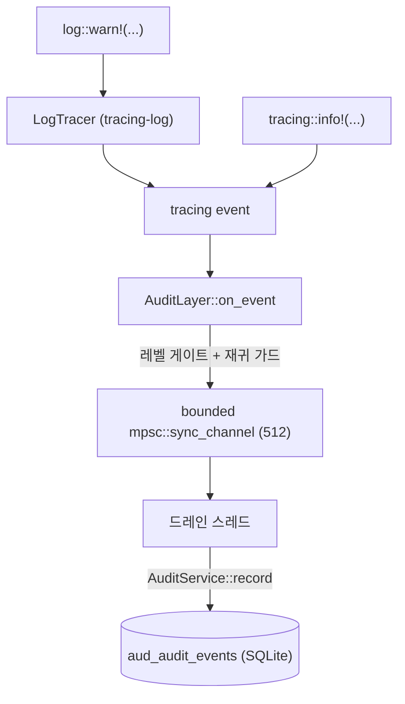

# DBFlux 감사 시스템

DBFlux는 모든 중요한 작업을 SQLite에 저장된 통합 감사 트레일에 기록합니다. 여기에는 쿼리 실행, 연결 수명 주기, 훅 실행, 스크립트 실행, MCP 거버넌스 결정, 구성 변경이 포함됩니다.

## 저장 위치

모든 감사 이벤트는 통합 데이터베이스에 저장됩니다:

```
~/.local/share/dbflux/dbflux.db
```

테이블: `aud_audit_events`

같은 데이터베이스는 다른 모든 런타임 상태(프로필, 기록, 세션)도 저장합니다. 스키마는 `dbflux_storage/src/migrations/`의 마이그레이션 시스템이 관리합니다.

## 이벤트 구조

모든 감사 이벤트는 다음 필드를 가진 `EventRecord`(`dbflux_core/src/observability/types.rs`)입니다:

| 필드 | 타입 | 설명 |
|-------|------|-------------|
| `id` | `i64` | 삽입 시 자동 할당 |
| `ts_ms` | `i64` | 밀리초 단위 Unix 타임스탬프 |
| `level` | `EventSeverity` | `trace`, `debug`, `info`, `warn`, `error`, `fatal` |
| `category` | `EventCategory` | 이벤트의 도메인 (아래 참조) |
| `action` | `String` | 구체적인 작업 식별자 (예: `query_execute`) |
| `outcome` | `EventOutcome` | `success`, `failure`, `cancelled`, `pending` |
| `actor_type` | `EventActorType` | 이벤트를 트리거한 주체 |
| `actor_id` | `Option<String>` | 행위자의 신원 (MCP 클라이언트 ID, 훅 이름 등) |
| `source_id` | `EventSourceId` | 이벤트가 발생한 위치 |
| `connection_id` | `Option<String>` | 연결 프로필 ID |
| `database_name` | `Option<String>` | 대상 데이터베이스 이름 |
| `driver_id` | `Option<String>` | 드라이버 ID (예: `postgres`, `mongodb`) |
| `object_type` | `Option<String>` | 영향받은 개체의 타입 (예: `table`, `collection`) |
| `object_id` | `Option<String>` | 해당 개체의 ID/이름 |
| `summary` | `String` | 사람이 읽을 수 있는 설명 |
| `details_json` | `Option<String>` | JSON 개체 형태의 추가 구조화된 컨텍스트 |
| `error_code` | `Option<String>` | 실패 시 오류 코드 |
| `error_message` | `Option<String>` | 실패 시 오류 메시지 |
| `duration_ms` | `Option<i64>` | 밀리초 단위 실행 시간 |
| `session_id` | `Option<String>` | 세션 상관 관계 ID |
| `correlation_id` | `Option<String>` | 구성 요소 간 상관 관계 ID |

### 이벤트 카테고리

| 카테고리 | 문자열 | 수집 내용 |
|----------|--------|-----------------|
| `Query` | `query` | SQL 실행, MongoDB 쿼리, 스캔 작업 |
| `Connection` | `connection` | 연결, 연결 끊기, 재연결 수명 주기 |
| `Hook` | `hook` | PreConnect, PostConnect, PreDisconnect, PostDisconnect |
| `Script` | `script` | Lua, Python, Bash 스크립트 실행 |
| `Mcp` | `mcp` | AI 클라이언트 도구 호출과 정책 결정 |
| `Governance` | `governance` | 정책 평가 결과 |
| `Config` | `config` | 프로필 변경, 설정 수정 |
| `System` | `system` | 애플리케이션 시작, 패닉, 마이그레이션 |
| `ObjectStorage` | `object_storage` | 개체 스토리지 CRUD/변경 이벤트 (업로드, 삭제, presign, 이름 바꾸기, 버킷/폴더 만들기, 저장 후 편집) |

### 행위자 타입

| 타입 | 문자열 | 의미 |
|------|--------|---------|
| `User` | `user` | DBFlux GUI를 사용하는 사람 |
| `System` | `system` | 백그라운드 시스템 작업 |
| `App` | `app` | 자율적으로 동작하는 애플리케이션 |
| `McpClient` | `mcp_client` | MCP 프로토콜을 통한 AI 에이전트 |
| `Hook` | `hook` | 수명 주기 훅 스크립트 |
| `Script` | `script` | 사용자가 작성한 스크립트 |

### 카테고리별 필수 필드

검증은 저장 전에 `AuditService::validate_event()`가 강제합니다:

| 카테고리 | `action` + `summary` 외에 필수인 필드 |
|----------|--------------------------------------|
| `Query` | `connection_id`, `driver_id`, `duration_ms` (실행 이벤트의 경우) |
| `Connection` | `connection_id` |
| `Hook` | `object_type`, `object_id`, `connection_id` |
| `Script` | `object_type`, `object_id` |
| `Mcp` | `actor_id`, `object_id` (도구 이름) |
| `Config` | `object_type`, `object_id` |
| `ObjectStorage` | `connection_id`, `object_type`, `object_id` |
| `Governance`, `System` | 추가 필드 없음 |

## 개인정보 및 마스킹

기본적으로 `AuditService`는 다음 설정으로 실행됩니다:

- **`redact_sensitive = true`**: `details_json`과 `error_message`의 민감한 값(비밀번호, 토큰, 연결 문자열)은 저장 전에 `[REDACTED]`로 대체됩니다.
- **`capture_query_text = false`**: 전체 쿼리 텍스트는 저장되지 않습니다. 대신 SHA256 지문과 원본 길이가 `query_length`와 함께 `[FINGERPRINT:<16-char-hex>]`로 저장됩니다. 이는 쿼리에 포함된 민감한 데이터가 감사 로그로 유출되는 것을 막습니다.
- **`max_detail_bytes = 65536`**: 저장소 비대화를 막기 위해 64 KiB보다 큰 페이로드는 거부됩니다.

이 설정은 런타임에 `AuditService::set_*()` 메서드로 변경할 수 있습니다. MCP 서버는 이 중 일부를 거버넌스 설정을 통해 노출합니다.

## 감사 이벤트 보기

### DBFlux UI에서

**Workspace → Audit**로 이동합니다. 통합 감사 뷰는 다음을 지원합니다:

- 행위자, 도구/작업, 날짜 범위, 결정, 카테고리로 필터링
- 필터링된 결과를 CSV 또는 JSON으로 내보내기

같은 `AuditDocument` UI 셸은 드라이버가 일반 코어 추상화(`CollectionPresentation`, `CollectionChildInfo`, `EventStreamTarget`)를 통해 선언하는 드라이버 기반 외부 이벤트 스트림에도 재사용됩니다. UI는 그런 스트림을 열거나 렌더링하기 위해 구체적인 드라이버를 특별 취급해서는 안 됩니다.

### SQLite로 직접

데이터베이스는 표준 SQLite 파일입니다. 직접 쿼리할 수 있습니다:

```bash
sqlite3 ~/.local/share/dbflux/dbflux.db
```

유용한 쿼리:

```sql
-- 최근 24시간의 모든 이벤트
SELECT id, datetime(ts_ms/1000, 'unixepoch') as ts, level, category, action, outcome, actor_id, summary
FROM aud_audit_events
WHERE ts_ms > (unixepoch('now') - 86400) * 1000
ORDER BY ts_ms DESC;

-- MCP 도구 호출만
SELECT id, datetime(ts_ms/1000, 'unixepoch') as ts, actor_id, object_id as tool, outcome, summary
FROM aud_audit_events
WHERE category = 'mcp'
ORDER BY ts_ms DESC;

-- 실패한 모든 작업
SELECT id, datetime(ts_ms/1000, 'unixepoch') as ts, category, action, actor_id, error_message
FROM aud_audit_events
WHERE outcome = 'failure'
ORDER BY ts_ms DESC
LIMIT 50;

-- 연결별 쿼리 이벤트
SELECT id, datetime(ts_ms/1000, 'unixepoch') as ts, action, driver_id, duration_ms, summary
FROM aud_audit_events
WHERE category = 'query' AND connection_id = 'your-connection-id'
ORDER BY ts_ms DESC;

-- 카테고리와 결과별로 그룹화된 이벤트
SELECT category, outcome, count(*) as count
FROM aud_audit_events
GROUP BY category, outcome
ORDER BY category, outcome;
```

### MCP 도구로 (AI 클라이언트)

MCP 도구 표면은 세 가지 감사 도구를 노출합니다 (`read` 실행 클래스로 분류됨):

```
query_audit_logs    — 행위자, 도구, 날짜 범위, 결정으로 이벤트 필터링
get_audit_entry     — ID로 단일 이벤트 조회
export_audit_logs   — 필터링된 결과를 CSV 또는 JSON으로 내보내기
```

### Rust API로

```rust
use dbflux_audit::{AuditService, AuditQueryFilter, AuditExportFormat};

let service = AuditService::new_sqlite_default()?;

// 최근 이벤트 조회
let filter = AuditQueryFilter {
    category: Some("mcp".to_string()),
    start_epoch_ms: Some(start_ms),
    limit: Some(100),
    ..Default::default()
};
let events = service.query(&filter)?;

// CSV로 내보내기
let csv = service.export(&filter, AuditExportFormat::Csv)?;

// 확장 내보내기 (details_json 포함 모든 필드)
let json = service.export_extended(&filter, AuditExportFormat::Json)?;
```

## 감사 이벤트 생성

### 서비스 레이어에서

`EventSink` 트레이트를 사용합니다. 감사 이벤트를 발행하는 모든 컴포넌트는 `Arc<dyn EventSink>`를 받습니다:

```rust
use dbflux_core::observability::{
    EventOrigin, EventRecord, EventSink,
    types::{EventCategory, EventSeverity, EventOutcome},
    actions,
};

// 이벤트를 만듭니다
let event = EventRecord::new(
    now_epoch_ms(),
    EventSeverity::Info,
    EventCategory::Query,
    EventOutcome::Success,
)
.with_typed_action(actions::QUERY_EXECUTE)
.with_summary("SELECT executed on users table")
.with_actor_id("my-actor-id")
.with_origin(EventOrigin::local())
.with_connection_context("my-profile-id", "mydb", "postgres")
.with_object_ref("table", "users")
.with_duration_ms(42);

// 싱크를 통해 발행합니다 (생성자나 DI로 주입됨)
event_sink.record(event)?;
```

### 표준 액션 상수

액션 문자열은 `dbflux_core/src/observability/actions.rs`에 정의되어 있습니다. 문자열을 그대로 쓰는 대신 상수를 사용합니다:

| 상수 | 문자열 | 카테고리 |
|----------|--------|----------|
| `QUERY_EXECUTE` | `query_execute` | Query |
| `QUERY_EXECUTE_FAILED` | `query_execute_failed` | Query |
| `CONNECTION_CONNECT` | `connection_connect` | Connection |
| `CONNECTION_DISCONNECT` | `connection_disconnect` | Connection |
| `HOOK_EXECUTE` | `hook_execute` | Hook |
| `HOOK_EXECUTE_FAILED` | `hook_execute_failed` | Hook |
| `SCRIPT_EXECUTE` | `script_execute` | Script |
| `SCRIPT_EXECUTE_FAILED` | `script_execute_failed` | Script |
| `MCP_AUTHORIZE` | `mcp_authorize` | Mcp |
| `MCP_APPROVE_EXECUTION` | `mcp_approve_execution` | Mcp |
| `MCP_REJECT_EXECUTION` | `mcp_reject_execution` | Mcp |
| `MCP_TOOL_EXECUTE` | `mcp_tool_execute` | Mcp |
| `MCP_TOOL_EXECUTE_FAILED` | `mcp_tool_execute_failed` | Mcp |
| `SYSTEM_PANIC` | `system_panic` | System |

### 필수 필드 체크리스트

`record()`를 호출하기 전에 다음을 확인합니다:

1. `action`이 설정되어 있고 비어 있지 않아야 합니다 (`actions`의 상수를 사용)
2. `summary`가 설정되어 있고 비어 있지 않아야 합니다 (사람이 읽을 수 있는 한 문장)
3. 카테고리별 필드가 존재해야 합니다 (위 표 참조)
4. `details_json`을 제공하는 경우 유효한 JSON 개체여야 합니다 — 배열이나 원시 값이 아님
5. `details_json`은 64 KiB 미만이어야 함

### 실패 이벤트

실패 시에는 outcome을 `EventOutcome::Failure`로 설정하고 `error_code`와 `error_message`를 채웁니다:

```rust
let event = EventRecord::new(ts_ms, EventSeverity::Error, EventCategory::Query, EventOutcome::Failure)
    .with_typed_action(actions::QUERY_EXECUTE_FAILED)
    .with_summary("Query failed: syntax error")
    .with_connection("profile-id", Some("mydb"), Some("postgres"))
    .with_error("42601", "syntax error at or near \"SELEC\"");
```

`error_message`는 민감한 패턴을 포함하면 마스킹됩니다. 안정적인 기계 판독 가능 오류 식별자에는 `error_code`를 사용합니다.

## 보존 및 제거

이벤트는 보존 정책에 따라 제거할 수 있습니다:

```rust
// 90일보다 오래된 이벤트를 500개씩 일괄 삭제
let stats = service.purge_old_events(90, 500)?;
println!("Deleted {} events in {} batches", stats.deleted_count, stats.batches);
```

제거는 긴 쓰기 트랜잭션을 피하기 위해 일괄 처리됩니다. 자동으로 실행되지 않으므로 예약된 백그라운드 작업이나 운영자 런북에 추가합니다.

## Tracing 감사 브리지

Tracing 브리지는 모든 DBFlux 크레이트에서 `log::*!`와 `tracing::*!` 매크로가 발행하는 구조화된 이벤트를 캡처하여, 호출 지점을 수정할 필요 없이 동일한 `aud_audit_events` 테이블에 기록합니다.

### 이벤트 흐름



### 브리지가 허용하는 카테고리

브리지를 통해 캡처된 모든 이벤트에는 `System` 카테고리가 부여됩니다. 이것은 V1에서 내린 결정입니다: 자유 형식의 로그 이벤트는 다른 카테고리가 요구하는 구조화된 필드(`connection_id`, `object_type`, `object_id`)를 담고 있지 않으므로, 이를 `Connection`이나 `Config`로 라우팅하면 `validate_event`가 거부하게 됩니다. `dbflux_core/src/observability/tracing_bridge/category.rs`의 `PREFIX_CATEGORY_MAP`은 문서화 목적으로 모듈 접두사를 의도된 카테고리에 매핑하지만, 런타임에는 해석된 모든 카테고리가 `System`으로 강제됩니다.

### 캡처 임계값

설정된 `log_capture_min_level` 이상의 이벤트만 감사 저장소에 기록됩니다. `TRACE`와 `DEBUG`는 하드 필터링됩니다 — 설정된 임계값과 무관하게 기록되지 않습니다.

임계값은 `Arc<AtomicU8>`에 `u8` 서수로 저장되며, subscriber를 다시 초기화하지 않고 갱신됩니다. 매핑은 다음과 같습니다:

| 심각도 | 서수 |
|----------|---------|
| Trace    | 0       |
| Debug    | 1       |
| Info     | 2       |
| Warn     | 3       |
| Error    | 4       |

기본 임계값은 `Info`(서수 2)입니다.

### 임계값 설정

DBFlux UI에서: **설정 → 감사 → 로그 캡처 → 최소 레벨** 드롭다운. 레벨을 선택하고 저장을 누르면 `cfg_audit_settings.log_capture_min_level`에 저장되고(마이그레이션 014에서 추가된 열) 브리지에 원자적으로 적용됩니다 — 재시작이 필요 없습니다.

SQLite에서 직접:

```sql
UPDATE cfg_audit_settings SET log_capture_min_level = 'warn';
```

유효한 값: `trace`, `debug`, `info`, `warn`, `error`.

### 드롭 카운터

bounded 채널이 가득 차면(기본 512개 이벤트, `BridgeConfig::queue_capacity`로 설정 가능) 브리지는 블록하는 대신 들어오는 이벤트를 버리고 `Arc<AtomicU64>` 드롭 카운터를 증가시킵니다. 이를 통해 감사 경로가 애플리케이션 코드에 역압(backpressure)을 유발하지 않습니다. 현재 드롭 수는 `BridgeHandle::drop_count()`로 접근할 수 있고 관측성을 위해 `AuditService::dropped_log_event_count()`로 노출되지만, V1에서는 저장되지 않고 UI에도 표시되지 않습니다.

### 시작 구간

프로세스 시작과 싱크 설치 사이에는 짧은 간격이 있으며, 이 동안 이벤트는 드레인 채널로 캡처되지만 아직 SQLite로 플러시되지 않습니다 — 싱크는 `AppState`가 만들어지고 첫 감사 설정 읽기가 끝난 뒤에 설치됩니다. 이 구간에서 처리 중이던 이벤트는 bounded 채널에 보관되고 싱크가 설치되면 전달됩니다. 시작 구간 동안 채널이 가득 차면 이벤트는 버려지고 집계됩니다.

### 재귀 가드

`dbflux_core::observability::tracing_bridge`에서 발행되는 이벤트는 브리지 진단이 자기 자신으로 되먹임되는 피드백 루프를 막기 위해 브리지에서 제외됩니다. 이는 `AuditLayer::on_event`에서 검사하는 `BRIDGE_INTERNAL_TARGET` 상수로 강제됩니다.

### 대상 허용 목록

`target`이 `dbflux`로 시작하는 이벤트만 감사 저장소로 미러링됩니다. `gpui`, `blade_graphics`, `naga`, `wgpu`, `hyper`, `tokio` 같은 업스트림 의존성은 장황한 `INFO` 수준의 trace(렌더 루프 텍스처와 버퍼 수명 주기, surface present mode, HTTP 요청 수명 주기 등)를 발행하는데, 이를 그대로 두면 사후 진단에 아무 가치가 없는 운영 노이즈로 감사 로그가 뒤덮입니다.

이 이벤트들은 여전히 fmt 레이어를 흐르며 `RUST_LOG` 설정에 따라 stderr(또는 로그 파일)에 표시됩니다. 이 게이트는 `layer.rs`의 `passes_target_gate`에 있으며 레코드 생성 전에 실행됩니다.

`dbflux`가 아닌 소스에서 발생한 이벤트를 감사하려면, 발행을 dbflux 모듈 안에 넣고 dbflux target으로 다시 발행합니다 — 브리지는 의도적으로 업스트림 target을 통과시키지 않습니다.

### 이름 있는 Tracing 필드

브리지는 tracing 이벤트에서 다음 이름 있는 필드를 인식하여 `EventRecord` 필드로 매핑합니다:

| Tracing 필드 | `EventRecord` 필드 |
|---------------|---------------------|
| `message` | `summary` |
| `category` | `category` (`System`으로 강제됨) |

`actor_type`, `actor_id`, `connection_id`, `database_name`, `driver_id`, `action`, `outcome`, `details_json` 필드도 마찬가지로 인식되며 같은 이름의 `EventRecord` 필드로 매핑됩니다.

알 수 없는 필드는 JSON 개체로 `details_json`에 누적됩니다. 메시지가 512자를 넘으면 `…`로 잘리고 전체 메시지는 `details_json["message"]`에 저장됩니다.

브리지는 또한 `correlation_id`를 (`details_json`이 아니라) `EventRecord.correlation_id`로 직접 매핑하여, 사용자 대면 오류 토스트와 그에 해당하는 감사 레코드 사이의 컴포넌트 간 상관 관계 추적을 가능하게 합니다.

### 사용자 대면 오류 이벤트

사용자 대면 오류(저장소 실패, 드라이버 오류, 네트워크 문제, 설정 저장 실패)는 `dbflux_ui_base::user_error`의 `report_error` / `report_error_async`를 통해 보고됩니다. 각 호출은 브리지를 흐르는 tracing 이벤트를 발행하고 토스트 알림도 띄웁니다.

tracing 이벤트의 모양:

| Tracing 필드 | 값 |
|---------------|-------|
| `target` | `dbflux_ui::user_error` |
| `action` | `user_error` |
| `outcome` | `failure` |
| `kind` | 문자열 형태의 `ErrorKind` (`storage`, `network`, `auth`, `hook`, `driver`, `user`, `config`) |
| `correlation_id` | 토스트와 감사 레코드를 잇는 UUID v7 |
| `message` | 토스트에 표시되는 사람이 읽을 수 있는 요약 |

`correlation_id` 필드는 `AuditFieldVisitor`가 추출하여 `EventRecord.correlation_id`에 넣습니다. 이 visitor는 `record_str`(Display sigil `%val`)과 `record_debug`(Debug sigil `?val`)을 모두 같은 `record_string_by_name` 디스패처로 보내므로, 앞으로 추가되는 새 타입 슬롯도 호출자가 어떤 sigil을 쓰든 모두 처리됩니다.

UI에서 감사 문서로 돌아오는 경로는 두 가지입니다:

- **토스트별 "감사에서 보기" 액션** — `OpenAuditRequested(Some(correlation_id))`를 발행합니다. 워크스페이스는 감사 문서를 열거나(또는 포커스하고) 일치하는 상관 관계 필터를 적용하여, 사용자가 토스트에 연결된 그 하나의 이벤트만 보게 합니다.
- **상태 표시줄 오류 배지 클릭** — `OpenAuditRequested(None)`을 발행합니다. 워크스페이스는 기본 사용자 오류 필터(최근 시간 범위의 `target = dbflux_ui::user_error`)로 감사 문서를 열어, 사용자가 최근의 모든 사용자 대면 실패를 훑어볼 수 있게 합니다.

두 이벤트 모두 `AppStateEntity::request_open_audit`를 통해 흐르므로 워크스페이스는 한 번만 구독합니다.

`EventSeverity`에서의 심각도 매핑:
- `EventSeverity::Info`와 `EventSeverity::Warn` — `WARN` 수준으로 발행; 스로틀 적용(심각도별 5토큰 버킷, 2초마다 1토큰 충전)
- `EventSeverity::Error`와 `EventSeverity::Fatal` — `ERROR` 수준으로 발행; 스로틀 우회

### 브리지 활성화

브리지는 `dbflux_core`를 `tracing-bridge` 기능과 함께 빌드하면 활성화됩니다(`dbflux`, `dbflux_mcp_server`에서는 기본 활성). 프로세스 시작 시 `init_tracing(BridgeConfig { .. })`을 한 번 호출합니다:

```rust
use dbflux_core::observability::tracing_bridge::{init_tracing, BridgeConfig, FmtWriter};

let handle = init_tracing(BridgeConfig {
    include_audit_layer: true,
    fmt_writer: FmtWriter::Stderr,
    env_filter_default: "info",
    ..BridgeConfig::default()
})?;

// 나중에 AuditService가 준비되면:
handle.install_sink(Arc::new(audit_service));
```

`dbflux_driver_host`는 `include_audit_layer: false`를 사용합니다. 드라이버 호스트 프로세스는 수명이 짧고 감사 SQLite 데이터베이스에 접근할 수 없기 때문입니다.

### 주요 파일

| 파일 | 역할 |
|------|------|
| `crates/dbflux_core/src/observability/tracing_bridge/mod.rs` | `init_tracing`, `BridgeHandle`, `BridgeConfig`, `LevelCode` |
| `crates/dbflux_core/src/observability/tracing_bridge/layer.rs` | `AuditLayer`, `AuditFieldVisitor`, 레벨 게이트 |
| `crates/dbflux_core/src/observability/tracing_bridge/category.rs` | `PREFIX_CATEGORY_MAP`, `resolve_category`, `BRIDGE_INTERNAL_TARGET` |
| `crates/dbflux_storage/src/migrations/mod_014_audit_settings_log_capture_min_level.rs` | `cfg_audit_settings`에 `log_capture_min_level` 열 추가 |

## 외부 감사 이벤트 발행 (RPC 드라이버 및 인증 제공자)

외부 RPC 드라이버(프로토콜 v1.2+)와 인증 제공자(프로토콜 v1.3+)는 중간 응답 프레임 형태로 감사 이벤트를 호스트에 되돌려 발행할 수 있습니다. 호스트는 `aud_audit_events`에 기록하기 전에 엄격한 정화를 적용합니다.

### 호스트 권한 정책

호스트가 식별, 상관 관계, 속도 제한 관련 필드를 모두 소유합니다. 외부 서비스는 자신의 식별 정보를 위조하거나 사용이 허가되지 않은 감사 카테고리를 주장할 수 없습니다.

| 필드 | 출처 |
|-------|--------|
| `actor_type` | 항상 `ExternalDriver` 또는 `ExternalAuthProvider` |
| `source_id` | 등록된 `socket_id`와 함께 항상 `ExternalDriver` / `ExternalAuthProvider` |
| `actor_id` | 항상 `rpc:<socket_id>` |
| `connection_id` | 세션 컨텍스트에서 호스트가 제공 (`None`일 수 있음) |
| `database_name` | 세션 컨텍스트에서 호스트가 제공 (`None`일 수 있음) |
| `driver_id` | 항상 `rpc:<socket_id>` |
| `correlation_id` | 호스트가 생성; 드라이버는 세션별 하나, 인증 제공자는 요청별 하나 |
| `ts_ms` | 서비스가 제공하지만 호스트 벽시계 시간과의 편차가 5분을 넘으면 보정됨 |

`correlation_id`는 구조적으로 호스트가 생성함이 보장됩니다. `AuditEventEmitDto`(IPC 페이로드 타입)에 `correlation_id` 필드가 없기 때문입니다. 외부 서비스는 이 값을 공급할 수 없습니다 — 이 필드는 받아서 검증으로 걸러내는 대신 설계 단계(ADR-3)에서 DTO에서 의도적으로 빠졌습니다. 그 결과 "드라이버 DTO가 위조된 correlation_id를 담고 호스트가 런타임에 이를 덮어쓰는" 시나리오는 타입 수준에서 불가능합니다; 저장되는 값은 항상 호스트의 correlation-id 할당 로직이 만듭니다.

### 카테고리 허용 목록

드라이버는 `Connection`, `Query`, `System` 이벤트를 발행할 수 있습니다. 인증 제공자는 `Connection` 이벤트만 발행할 수 있습니다. 허용되지 않은 카테고리를 담은 프레임은 조용히 버려집니다.

### 속도 제한

외부 서비스 각각(`socket_id` 기준)은 토큰 버킷으로 60초당 100개 이벤트로 제한됩니다. 한도를 넘긴 프레임은 버려지고 `AuditService::external_audit_dropped_count()`에 집계됩니다.

### 선택 플래그

- **드라이버**: 드라이버는 hello 응답에 `DriverCapability::AuditEmit`을 포함해야 합니다 (프로토콜 v1.2+). 이 기능을 알리지 않은 드라이버가 보낸 프레임은 조용히 버려집니다.
- **인증 제공자**: 제공자는 hello 응답에 `audit_emit_opt_in: true`를 설정해야 합니다 (프로토콜 v1.3+). 선택하지 않은 제공자가 보낸 프레임은 조용히 버려집니다.

### 발행되는 모든 프레임의 필수 필드

발행되는 `AuditEventEmitDto`는 비어 있지 않은 `action`과 `summary`를 가져야 합니다. 이 검사를 통과하지 못한 프레임은 조용히 버려집니다.

### 전송 메커니즘

발행된 프레임은 정상 응답 시퀀스 안에서 `done=false` 중간 프레임으로 도착합니다. 전송 계층(`dbflux_driver_ipc`의 `RpcClient`, `dbflux_ipc`의 `RpcAuthProvider::dispatch_request_loop`)이 호출자에게 닿기 전에 이를 가로챕니다. 호출자가 보는 것은 언제나 최종 프레임뿐입니다.

### 주요 파일

| 파일 | 역할 |
|------|------|
| `crates/dbflux_ipc/src/audit.rs` | `AuditEventEmitDto`, `ExternalAuditEmitter` 트레이트, `ExternalAuditSource` |
| `crates/dbflux_app/src/rpc_services/external_audit.rs` | `ExternalAuditSink`, 토큰 버킷 속도 제한기, 정화 파이프라인 |
| `crates/dbflux_driver_ipc/src/transport.rs` | `RpcClient::send_raw`가 드라이버 발행 프레임을 가로챔 |
| `crates/dbflux_ipc/src/auth_provider_client.rs` | `dispatch_request_loop`가 인증 제공자 발행 프레임을 가로챔 |

## 아키텍처

```
[서비스 레이어]
  |  EventSink 트레이트를 통해 EventRecord를 발행
  v
AuditService              (dbflux_audit/src/lib.rs)
  |  검증 → 쿼리 텍스트 지문화 → 민감 값 마스킹 → 크기 제한 적용
  v
SqliteAuditStore          (dbflux_audit/src/store/sqlite.rs)
  |  AuditRepository에 위임
  v
AuditRepository           (dbflux_storage/src/repositories/audit.rs)
  |  aud_audit_events에 삽입
  v
~/.local/share/dbflux/dbflux.db
```

주요 파일:

| 파일 | 역할 |
|------|------|
| `crates/dbflux_core/src/observability/types.rs` | `EventRecord`, 모든 열거형 타입 |
| `crates/dbflux_core/src/observability/actions.rs` | 표준 액션 문자열 상수 |
| `crates/dbflux_audit/src/lib.rs` | `AuditService` — 검증, 전처리, 기록 |
| `crates/dbflux_audit/src/query.rs` | `AuditQueryFilter` |
| `crates/dbflux_audit/src/export.rs` | CSV/JSON 내보내기 (기본 및 확장) |
| `crates/dbflux_audit/src/redaction.rs` | 민감 값 마스킹 로직 |
| `crates/dbflux_audit/src/purge.rs` | 보존 정책 기반 이벤트 제거 |
| `crates/dbflux_audit/src/store/sqlite.rs` | SQLite 저장소 어댑터 |
| `crates/dbflux_storage/src/repositories/audit.rs` | `AuditRepository` + `AuditEventDto` |
