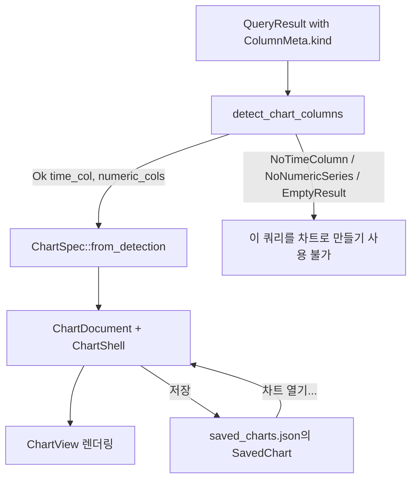

# DBFlux 차트

DBFlux는 쿼리 결과를 차트로 바꿀 수 있습니다. 차트 엔진은 완전히 드라이버에
독립적입니다: 모든 드라이버가 채우는 구조화된 열 메타데이터만 검사할 뿐,
드라이버 식별자나 데이터베이스 고유의 타입 이름 문자열은 절대 보지 않습니다.
이 문서는 지원되는 차트 유형, 엔진이 축을 자동으로 감지하는 방식, 차트가
저장되는 방식, UI에서 차트를 만드는 방법을 설명합니다.

대시보드(공유 시간 범위를 갖는 저장된 차트들의 그리드), 시각화 저장소
테이블(`viz_*`), 그리고 업스트림 대시보드를 가져오거나 탐색하기 위한
드라이버 연동 지점에 대해서는 [`DASHBOARDS.md`](./DASHBOARDS.md)를
참조하세요.

## 개요

차트 엔진은 `dbflux_components` 크레이트의 `crates/dbflux_components/src/chart/` 아래에
있습니다. 이 크레이트의 `mod.rs`는 전체 파이프라인을 설명합니다:

1. `detect` — `ColumnKind` 의미 체계만을 사용해 `QueryResult`에서 적합한 열을 자동으로
   감지합니다.
2. `spec` — 차트 및 시리즈 명세 타입과, 감지 기반 및 수동 열 선택을 위한 생성자를
   제공합니다.
3. `decimate` — 대규모 데이터 집합에서 그리기를 빠르게 유지하기 위한 LTTB
   (Largest-Triangle-Three-Buckets) 다운샘플링입니다.
4. `axis` — 숫자 축과 시간 축의 눈금 생성 및 레이블 형식화입니다.
5. `legend` — 범례 행을 위한 요소 팩토리입니다.
6. `engine` — 차트 상태를 소유하고 캔버스를 렌더링하는 GPUI 엔터티인 `ChartView`입니다.

독립형 차트 문서 UI는 `crates/dbflux_ui_document/src/chart_document/`(`mod.rs`, `render.rs`,
`pane.rs`)에 있습니다. `ChartDocument`는 쿼리, 연결, 차트 명세, `ChartShell`을 소유하며,
`crates/dbflux_components/src/result_panel/`의 공유 `ResultPanel` 크롬을 통해 렌더링을
호스팅합니다.

## 차트 타입

차트 종류는 `crates/dbflux_components/src/chart/spec.rs`의 `ChartKind` 열거형으로
정의됩니다:

| 변형 | 설명 |
|---------|-------------|
| `Line` | 선 차트. 기본 종류(`#[default]`)이며, 모든 `ChartSpec` 생성자가 선택하는 종류이기도 합니다. |
| `Bar` | 막대 차트. |
| `Scatter` | 산점도 차트. |
| `Area` | 채워진 선 차트; 시리즈 선과 기준선 사이의 영역이 음영 처리됩니다. Line의 기하 구조와 호버 동작을 공유합니다. |
| `StackedBar` | 누적 세로 막대. 각 X 위치마다 시리즈별로 하나의 막대가 표시되며, 나란히 그룹화되는 대신 누적으로 쌓입니다. Y축은 렌더 시점에 최대 스택 합계에 맞춰 다시 스케일링됩니다. |
| `Pie` | 파이 차트. X/Y 축이 없으며, 표시되는 각 시리즈가 해당 시리즈의 Y 값 합계에 비례하는 크기의 부채꼴 하나가 됩니다. |

`ChartKind`는 `ChartSpec.kind` 필드에 `#[serde(default)]` 의미 체계를 두고 있으므로,
`kind` 필드 이전에 직렬화된 차트 명세는 `Line`으로 역직렬화됩니다.

## ColumnKind와 축 자동 감지

### ColumnKind

자동 감지는 `crates/dbflux_core/src/query/types.rs`에 정의된 `ColumnKind` 열거형에 의해
전적으로 수행됩니다:

| 변형 | 의미 |
|---------|---------|
| `Timestamp` | 날짜/시간 또는 타임스탬프 열입니다. |
| `Float` | 부동 소수점 숫자 열입니다. |
| `Integer` | 정수 숫자 열입니다. |
| `Text` | 텍스트/문자열 열입니다. |
| `Unknown` | 드라이버가 이 열을 분류하지 못했습니다. |

각 드라이버는 반환하는 모든 열에 `ColumnMeta::kind`를 설정할 책임이 있습니다(`AGENTS.md`의
"Adding a New Driver" 규칙 참고). `Unknown`으로 남은 열은 차트 축이나 시리즈로 사용되지
않습니다.

### 자동 감지 규칙

`crates/dbflux_components/src/chart/detect.rs`의 `detect_chart_columns`는 `QueryResult`에
다음 규칙을 순서대로 적용합니다:

1. 결과의 행이 0개이면 `EmptyResult`를 반환합니다.
2. `kind == Timestamp`인 가장 왼쪽 열을 X축으로 선택합니다. 없으면 `NoTimeColumn`을
   반환합니다.
3. `kind == Float` 또는 `kind == Integer`인 나머지 모든 열을 열 순서대로 수집하여 숫자 Y
   시리즈로 삼습니다. 남은 열이 없으면 `NoNumericSeries`를 반환합니다.
4. 그렇지 않으면 `Ok { time_col, numeric_cols }`를 반환합니다.

그 결과가 `ChartDetection` 열거형이며, 변형은 `Ok`, `NoTimeColumn`, `NoNumericSeries`,
`EmptyResult`입니다.

### `type_name`과 드라이버 ID를 검사하지 않는 이유

`detect.rs`의 모듈 수준 문서는 감지 모듈이 쿼리-결과 모델과 차트 엔진 사이의 경계이며,
`type_name` 문자열이나 드라이버 식별자가 아니라 `ColumnKind` 값을 검사한다고 명시합니다.
`detect_chart_columns` 함수는 `column.kind`만 읽으며, `column.type_name`, `column.name`,
드라이버 ID는 절대 읽지 않습니다. 이를 통해 엔진은 특정 드라이버에서 완전히 분리된 상태를
유지하며, `AGENTS.md`의 드라이버/UI 분리 규칙과 일치합니다: 드라이버는 올바른 `ColumnKind`로
열을 분류하는 것만으로 자신의 열을 차트화 가능하게 만듭니다.

`Unknown`은 `Timestamp`도 `Float`/`Integer`도 아니므로, 분류되지 않은 열은 자동 감지된 X축도
자동 감지된 시리즈도 될 수 없습니다. 이는 의도된 설계입니다: 엔진이 타입 문자열로 추측하게
두는 대신 드라이버가 열을 분류하도록 강제합니다.

### 축 종류 추론

`ChartSpec`이 만들어질 때 X축 종류는 X 열의 `ColumnKind`에서 추론됩니다: `Timestamp`는
`AxisKind::Time`(눈금이 날짜/시간으로 형식화됨)으로, 그 외의 모든 값은
`AxisKind::Numeric`(십진 눈금)으로 매핑됩니다. `AxisSpec.unit` 필드는 현재 항상 `None`이며,
향후 드라이버가 제공할 단위 메타데이터를 위한 하위 호환성 확장 지점입니다.

### 숫자 값 추출

엔진이 셀에서 숫자 값을 추출할 때(`engine.rs`의 `extract_f64`), 여러 `Value` 형태를
처리합니다:

- `Value::Int` → `f64`로 캐스팅됩니다.
- `Value::Float` → 유한한 값이면 그대로 사용되며, 유한하지 않은 값은 버려집니다.
- `Value::Decimal` (정밀도를 보존하기 위해 문자열로 저장됨) → `f64`로 손실 있이 파싱되며,
  유한하지 않거나 파싱할 수 없는 값은 버려집니다. `NUMERIC`/`DECIMAL` 열을
  `ColumnKind::Float`로 분류하는 드라이버(예: PostgreSQL `NUMERIC`, MSSQL `DECIMAL`)는 이
  경로를 통과합니다.
- `Value::Bool` → `true`는 `1.0`으로, `false`는 `0.0`으로 매핑되므로, 일부 드라이버가
  `Integer`로 분류하는 `BIT`/`BOOLEAN` 열(예: MSSQL `BIT`)도 계속 그릴 수 있습니다.
- `Value::Text`는 RFC 3339 타임스탬프로서 시간 축에 한해서만 파싱됩니다.
- `Value::Null`과 그 외 모든 형태는 값을 산출하지 않습니다.

## 저장된 차트

영속화되는 차트는 `crates/dbflux_components/src/saved_chart.rs`에 정의된 `SavedChart`
레코드입니다. 저장된 차트는 `SavedChartsRepository`를 통해 통합 SQLite 데이터베이스 —
`viz_saved_charts` 테이블과 관련 `viz_saved_chart_*` 테이블 — 에 저장되며, 메모리 내 캐시는
`SavedChartManager`(`crates/dbflux_ui_base/src/saved_chart_manager.rs`)가 관리합니다. 쓰기는
먼저 리포지토리로 이동하며, 캐시는 성공한 경우에만 갱신됩니다.

`SavedChart`는 다음을 영속화합니다:

- `id`, `name`, `profile_id` — 식별자, 표시 이름, 소유 연결 프로필.
- `source` — `SavedChartSource`로, `Query { query }`(`ChartDocument` 내부에서 실행되는
  쿼리 문자열) 또는 `Collection { collection_ref,
  time_window }`(컬렉션 탐색 소스) 중 하나입니다.
- `chart_spec`과 `bindings` — 전체 렌더링 구성(`ChartSpec`과 `BindingSpec`).
- `time_range_preset`, `refresh_policy`, `created_at`, `updated_at`.

쿼리 문자열(또는 컬렉션 참조)만 영속화되며, 원시 결과 데이터는 절대 저장되지 않습니다.

### 저장된 차트 열기

`Workspace::open_saved_chart`(`crates/dbflux_ui/src/ui/views/workspace/actions.rs`)는 소스
타입에 따라 라우팅합니다:

- `Query` 소스는 `ChartDocument::from_saved`를 통해 독립형 `ChartDocument`를 엽니다.
  `from_saved`와 `validate_saved_source`는 `Collection` 소스를 거부하며, 워크스페이스는
  엔터티를 할당하기 전에 소스를 검증합니다.
- `Collection` 소스는 `ChartDocument`를 열지 않으며, `open_collection_document`를 통해
  기반 `DataDocument`를 차트 모드로 다시 엽니다.

### 중복 제거

열린 차트 문서는 `crates/dbflux_ui_document/src/dedup.rs`의
`DocumentKey::Chart { saved_chart_id: Uuid }` 변형을 통해 중복 제거됩니다. 저장된 차트를
열기 전에 `open_saved_chart`는 `tab_manager.find_by_key(&DocumentKey::Chart { ... })`를
호출하여 중복을 열지 않고 기존 탭을 활성화합니다. "이 쿼리를 차트로 만들기"("Chart this
query") 액션으로 만든 차트 문서는 아직 저장된 ID에 연결되지 않았으므로, 저장되기 전까지는
중복 제거되지 않습니다.

## UI에서 차트 만들기

세 가지 진입점이 있습니다.

### 이 쿼리를 차트로 만들기(Chart this query)

데이터 그리드의 상황에 맞는 메뉴는 "이 쿼리를 차트로 만들기"("Chart this query") 항목을
제공합니다. 이 항목은 `crates/dbflux_ui_document/src/data_grid_panel/context_menu.rs`의
`can_chart_from_context_menu`에 의해 게이트되며, 다음 둘 모두를 요구합니다:

1. 패널의 소스가 비어 있지 않은 원본 쿼리를 가진 `QueryResult`이고
2. 현재 결과에 대한 `detect_chart_columns`가 `Ok`를 반환합니다.

항목을 선택하면 `Workspace::open_chart_from_query`가 호출되어, 쿼리와 연결로 시드된
`ChartDocument::new`를 구성하고, `ChartDocument::into_pane`을 통해 `PaneHandle`로 감싸고,
새 탭으로 엽니다. 비어 있지 않은 쿼리가 있으면 문서가 첫 렌더링 시 자동 실행됩니다.

### 차트 열기...

"차트 열기..."("Open chart...") 명령은 활성 프로필에 대해 저장된 차트를 나열하고
(`build_saved_chart_palette_items`로 구축), 앞서 설명한 대로 `open_saved_chart`를 통해
선택한 차트를 엽니다.

### 시계열 컬렉션

카테고리가 `DatabaseCategory::TimeSeries`인 연결(예: InfluxDB measurement)에서
컬렉션을 열면, 데이터 그리드가 쿼리 결과와 같은 Data, Chart, JSON 뷰를 제공합니다.
`detect_chart_columns`가 `Ok`를 반환하면 첫 페이지가 차트로 열리며, 축은
`default_bindings_for_time_series`로 미리 설정됩니다(X는 시간, Y는 첫 번째 숫자 열,
그룹은 첫 번째 `Text` 열). Data 뷰는 다른 컬렉션이 사용하는 문서 트리 대신 그리드에
행을 표시합니다. 수동, 자동, 페이지 이동 등 어떤 새로 고침이든 사용자가 고른 뷰를
유지하며, 새 페이지를 더 이상 차트로 그릴 수 없을 때만 Data로 돌아갑니다.

도구 모음과 상태 표시줄은 드라이버가 실제로 실행하는 쿼리로 이 조회를 표시합니다.
이 쿼리는 `QueryGenerator::collection_browse_query`에서 가져오므로 레이블은 연결
자체의 쿼리 언어로 작성됩니다. 이 메서드를 구현하지 않은 드라이버는 일반 레이블을
유지합니다.

### 저장

`ChartDocument` 내부에서 저장 도구 모음 버튼은 이름 입력 프롬프트를 연 뒤 `confirm_save`를
호출하며, 이는 마지막 결과로부터 `ChartSpec`을 만들고(감지가 성공하면
`detect_chart_columns` / `ChartSpec::from_detection` 사용) 앱 상태의 `saved_charts`
관리자에 `SavedChart`를 업서트합니다. 저장 시 기존 `saved_chart_id`가 있으면 재사용하여
레코드가 중복 생성되지 않고 덮어써지도록 합니다.

## 제한 사항

이 제한 사항은 가정이 아니라 현재 코드에 기반합니다:

- 자동 감지는 X축을 선택하기 위해 최소 하나의 `Timestamp` 열을 요구합니다; 없으면
  `detect_chart_columns`가 `NoTimeColumn`을 반환하고 "이 쿼리를 차트로 만들기"를 사용할 수
  없습니다. (`BindingSpec` / `ChartSpec::from_bindings`을 통한 수동 선택은 타임스탬프가 아닌
  X 열을 사용할 수 있으며, 그 경우 `AxisKind::Numeric` 축으로 분류됩니다.)
- `ColumnKind::Unknown`인 열은 자동 감지에서 완전히 제외됩니다.
- `Collection` 소스의 저장된 차트는 `ChartDocument`로 열 수 없으며, 대신 기반
  `DataDocument`를 차트 모드로 다시 엽니다. `ChartDocument::from_saved`에 `Collection`
  소스를 전달하면 오류가 반환됩니다.
- 이 버전에서 `AxisSpec.unit`은 항상 `None`이며, 드라이버가 아직 단위 메타데이터를
  제공하지 않습니다.
- 모든 `ChartSpec` 생성자(`from_detection`, `from_bindings`, `from_manual_selection`)는
  `kind = ChartKind::Line`인 명세를 만들며, 다른 차트 종류는 생성 후에 선택됩니다.
- 시리즈 데시메이션은 기본값이 10,000포인트인 LTTB 임계값을 사용합니다
  (`default_decimation_threshold`).
