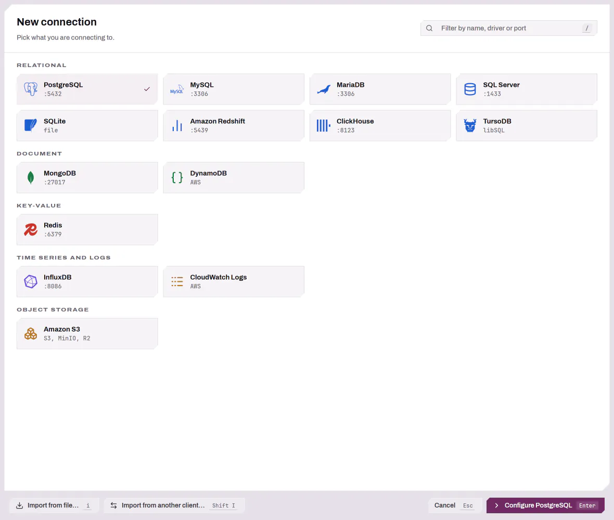
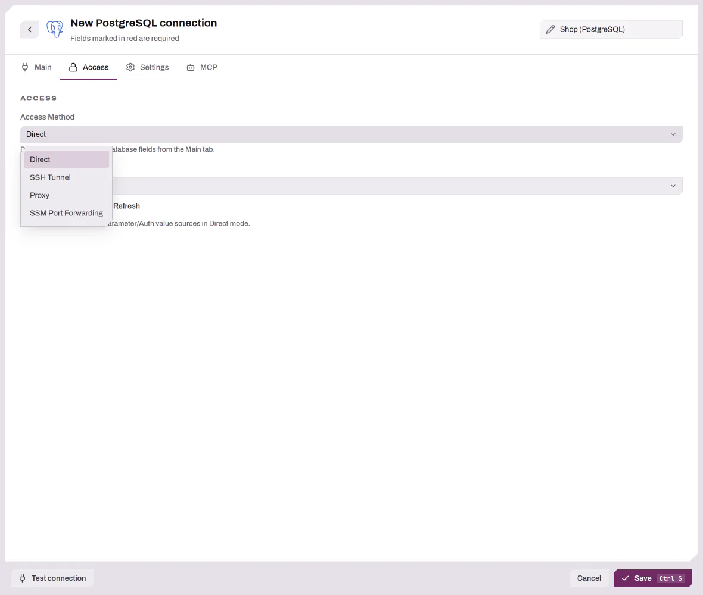

# 데이터베이스 연결 — 고급 설정

이 가이드는 연결 관리자에서 기본적인 "호스트, 포트, 사용자 이름, 비밀번호" 폼을 넘어서는
모든 내용을 다룹니다: SSH 터널, 프록시, 또는 AWS SSM을 통한 데이터베이스 접근; 공급자 기반
인증 프로필(AWS SSO)을 사용한 인증; 그리고 값을 직접 입력하는 대신 시크릿 관리자나 파라미터
스토어에서 개별 필드 값을 가져오는 방법입니다.

처음 따라 해 보는 흐름(연결 만들기, 스키마 탐색, 쿼리 실행)은 [시작하기](GETTING_STARTED.md)를
참고하세요. 이 문서는 연결 관리자를 열고 드라이버를 고르는 방법부터 시작해 **액세스**
탭과 값 소스 선택기를 다룹니다.

---
## 연결 관리자 열기

연결을 만들거나 편집하려면 연결 관리자를 엽니다:

- `Ctrl+Shift+N`(macOS에서는 `Cmd+Shift+N`)을 누릅니다.
- 사이드바에서 `c`를 누릅니다.
- 또는 명령 팔레트(macOS에서는 `Ctrl+Shift+P` / `Cmd+Shift+P`)를 열고
  **연결 관리자 열기**를 실행합니다.

## 드라이버 선택

연결 관리자에는 드라이버 선택기가 표시됩니다. 사용 가능한 드라이버는 바이너리가
빌드될 때 포함된 기능에 따라 다르며, 표준 빌드에는 SQLite, PostgreSQL,
MySQL/MariaDB, Microsoft SQL Server, Amazon Redshift, ClickHouse, TursoDB,
MongoDB, DynamoDB, Redis, InfluxDB, CloudWatch Logs, Amazon S3가 포함됩니다.
선택기는 드라이버를 관계형, 문서, 키-값, 시계열 및 로그, 오브젝트 스토리지
범주로 묶어 보여 줍니다. 구성되어 있으면 외부에서 등록된 RPC 드라이버도 여기에
표시됩니다(`docs/RPC_SERVICES_CONFIG.md` 참조).

`/`로 드라이버 목록을 필터링하고, `j`/`k`(또는 방향 키)로 이동하고, `Enter`로
선택합니다.

각 드라이버는 자체 연결 폼을 제공합니다. 폼은 동적입니다. 해당 드라이버가 실제로
필요로 하는 필드만 표시합니다. SQLite 같은 파일 기반 드라이버는 파일 경로 폼을
사용합니다. 대부분의 관계형 드라이버는 단일 연결 문자열도 받습니다.
[폼 모드 vs. 직접 URI](#폼-모드-vs-직접-uri)를 참고하세요.

<picture>
  <source media="(prefers-color-scheme: dark)" srcset="../images/connections/driver-picker-dark.webp">
  
</picture>

---

## 액세스 탭: DBFlux가 데이터베이스에 도달하는 방법

모든 연결은 **Access Method** 드롭다운에서 선택한 정확히 **하나**의 액세스 방식을
사용합니다. 방식을 전환하면 다른 방식의 설정이 지워집니다 — 연결은 Direct, SSH,
Proxy, SSM 중 하나이며, 조합은 불가능합니다.

| 방식 | 하는 일 |
|--------|--------------|
| **Direct** | 메인 탭의 호스트/포트에 직접 연결합니다. 필드별 값 소스를 계속 확인할 수 있습니다(자세한 내용은 [값 소스](#값-소스-secret-manager-parameter-store-auth-session) 참고). |
| **SSH Tunnel** | SSH 호스트를 통해 로컬 포트 포워딩을 열고 그 경유로 연결합니다. |
| **Proxy** | SOCKS5 또는 HTTP/HTTPS 프록시를 통해 연결을 라우팅합니다. |
| **SSM Port Forwarding** | AWS Systems Manager를 사용해 인스턴스로 포트 포워딩한 뒤 터널을 통해 연결합니다. `aws` 빌드 기능이 필요합니다. |

<picture>
  <source media="(prefers-color-scheme: dark)" srcset="../images/connections/access-tab-dark.webp">
  
</picture>

### Connect를 눌렀을 때 일어나는 일

DBFlux는 드라이버가 소켓을 열기 전에 고정된 사전 연결 파이프라인을 실행합니다:

1. **Authenticating** — 선택한 인증 프로필의 세션을 검증하거나 갱신합니다
   (여기서 AWS SSO 브라우저 로그인이 일어날 수 있습니다).
2. **Resolving values** — 모든 필드별 값 소스(secret manager, parameter store,
   환경 변수, 인증 세션 필드)를 확인해 설정에 반영합니다.
3. **Opening access** — SSH 터널, 프록시 또는 SSM 세션을 설정합니다 (Direct의
   경우 없음).
4. **Driver connect + schema fetch** — 드라이버가 연결하고 DBFlux는 얕은
   스키마를 불러옵니다.

연결 **훅**이 바인딩되어 있다면 이 파이프라인 전후로 PreConnect, PostConnect,
PreDisconnect, PostDisconnect 단계에서 실행됩니다. 자세한 내용은
[Settings & Hooks](SETTINGS.md#연결-훅)를 참고하세요.

---

## 연결에 실패한 경우

연결 시도가 실패하면 오류가 토스트로 표시되고, 연결 행에는 빨간색 오류 아이콘이
남습니다. 아이콘에 마우스를 올리면 오류를 볼 수 있습니다. 다시 연결하려면 행의
컨텍스트 메뉴에서 **다시 시도**를 선택하거나 행에서 `Enter`를 누르세요. 이 표시는
새 시도가 시작되거나, 연결에 성공하거나, 연결을 편집하면 사라집니다.

## 쿼리 실행 중 연결 끊기

쿼리가 아직 실행 중인 연결을 끊으려 하면 먼저 묻습니다: **쿼리 취소**는 쿼리를
중지하고 연결은 유지하며, **계속 기다리기**는 둘 다 그대로 두고, **그래도 연결
끊기**는 쿼리를 취소한 뒤 연결을 끊습니다. `Enter`는 **쿼리 취소**를,
`Escape`는 **계속 기다리기**를 선택합니다. 어느 연결에서든 쿼리가 실행 중일 때
DBFlux 창을 닫으면 해당 연결 이름과 함께 같은 질문을 하며, **그래도 연결
끊기** 대신 **그래도 종료**가 표시됩니다.

---

## SSH 터널

SSH 터널은 두 가지 방식으로 사용할 수 있습니다:

- **저장된 터널 참조** — **Settings → SSH Tunnels**에서 중앙 관리하는 터널
  프로필을 선택합니다. 여러 연결에서 같은 배스천을 재사용할 때 권장됩니다.
- **인라인** — 액세스 탭에서 SSH 필드를 직접 채웁니다. 나중에 **Save as
  tunnel**을 눌러 재사용 가능한 프로필로 승격할 수 있습니다.

### SSH 필드

| 필드 | 설명 |
|-------|-------|
| **Host** / **Port** | SSH 서버. 포트는 보통 `22`입니다. |
| **Username** | SSH 사용자입니다. |
| **Auth method** | **Private Key** 또는 **Password**. |
| **Key path** (Private Key) | 개인 키 파일 경로. **SSH 에이전트나 기본 키를 사용하려면 비워 두세요** (`~/.ssh/id_rsa` 등). |
| **Key passphrase** (Private Key) | 선택 사항; **Save**를 체크하면 OS 키링에 저장됩니다. |
| **Password** (Password 인증) | **Save**를 체크하면 OS 키링에 저장됩니다. |

별도의 "SSH agent" 옵션은 없습니다 — 에이전트 기반 인증은 **Private Key**를
선택하고 키 경로를 비워 두었을 때 적용되는 방식입니다.

**Test SSH**는 연결을 저장하지 않고 터널을 검증합니다.

### SSH 비밀이 저장되는 위치

암호 문구와 비밀번호는 데이터베이스가 아닌 **OS 키링**에 저장됩니다. **Save**
확인란은 키링을 사용할 수 있을 때만 나타나며, 사용할 수 없으면 비밀이 저장되지
않으므로 세션마다 다시 입력해야 합니다. 자세한 내용은
[Data & Privacy → Secrets](PRIVACY.md#비밀과-os-키링)를
참고하세요.

---

## 프록시

프록시는 **Settings → Proxies**에서 관리하며, 액세스 탭은 저장된 프록시를
*선택*하고 세부 정보를 표시할 뿐입니다. 프록시가 없으면 탭에서 설정으로
이동하는 링크를 보여줍니다.

| 필드 | 설명 |
|-------|-------|
| **Type** | `SOCKS5`, `HTTP`, `HTTPS`. 기본 포트: SOCKS5는 `1080`, HTTP/HTTPS는 `8080`. |
| **Host** / **Port** | 프록시 엔드포인트. |
| **Auth** | `None`, 또는 사용자 이름이 있는 `Basic` (비밀번호는 키링에 저장됩니다). |
| **No Proxy** | 우회할 쉼표로 구분된 호스트/패턴입니다. `*` (전체), 정확한 호스트, 접미사 일치(선행 점 유무와 무관)를 지원하며 대소문자를 구분하지 않습니다. **CIDR 범위는 지원되지 않습니다.** |
| **Enabled** | 프록시 프로필이 비활성화되면 실패하는 대신 (경고와 함께) **직접 연결**로 폴백합니다. |

> **주의:** 비활성화된 프록시 또는 **No Proxy**에 일치하는 원격 호스트는
> 조용히 직접 연결됩니다. 트래픽이 프록시를 통하길 기대했는데 그렇지 않았다면
> 먼저 이 두 가지를 확인하세요.

---

## 인증 프로필 (AWS SSO 및 공유 자격 증명)

인증 프로필은 DBFlux가 연결 시점에 확인하는 공급자 기반 인증을 담습니다.
**Settings → Auth Profiles**에서 만들고 연결별로 선택합니다. 이 빌드에서
내장 공급자는 **AWS뿐**입니다:

| 공급자 | 용도 |
|----------|------------|
| **AWS SSO** | 계정 + 역할을 확인하는 IAM Identity Center (SSO) 로그인입니다. |
| **AWS SSO Session** | AWS SSO 프로필이 상속할 수 있는 재사용 가능한 SSO 세션(Start URL + 리전 + 스코프)입니다. |
| **AWS Shared Credentials** | `~/.aws/credentials`에 저장된 이름 있는 프로필(액세스 키 / 시크릿 / 선택적 세션 토큰)입니다. |

외부에 등록된 RPC 인증 공급자가 여기에 항목을 더 추가할 수 있습니다; 자세한
내용은 [RPC Services](RPC_SERVICES_CONFIG.md)를 참고하세요.

> DBFlux가 `~/.aws/config`에서 실시간으로 반영하는 AWS 프로필은 **읽기
> 전용**으로 표시됩니다 — 여기서는 선택만 할 수 있고 편집할 수 없으므로 AWS
> 파일을 직접 편집하세요.

### AWS SSO 프로필 만들기

폼은 공급자가 주도합니다. AWS SSO에서는 다음을 입력합니다:

| 필드 | 설명 |
|-------|-------|
| **Profile name** | 예: `dev`. |
| **SSO session** | **AWS SSO Session** 프로필에 대한 선택적 참조입니다. 설정하면 Start URL과 리전이 상속되고 해당 인라인 필드는 회색으로 비활성화됩니다. |
| **SSO Start URL** | Identity Center 포털 URL입니다(세션을 사용한다면 건너뜁니다). |
| **Region** | 예: `us-east-1`. |
| **Account** | **로그인 후에** 채워지는 드롭다운 — SSO 세션이 접근할 수 있는 계정을 나열합니다. |
| **Role** | 계정을 선택하면 채워지는 드롭다운입니다. |

**Account**와 **Role** 드롭다운은 동적입니다: 살아 있는 SSO 세션이 필요하고
의존성이 바뀌면 갱신됩니다. 비어 있다면 먼저 로그인하세요(아래 참고).

**SSO Wizard**는 같은 흐름을 단계별 안내형 생성자로 제공합니다: 이름, Start
URL, 리전을 입력하면 로그인을 진행한 뒤 계정과 역할을 나열해 선택하게
해줍니다.

### SSO 로그인 흐름

연결(또는 Account/Role 드롭다운)에 SSO 세션이 필요하면 DBFlux는 로그인 모달을
엽니다:

- 검증 URL로 **브라우저를 자동으로 엽니다**.
- 브라우저를 열 수 없으면 모달이 URL과 **Copy URL** 작업을 표시해 수동으로 열
  수 있습니다.
- 브라우저에서 인증을 마치면 DBFlux가 자동으로 계속 진행됩니다.
- **SSO 로그인은 5분 후 시간 초과됩니다.**

### 연결별 인증 프로필 선택

- **Direct 모드** — 인증 프로필은 *선택 사항*입니다. Secret/Parameter/인증 값
  소스를 확인할 때만 사용합니다(다음 절).
- **SSM 모드** — 인증 프로필이 **필수**입니다.
- 어떤 필드가 공급자가 인증 공급자인 Secret/Parameter 값 소스를 사용하면
  일치하는 인증 프로필이 **필수**이며, 그렇지 않으면 연결 전에 거부됩니다.

각 프로필 행에는 **Manage**, **Login**, **Refresh** 버튼이 있습니다.
**Login**은 선택한 프로필이 실제로 로그인이 필요할 때만 활성화됩니다.

---

## SSM Port Forwarding (관리형 액세스)

"관리형" 액세스는 공급자가 호스트로 가는 경로를 대신 열어주는 방식입니다.
기본 제공 구현은 **AWS SSM Port Forwarding**입니다 (`aws` 기능 필요).

| 필드 | 설명 |
|-------|-------|
| **Instance ID** | 대상 EC2 인스턴스. 값 소스 선택기를 지원합니다. |
| **Region** | 비워 두면 `us-east-1`이 기본값입니다. |
| **Remote Port** | 인스턴스에서 포워딩할 포트입니다. |
| **Auth Profile** | **필수** — SSM 세션을 시작하는 데 사용되는 AWS 프로필입니다. |

**로컬** 터널 포트는 DBFlux와 OS가 자동으로 할당합니다 — 설정할 수 있는 것은
원격 포트뿐입니다.

---

## 값 소스: Secret Manager, Parameter Store, Auth Session

개별 연결 필드(호스트, 비밀번호 등)는 리터럴 대신 외부 소스에서 값을 가져올 수
있습니다. 필드 옆의 소스 선택기를 클릭하고 선택하세요:

| 소스 | 하는 일 |
|--------|--------------|
| **Literal** | 직접 입력한 값입니다(기본값). |
| **Environment Variable** | 이름으로 환경 변수를 읽습니다. |
| **Secret Manager** | 시크릿 공급자(AWS Secrets Manager)에서 가져옵니다. |
| **Parameter Store** | 파라미터 공급자(AWS SSM Parameter Store)에서 가져옵니다. |
| **Auth Session Field** | 확인된 인증 프로필의 세션/자격 증명에서 필드를 가져옵니다. |

참고:

- Secret/Parameter 소스는 JSON 시크릿 내부의 **JSON 키**를 대상으로 할 수
  있으므로, 하나의 저장된 JSON 문서가 여러 필드를 공급할 수 있습니다.
- 확인된 값은 재연결 때마다 다시 가져오지 않도록 **5분** 동안 캐시됩니다.
- 인증 공급자에 의해 지원되는 Secret/Parameter 소스는 연결에 **인증 프로필이
  필요**합니다(연결 전에 강제됩니다).

---

## 폼 모드 vs. 직접 URI

대부분의 관계형 드라이버는 연결 세부 정보를 개별 필드로도 단일 연결
문자열로도 제공할 수 있습니다. 메인 탭의 **Use URI** 토글이 둘 사이를
전환합니다.

- URI 모드는 **PostgreSQL, MySQL/MariaDB, SQL Server, MongoDB, Redis**에서
  사용할 수 있습니다. SQLite, DynamoDB, CloudWatch, InfluxDB는 대신 자체
  필드 기반 폼을 사용합니다.
- URI 모드가 **켜져** 있으면 단일 URI 필드가 우선하며 개별 필드는
  무시됩니다; **꺼져** 있으면 필드가 사용됩니다.
- URI에 포함된 비밀번호는 추출되어 별도로 저장되며(저장하면 키링에 저장됨)
  URI 텍스트에는 유지되지 않습니다.
- SSH/프록시/SSM 터널을 통해 연결하면 URI를 입력했더라도 DBFlux는 항상 필드
  기반 설정(`127.0.0.1:<local port>`로 재작성됨)을 사용합니다.

---

## 빠른 참고: 주의할 점

- **연결당 하나의 액세스 방식.** 방식을 전환하면 다른 방식은 지워집니다.
- **비밀은 DBFlux 데이터베이스가 아닌 OS 키링에 저장됩니다.** 키링을 사용할
  수 없으면 "Save" 확인란이 사라지고 비밀이 유지되지 않습니다.
- **비활성화된 프록시나 No-Proxy 일치는 조용히 직접 연결됩니다.**
- **`No Proxy`는 CIDR을 지원하지 않습니다** — IP 범위가 아니라
  호스트/접미사를 나열하세요.
- **SSM과 인증 기반 값 소스는 모두 인증 프로필이 필요합니다.**
- **내장된 인증 공급자는 AWS뿐입니다** (SSO, SSO Session, Shared
  Credentials). 다른 공급자는 외부 RPC 서비스에서 제공됩니다.
- **SSO 로그인은 브라우저를 자동으로 열고 5분 후 시간 초과됩니다.**

## 관련 문서

- [시작하기](GETTING_STARTED.md) — 기본 연결/쿼리/결과 흐름.
- [Settings & Hooks](SETTINGS.md) — SSH/프록시/인증 프로필과 훅 관리.
- [Data & Privacy](PRIVACY.md#이-컴퓨터에-저장되는-데이터) — 자격 증명과 데이터가 저장되는 위치.
- [RPC Services](RPC_SERVICES_CONFIG.md) — 외부 드라이버와 인증 공급자.
