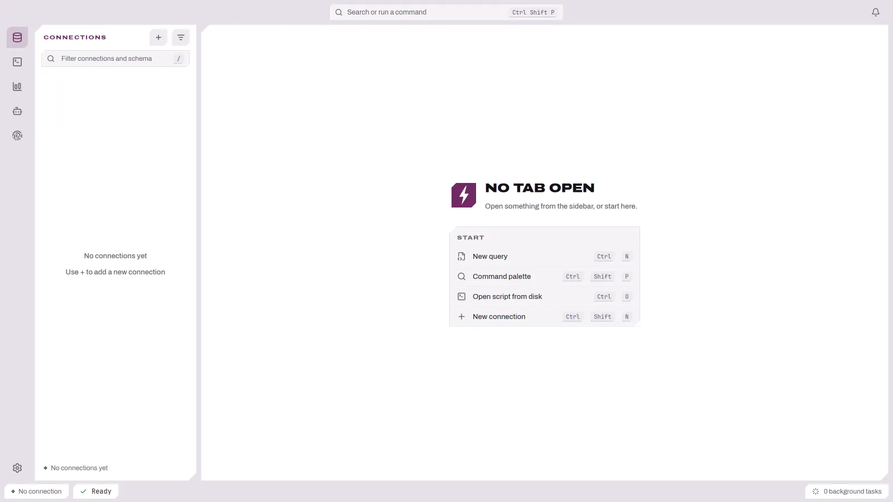
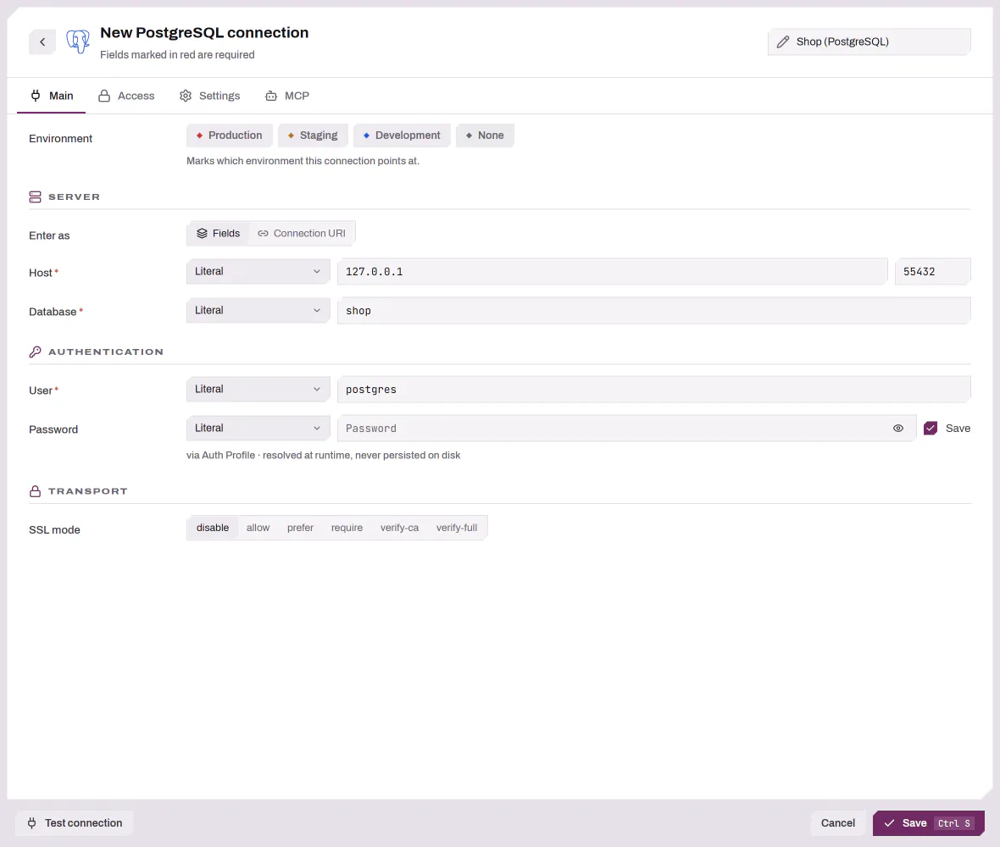
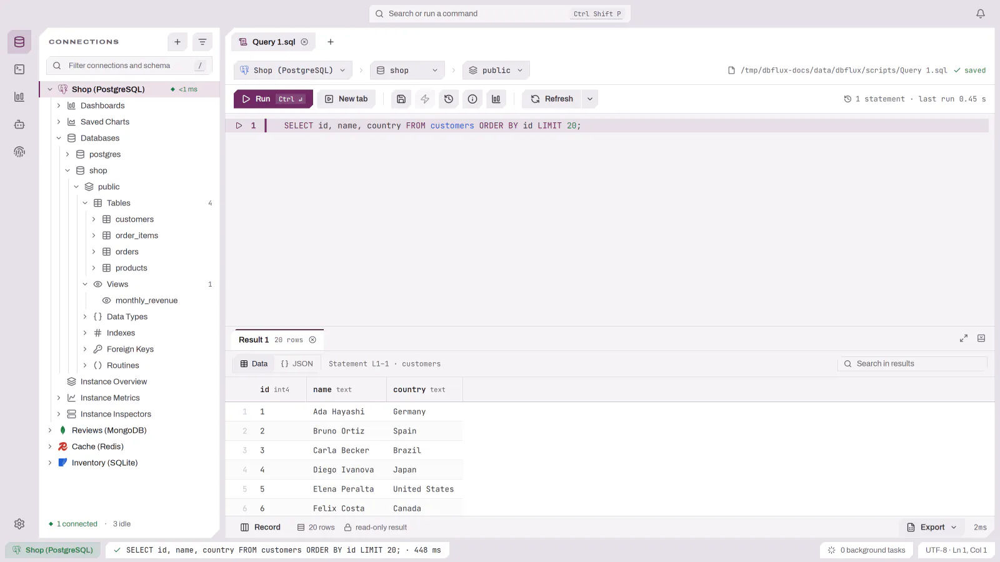

# 시작하기

이 페이지는 새로 설치한 상태에서 첫 쿼리 결과를 얻기까지 안내합니다. 아직
DBFlux를 설치하지 않았다면 [설치](INSTALL.md)부터 시작하세요.

DBFlux는 키보드 우선 설계입니다. 거의 모든 작업에 마우스 조작과 키보드 바인딩이
함께 제공됩니다. 이 페이지들에 나열된 키 바인딩은 애플리케이션 기본값이며, 활성
키맵은 **설정 → 키 바인딩**에서 확인하고 변경할 수 있습니다([설정](SETTINGS.md#키-바인딩)
참조). 모든 기본 키 바인딩은 [키보드 참조](KEYBOARD.md)에 있습니다.

## 첫 실행

DBFlux는 시작할 때 이전 세션(열려 있던 탭)을 복원합니다. 새로 설치한 경우 복원할
것이 없으므로 포커스는 사이드바에 맞춰집니다.

<picture>
  <source media="(prefers-color-scheme: dark)" srcset="../images/getting-started/first-launch-dark.webp">
  
</picture>

## 연결 만들기

`Ctrl+Shift+N`(macOS에서는 `Cmd+Shift+N`)을 눌러 연결 관리자를 열고, 드라이버를
고르고, 폼을 채운 뒤 연결합니다. 그러면 연결의 스키마가 사이드바에 표시됩니다.
[데이터베이스 연결](CONNECTIONS.md)에서 연결 관리자를 여는 다른 방법, 드라이버
선택기, 접근 탭(SSH, 프록시, 관리형 액세스), 연결이 실패했을 때의 동작을
설명합니다.

<picture>
  <source media="(prefers-color-scheme: dark)" srcset="../images/getting-started/connection-manager-dark.webp">
  
</picture>

## 첫 쿼리 실행

`Ctrl+n`(macOS에서는 `Cmd+n`)으로 새 쿼리 탭을 열고, 활성 연결의 쿼리 언어로
쿼리를 입력한 뒤 `Ctrl+Enter`(`Cmd+Enter`)를 눌러 실행합니다. 결과는 문서 안의
결과 탭에 렌더링됩니다.

<picture>
  <source media="(prefers-color-scheme: dark)" srcset="../images/getting-started/first-query-dark.webp">
  
</picture>

## 다음 단계

- [데이터베이스 연결](CONNECTIONS.md) — 연결 관리자, 드라이버, SSH 터널, 프록시,
  AWS SSO, 값 소스.
- [스키마 탐색](SCHEMA_BROWSER.md) — 사이드바, 스키마 트리, 루틴, 스키마
  다이어그램.
- [쿼리 실행](EDITOR.md) — 쿼리 탭, 실행, 스크립트, 위험 쿼리 확인, 쿼리 기록.
- [시각적 쿼리 빌더](QUERY_BUILDER.md) — SQL을 작성하지 않고 SELECT, UPDATE,
  DELETE 만들기.
- [결과 다루기](RESULTS.md) — 데이터 그리드, 레코드 뷰, 필터링, 편집, 내보내기.
- [키-값 브라우저](../KEY_VALUE.md) — 키, 값, 만료, 명령 콘솔.
- [문서 컬렉션](DOCUMENTS.md) — 문서의 테이블, 트리, JSON 뷰.
- [차트](CHARTS.md)와 [대시보드](DASHBOARDS.md) — 결과 차트와 대시보드 만들기.
- [키보드 참조](KEYBOARD.md) — Vim 모드를 포함한 모든 기본 키 바인딩.
- [설정](SETTINGS.md) — 모든 설정 섹션과 연결 훅.
