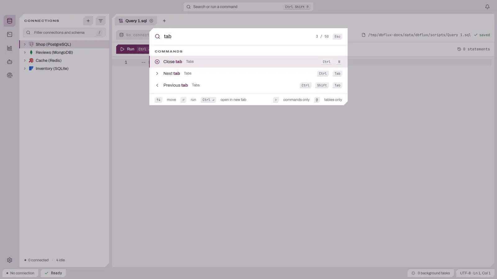

# 키보드 참조

DBFlux는 계층화되고 컨텍스트를 인식하는 키맵을 사용합니다. 활성 레이어는 어느
패널에 포커스가 있는지에 따라 달라집니다. **기본(primary)** 수정자로 표기된 키
바인딩은 macOS에서는 `Cmd`를, 다른 모든 플랫폼에서는 `Ctrl`을 사용하며, 리터럴
`Ctrl`로 표기된 키 바인딩은 모든 플랫폼에서 `Ctrl`로 유지됩니다(macOS 시스템
단축키와의 충돌을 피하기 위해서입니다).

아래의 모든 단축키는 **설정 → 키 바인딩**에서 바꿀 수 있습니다. 키(하나의 조합
또는 `g g` 같은 시퀀스)와 단축키가 적용되는 컨텍스트를 모두 바꿀 수 있습니다.
`y y`처럼 공백으로 구분된 키는 차례로 누릅니다. 첫 키를 누른 뒤 DBFlux는 다음
키를 최대 1초 동안 기다립니다. 대화 상자가 열려 있는 동안에는 뒤에 있는 패널이
키에 반응하지 않습니다.

포커스는 키보드를 사용한 뒤에만 표시됩니다. 키를 누르면 포커스된 컨트롤에 강조색
링이 나타나고, 포인터를 움직여도 유지되며, 다음 클릭에서 사라집니다. 포커스된
버튼, 체크박스, 목록 행은 `Enter`와 `Space`를 직접 처리합니다.

## 전역 (포커스와 무관하게 사용 가능)

| Keys | Action |
|------|--------|
| `Ctrl+Shift+P` / `Cmd+Shift+P` | 명령 팔레트 전환 |
| `Ctrl+Shift+N` / `Cmd+Shift+N` | 연결 관리자 열기 |
| `Ctrl+n` / `Cmd+n` | 새 쿼리 탭 |
| `Ctrl+w` / `Cmd+w` | 현재 탭 닫기 |
| `Ctrl+q` / `Cmd+q` | DBFlux 종료, 실행 중인 쿼리가 있으면 먼저 확인 |
| `Ctrl+Tab` / `Ctrl+Shift+Tab` | 다음 / 이전 탭 |
| `Ctrl+1` .. `Ctrl+9` / `Cmd+1` .. `Cmd+9` | N번째 탭으로 전환 |
| `Ctrl+o` / `Cmd+o` | 스크립트 파일 열기 |
| `Ctrl+Enter` / `Cmd+Enter` | 쿼리 실행 |
| `Ctrl+Shift+Enter` / `Cmd+Shift+Enter` | 새 탭에서 쿼리 실행 |
| `Escape` | 취소 / 모달 닫기 |
| `Tab` / `Shift+Tab` | 포커스 앞으로 / 뒤로 순환 |
| `Ctrl+Shift+1` | 사이드바 포커스 |
| `Ctrl+Shift+2` | 편집기 포커스 |
| `Ctrl+Shift+3` | 결과 포커스 |
| `Ctrl+Shift+4` | 백그라운드 작업 포커스 |
| `Ctrl+Shift+A` / `Cmd+Shift+A` | 감사 뷰어 열기 |
| `Ctrl+b` / `Cmd+b` | 사이드바 전환 |
| `Ctrl+m` | 탭 상황에 맞는 메뉴 열기 |
| `` Ctrl+` `` | 활성 테이블, 컬렉션 또는 키-값 브라우저 아래에 붙은 콘솔 표시 / 숨기기(연결에 콘솔이 있을 때). 콘솔 탭에서는 키보드를 입력창으로 되돌림 |

macOS에서는 정보, 서비스, 가리기, 종료가 응용 프로그램 메뉴에 있으며, 종료는 위의 단축키를 사용합니다.

## 사이드바

| Keys | Action |
|------|--------|
| `q` / `e` | 사이드바 탭 전환 (연결 / 스크립트) |
| `/` | 검색 포커스 |
| `j` / `k` (or `Down` / `Up`) | 다음 / 이전 선택 |
| `h` / `l` | 노드 접기 / 펼치기 |
| `Space` | 펼치기 / 접기 |
| `g` / `Shift+g` (or `Home` / `End`) | 첫 / 마지막 항목 |
| `Ctrl+d` / `Ctrl+u` (or `PageDown` / `PageUp`) | 아래로 / 위로 한 페이지 |
| `Enter` | 항목 열기 / 실행 |
| `r` | 스키마 새로고침 |
| `c` | 연결 관리자 열기 |
| `d` | 연결 끊기 |
| `m` | 항목 메뉴 열기 |
| `Shift+j` / `Shift+k` | 선택 아래로 / 위로 확장 |
| `Space` (with Shift) | 선택 전환 |
| `Ctrl+j` / `Ctrl+k` | 선택한 항목 아래로 / 위로 이동 |
| `Shift+r` | 이름 바꾸기 |
| `x` | 삭제 |
| `Shift+n` | 폴더 만들기 |
| `Ctrl+l` | 오른쪽 패널 포커스 |

## 편집기

| Keys | Action |
|------|--------|
| `Ctrl+h` / `Ctrl+j` / `Ctrl+k` | 왼쪽 / 아래 / 위 패널 포커스 |
| `Alt+h` | 히스토리 드롭다운 전환 |
| `Ctrl+p` / `Cmd+p` | 저장된 쿼리 열기 |
| `Ctrl+s` / `Cmd+s` | 쿼리 저장 |
| `Ctrl+Shift+s` / `Cmd+Shift+s` | 다른 이름으로 파일 저장 |
| `Ctrl+/` / `Cmd+/` | 행 주석 전환 |
| `Enter` | 포커스 / 실행 |

(수정자 없는 문자 키는 입력이 동작하도록 의도적으로 텍스트 입력에 남겨 두었습니다.)

## Vim 모드(선택 사항)

코드 편집기에서 Vim 명령 일부를 사용하는 모드 편집을 쓸 수 있습니다. 기본값은
꺼짐입니다. **설정 → 일반 → 편집기 → 코드 편집기에서 Vim 모드 사용**을
켜고 저장하면 열려 있는 편집기에 바로 적용됩니다. 모든 코드 편집기(SQL 및 기타
쿼리 언어, Lua, Python, Bash)에 적용되며 그 밖의 입력에는 적용되지 않으므로,
검색 상자, 폼, 명령 팔레트에서는 평소처럼 입력됩니다.

편집기는 열릴 때와 Vim 모드를 켤 때 노멀 모드로 시작합니다. 편집기 아래의
표시줄에 현재 모드(`노멀`, `삽입`, `바꾸기`, `비주얼`, `비주얼 줄`, `비주얼 블록`)가 나타납니다. 탭을 전환하거나 포커스를
옮겼다가 돌아와도 각 탭은 자신의 모드를 유지합니다. 표시줄에는 `2`, `2d3`, `4g`처럼
아직 완성되지 않은 키 입력도 표시됩니다. 명령이 완료되거나 중단될 때, 편집기에서
포커스가 벗어날 때, `Escape` 또는 `Tab`을 누를 때 지워집니다. 명령 기록은
표시하지 않으며 작업 공간 상태 표시줄에는 나타나지 않습니다.

| 모드 | 키 | 동작 |
|------|------|--------|
| 노멀 | `h` / `l` | 줄 안에서 한 문자 왼쪽 / 오른쪽으로 이동 |
| 노멀 | `j` / `k` | 한 줄 아래 / 위로 이동하며, 더 짧은 줄을 지나도 열을 유지 |
| 노멀 | `Enter` | 한 줄 아래로 이동 |
| 노멀 | `/` | 네이티브 텍스트 검색 입력창 열기 |
| 노멀 | `n` / `N` | 마지막 검색을 앞으로 / 뒤로 반복(앞에 횟수 지정 가능) |
| 노멀 | `m{a-z}` | 커서 위치에 소문자 로컬 마크를 설정하거나 덮어쓰기 |
| 노멀 | `'{a-z}` / `` `{a-z} `` | 마크가 있는 줄의 첫 비공백 문자 / 표시한 정확한 위치로 이동(노멀 커서 범위로 제한) |
| 노멀 / 비주얼 / 비주얼 줄 / 비주얼 블록 | `gg` / `G` / `Ngg` / `NG` | 첫 번째 / 마지막 / 1부터 세는 N번째 절대 논리적 줄로 이동(범위 밖은 마지막 줄로 제한); 비주얼에서는 선택 확장 |
| 노멀 | `i` | 커서 앞에 입력 시작 |
| 노멀 | `a` / `A` / `I` | 커서 뒤 / 줄 끝 / 줄의 첫 비공백 문자에서 삽입 시작 |
| 노멀 | `e` / `w` / `b` | 단어 끝 / 다음 단어 시작 / 이전 단어 시작으로 이동 |
| 노멀 | `E` / `W` / `B` | 공백으로 구분한 단어를 기준으로 각각 이동 |
| 노멀 | `x` | 커서 아래 문자 삭제 |
| 노멀 | `r{문자}` / `Nr{문자}` | 커서 아래 문자 또는 줄에서 이어지는 N개 문자를 `{문자}`로 바꿈. 커서는 바뀐 첫 문자에 머묾 |
| 노멀 | `R` | 바꾸기 모드로 전환 |
| 노멀 | `dd` / `yy` / `cc` | 논리적 줄 전체 삭제 / 복사 / 변경(`yy`는 시스템 클립보드 사용) |
| 노멀 | `c` + `h` / `l` / `j` / `k`, `w` / `W` / `e` / `E` / `b` / `B`, `gg` / `G` | 가로·단어 이동은 문자 범위, 세로·절대 줄 이동은 논리적 줄 전체 변경 |
| 노멀 | `d` / `y` + `h` / `l` / `j` / `k` | 가로 이동은 문자 단위, 세로 이동은 줄 단위로 삭제 / 복사(`y`는 시스템 클립보드 사용) |
| 노멀 | `d` / `y` + `w` / `W` / `e` / `E` / `b` / `B` | 단어 이동 범위의 문자 삭제 / 복사(`y`는 시스템 클립보드 사용) |
| 노멀 | `d` / `y` + `gg` / `G` | 절대 대상 줄까지 논리적 줄 전체 삭제 / 복사(`y`는 시스템 클립보드 사용) |
| 노멀 | `u` | 실행 취소 |
| 노멀 | `v` / `V` / `Ctrl+v` | 문자 단위 / 줄 단위 / 표시 행의 직사각형 비주얼 선택 시작 |
| 비주얼 / 비주얼 줄 | `h` / `j` / `k` / `l`, `e` / `E` / `w` / `W` / `b` / `B`, `0`, `Enter` | 노멀 모드와 같은 이동 및 횟수로 선택 확장 |
| 비주얼 / 비주얼 줄 | `v` / `V` | 현재 비주얼 모드 종료 / 문자와 줄 선택 전환 |
| 비주얼 / 비주얼 줄 / 비주얼 블록 | `c` | 선택한 문자(끝 문자 포함), 논리적 줄 또는 블록 열을 변경하고 삽입 모드로 전환 |
| 비주얼 / 비주얼 줄 / 비주얼 블록 | `d` / `x` / `y` | 선택 영역 삭제(`d` / `x`) 또는 시스템 클립보드로 복사(`y`) |
| 비주얼 / 비주얼 줄 / 비주얼 블록 | `Escape` | 선택을 지우고 노멀 모드로 돌아감 |
| 삽입 | `Escape` | 열린 자동 완성 메뉴를 닫고, 메뉴가 없으면 노멀 모드로 돌아감 |
| 바꾸기 | 입력한 문자 | 커서 아래 문자를 덮어씀. 줄 끝에서는 뒤에 추가 |
| 바꾸기 | `Backspace` | 이번 바꾸기 세션에서 덮어쓴 문자를 복원하고, 없으면 왼쪽으로 이동 |
| 바꾸기 | `Escape` | 노멀 모드로 돌아감 |

이동 명령, `x` / `u`, `dd` / `yy` 앞에 횟수를 붙일 수 있습니다(예: `3w`,
`2x`, `2u`, `3dd`, `2yy`). 반복하는 두 글자 사이에도 횟수를 넣을 수 있으며
(`d2d`), 앞뒤 횟수는 곱해집니다(`2d3d`는 여섯 줄에 적용).
연산자와 이동의 횟수도 곱해집니다. `2d3w`는 여섯 번의 `w` 이동 범위를,
`2d3j`는 여섯 줄을 삭제합니다. `h` / `l`은 문자 단위, `j` / `k`는
논리적 줄 단위입니다. 횟수를 붙인 `x`는 줄을 합치지 않고 줄 끝까지만
삭제하며, `u`는
지정한 횟수만큼 실행 취소합니다. 횟수 없이 `0`을 누르면 줄의 시작으로
이동합니다. 0이 아닌 숫자 뒤의 `0`은 횟수의 일부입니다(예: `20w`).
중단된 횟수 입력은 다음 명령에 적용되지 않습니다. 비주얼 모드에서 횟수를
붙인 이동은 편집기의 선택 영역을 확장합니다. `gg`와 `G`는 대상 논리적 줄의
첫 비공백 문자로 이동하며, `G`는 대문자 한 키입니다. 대기 중인 `g`는
입력이 중단되거나 편집기 포커스를 잃으면 취소됩니다. 노멀 모드에서 `d` / `y` / `c`와 `gg` / `G`는 현재 줄부터 대상 줄까지 줄 단위로 적용되며, 대상은 버퍼 범위로 제한됩니다. 횟수 없는 `gg`는 첫 줄, `G`는 마지막 줄을 가리킵니다. 연산자 앞이나 이동 앞의 횟수는 1부터 세는 절대 줄 번호이며, 둘 다 있으면 곱합니다(`2d3G`는 6번째 줄). 따라서 `1dG`는 `dG`와 달리 첫 줄을 가리킵니다. 삭제는 한 번의 실행 취소로 되돌릴 수 있으며, 읽기 전용 편집기에서 삭제는 아무 동작도 하지 않지만 복사는 시스템 클립보드에 기록합니다.

`Ctrl+Enter`는 선택한 텍스트의 양끝 공백을 제거한 결과가 비어 있지 않을
때만 이를 사용합니다. 그렇지 않으면 편집기 전체 내용을 사용합니다. 비주얼
블록에서는 마우스로 Alt를 누른 채 드래그할 때처럼 비어 있지 않은 행 조각을
순서대로 줄바꿈으로 연결합니다. 공백만 선택했다면 편집기 전체 내용을
사용합니다. 블록의 열은 화면 셀이 아닌 유니코드 스칼라 단위입니다.
따라서 탭, 넓은 문자, 결합 문자 시퀀스는 화면 열과 맞지 않을 수 있습니다.

노멀 모드에서 `/`를 누르면 편집기 아래에 검색 막대가 열립니다. 강조색 `/` 옆에
검색 입력창이 있습니다. 대소문자를
구분하는 리터럴 문자열을 입력하고 `Enter`를 누르면 커서 위치에서 앞으로 검색하며,
끝에 도달하면 처음으로 돌아갑니다. `Escape`는 커서와 마지막 검색어를 바꾸지 않고
취소합니다. `n`은 앞으로, `N`은 뒤로 마지막 검색을 반복하며 앞에 횟수를
지정할 수 있습니다. 읽기 전용 편집기에서도 작동하며 탭마다 마지막 검색어를
따로 유지합니다. 입력창이 열려 있을 때 `Tab` / `Shift+Tab`은 아무 동작도
하지 않고 포커스를 입력창에 유지합니다. 정규식 검색이나 Vim 방식의 검색 결과
강조 표시는 지원하지 않습니다. 데스크톱 IME 동작과 렌더링된 UI는 검증하지
않았습니다.

**로컬 마크.** 마크는 현재 코드 문서에만 속하며 다른 탭이나 세션과
공유되지 않습니다. 읽기 전용 편집기에서도 설정할 수 있습니다. 삽입 모드 입력과
IME 확정을 포함한 네이티브 텍스트 편집 시 마크는 텍스트를 따라 이동하며,
실행 취소와 다시 실행에도 적용됩니다. 마크 위치에 삽입하면 삽입된 텍스트 뒤로
이동합니다. 마크가 있는 텍스트를 삭제하거나 교체하면 변경 범위의 시작으로
이동하므로 실행 취소가 삭제된 텍스트 내부의 정확한 위치를 복원할 필요는
없습니다. 편집기 전체 내용을 교체하거나 Vim 모드를 끄거나 문서를 닫으면
마크가 지워집니다. 데스크톱 IME 동작과 렌더링된 UI는 검증하지 않았습니다.

노멀 모드에서 그 밖의 입력:

| 입력 | 노멀 모드에서의 동작 |
|-------|-------------------------|
| 지원하지 않는 문자, 구두점, `Space` | 아무 동작 없음 |
| `Tab` / `Shift+Tab` | 아무 동작 없음: 들여쓰지 않으며 포커스는 편집기에 머무름 |
| `Ctrl+v` | 비주얼 블록 시작(붙여넣기 아님) |
| 붙여넣기(`Cmd+v` 또는 컨텍스트 메뉴) | 아무 동작 없음 |
| 입력기(IME) 조합 및 확정 | 버려짐 |
| `Backspace` / `Delete` | 아무 동작 없음 |
| `Escape` | 평소 의미: 실행 중인 쿼리를 취소하거나 편집기를 벗어남 |
| `Ctrl`, `Alt`, `Cmd` 단축키, 화살표 키, 마우스 | 실행 취소와 다시 실행을 포함해 평소처럼 동작 |

노멀 모드에서 커서는 항상 문자 위에 있으며 줄 끝을 넘어가지 않습니다. 삽입
모드를 벗어나면 Vim처럼 커서가 한 문자 뒤로 이동합니다. 빈 줄에서 `x`는 아무
동작도 하지 않으므로 줄을 합치지 않습니다.

삽입 모드에서는 `Ctrl+v` 붙여넣기를 포함하여 `Escape`를 제외하면 Vim 모드가 꺼져 있을 때와 똑같이 동작합니다.
자동 완성 메뉴나 코드 작업 메뉴가 열려 있으면 `Escape`는 메뉴를 닫고 삽입 모드에
머무르며, 그렇지 않으면 노멀 모드로 돌아갑니다. 어느 경우에도 포커스는 편집기에
남습니다. 커서가 여러 개이거나 인라인 제안이 표시 중이면 첫 번째 `Escape`가 이를
지우고 다음 `Escape`가 노멀 모드로 돌아갑니다.

비주얼 모드의 `d` / `x`는 문자, 줄, 블록 선택을 삭제합니다. 블록은 각 행의 분리된 범위를 한 번의 실행 취소 단계로 삭제합니다. `y`는 선택한 텍스트를 시스템 클립보드에 복사합니다. 선택 영역이 비어 있으면 이 명령들은 편집이나 클립보드 변경 없이 노멀 모드로 돌아갑니다. 읽기 전용 편집기에서는 `d` / `x`가 선택 영역을 유지하며 편집이나 클립보드 변경을 하지 않고, `y`는 사용할 수 있습니다. `dd`와 `cc`는 노멀 모드 전용입니다. 비주얼 블록 `c`는 블록의 왼쪽 열에 닿는 모든 행에서 블록 열을 삭제하고, 더 짧은 행은 건너뛰며, 그중 첫 행에서 삽입 모드로 전환합니다. `Escape`로 삽입을 끝내면 그 행에 입력한 텍스트가 다른 행의 같은 열에 삽입됩니다. 입력한 텍스트에 줄바꿈이 있거나, 아무것도 입력하지 않았거나, 먼저 포커스가 편집기를 벗어나면 복사하지 않습니다. 블록 열은 블록 선택과 마찬가지로 유니코드 스칼라 단위로 셉니다. 삭제, 입력한 텍스트, 복사본은 한 번의 실행 취소 단계입니다.

**변경 및 실행 취소.** 노멀 모드의 `c`는 문자 단위 `h` / `l`, 줄 단위 `j` / `k`, 단어 이동 `w` / `W` / `e` / `E` / `b` / `B`, 줄 단위 `gg` / `G`와 `cc`를 지원합니다. `cw`는 다음 `w` 경계까지 변경합니다. 연산자와 이동 횟수는 곱해집니다(`2c3w`는 여섯 번의 `w` 이동). 절대 줄 대상은 1부터 세며 버퍼 범위로 제한됩니다(`2c3G`는 6번째 줄); 횟수 없는 `cG`는 마지막 줄을 가리킵니다. 줄 단위 변경은 다음 행 앞의 구분자를 보존하며, 횟수를 지정한 `cc`는 대상 줄의 기존 LF 또는 CRLF 줄바꿈도 포함합니다. 변경은 네이티브 편집으로 대상을 삭제한 뒤 삽입 모드로 전환합니다. 일반적인 세션에서는 삭제와 대체 입력이 한 번의 실행 취소 단계로 묶이고 첫 번째 커서가 복원됩니다. 읽기 전용 편집기에서는 텍스트를 바꾸거나 삽입 모드로 전환하지 않습니다.

문자 또는 줄 비주얼 `c`는 끝을 포함한 선택 영역을 네이티브 편집으로 변경한 뒤 대체 텍스트 입력을 위해 삽입 모드로 전환합니다. 일반적인 세션에서 실행 취소 한 번으로 원래 텍스트와 접힌 앵커가 복원됩니다. 선택한 쿼리의 바이트는 변경되지 않습니다. 읽기 전용 편집기에서는 선택을 유지하고 삽입 모드로 전환하지 않습니다. 빈 문자 또는 줄 선택에서 `c`는 텍스트를 삭제하지 않고 삽입 모드로 전환합니다. 줄 단위 변경은 LF 또는 CRLF 뒤의 마지막 빈 논리적 줄도 처리합니다.

**바꾸기.** `r{문자}`는 커서 아래 문자를 바꾸고 커서를 그 문자 위에 둡니다. 횟수를 붙이면 `3rx`는 줄에서 이어지는 세 문자를 `x`로 바꾸며, 줄 끝까지 남은 문자가 더 적으면 아무것도 바꾸지 않습니다. 줄바꿈은 바꾸지 않으며 빈 줄에서는 아무 동작도 하지 않습니다. `r` 다음에 `Enter`를 누르면 해당 문자들을 줄의 들여쓰기를 유지하는 줄바꿈 하나로 바꾸고, `r` 다음에 `Tab`을 누르면 탭 문자를 씁니다. `Escape`, `Backspace`, `Delete`, 화살표 키를 누르거나 편집기를 벗어나면 편집 없이 `r`이 취소되며, `Ctrl`, `Alt`, `Cmd` 단축키는 `r`을 취소한 뒤 평소처럼 실행됩니다. `r`은 입력기(IME)로 조합한 문자도 받습니다. 바꾸기는 한 번의 실행 취소 단계입니다.

`R`은 바꾸기 모드로 전환합니다. 입력한 각 문자는 커서 아래 문자를 덮어쓰며, 줄 끝에서는 줄바꿈을 바꾸지 않고 뒤에 추가됩니다. `Backspace`는 이번 바꾸기 세션에서 덮어쓴 문자를 역순으로 복원하고, 복원할 문자가 없으면 왼쪽으로만 이동합니다. `Enter`는 줄바꿈을 삽입하고 `Tab`은 삽입 모드처럼 들여씁니다. `Escape`는 노멀 모드로 돌아가며 커서를 한 문자 뒤로 옮깁니다. 바꾸기 세션 전체가 한 번의 실행 취소 단계입니다. `R` 앞의 횟수는 무시됩니다.

`x`, `dd` 또는 이동을 결합한 `d` 명령 한 번이 실행 취소 한 단계이며, 횟수를 붙여도 마찬가지입니다. 일반적인 삽입 모드 세션에서 입력한 내용이 한 단계이고 새 세션마다 새 단계가 시작됩니다. 실행 취소 그룹은 최대 1000개 변경으로 제한되므로 긴 세션은 여러 번 실행 취소해야 할 수 있습니다. `u`는 `Ctrl+z` / `Cmd+z`와 같은 단계를 실행 취소합니다.

**IME 제한.** 이전 조합의 늦은 마크 해제 신호가 다음 조합이 시작된 뒤 도착하면 현재 네이티브 조합이 조기에 확정되고 Vim 실행 취소 그룹이 나뉠 수 있습니다. 읽기 전용 또는 노멀 모드로 전환하면 표시 중인 미확정 조합 텍스트가 그대로 확정되며 이후 후보는 수락하지 않습니다. 바꾸기 모드에서 키 입력 없이 도착한 텍스트(예: IME 확정)는 덮어쓰지 않고 삽입되며, `Backspace`는 그 주변 문자를 복원하지 않습니다. IME의 완전한 안전성이나 실제 UI 검증을 주장하지 않습니다.

**읽기 전용 편집기**(루틴 정의)에서는 이동 명령, `yy`, 이동을 결합한
`y`가 동작하지만 `x`, `r`, `R`, `dd`, `cc`, 이동을 결합한 `c` / `d`, 비주얼 `c`, `u`는 아무 동작도 하지
않습니다. 삭제 명령은 클립보드도 바꾸지 않습니다.

**제한 사항.**

- 첫 번째 표의 명령만 있습니다. `dd`와 `yy`는 줄바꿈이 있으면 이를 포함해
  논리적 줄 전체에 적용됩니다. 파일 끝에서는 마지막 줄까지만 적용되며, 마지막
  줄 삭제 시 앞의 구분자도 제거합니다. 복사할 때 없는 줄바꿈을 추가하지는
  않습니다. LF 또는 CRLF로 생긴 파일 끝의 빈 줄에서 줄 단위 `y`는 기존
  구분자를 복사합니다. 빈 파일에는 복사할 구분자가 없습니다. 단어 이동을 결합한 `d` / `y`는 `w` / `W` / `e` / `E` /
  `b` / `B`를 지원합니다. `w` / `W`와 `b` / `B`는 도착 문자를 제외하고
  `e` / `E`는 포함합니다. 연산자와 결합한 `h` / `l`은 문자 단위,
  `j` / `k`는 줄 단위입니다. 그 외 마크, 텍스트 객체,
  레지스터, 매크로, `.` 반복, `:` 명령, 다시 실행 키는 지원하지 않습니다.
  Vim 전체 기능을 지원하는 것은 아닙니다.
- 이동은 화살표 키처럼 유니코드 코드 포인트 단위로 이루어지므로, 별도의 결합
  악센트로 쓴 문자는 두 번 눌러야 지나갑니다.
- 노멀 모드는 사용자의 입력과 붙여넣기만 막습니다. 파일이나 히스토리의 쿼리를
  불러오는 것처럼 DBFlux가 직접 하는 편집은 그대로 적용됩니다.

## 결과

| Keys | Action |
|------|--------|
| `Ctrl+h` / `Ctrl+k` / `Ctrl+l` | 왼쪽 / 위 / 오른쪽 패널 포커스 |
| `Ctrl+j` | 도구 모음 포커스 |
| `j` / `k` (or `Down` / `Up`) | 다음 / 이전 행 |
| `h` / `l` (or `Left` / `Right`) | 왼쪽 / 오른쪽 열 |
| `g` / `Shift+g` (or `Home` / `End`) | 첫 / 마지막 행 |
| `Ctrl+d` / `Ctrl+u` (or `PageDown` / `PageUp`) | 아래로 / 위로 한 페이지 |
| `]` / `[` | 다음 / 이전 결과 페이지 |
| `F5` | 포커스된 문서 새로고침 (테이블 행, 버킷 목록, 객체 목록, 키) |
| `Ctrl+e` / `Cmd+e` | 결과 내보내기 |
| `f` | 도구 모음 포커스 |
| `/` | 검색/필터 포커스 |
| `x` | 행 삭제 |
| `r` | 이름 바꾸기 / 편집 |
| `o` | 행 추가 |
| `y` | 행 복사 |
| `i` | 레코드 뷰 전환 (한 행을 필드당 한 줄로 표시) |
| `v` | 선택한 셀의 값 패널 전환 |
| `Ctrl+c` / `Cmd+c` | 셀 복사 |
| `z` | 패널 접기 전환 |
| `m` (or `Shift+F10`) | 상황에 맞는 메뉴 열기 |

## 스키마 다이어그램

| Keys | Action |
|------|--------|
| `+` (or `=`) / `-` | 확대 / 축소 |
| `h` / `j` / `k` / `l` (or 화살표 키) | 뷰 이동 |
| `Shift` + `h` / `j` / `k` / `l` (or 화살표 키) | 그 방향의 다음 테이블을 선택하고 가운데에 표시 |
| `Alt` + `h` / `j` / `k` / `l` (or 화살표 키) | 선택한 테이블 이동 |
| `r` / `s` / `c` | 왼쪽-오른쪽 / 스노우플레이크 / 컴팩트 레이아웃 |
| `m` | 상황에 맞는 메뉴 열기 |
| `Escape` | 선택 해제 |

## 백그라운드 작업

| Keys | Action |
|------|--------|
| `Ctrl+h` / `Ctrl+j` / `Ctrl+k` | 왼쪽 / 아래 / 위 패널 포커스 |
| `j` / `k` (or `Down` / `Up`) | 다음 / 이전 선택 |
| `g` / `Shift+g` (or `Home` / `End`) | 첫 / 마지막 항목 |
| `Ctrl+d` / `Ctrl+u` (or `PageDown` / `PageUp`) | 아래로 / 위로 한 페이지 |
| `z` | 패널 접기 전환 |

## 알림 센터

제목 표시줄 오른쪽 끝의 종 아이콘은 워크스페이스 위에 떠 있는 팝오버인 알림 센터를 엽니다. 결정을 기다리는 MCP 승인, 실행한 작업에서 보고된 오류, 사용 가능한 DBFlux 업데이트, 완료된 내보내기·가져오기·마이그레이션·덤프 분석 작업이 표시됩니다. 종의 배지는 읽지 않은 항목 수를 세며, 가장 긴급한 항목의 색을 따릅니다. 오류는 빨간색, 승인은 강조색, 업데이트와 완료된 작업은 중립색입니다. 읽지 않은 항목이 없으면 배지가 없습니다.

팝오버를 열어도 읽음으로 표시되는 항목은 없습니다. 행을 클릭하면 대상이 열리고 읽음으로 표시됩니다. 승인은 해당 요청으로 MCP 승인 탭을 열고, 오류는 상관 관계 ID로 필터링된 감사를 열고, 업데이트는 릴리스 노트를 열고, 완료된 작업은 백그라운드 작업 패널을 엽니다. **모두 읽음으로 표시**는 모든 항목을 읽음으로 표시하고, **읽은 항목 지우기**는 읽은 항목을 제거합니다. 목록은 세션 동안만 유지됩니다. 업데이트는 상태 표시줄 대신 여기에 표시됩니다.

| Keys | Action |
|------|--------|
| `Escape` | 팝오버 닫기 (바깥을 클릭해도 같음) |

## 명령 팔레트

| Keys | Action |
|------|--------|
| `Down` / `Up` (or `Ctrl+j` / `Ctrl+k`) | 다음 / 이전 선택 |
| `Enter` | 실행 |
| `Escape` | 취소 |

문자 키는 검색 입력창에 입력되므로, 입력하면 목록이 필터링됩니다.

<picture>
  <source media="(prefers-color-scheme: dark)" srcset="../images/keyboard/command-palette-dark.webp">
  
</picture>

## 데이터 테이블

결과 그리드나 테이블에 포커스가 있고 편집 중인 셀이 없을 때 적용됩니다.

| Keys | Action |
|------|--------|
| `j` / `k` / `h` / `l` (or 방향 키) | 커서 이동 |
| `Shift` + 방향 키 | 선택 확장 |
| `Home` / `End` | 행의 첫 / 마지막 셀 |
| `Ctrl+Home` / `Ctrl+End` | 첫 / 마지막 행 |
| `Shift+Home` / `Shift+End`, `Ctrl+Shift+Home` / `Ctrl+Shift+End` | 행 또는 테이블의 끝까지 선택 확장 |
| `Ctrl+a` / `Cmd+a` | 모두 선택 |
| `Escape` | 선택 해제 |
| `Ctrl+c` / `Cmd+c`, `y y` | 선택 영역 복사 |
| `Shift+y Shift+y` | 행 복사 |
| `Enter` / `F2` | 셀 편집 |
| `Ctrl+Enter` / `Cmd+Enter`, `Ctrl+s` / `Cmd+s` | 대기 중인 변경 저장 |
| `d d` / `Delete` | 행 삭제 |
| `a a` / `Shift+a Shift+a` | 행 추가 / 복제 |
| `Ctrl+n` | 셀을 NULL로 설정 |
| `u` / `Ctrl+z` / `Cmd+z` | 실행 취소 |
| `Ctrl+r` / `Ctrl+Shift+z` / `Cmd+Shift+z` | 다시 실행 |
| `e` | 중첩 열 펼치기 / 접기(문서 그리드) |
| `Backspace` | 중첩 값에서 나가기(문서 그리드) |

## 문서 트리

| Keys | Action |
|------|--------|
| `j` / `k` (or `Down` / `Up`) | 다음 / 이전 노드 |
| `h` / `l` (or `Left` / `Right`) | 접기 / 펼치기, 또는 부모 / 첫 자식으로 이동 |
| `g` / `Shift+g` (or `Home` / `End`) | 첫 / 마지막 노드 |
| `Ctrl+u` / `Ctrl+d` (or `PageUp` / `PageDown`) | 위로 / 아래로 한 페이지 |
| `Space` | 펼치기 / 접기 |
| `Enter` / `F2` | 값 편집 |
| `e` | 문서 미리보기 |
| `d d` / `Delete` | 문서 삭제 |
| `t` | 데이터 보기 전환 |
| `r` | 원본 JSON 보기 전환 |
| `/` / `Ctrl+f` | 검색. `n` / `Shift+n`은 다음 / 이전 일치 항목, `Escape`는 닫기 |

## 키-값 브라우저

| Keys | Action |
|------|--------|
| `` Ctrl+` `` | 명령 콘솔 표시 / 숨기기(콘솔 입력창 안에서도 동작) |
| `Ctrl+j` | 키 더 불러오기 |
| `t` | 선택한 키의 만료 시간 편집 |

`Ctrl+j`와 `t`는 텍스트 입력창이 아니라 키 목록에 포커스가 있을 때 적용됩니다. 문서 컬렉션의 콘솔도 같은 키에 반응합니다.

## CSV 및 TSV 파일

CSV 또는 TSV 탭의 테이블은 [데이터 테이블](#데이터-테이블) 키와 다음 키를 받습니다. [CSV 및 TSV 파일](CSV_FILES.md)을 참고하세요.

| 키 | 동작 |
|------|--------|
| `t` | 표와 텍스트 사이 전환 |
| `Shift+t` | 텍스트를 원본과 정렬 사이에서 전환 |
| `Escape` / `Enter` | 텍스트에서 키보드를 빼기 / 다시 넣기 |
| `]` | 다음 500개 레코드 불러오기 |
| `F5` | 원본에서 파일을 다시 읽기 |
| `Ctrl+s` / `Cmd+s` | 테이블이나 텍스트에서 저장 |
| `m` (또는 `Shift+F10`) | 창 작업: 방언 컨트롤, 위에 행 삽입, 열 추가, 열 이름 바꾸기, 변경 사항 취소, 파일에서 다시 불러오기, 그리고 파일의 나머지를 불러오는 동안 불러오기 취소 |

## 텍스트 입력창

| Keys | Action |
|------|--------|
| `Ctrl+j` / `Ctrl+k` | 다음 / 이전 줄 또는 다음 / 이전 제안 |
| `Ctrl+Space` | 제안 표시 |
| `Ctrl+Enter` / `Cmd+Enter` | 쿼리 실행 |
| `Ctrl+Shift+Enter` / `Cmd+Shift+Enter` | 새 탭에서 쿼리 실행 |
| `Ctrl+Shift+z` | 다시 실행(Linux와 Windows, macOS는 `Cmd+Shift+z`) |

## 대화 상자

| Keys | Action |
|------|--------|
| `Escape` | 닫기. 폼 대화 상자에서는 먼저 편집 중인 필드에서 나감 |
| `Enter` | 주 버튼이 활성화되어 있으면 확인 |
| `Up` / `Down`, `PageUp` / `PageDown`, `Home` / `End` | 긴 대화 상자 내용 스크롤 |
| `Escape` / `Ctrl+s` / `Cmd+s` | 셀 편집기와 문서 미리보기 닫기 / 저장 |

## 폼과 설정 창

대화 상자의 폼과 설정 창에서 텍스트 필드를 편집하고 있지 않을 때 적용됩니다.

| Keys | Action |
|------|--------|
| `j` / `k` (or `Down` / `Up`) | 다음 / 이전 필드 |
| `Left` / `Right` | 행 안에서 이동, 세그먼트 필드의 옵션 변경 |
| `h` / `l` | 목록으로 돌아가기 / 폼으로 들어가기 |
| `g` / `Shift+g` | 첫 / 마지막 필드 |
| `Tab` / `Shift+Tab` | 다음 / 이전 필드 |
| `Space` | 전환 |
| `Enter` | 필드 활성화 또는 편집 |
| `Escape` | 필드 또는 폼에서 나가기 |
| `/` | 검색으로 포커스 이동 |
| `Ctrl+w` / `Ctrl+q` | 설정 창 닫기 |
| `Ctrl+s` | 섹션 저장 |
| `Ctrl+h` / `Ctrl+l` | 탐색 영역과 섹션 사이 이동 |

연결 관리자에서는 `Ctrl+s` / `Cmd+s`가 폼 어디에서나 연결을 저장하고,
`Left` / `Right`로 **입력 방식**과 SSH 인증 방식의 옵션을 바꿉니다. 감사
뷰어에서는 시간 프리셋 위에서 `Left` / `Right`로 프리셋을 바꿉니다.

## 상황에 맞는 메뉴

| Keys | Action |
|------|--------|
| `j` / `k` (or `Down` / `Up`) | 아래로 / 위로 이동 |
| `Enter` / `l` (or `Right`) | 선택 / 하위 메뉴 진입 |
| `Escape` / `h` (or `Left`) | 뒤로 / 닫기 |

## 히스토리 모달

| Keys | Action |
|------|--------|
| `Ctrl+j` / `Ctrl+k` (or `Down` / `Up`) | 다음 / 이전 선택 |
| `Enter` | 항목 열기 |
| `Ctrl+f` | 즐겨찾기 전환 |
| `Ctrl+r` | 이름 바꾸기 |
| `Ctrl+d` | 삭제 |
| `/` | 검색 포커스 |
| `Ctrl+s` / `Cmd+s` | 쿼리 저장 |
