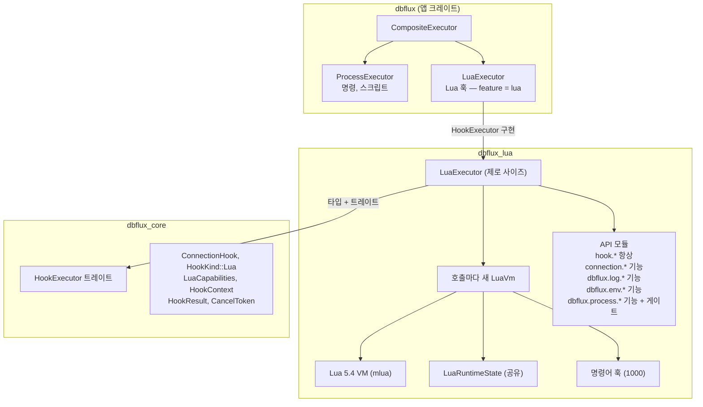

# 내장 Lua 런타임

`dbflux_lua` 크레이트는 DBFlux의 연결 훅을 위한 샌드박스 처리된 Lua 5.4 런타임입니다. 이 문서는 크레이트의 아키텍처, 훅 스크립트에 노출되는 Lua API, 샌드박스 및 시간 초과 모델, 그리고 런타임이 애플리케이션에 연결되는 방식을 설명합니다.

---

## 이 크레이트의 역할

`dbflux_lua`는 연결 수명 주기 이벤트(사전 연결, 사후 연결, 연결 끊기 전, 연결 끊기 후) 중에 실행되는 Lua 스크립트를 사용자가 작성할 수 있게 합니다. 훅은 범용입니다: SSO 로그인 흐름, 환경 설정, 감사 로깅을 수행하거나, 연결이 열리기 전/후에 외부 도구를 트리거할 수 있습니다.

이 크레이트는 정확히 하나의 공개 타입만 노출합니다: `LuaExecutor`. 그 외의 모든 것 — VM 팩토리, API 모듈, 공유 상태 — 은 크레이트 내부에 있습니다. 외부에서는 `executor.execute_hook(hook, context, cancel_token, parent_cancel_token, output, detached)`를 호출하고 `HookResult`를 돌려받습니다. 마지막 `detached: Option<&DetachedProcessSender>` 인수는 실행기가 장시간 실행되는 분리(detached) 프로세스를 호출자에게 넘길 수 있게 합니다.

---

## 아키텍처 개요



핵심 설계 원칙: **훅을 실행할 때마다 새 Lua VM을 만듭니다**. VM 풀링도 없고, 실행 간에 상태가 누출되지도 않습니다. 덕분에 샌드박스는 자명하게 안전합니다 — 스크립트가 어떻게든 VM 상태를 망쳐도 실행 후 버려집니다.

---

## 종속성

| 종속성        | 버전      | 용도                                                                                                    |
| ------------- | --------- | ------------------------------------------------------------------------------------------------------ |
| `mlua`        | 0.10      | Lua 5.4 바인딩. 기능: `lua54`, `send` (`Lua`를 `Send`로 만듦), `vendored` (Lua를 소스에서 컴파일) |
| `dbflux_core` | workspace | 트레이트 (`HookExecutor`), 타입 (`ConnectionHook`, `HookContext` 등)                                 |
| `log`         | 0.4       | Lua 콜백에서 Rust 쪽 로깅                                                                               |

`vendored` 기능이 중요합니다 — 시스템 Lua 설치가 필요 없다는 뜻입니다. Lua 5.4 인터프리터는 C 소스에서 컴파일되어 정적 링크됩니다. 배포 종속성이 사라지지만 바이너리가 약 200KB 커집니다.

---

## 샌드박스

### 로드되는 항목

네 가지 Lua 표준 라이브러리만 로드합니다:

```rust
let stdlib = StdLib::TABLE | StdLib::STRING | StdLib::MATH | StdLib::UTF8;
let lua = Lua::new_with(stdlib, LuaOptions::default())?;
```

스크립트는 다음에 접근할 수 있습니다:

- **table**: `table.insert`, `table.remove`, `table.sort`, `table.concat`, `table.pack`, `table.unpack`
- **string**: `string.format`, `string.find`, `string.gsub`, `string.sub`, `string.len`, `string.match`, `string.rep`, 패턴 매칭
- **math**: `math.floor`, `math.ceil`, `math.random`, `math.sqrt`, `math.abs`, `math.max`, `math.min`, `math.pi`
- **utf8**: `utf8.char`, `utf8.codepoint`, `utf8.len`

그리고 라이브러리 로딩이 필요 없는 Lua 내장 함수도 있습니다: `type()`, `tostring()`, `tonumber()`, `pairs()`, `ipairs()`, `next()`, `select()`, `pcall()`, `xpcall()`, `error()`, `setmetatable()`, `getmetatable()`, `rawget()`, `rawset()`, `rawequal()`, `rawlen()`. 클로저, 지역 변수, 메타테이블, 모든 제어 흐름 — Lua를 _Lua_답게 만드는 모든 것이 정상 동작합니다.

### 차단되는 항목

| 라이브러리  | 차단 이유                                                                                                                                                    |
| ----------- | ------------------------------------------------------------------------------------------------------------------------------------------------------------ |
| `io`        | 파일 읽기/쓰기. 훅이 임의의 파일을 읽거나 디스크에 쓰게 할 수 없습니다.                                                                                      |
| `os`        | 시스템 호출: `os.execute()`는 완전한 셸 탈출이 되고, `os.remove()`는 파일을 삭제할 수 있습니다. `os.getenv()`조차 게이트가 있는 `dbflux.env.get()`으로 대체됩니다. |
| `debug`     | `debug.sethook()`은 명령어 수 카운트 인터럽트를 방해할 수 있습니다. `debug.getlocal()`과 `debug.getinfo()`는 내부 상태를 들여다볼 수 있습니다.               |
| `package`   | `require()`, `dofile()`, `loadfile()`은 디스크에서 임의의 코드를 로드할 수 있게 합니다.                                                                          |
| `coroutine` | 그 자체로 위험하지는 않지만 시간 초과/취소 모델에 복잡성을 더합니다 (코루틴이 명령어 훅을 넘어 yield할 수 있습니다).                                |

샌드박스는 "차단 목록이 아니라 허용 목록" 방식입니다. 명시적으로 로드한 네 가지 라이브러리와 등록된 API 함수만 존재합니다. 위 목록에 없는 것은 Lua VM에 존재하지 않습니다.

### 메모리 제한

각 VM은 16 MiB의 강제 메모리 상한(`engine.rs`의 `lua.set_memory_limit(16 * 1024 * 1024)`)과 함께 만들어집니다. 이 한도를 넘어 할당하는 스크립트는 호스트의 메모리를 소진하는 대신 메모리 오류로 실패합니다.

---

## Lua API

### `hook.*` — 항상 사용 가능

이것이 핵심 제어 흐름 API입니다. 모든 Lua 훅 스크립트는 이 함수들로 결과를 전달합니다.

```lua
-- 현재 단계 읽기
local phase = hook.phase  -- "pre_connect", "post_connect", ...

-- 결과 알리기
hook.ok()           -- 성공 (아무것도 호출하지 않으면 이것이 기본값)
hook.warn("msg")    -- 성공이지만 사용자에게 경고를 표시
hook.fail("msg")    -- 실패, 연결 흐름 중단
```

결과는 세 상태를 가진 단순한 상태 머신입니다: `Ok`, `Warn(msg)`, `Fail(msg)`. **여러 번 호출하면 덮어씁니다** — 스크립트가 끝나기 전 마지막 호출만 유효합니다. 스크립트가 아무것도 호출하지 않고 끝나면 결과는 기본값 `Ok`가 됩니다.

결과는 다음처럼 `HookResult`에 매핑됩니다:

| 결과        | `exit_code` | `stderr` | `warnings` |
| ----------- | ----------- | -------- | ---------- |
| `Ok`        | `0`         | 비어 있음 | `[]`       |
| `Warn(msg)` | `0`         | 비어 있음 | `[msg]`    |
| `Fail(msg)` | `1`         | `msg`    | `[]`       |

### `connection.*` — 연결 메타데이터

`capabilities.connection_metadata`로 게이트됩니다 (기본값: **true**).

```lua
connection.profile_id     -- "550e8400-e29b-41d4-a716-446655440000"
connection.profile_name   -- "Production DB"
connection.db_kind        -- "Postgres", "SQLite", "MongoDB", "Redis", "MySQL"
connection.host           -- "db.example.com" 또는 nil (SQLite에는 호스트가 없음)
connection.port           -- 5432 또는 nil
connection.database       -- "myapp" 또는 nil
```

모든 값은 VM 생성 시점에 찍힌 **정적 스냅샷**입니다. 스크립트가 바꿀 수 없습니다. 의도된 설계입니다 — 훅은 연결을 관찰할 뿐 설정하지 않습니다.

### `dbflux.log.*` — 로깅

`capabilities.logging`으로 게이트됩니다 (기본값: **true**).

```lua
dbflux.log.info("Starting SSO flow")
dbflux.log.warn("Token expires in 5 minutes")
dbflux.log.error("AWS CLI not found")
```

각 호출은 두 가지 일을 합니다:

1. 내부 로그 버퍼에 `[LEVEL] message`를 추가합니다 (이 버퍼가 `HookResult`의 `stdout`이 됩니다)
2. 해당 수준으로 `[lua]` 접두사를 붙여 Rust의 `log` 크레이트에 전달합니다

호출자가 출력 채널을 제공하면 같은 로그 줄이 UI로도 즉시 스트리밍됩니다. 로그 버퍼는 최종 `HookResult`의 주된 영속 출력으로 남습니다.

### `dbflux.env.*` — 환경 변수

`capabilities.env_read`로 게이트됩니다 (기본값: **true**).

```lua
local home = dbflux.env.get("HOME")          -- "/home/user" 또는 nil
local profile = dbflux.env.get("AWS_PROFILE") -- "production" 또는 nil

if not dbflux.env.get("DATABASE_URL") then
    hook.fail("DATABASE_URL is not set")
end
```

읽기 전용입니다. `set()`이나 `unset()`이 없습니다 — 훅은 환경을 수정할 수 없습니다. 이는 안전하지 않은 `os` 라이브러리를 로드해야 하는 `os.getenv()`를 대체합니다.

### `dbflux.process.*` — 통제된 프로세스 실행

`capabilities.process_run`으로 게이트됩니다 (기본값: **false**). 명시적으로 선택(opt-in)해야 합니다.

활성화된 경우에도 프로세스 API는 허용 목록 체계로 **이중 게이트**됩니다. 임의의 프로그램을 실행할 수 없습니다 — 미리 정의된 카테고리의 특정 도구만 실행할 수 있습니다.

```lua
local result = dbflux.process.run({
    program = "aws",
    allowlist = "aws_cli",
    args = { "sso", "login", "--profile", "prod" },
    timeout_ms = 120000,
    cwd = "/home/user",
    stream = true,
})

if not result.ok then
    hook.fail("AWS SSO login failed: " .. result.stderr)
end

dbflux.log.info("AWS SSO login succeeded")
hook.ok()
```

**입력 옵션:**

| 필드         | 타입     | 필수     | 설명                                                            |
| ------------ | -------- | -------- | ---------------------------------------------------------------------- |
| `program`    | string   | 예      | 단순 명령 이름 (경로 구분자 없음)                                 |
| `allowlist`  | string   | 예      | 알려진 허용 목록 이름과 일치해야 합니다                                      |
| `args`       | string[] | 아니요       | 명령 인수                                                      |
| `timeout_ms` | integer  | 아니요\*     | 프로세스별 시간 초과 (ms). 그 위에 훅 수준 시간 초과도 여전히 적용됩니다. |
| `cwd`        | string   | 아니요       | 작업 디렉터리                                                      |
| `stream`     | boolean  | 아니요       | 프로세스가 아직 실행 중인 동안 호출자에게 stdout/stderr를 스트리밍합니다  |
| `detached`   | boolean  | 아니요       | 프로세스가 끝나기를 기다리는 대신 생성된 프로세스를 호출자에게 넘기고 즉시 반환합니다 |

\* 분리(detached)되지 않은 `run`의 경우, 훅 수준 시간 초과가 없으면 `timeout_ms`가 사실상 필수입니다: `timeout_ms`도 훅 수준 시간 초과도 없는 호출은 런타임 오류 `"dbflux.process.run requires a timeout_ms when no hook-level timeout is set"`으로 실패합니다. 분리된 `run`은 이 제약에서 예외입니다.

**반환값:**

| 필드        | 설명                                |
| ----------- | ------------------------------------------ |
| `ok`        | boolean. 프로세스가 분리되었거나, 종료 코드가 0이고 시간 초과되지 않았으면 `true` |
| `detached`  | boolean. 프로세스가 분리 상태로 넘겨졌으면 `true` (이 경우 아래의 출력/종료 필드는 비어 있음/nil) |
| `exit_code` | integer/nil. 프로세스 종료 코드             |
| `stdout`    | string. 캡처된 stdout                    |
| `stderr`    | string. 캡처된 stderr                    |
| `timed_out` | boolean. 프로세스별 시간 초과가 발동하면 `true` |

**사용 가능한 허용 목록:**

| 허용 목록     | 허용된 프로그램                                 |
| ------------- | ------------------------------------------------ |
| `aws_cli`     | `aws`, `aws.exe`                                 |
| `python_cli`  | `python`, `python.exe`, `python3`, `python3.exe` |
| `ssh_cli`     | `ssh`, `ssh.exe`                                 |
| `cloudflared` | `cloudflared`, `cloudflared.exe`                 |
| `gcloud_cli`  | `gcloud`, `gcloud.cmd`, `gcloud.exe`             |
| `az_cli`      | `az`, `az.cmd`, `az.exe`                         |

`program`은 **단순 명령 이름**이어야 합니다. 경로가 붙은 이름은 허용 목록을 확인하기 전에 거부됩니다: `/` 또는 `\`를 포함하거나, 여러 경로 구성 요소로 이루어졌거나, `~`로 시작하는 프로그램은 런타임 오류 `"Program '...' must be a bare command name (no path separators)"`으로 실패합니다. 따라서 `program = "/usr/local/bin/aws"`는 무조건 거부됩니다 — 대신 `program = "aws"`를 전달해 `PATH`를 통해 해석되도록 합니다. 단순 이름과 허용 목록의 대조는 대소문자를 구분하지 않습니다.

이 설계는 특정 사용 사례를 위해 존재합니다: 완전한 셸 탈출을 열지 않고 클라우드 CLI 도구(SSO 로그인, 터널 설정, 비밀 검색)를 트리거해야 하는 훅입니다. 허용 목록은 사용성과 실수 방지 장치입니다 — 오타와 의도하지 않은 프로그램의 우발적인 실행을 막습니다. **보안 격리 경계가 아닙니다**: `PATH`를 통제하는 사용자는 같은 이름으로 다른 바이너리를 대체할 수 있습니다. 하드코딩된 허용 목록은 새 사용 사례가 나타나면 나중에 확장할 수 있습니다.

---

## 시간 초과와 취소

중단에는 세 가지 계층이 있으며, 이들이 서로 어떻게 상호작용하는지 이해하는 것이 중요합니다.

### 계층 1: Lua 명령어 훅

```rust
lua.set_hook(
    HookTriggers::new().every_nth_instruction(1_000),
    move |_lua, _debug| { ... }
);
```

1,000개의 Lua 명령어마다 훅이 실행되어 다음을 확인합니다:

1. 취소 토큰이 설정되었는가? → `RuntimeError("Lua hook cancelled")`
2. 시간 초과가 경과했는가? → `RuntimeError("Lua hook timed out")`

이 훅은 무한 루프, 통제를 벗어난 계산, 오래 실행되는 순수 Lua 코드를 잡아냅니다. 1,000명령어 간격은 응답성(자주 확인함)과 성능(확인은 공짜가 아님) 사이의 균형점입니다.

**제약**: 이 훅은 Lua 바이트코드 명령어에 대해서만 실행됩니다. 스크립트가 블로킹 Rust 함수(예: `dbflux.process.run`)를 호출하면 해당 함수가 반환될 때까지 명령어 훅은 실행되지 않습니다. 그렇기 때문에...

### 계층 2: 공유 프로세스 실행기

`dbflux.process.run` 내부에서는 프로세스 실행이 공유 헬퍼인 `dbflux_core::execute_streaming_process()`에 위임됩니다. 이 헬퍼는:

- stdout과 stderr에 대한 리더 스레드를 생성하고
- 출력 청크를 채널을 통해 전달하며
- 짧은 간격으로 취소 토큰과 시간 초과를 확인하고
- 취소 또는 시간 초과 시 자식 프로세스를 종료하며
- 프로세스별 시간 초과에는 정상적인 결과 테이블을, 훅 수준의 취소/시간 초과에는 Lua 런타임 오류를 반환합니다

이 덕분에 Lua 훅과 non-Lua 스크립트 훅이 같은 방식으로 동작합니다. Bash, Python, 그리고 Lua가 실행시킨 하위 프로세스 모두 동일한 저수준 프로세스 실행 경로를 사용합니다.

### 계층 3: 부모 취소 토큰

연결 흐름은 전체 연결/연결 끊기 작업이 중단될 때 모든 훅을 취소하는 부모 취소 토큰을 전달합니다. 명령어 훅과 공유 프로세스 실행기 모두 훅 고유의 토큰과 함께 이 토큰을 확인합니다.

### 시간 초과 계층 구조

```
훅 수준 시간 초과 (예: 30s)
  └── 프로세스 수준 시간 초과 (예: SSO 로그인의 경우 120s)
        └── 실제로는, 유용하려면 프로세스 시간 초과 < 훅 시간 초과여야 함
```

프로세스가 실행되는 중에 훅 수준 시간 초과가 발생하면 프로세스가 종료되고 전체 훅이 Lua 시간 초과 오류로 중단되며, `LuaExecutor`가 이를 `HookResult { timed_out: true }`로 변환합니다.

프로세스 수준 시간 초과가 발생하면 해당 프로세스만 종료됩니다. 스크립트는 계속 실행되며 시간 초과를 우아하게 처리할 수 있습니다:

```lua
local result = dbflux.process.run({ ..., timeout_ms = 5000 })
if result.timed_out then
    dbflux.log.warn("Process timed out, falling back to cached credentials")
end
```

---

## 오류 처리

### 오류 흐름

```
스크립트 실행
    │
    ├─ 정상 완료 → outcome (Ok/Warn/Fail)이 HookResult를 결정
    │
    ├─ "Lua hook cancelled" → Err(String)을 호출자에게 반환
    │                          (Err을 반환하는 유일한 경우)
    │
    ├─ "Lua hook timed out" → Ok(HookResult { timed_out: true })
    │
    └─ 그 외의 Lua 오류 → Ok(HookResult { exit_code: 1, stderr: error_msg })
```

취소는 `execute_hook`에서 `Err`을 반환하는 유일한 경우입니다. 시간 초과와 런타임 오류는 정상적인 "훅 실패" 결과이며 `HookResult`에 기록됩니다.

### 센티널 기반 오류 감지

mlua는 오류를 `CallbackError`와 `WithContext`의 여러 계층으로 감쌉니다. 취소와 시간 초과를 구분하기 위해 코드는 재귀 함수 `error_has_message`를 사용해 이러한 계층을 풀어가며 정확한 센티널 문자열인 `"Lua hook cancelled"`과 `"Lua hook timed out"`을 찾습니다.

이것은 실용적인 우회 방법입니다. 더 깔끔한 접근은 사용자 정의 오류 타입이겠지만, mlua의 오류 모델상 라이브러리와 맞서지 않고는 비현실적입니다. 이 센티널 방식이 안정적으로 동작하는 이유는 이 정확한 문자열들이 오직 우리의 명령어 훅과 공유 프로세스 실행 경로에서만 생성되기 때문입니다.

---

## LuaCapabilities

`dbflux_core::connection::hook`에 정의되어 있습니다:

```rust
pub struct LuaCapabilities {
    pub logging: bool,              // 기본값: true
    pub env_read: bool,             // 기본값: true
    pub connection_metadata: bool,  // 기본값: true
    pub process_run: bool,          // 기본값: false
}
```

이 기능들은 설정 UI에서 훅별로 구성합니다. 기본값은 의도적으로 보수적입니다 — `process_run`이 유일하게 위험한 기능이며, 기본적으로 꺼져 있습니다.

기능 확인은 호출 시점이 아니라 VM 생성 시점에 이루어집니다. `logging`이 false이면 `dbflux.log` 테이블은 VM 안에 아예 존재하지 않습니다. 런타임 확인은 없으며, 샌드박스는 구조적으로 강제됩니다.

---

## 내부 아키텍처 상세

### LuaRuntimeState

```rust
pub struct LuaRuntimeState {
    pub outcome: Arc<Mutex<LuaHookOutcome>>,
    pub log_buffer: Arc<Mutex<Vec<String>>>,
    pub output: Option<OutputSender>,
    pub detached: Option<DetachedProcessSender>,
    pub cancel_token: CancelToken,
    pub parent_cancel_token: Option<CancelToken>,
    pub hook_started_at: Instant,
    pub hook_timeout: Option<Duration>,
}
```

이것은 Lua 콜백과 실행기가 모두 접근하는 공유 가변 상태입니다. Lua 클로저(API 함수로 등록됨)가 복제된 `Arc`를 캡처하고 실행기가 스크립트 실행 후 최종 상태를 읽기 때문에 `Arc<Mutex<...>>` 패턴이 필요합니다.

`output` sender는 선택 사항입니다. 존재할 때 Lua 로그 호출과 `dbflux.process.run({ stream = true })`는 최종 버퍼링된 출력을 `HookResult`에 그대로 유지하면서 실시간 출력을 UI로 전달합니다.

`cancel_token`과 타이밍 필드는 프로세스 실행과도 공유되어, 모든 계층에서 실행 컨텍스트에 대한 단일한 시점을 만듭니다.

### LuaVmConfig

`LuaEngine::create_vm()`은 긴 인수 목록 대신 `LuaVmConfig` 구조체를 받습니다. 이 구조체는 새 VM을 빌드하는 데 필요한 훅 컨텍스트, 단계, 기능, 취소 상태, 선택적 output sender, 시간 초과 메타데이터를 묶어 담고 있습니다.

### LuaVm

```rust
pub struct LuaVm {
    pub lua: Lua,
    pub state: LuaRuntimeState,
}
```

Lua VM과 공유 상태를 묶어 실행기가 둘 다 접근할 수 있게 합니다. `vm.lua.load(&script).exec()`가 완료된 후 실행기는 `vm.state.log_buffer`와 `vm.state.outcome`을 읽어 `HookResult`를 만듭니다.

### `dbflux` 테이블 지연 초기화 패턴

```rust
fn ensure_dbflux_table(lua: &Lua) -> LuaResult<Table> {
    let globals = lua.globals();
    match globals.get::<Table>("dbflux") {
        Ok(table) => Ok(table),
        Err(_) => {
            let table = lua.create_table()?;
            globals.set("dbflux", table.clone())?;
            Ok(table)
        }
    }
}
```

각 `register_*_api` 함수는 이를 호출해 `dbflux` 전역을 가져오거나 생성합니다. 덕분에 기능들이 서로를 알 필요 없이 독립적으로 등록될 수 있습니다 — 각각은 공유 부모 테이블에 자신의 하위 테이블을 추가할 뿐입니다.

---

## 스크립트 스타일 가이드

테스트 케이스와 API 설계를 바탕으로, Lua 훅을 작성하는 관용적인 방법은 다음과 같습니다:

### 기본 훅

```lua
dbflux.log.info("Pre-connect hook for " .. connection.profile_name)

if connection.db_kind == "Postgres" and hook.phase == "pre_connect" then
    local db_url = dbflux.env.get("DATABASE_URL")
    if not db_url then
        hook.fail("DATABASE_URL environment variable is not set")
        return
    end
end

hook.ok()
```

### SSO 로그인 훅

```lua
local result = dbflux.process.run({
    program = "aws",
    allowlist = "aws_cli",
    args = { "sso", "login", "--profile", connection.profile_name },
    timeout_ms = 120000,
})

if not result.ok then
    hook.fail("AWS SSO login failed: " .. result.stderr)
    return
end

dbflux.log.info("AWS SSO login completed successfully")
hook.ok()
```

### 단계별 조건 분기

```lua
if hook.phase == "pre_connect" then
    dbflux.log.info("Establishing tunnel...")
    -- 설정 로직
elseif hook.phase == "post_disconnect" then
    dbflux.log.info("Cleaning up...")
    -- 정리 로직
end
```

### 오류 처리 패턴

```lua
-- 실패할 수 있는 작업에는 pcall을 사용합니다
local ok, err = pcall(function()
    -- 위험한 작업은 여기에
end)

if not ok then
    hook.fail("Unexpected error: " .. tostring(err))
    return
end
```

### 관례

- **`hook.fail()` 이후에 `return`을 사용하세요** — `hook.fail()`은 플래그를 설정할 뿐이며, 스크립트는 그 후에도 계속 실행됩니다. return하지 않으면 이후 코드가 `hook.ok()`를 호출해 실패를 덮어쓸 수 있습니다. 마지막 호출이 이깁니다.
- **로그를 넉넉히 남기세요** — `dbflux.log.info()` 출력은 결과 패널에 나타납니다. 진행 상황을 전달하고 문제를 디버그할 수 있는 유일한 방법입니다.
- **`result.exit_code`가 아니라 `result.ok`를 확인하세요** — `ok` 필드는 종료 코드와 시간 초과를 모두 반영합니다. `exit_code`는 엣지 케이스에서 `nil`일 수 있습니다.
- **편집기에서 `hook.phase`가 존재하지 않는 것에 의존하지 마세요** — 코드 편집기의 실행 버튼으로 스크립트를 실행하면(연결 흐름의 일부가 아니면) 단계는 기본값으로 `"pre_connect"`가 됩니다. 단계에 의존하는 로직은 이를 우아하게 처리해야 합니다.

---

## 제한 사항

### 비동기 없음

모든 것이 동기적이고 블로킹 방식입니다. Lua VM은 백그라운드 스레드에서 실행되며, `dbflux.process.run`은 공유 프로세스 실행기가 끝날 때까지 해당 스레드를 블로킹합니다. 대부분의 훅 사용 사례(CLI 도구 호출, 환경 검사)에서는 이 방식으로 충분합니다. 하지만 비동기 HTTP 요청이나 병렬 작업은 할 수 없습니다.

### 네트워크 접근 없음

HTTP 클라이언트, 소켓 라이브러리, 네트워크 API가 없습니다. 외부 서비스와 상호 작용하는 유일한 방법은 허용 목록에 등록된 CLI 도구로 `dbflux.process.run`을 사용하는 것입니다. 이는 의도된 설계입니다 — 샌드박스 처리된 HTTP 클라이언트는 신중한 URL 필터링이 필요하고 공격 표면을 크게 넓힙니다.

### 파일 I/O 없음

`io.open`도, `os.rename`도 없고, Lua 자체에서 파일을 직접 읽거나 쓸 수도 없습니다. 외부의 데이터가 필요하면 Python이나 클라우드 CLI 같은 허용 목록에 등록된 프로세스를 거쳐야 합니다.

### 영속 상태 없음

훅이 실행될 때마다 새 VM이 만들어집니다. 호출 사이에 상태를 저장할 방법이 없습니다. 영속 상태가 필요하면 외부 프로세스를 통해 파일에 기록하고 다음 호출에서 읽어 들여야 합니다.

### `require()` 없음

`package` 라이브러리가 로드되지 않으므로 `require()`가 존재하지 않습니다. Lua 코드를 여러 파일로 나누거나 서드파티 Lua 라이브러리를 사용할 수 없습니다. 모든 훅 로직은 하나의 스크립트 안에서 자족적이어야 합니다.

### `os.time()` 및 `os.clock()` 없음

`os` 라이브러리는 완전히 차단되어 있습니다. 시간 측정이 필요하면 외부에서 측정해야 합니다. 따라서 `math.randomseed(os.time())`도 동작하지 않습니다 — `math.random()`은 mlua가 제공하는 시드를 그대로 사용합니다(구현에 따라 다름).

### 제한적인 허용 목록

프로세스 허용 목록은 하드코딩되어 있습니다. 새 도구를 추가하려면 코드 변경, 재빌드, 새 릴리스가 필요합니다. 사용자가 구성할 수 있는 허용 목록 메커니즘은 (아직) 없습니다. 현재 여섯 개의 허용 목록이 가장 흔한 사용 사례(클라우드 CLI, SSH, Python 스크립트)를 다룹니다.

### 메모리 제한

각 VM은 Lua가 할당하는 메모리가 16 MiB로 제한됩니다. 매우 큰 데이터 구조를 메모리에 만들려는 스크립트는 이 상한에 걸려 실패합니다. 이는 샌드박스 보호 장치이지 훅별로 조정할 수 있는 설정이 아닙니다.

### 출력은 API 기반

진행 상황과 진단 정보를 전달하는 공식적인 방법은 `dbflux.log.*`입니다. 이 출력은 최종 `HookResult`에 버퍼링되며, 호출자가 요청하면 실시간으로 스트리밍될 수도 있습니다.

---

## 앱에 통합되는 방식

### 기능 플래그

선택적인 `dbflux_lua` 의존성과 그 `lua` 기능은 앱 크레이트인 `crates/dbflux_app/Cargo.toml`에 있습니다:

```toml
dbflux_lua = { workspace = true, optional = true }
# ...
[features]
lua = ["dbflux_lua"]
```

바이너리 크레이트인 `crates/dbflux/Cargo.toml`에는 `dbflux_lua`에 대한 직접 의존성이 없습니다. 이 크레이트의 `lua` 기능은 단순히 앱 및 UI 크레이트로 전달되며, 기본 집합에 포함되어 있습니다:

```toml
[features]
lua = ["dbflux_app/lua", "dbflux_ui/lua"]
default = ["sqlite", "postgres", "mysql", "mongodb", "redis", "dynamodb", "cloudwatch", "influxdb", "mssql", "lua", "aws", "mcp"]
```

`lua` 기능은 기본 집합에 있으므로 일반 빌드에서는 항상 활성화됩니다. Lua가 필요 없는 빌드에서는 비활성화할 수 있습니다(바이너리 크기가 약 200KB 줄어듭니다).

### CompositeExecutor

`crates/dbflux_app/src/hook_executor.rs`가 라우터를 정의합니다(`crates/dbflux_app/src/lib.rs`에서 재export됩니다):

```rust
#[derive(Clone)]
pub struct CompositeExecutor {
    process: ProcessExecutor,
    #[cfg(feature = "lua")]
    lua: dbflux_lua::LuaExecutor,
}
```

`HookKind::Lua`는 `LuaExecutor`로 라우팅됩니다. `HookKind::Command`와 `HookKind::Script`는 `ProcessExecutor`로 갑니다. `lua` 기능이 없으면 Lua 훅은 오류 문자열을 반환합니다.

### 실행 버튼 통합

코드 편집기의 실행 버튼(`execution.rs`)은 스크립트를 실행할 때 `CompositeExecutor`를 사용합니다. Lua 스크립트의 경우 편집기 내용으로부터 인라인 `ConnectionHook`을 만들고 `LuaCapabilities::all_enabled()`와 30초 시간 초과를 적용한 뒤, 출력 채널을 `execute_hook`에 전달하고, 스크립트가 아직 실행 중인 동안 결과 패널에 실시간 출력을 렌더링합니다. 최종 stdout(로그 버퍼)과 stderr는 완료된 텍스트 결과에 그대로 보존됩니다.

---

## 테스트

모든 테스트는 크레이트 자체에 있습니다(별도의 `tests/` 디렉터리가 아닙니다). 현재 커버리지는 다음을 포함합니다:

- `executor.rs`: 정상 결과, 런타임 오류, 파일 기반 스크립트, 취소, 시간 초과, 기능 게이팅, 허용 목록 강제, 스트리밍되는 프로세스 출력 동작
- `engine.rs`: 훅 단계, 연결 메타데이터, 숨겨진 안전하지 않은 라이브러리, 선택적 API 가시성, VM 생성 동작
- `api/dbflux.rs`: 프로세스 옵션 검증, spawn 전 만료된 훅 시간 초과 처리, 실시간 로그 이벤트 포맷팅, 취소 중 스트리밍되는 부분 stdout/stderr

### 테스트 실행

```bash
cargo test -p dbflux_lua           # 전체 테스트
cargo test -p dbflux_lua -- timeout  # 이름으로 특정 테스트 실행
```

일부 테스트는 실제 프로세스(`echo`, `sleep`, `python3`)를 spawn하며 시간 초과가 설정되어 있어 몇 초 정도 걸립니다. 프로세스 관련 테스트는 `cfg!(target_os = "windows")`를 사용해 플랫폼에 맞는 명령을 선택합니다.

---

## 교훈과 주의 사항

### mlua 오류 래핑 문제

mlua는 오류를 여러 층으로 감쌉니다: `CallbackError { cause: WithContext { context: "...", cause: RuntimeError("actual message") } }`. 특정 오류(예: "Lua hook cancelled")를 감지하려면 바깥 변형만 매칭해서는 안 됩니다 — 재귀적으로 풀어야 합니다. `error_has_message` 함수가 이 작업을 하지만, 이 방식은 취약합니다. mlua의 래핑 동작이 바뀌면 센티널 감지는 조용히 깨집니다.

더 나은 접근은 `std::error::Error`를 구현하는 사용자 정의 오류 타입과 함께 mlua의 `Error::external()`을 사용하는 것일 수 있지만, 현재의 센티널 방식은 여러 mlua 버전에 걸쳐 잘 유지되어 왔습니다.

### 1,000 명령어 간격

명령어 훅은 1,000개의 명령어마다 발동합니다. 이는 다음을 의미합니다:

- 아무것도 하지 않는 타이트한 루프는 취소 검사가 발동하기 전에 약 1,000회 반복을 돕니다
- 시간 초과 정밀도 관점에서 1,000개의 명령어는 대략 마이크로초 수준이므로 시간 초과 정확도는 매우 뛰어납니다
- 너무 낮게 설정하면(예: 매 명령어마다) 연산 위주의 스크립트 성능에 측정 가능한 영향을 줍니다
- 너무 높게 설정하면(예: 100,000마다) 취소가 느리게 느껴집니다

1,000은 취소 반응성과 검사당 오버헤드 사이의 균형점입니다.

### process_run 시간 초과 계층 구조

세 층의 시간 초과(명령어 훅, 공유 프로세스 실행기, 프로세스별 시간 초과)는 혼란스러울 수 있습니다. 핵심은 다음과 같습니다: **프로세스 수준 시간 초과는 복구 가능합니다**(스크립트가 계속됩니다), **훅 수준 시간 초과는 복구할 수 없습니다**(훅이 실패합니다). 따라서 `dbflux.process.run` 호출에는 항상 훅의 시간 초과보다 낮은 `timeout_ms`를 설정해 스크립트가 실패를 우아하게 처리할 수 있게 해야 합니다.

### 왜 `os.execute()`를 그냥 허용하지 않았나?

`os` 라이브러리를 로드해 사용자가 원하는 것을 실행하게 하는 편이 더 단순해 보일 수 있습니다. 문제는 `os.execute()`가 출력 수집도, 시간 초과도, 취소도, 프로그램 필터링도 제공하지 않는다는 점입니다. `dbflux.process.run` API는 이 모든 것을 제공합니다. 허용 목록은 사용자 스크립트를 실행하는 GUI 앱에서 훅이 실행할 수 있는 프로그램을 제한하는 대가입니다. 이는 보안 격리 경계가 아니라 인체공학적 실수 방지 장치입니다 — PATH 치환으로 허용된 이름 뒤의 바이너리를 바꿀 수 있으니까요.

### 실행마다 새 VM — 비용과 안전성

훅이 호출될 때마다 새 Lua 5.4 VM을 만드는 비용은 약 0.5ms입니다. 연결 수명 주기당 최대 4번 실행되는 작업이라면 무시할 수 있는 수준입니다. 그 이점 — 실행 간의 완전한 격리 — 은 비용보다 훨씬 가치가 있습니다. VM 풀링 방식은 마이크로초를 아낄 수 있지만 미묘한 상태 누수 버그를 유발할 것입니다.
