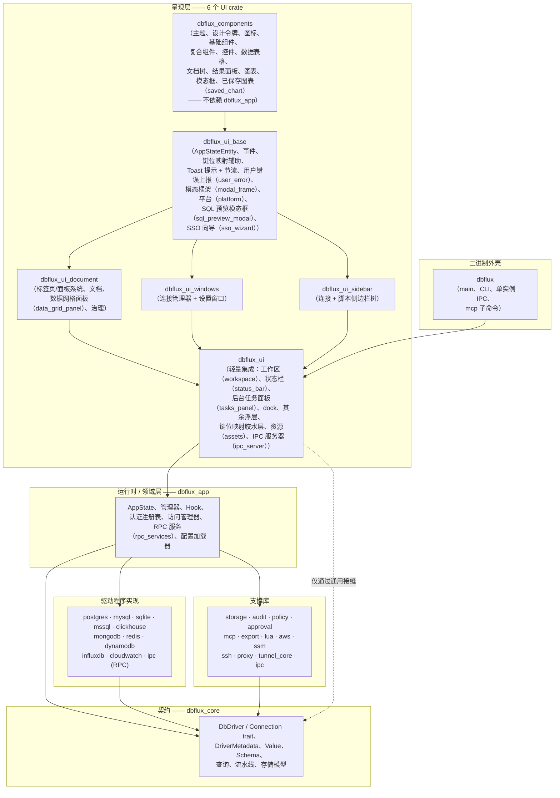
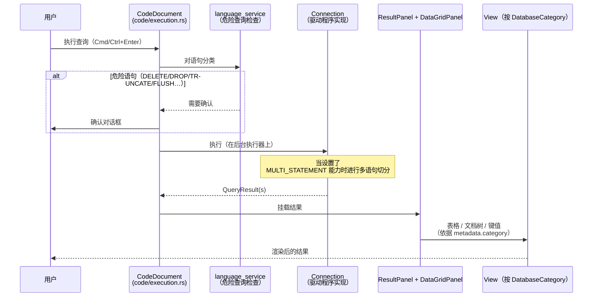
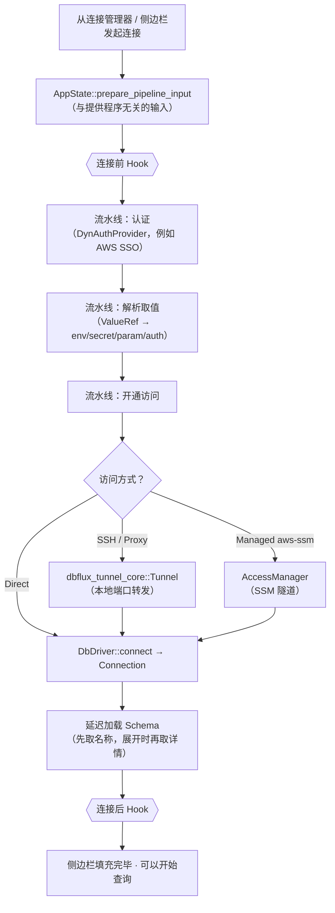

# 架构

关于概念模型与契约边界，请先阅读[核心概念](docs/CONCEPTS.md)。本文档仍是 crate 边界与关键文件的权威说明。

## 概述

- DBFlux 是一款用 Rust 与 GPUI 构建的键盘优先数据库客户端，专注于快速的工作流与简洁的桌面界面（README.md）。
- 本仓库是一个 Rust 工作区，包含一个界面应用 crate，以及共享的核心类型、驱动程序实现和支撑库（Cargo.toml、crates/）。
- 支持多种数据库范式：关系型（SQL）、文档型（MongoDB、DynamoDB）、键值（Redis）、时序（InfluxDB）、日志流（CloudWatch Logs）、图，以及宽列存储。
- 本文档是项目结构、架构概览、crate 边界、关键文件与跨 crate 图谱的权威顶层文档。其他顶层文档应链接到这里，而不是复述这些内容。

## 架构速览

下文的文字详尽但密集，这三张图先给出心智模型。它们只是概念性的 —— 确切的符号名见后续章节。

### 分层的 crate 图谱

依赖自上而下。`dbflux_core` 是每个 crate 都构建其上的无依赖契约层；界面从不依赖具体的驱动程序 crate（参见[驱动程序/界面解耦](#驱动程序体系)）。



### 查询流程

一次查询从编辑器文档出发，抵达驱动程序的 `Connection`，再回到由 `DatabaseCategory` 选定的结果视图 —— 界面永远不会依据驱动程序 id 做分支。



### 连接流程

连接在驱动程序打开之前，会先跑一条与提供程序无关的连接前流水线，并在各阶段附带可选的隧道/托管访问与生命周期 Hook。



## 技术栈

- 语言：Rust 2024 edition（crates/dbflux/Cargo.toml）。
- 界面：`gpui`、`gpui-component`（Cargo.toml）。
- 数据库：`tokio-postgres`（PostgreSQL）、`rusqlite`（SQLite）、`mysql`（MySQL/MariaDB）、`mongodb`（MongoDB）、`redis`（Redis）、`aws-sdk-dynamodb`（DynamoDB），以及基于 `reqwest` 的 HTTP（ClickHouse）（Cargo.toml）。
- AWS 认证/集成：`aws-config`、`aws-sdk-sso`、`aws-sdk-ssooidc`、`aws-sdk-sts`、`aws-sdk-secretsmanager`、`aws-sdk-ssm`（`dbflux_aws`）。
- IPC/RPC：`interprocess` 本地 Socket + `bincode` 消息分帧（`dbflux_ipc`、`dbflux_driver_ipc`、`dbflux_driver_host`）。
- SSH：经由 `dbflux_ssh` 使用 `ssh2`（crates/dbflux_ssh/src/lib.rs）。
- 导出：经由 `dbflux_export` 使用 `csv` + `hex` + `base64` + `serde_json`（crates/dbflux_export/src/lib.rs）。
- 序列化/配置：`serde`、`serde_json`、`dirs`（Cargo.toml）。
- 日志：`log`、`env_logger`（crates/dbflux/src/main.rs）。

## 目录结构

```
crates/
  dbflux/                   # 二进制外壳：main 入口、CLI、单实例 IPC
    src/
      main.rs               # 应用入口、日志、窗口引导、IPC socket
      cli.rs                # CLI 参数解析、单实例 IPC 客户端
  dbflux_components/        # 与领域无关的叶子 crate：主题、设计令牌、图标、基础组件、复合组件、
    src/                    # 控件、排版、数据表格、文档树、树形导航、
      theme.rs              # 主题定义
      tokens.rs             # 设计令牌（间距、尺寸常量）
      icons/                # SVG 图标系统（AppIcon 枚举）
        mod.rs
      icon.rs               # 图标渲染辅助函数
      primitives/           # 底层构建块（徽标、横幅、标签、按钮等）
      controls/             # 输入控件（按钮、复选框、下拉框、输入框、选择器等）
      composites/           # 组合模式（modal_frame、tab_strip、section_header 等）
      components/           # 领域组件
        data_table/         # 自研的虚拟化数据表格
          mod.rs
          table.rs          # 主表格组件，带虚拟滚动条
          state.rs          # 表格状态管理
          model.rs          # CellValue 与数据模型
          selection.rs      # 选区处理
          events.rs         # 事件处理
          clipboard.rs      # 复制/粘贴支持
          theme.rs          # 表格样式
        document_tree/      # 层级式文档/JSON 查看器
          mod.rs
          state.rs          # 含光标、展开与搜索的树状态
          tree.rs           # 带键盘导航的树渲染
          node.rs           # 节点类型（文档、字段、数组项）
          events.rs         # 文档树事件（选区、右键菜单）
        tree_nav/           # 可复用的树形导航组件
          mod.rs
          gutter.rs
        filter_bar.rs       # 通用筛选栏组件
        form_navigation.rs  # FormNavigation / FormEditState trait
        form_renderer.rs    # 通用表单字段渲染
        json_editor_view.rs # 内联 JSON 编辑器组件
        multi_select.rs     # 多选下拉框组件
        value_source_selector.rs # 取值来源下拉框（Env/Secret/Parameter/Auth）
      modals/               # 可复用的模态框组件（cell_editor、document_preview 等）
      result_panel/         # ResultPanel + ViewHandle 通用框架宿主
      chart/                # 图表引擎（detect、spec、decimate、axis、legend、engine）
      saved_chart.rs        # SavedChart 与 SavedChartStore 类型别名
      common/               # 共享辅助函数（时间范围选择器等）
      actions.rs            # 共享动作定义
      typography.rs
  dbflux_ui_base/           # AppStateEntity + 事件、键位映射辅助、平台工具
    src/
      app_state_entity.rs   # AppStateEntity 包装器（Deref + EventEmitter）、AppStateGlobal、
                            # UserErrorReported + OpenAuditRequested 事件、unread_error_count
      keymap.rs             # default_keymap、key_chord_from_gpui
      async_ext.rs          # AsyncUpdateResultExt
      toast.rs              # Toast 提示 + ToastHost，带按严重级别区分的令牌桶节流
      user_error/           # 集中式面向用户的错误上报（UserFacingError、
                            # ErrorKind、report_error、report_error_async）+ 节流
      modal_frame.rs        # 可复用的模态框架
      platform.rs           # X11/Wayland 检测、窗口选项
      sql_preview_modal.rs  # SQL/查询预览模态框（双模式：SQL 与通用）
      sso_wizard.rs         # SSO 账户/角色发现向导 [cfg aws]
  dbflux_ui_document/       # 标签页/面板系统、全部文档类型、data_grid_panel、治理
    src/
      pane.rs               # PaneHandle：为带类型的 Entity<T> 文档擦除闭包的壳
      tab_manager.rs        # Tab 枚举、TabManager（Vec<Tab> + MRU 顺序）、TabManagerEvent
      tab_bar.rs            # 可视化标签栏渲染
      handle.rs             # DocumentEvent 枚举（统一 —— 取代各文档各自的事件枚举）
      dedup.rs              # DocumentKey 枚举：标签页去重的身份键
      types.rs              # DocumentId、DocumentKind、DocumentMetaSnapshot、DocumentState
      result_view.rs        # ResultViewMode 枚举（Table、LiveOutput 等）
      task_runner.rs        # 文档的后台任务跟踪
      data_view.rs          # DataViewMode 抽象（表格与文档）
      data_view_trait.rs    # DataView trait（available_view_modes、focus_handle、active_context）
      chrome.rs             # 共享框架工具
      governance.rs         # 用于待审批执行的 MCP 审批视图
      history_modal.rs      # 最近/已保存查询模态框
      add_member_modal.rs   # 用于添加 Redis set/list/sorted-set 成员的模态框
      new_key_modal.rs      # 用于创建新 Redis 键的模态框
      chart_document/       # ChartDocument：已保存/交互式图表标签页
        mod.rs              # ChartDocument 实体
        pane.rs             # ChartDocument::into_pane 构造函数
        render.rs           # ChartDocument 的 impl Render
      data_document/        # DataDocument：独立的数据浏览标签页
        mod.rs              # DataDocument 实体（包裹 DataGridPanel + ResultPanel 的薄壳）
        pane.rs             # DataDocument::into_pane 构造函数
      data_grid_panel/      # 带表格/文档视图模式的数据网格
        mod.rs
        context_menu.rs
        filter_bar.rs
        mutation_confirm.rs
        mutation_executor.rs
        mutations.rs
        navigation.rs
        query.rs
        render.rs
        row_inspector.rs
        utils.rs
      code/                 # CodeDocument：查询/脚本编辑器
        mod.rs
        pane.rs             # CodeDocument::into_pane 构造函数
        completion.rs       # 语言感知的自动补全
        context_bar.rs      # 执行上下文下拉框（连接/数据库/schema）
        diagnostics.rs      # 实时查询诊断
        execution.rs        # 查询与脚本执行流程（含危险查询确认）
        file_ops.rs         # 自动保存、临时/影子文件管理
        focus.rs            # 内部焦点管理
        live_output.rs      # 文档自有的流式脚本输出缓冲区
        render.rs           # 工具栏、编辑器与实时输出渲染
      key_value/            # Redis/键值专用的文档标签页
        mod.rs              # KeyValueDocument 实体
        pane.rs             # KeyValueDocument::into_pane 构造函数
        view.rs             # KeyValueView 边界结构体（文件级渲染辅助）
        commands.rs
        context_menu.rs
        copy_command.rs
        document_view.rs
        mutations.rs
        pagination.rs
        parsing.rs
        render.rs           # KeyValueDocument 的 impl Render
      audit/                # AuditDocument：统一的事件/审计查看器标签页
        mod.rs              # AuditDocument 实体
        pane.rs             # AuditDocument::into_pane 构造函数
        view.rs             # LogStreamView 边界结构体
        render.rs           # 抽出的渲染代码（约 1300 行）
        commands.rs         # 抽出的命令分发（约 560 行）
        filters.rs
        saved_filter.rs
        source_adapter.rs
      chart/                # 用于指标/实例图表的 ChartShell 宿主（与 chart_document/ 不同）
        mod.rs
        shell.rs            # ChartShell 宿主实体
        host.rs
        metric_picker.rs
        metric_picker_render.rs
        toolbar.rs
      instance_inspector/   # InstanceInspectorDocument（支撑 DocumentKey::InstanceInspector）
        mod.rs
        pane.rs             # into_pane 构造函数
  dbflux_ui_sidebar/        # 连接 + 脚本的侧边栏树，支持文件夹与拖放
    src/
      lib.rs                # SidebarView 实体（由 dbflux_ui 重新导出）
      code_generation.rs
      context_menu.rs
      deletion.rs
      drag_drop.rs
      expansion.rs
      operations.rs
      render.rs
      render_footer.rs
      render_overlays.rs
      render_tree.rs
      selection.rs
      table_loading.rs
      tree_builder.rs
  dbflux_ui_windows/        # 设置窗口 + 连接管理器窗口
    src/
      ssh_shared.rs         # 共享的 SSH 认证界面组件
      settings/             # 设置窗口各节
        mod.rs
        render.rs           # 设置窗口的顶层渲染
        lifecycle.rs        # 设置窗口的打开/关闭/保存逻辑
        sidebar_nav.rs      # 设置侧边栏导航（TreeNav）
        dirty_state.rs      # 设置表单的未保存变更跟踪
        form_nav.rs         # FormGridNav<F> 通用二维网格导航
        form_section.rs     # 用于键盘导航的 FormSection trait
        section_trait.rs    # SettingsSection trait
        general.rs          # 常规设置（主题、安全开关）
        keybindings.rs      # 键盘快捷键设置节
        auth_profiles_section.rs # 依据提供程序表单定义动态增删改查认证配置文件
        proxies.rs          # 带 FormGridNav 的代理增删改查表单
        ssh_tunnels.rs      # 带 FormGridNav 的 SSH 隧道增删改查表单
        hooks.rs            # Hook 定义增删改查
        drivers.rs          # 各驱动程序的设置覆盖项
        rpc_services.rs     # RPC 服务设置界面（驱动程序/认证提供程序描述符）
        audit_section.rs    # 审计设置节
        about_section.rs    # 关于节
        mcp_section.rs      # MCP 设置（受信客户端、角色、策略、审计；按 feature 门控）
      connection_manager/   # 连接管理器窗口
        mod.rs
        access_tab.rs       # 统一的访问方式编辑器（Direct/SSH/Proxy/SSM）
        form.rs             # 连接表单状态与字段管理
        navigation.rs       # 连接管理器内的键盘导航
        render.rs           # 连接管理器的顶层渲染
        render_driver_select.rs
        render_tabs.rs
        hooks_tab.rs        # 按配置文件的 Hook 绑定
  dbflux_ui/                # 轻量集成层（约 13.5k 行）：把六个 UI crate 串联起来
    src/                    # 通过旧模块路径上的 pub use 垫片重新导出已迁移的子系统
      lib.rs                # crate 根；通过垫片模块重新导出
      app.rs                # GPUI 应用引导
      ipc_server.rs         # 应用控制 IPC 服务器（Focus、OpenScript）
      assets.rs             # 用于内嵌 SVG 图标的 GPUI AssetSource 实现
      platform.rs           # 垫片：pub use dbflux_ui_base::platform::*
      keymap/               # 键盘胶水层（动作、分发器）
        mod.rs
        actions.rs
        dispatcher.rs
      ui/
        views/
          workspace/        # 主布局、命令分发、焦点路由
            mod.rs
            actions.rs      # 工作区级动作处理函数
            dispatch.rs     # 命令分发逻辑
            render.rs       # 工作区渲染
          status_bar.rs     # 状态栏渲染
          tasks_panel.rs    # 后台任务面板
        dock/
          sidebar_dock.rs   # 可折叠、可调整大小的侧边栏
        overlays/           # 仍留在 dbflux_ui 的其余浮层
          command_palette.rs       # 模糊搜索命令面板
          login_modal.rs           # 带超时的 SSO 登录等待模态框
          shutdown_overlay.rs      # 优雅关闭浮层
          # 旧浮层路径上的垫片，从 dbflux_ui_base / dbflux_components 重新导出：
          sql_preview_modal.rs     # → dbflux_ui_base::sql_preview_modal
          sso_wizard.rs            # → dbflux_ui_base::sso_wizard
          cell_editor_modal.rs     # → dbflux_components::modals::cell_editor
          document_preview_modal.rs # → dbflux_components::modals::document_preview
        document.rs         # 垫片：pub use dbflux_ui_document::*
        icons/mod.rs        # 垫片：重新导出 AppIcon + embedded_bytes（SVG 资源也在这里）
        theme.rs            # 垫片：pub use dbflux_components::theme::*
        tokens.rs           # 垫片：pub use dbflux_components::tokens::*
        components/
          modal_frame.rs    # 垫片：→ dbflux_ui_base::modal_frame
          toast.rs          # 垫片：→ dbflux_ui_base::toast
        windows/mod.rs      # 垫片：pub use dbflux_ui_windows::*
        views/sidebar/mod.rs # 垫片：pub use dbflux_ui_sidebar::*
  dbflux_app/               # 运行时/领域层：AppState（普通结构体）、管理器、Hook、认证
    src/
      app_state.rs          # AppState（普通结构体，不依赖 GPUI）
      access_manager.rs      # 用于直连/托管访问的 AppAccessManager
      auth_provider_registry.rs # 运行时认证提供程序注册表
      hook_executor.rs       # 复合 Hook 执行器路由
      proxy.rs               # 供 CreateTunnelFn 使用的 create_proxy_tunnel 回调
      config_loader.rs       # 基于 SQLite 的配置持久化
      rpc_services/          # 用于运行时引导的 RPC 服务发现/适配接缝（external_audit 等）
      history_manager_sqlite.rs # 基于 SQLite 的查询历史
      mcp_command.rs         # MCP 子命令集成与参数解析
      keymap/                # 键盘系统（纯领域类型）
        mod.rs               # 从 dbflux_core::keymap_types 重新导出 Command/ContextId
        focus.rs             # FocusTarget 枚举（纯领域）
  dbflux_core/              # trait、核心类型、存储、错误
    src/access/             # AccessKind、AccessManager 与托管访问的序列化
      mod.rs
    src/auth/               # AuthProfile + DynAuthProvider 契约
      mod.rs
      types.rs
    src/core/               # 基础类型与 trait
      traits.rs             # DbDriver + Connection trait
      error.rs              # DbError 类型
      error_formatter.rs    # 用于驱动程序特定错误消息的 ErrorFormatter trait
      value.rs              # 跨数据库数据的通用 Value 类型
      shutdown.rs           # ShutdownCoordinator
      task.rs               # 后台任务跟踪
    src/driver/             # 驱动程序元数据与表单定义
      capabilities.rs       # DatabaseCategory、QueryLanguage、DriverCapabilities、DriverMetadata
      form.rs               # 各驱动程序的动态表单定义
    src/schema/             # 数据库 Schema 类型
      types.rs              # Schema 类型（表、集合、索引、外键）
      builder.rs            # 用于构建 Schema 的构建器辅助函数
      node_id.rs            # 用于树识别的 SchemaNodeId
    src/sql/                # SQL 生成与方言
      dialect.rs            # 用于处理 SQL 方言差异的 SqlDialect trait
      generation.rs         # SQL INSERT/UPDATE/DELETE 生成
      query_builder.rs      # 用于安全构造查询的 SqlQueryBuilder
      code_generation.rs    # DDL 代码生成（索引、类型、外键）
    src/query/              # 查询类型与语言服务
      types.rs              # QueryRequest、QueryResult、Row、ColumnMeta
      generator.rs          # QueryGenerator trait、变更/读取模板、语义预览辅助函数
      language_service.rs   # 危险查询检测（SQL、MongoDB、Redis）
      safety.rs             # 安全读取查询检测
      table_browser.rs      # 表浏览状态与分页
    src/connection/         # 连接管理与配置
      profile.rs            # 连接/SSH 配置
      profile_manager.rs    # ProfileManager
      manager.rs            # ConnectionManager、Schema 缓存、连接流程
      hook.rs               # Hook 定义、HookRunner、阶段编排
      tree.rs               # 文件夹/连接树模型
      tree_manager.rs       # ConnectionTreeManager
      context.rs            # 按标签页的执行上下文（连接/数据库/schema）
      proxy.rs              # ProxyProfile、ProxyKind、ProxyAuth、不使用代理匹配
      proxy_manager.rs      # ProxyManager（ItemManager<ProxyProfile> 的类型别名）
      ssh_tunnel_manager.rs # SshTunnelManager
      item_manager.rs       # 通用 ItemManager<T>、Identifiable、DefaultFilename trait
    src/storage/            # 持久化与状态
      session.rs            # 会话持久化（临时/影子文件、清单（manifest））
      history.rs            # 历史记录持久化
      saved_query.rs        # 已保存查询持久化
      recent_files.rs       # 最近文件跟踪
      secrets.rs            # 密钥环密钥存储
      secret_manager.rs     # 带 HasSecretRef trait 的 SecretManager
      ui_state.rs           # 用于持久化界面状态的 UiStateStore（侧边栏折叠）
    src/data/               # 数据类型与操作
      crud.rs               # 覆盖所有数据库范式的 CRUD 变更类型
      key_value.rs          # 键值操作类型（Hash、Set、List、ZSet、Stream）
      view.rs               # DataViewMode（Table/Document）抽象
    src/config/             # 应用配置
      app.rs                # 旧版 config.json 导入（已弃用）
      refresh_policy.rs     # Schema 刷新策略
      scripts_directory.rs  # 脚本文件夹树（文件/文件夹增删改查）
    src/pipeline/           # 连接前流水线（认证/取值/访问阶段）
      mod.rs
      resolve.rs
    src/values/             # ValueRef 解析 + 提供程序注册表 + 缓存
      resolver.rs
    src/facade/             # 会话门面
      session.rs            # 用于连接管理的会话门面
  dbflux_ipc/               # 带版本号的 IPC 契约与分帧
    src/auth.rs             # IPC 认证令牌生成与文件存储
    src/envelope.rs         # ProtocolVersion + 应用/驱动程序协议常量
    src/protocol.rs         # 单实例应用控制消息
    src/driver_protocol.rs  # 驱动程序 RPC 请求/响应结构（DTO + 错误）
    src/framing.rs          # 长度前缀的 bincode 传输分帧
    src/socket.rs           # 跨平台 Socket 命名辅助函数
  dbflux_driver_ipc/        # 面向外部 RPC 服务的 DbDriver 适配器
    src/driver.rs           # IpcDriver + 受管宿主进程生命周期
    src/transport.rs        # RPC 客户端传输与握手
    src/connection.rs       # 基于驱动程序 RPC 的连接代理
  dbflux_driver_host/       # 通过 RPC 提供驱动程序服务的宿主进程
    src/main.rs             # 驱动程序 RPC 服务器入口
    src/session.rs          # 会话管理器与方法分发
  dbflux_driver_postgres/   # PostgreSQL 驱动程序实现
  dbflux_driver_sqlite/     # SQLite 驱动程序实现
  dbflux_driver_mysql/      # MySQL/MariaDB 驱动程序实现
  dbflux_driver_mssql/      # Microsoft SQL Server 驱动程序实现
  dbflux_driver_mongodb/    # MongoDB 驱动程序实现
    src/driver.rs           # 连接、Schema 发现、CRUD 操作
    src/query_parser.rs     # MongoDB 查询语法解析器（db.collection.method()）
    src/query_generator.rs  # MongoDB shell 查询生成器（insertOne、updateOne 等）
  dbflux_driver_redis/      # Redis 驱动程序实现
    src/driver.rs           # 连接、键值 API、Schema 发现
    src/command_generator.rs # Redis 命令生成器（SET、HSET、SADD 等）
  dbflux_driver_dynamodb/   # DynamoDB 驱动程序实现
    src/driver.rs           # 连接、Schema 发现、scan/query/put/update/delete
    src/query_parser.rs     # 用于 DynamoDB 操作的 JSON 命令信封解析器
    src/query_generator.rs  # 变更 → DynamoDB 命令信封生成器
    tests/live_integration.rs # 基于 Docker 的集成测试（DynamoDB Local）
  dbflux_driver_influxdb/   # InfluxDB 驱动程序（v1 + v2）
    src/driver.rs           # 连接、存储桶/测量发现、查询执行
    src/query_generator.rs  # InfluxQL（v1）与 Flux（v2）查询/模板生成
  dbflux_driver_clickhouse/ # ClickHouse HTTP(S) 关系型驱动程序
    src/driver.rs           # 元数据、连接表单与连接构造
    src/connection.rs       # 查询执行与系统目录发现
    src/types.rs            # ClickHouse 类型解析与值解码
    src/dialect.rs          # SQL 生成方言
  dbflux_driver_cloudwatch/ # AWS CloudWatch Logs 驱动程序（DatabaseCategory::LogStream）
    src/driver.rs           # 日志组/流发现、EventStreamTarget、CollectionPresentation::EventStream
  dbflux_driver_s3/         # AWS S3 对象存储驱动程序（DatabaseCategory::ObjectStorage）
    src/driver.rs           # 存储桶/对象发现、ObjectStoreConnection 实现、预签名/复制/版本
  dbflux_aws/               # AWS 认证提供程序 + Secrets Manager/SSM 取值提供程序
    src/auth.rs             # AWS SSO/共享/静态提供程序与 SSO 登录流程
    src/config.rs           # ~/.aws/config 解析器/缓存与配置回写辅助函数
    src/accounts.rs         # AWS SSO 账户与角色发现
  dbflux_ssm/               # 用于托管访问的 AWS SSM 隧道工厂
  dbflux_lua/               # 用于进程内 Hook 的嵌入式 Lua 运行时
    src/executor.rs         # Lua HookExecutor 实现
    src/engine.rs           # Lua VM 创建与共享运行时状态
    src/api/dbflux.rs       # dbflux.log/env/process 的 Lua API
    src/api/connection.rs   # Lua connection.* API（暴露 HookContext）
    src/api/hook.rs         # Lua hook.* API（阶段、失败策略）
  dbflux_tunnel_core/       # 共享的 RAII 隧道基础设施
    src/lib.rs              # Tunnel、TunnelConnector、ForwardingConnection<R>
  dbflux_proxy/             # SOCKS5/HTTP CONNECT 代理隧道
    src/lib.rs              # ProxyTunnelConfig、SOCKS5/HTTP 握手、隧道循环
  dbflux_ssh/               # SSH 隧道支持
  dbflux_export/            # 导出（CSV、JSON、文本、二进制）
    src/lib.rs              # 基于形状的导出 API 与格式分发
    src/binary.rs           # 二进制/hex/base64 导出器
    src/csv.rs              # CSV 导出器
    src/json.rs             # JSON 美化/紧凑导出器
    src/text.rs             # 文本表格导出器
  dbflux_mcp/               # MCP 运行时与治理
    src/lib.rs              # 运行时、治理服务、工具目录的导出
    src/runtime.rs          # 实现 McpGovernanceService 的 McpRuntime
    src/governance_service.rs # McpGovernanceService trait 与 DTO
    src/tool_catalog.rs     # 标准 MCP 工具与暂缓工具定义
    src/built_ins.rs        # 内置角色与策略
     src/handlers/           # MCP 工具处理器（查询、审批、发现、脚本）
    src/server/             # MCP 服务器基础设施（路由器、授权、引导）
  dbflux_mcp_server/        # 独立 MCP 服务器二进制
    src/main.rs             # 带 --client-id 与 --config-dir 的 CLI 入口
    src/server.rs           # 基于 stdin/stdout 的 JSON-RPC 请求循环
    src/bootstrap.rs        # 运行时初始化与状态
    src/transport.rs        # 按行处理的 stdin/stdout 传输
    src/connection_cache.rs # 独立服务器的连接池
    src/handlers/           # 为独立运行适配的工具处理器
  dbflux_policy/            # 策略引擎与分类
    src/lib.rs              # 引擎、分类、受信客户端的导出
    src/classification.rs   # ExecutionClassification 枚举（Metadata/Read/Write/Destructive/AdminSafe/Admin/AdminDestructive）
    src/engine.rs           # 带 PolicyRole 与 ToolPolicy 的 PolicyEngine
    src/trusted_clients.rs  # 用于已知 AI 客户端的 TrustedClientRegistry
    src/assignments.rs      # ConnectionPolicyAssignment 与 PolicyBindingScope
  dbflux_approval/           # 用于延后执行的审批服务
    src/lib.rs              # ApprovalService 与待处理存储的导出
    src/service.rs          # ApprovalService（批准/驳回生命周期）
    src/store.rs            # InMemoryPendingExecutionStore 与 ExecutionPlan
  dbflux_audit/             # 审计日志记录
    src/lib.rs              # AuditService：校验、指纹、脱敏、记录
    src/query.rs            # AuditQueryFilter（执行者、类别、动作、结果、日期范围）
    src/export.rs           # 审计导出为 JSON/CSV（基础与扩展结构）
    src/redaction.rs        # 对 details_json 与 error_message 中的敏感值脱敏
    src/purge.rs            # 基于保留策略的事件清理（分批删除）
    src/store/sqlite.rs     # 委托给 AuditRepository 的 SqliteAuditStore
  dbflux_storage/            # 统一的 SQLite 存储
    src/bootstrap.rs        # 使用单个 dbflux.db 连接的 StorageRuntime
    src/paths.rs            # dbflux_db_path() 返回 ~/.local/share/dbflux/dbflux.db
    src/migrations/         # 基于 trait 的迁移系统
      mod.rs                # MigrationRegistry、Migration trait
      *.rs                  # 各个迁移文件（001_initial.rs 等）
    src/repositories/       # 所有领域存储库
      traits.rs             # Repository trait（all()、find_by_id()、upsert()、delete()）
      audit.rs              # 带 AuditEventDto 的 AuditRepository
      *.rs                  # 其他领域存储库
    src/legacy.rs           # JSON 到 SQLite 的导入
  dbflux_test_support/       # 用于集成测试的 Docker 容器与固件（Fixture）
    src/containers.rs       # Docker 容器生命周期（Postgres、MySQL、MongoDB、Redis、DynamoDB Local）
    src/fixtures.rs         # 固件辅助函数
    src/fake_driver.rs      # 用于单元测试的 FakeDriver
```

## 核心组件

### 应用层

- 应用入口：`crates/dbflux/src/main.rs` 负责初始化日志、主题与主 GPUI 窗口。
- 全局应用状态：`crates/dbflux_app/src/app_state.rs`（普通结构体，不依赖 GPUI）持有驱动程序、配置、活动连接、历史记录、任务管理器与密钥存储访问入口。
- CLI 与单实例：`crates/dbflux/src/cli.rs` 负责解析参数；`crates/dbflux_ui/src/ipc_server.rs` 运行应用控制 IPC 服务器，处理 `Focus` 与 `OpenScript` 命令。
- 资源：`crates/dbflux_ui/src/assets.rs` 实现 GPUI 的 `AssetSource`，用于提供内嵌的 SVG 图标。
- 工作区界面外壳：`crates/dbflux_ui/src/ui/views/workspace/` 串联各面板（侧边栏/dock、文档区、底部 dock）、命令面板与焦点路由，分散在 `mod.rs`、`actions.rs`、`dispatch.rs` 与 `render.rs` 中。该模块留在 `dbflux_ui`。

### 面向用户的错误上报

用户触发的失败会经由 `crates/dbflux_ui_base/src/user_error/mod.rs` 中的单一接缝上报，因此每个可操作的错误都会产生一条 Toast 提示、一条审计记录，并让状态栏徽标加一 —— 三者都以同一个 UUID v7 关联 ID 为键。

- **入口**：`report_error(UserFacingError, &mut App)`（前台）与 `report_error_async(UserFacingError, &AsyncApp)`（后台 / `cx.spawn` / `background_executor`）。同步版本绝不能在后台上下文中调用 —— 它需要 `&mut App`。
- **分类**：`ErrorKind { Storage, Network, Auth, Hook, Driver, User, Config }` 决定徽标/Toast 提示样式与审计的 `action` 判别字段。严重级别复用 `dbflux_core::observability::EventSeverity`；`report_error` 不会另立一套枚举。
- **驱动程序数据源**：`UserFacingError::from_formatted(kind, FormattedError)` 采用驱动程序现有的 `ErrorFormatter` 输出。界面代码永远不会依据驱动程序 id 做分支。
- **审计桥接**：该接缝会发出 `tracing::error!(target = "dbflux_ui::user_error", correlation_id = %id, kind, action = "user_error", outcome = "failure", ...)`。`AuditFieldVisitor`（`crates/dbflux_core/src/observability/tracing_bridge/layer.rs`）把 `record_str` 与 `record_debug` 都经由 `record_string_by_name` 路由，因此无论字段是通过 `%`（Display）还是 `?`（Debug）标记符记录的，类型化的 `EventRecord.correlation_id` 槽位都会被填充。
- **Toast 提示节流（Throttle）**：`ToastHost` 为 Info 与 Warn 各维护一个按严重级别的令牌桶（容量 5，每 2 秒补充 1 个令牌），以免连接中断的风暴刷屏。Error 与 Fatal 绕过节流。该令牌桶的时钟可注入，便于确定性测试。
- **徽标与导航**：`AppStateEntity::note_user_error` 会让 `unread_error_count` 加一，并发出 `UserErrorReported`。状态栏徽标订阅它，点击时调用 `AppStateEntity::request_open_audit(None, cx)`，后者发出 `OpenAuditRequested`。toast 上的「在审计中查看」动作会带着 `Some(correlation_id)` 发出同一事件。工作区只订阅一次 `OpenAuditRequested`，并通过 `set_correlation_filter` 或 `new_with_correlation_id` 引导 `AuditDocument`。
- **约定**：只有第一个捕获点才上报。上层的传播者不得重复上报 —— 运行时没有去重机制，重复的 Toast 提示属代码评审关注点（参见 AGENTS.md § Error Handling）。

### 文档系统

`crates/dbflux_ui_document/src/` 实现了一套基于标签页的文档架构，共五层：

**分层（由外到内）**

1. **`Tab`**（`tab_manager.rs`）—— `#[non_exhaustive]` 枚举，只有一个 `Pane(Box<PaneHandle>)` 变体。保留枚举形式是为了向前兼容（例如将来可能出现可分离的面板变体）。`TabManager` 持有一个 `Vec<Tab>` 以及 MRU 顺序。

2. **`PaneHandle`**（`pane.rs`）—— 擦除闭包的壳，取代了原先封闭的 `DocumentHandle` 枚举。它的 22 项操作（render、focus、dispatch_command、meta_snapshot、tab_title、can_close、connection_id、active_context、change_summary、refresh_policy、set_active_tab、set_refresh_policy、flush_auto_save、matches_dedup_key、subscribe，以及若干可选辅助方法）各自是一个捕获类型化 `Entity<T>` 的 `Box<dyn Fn>` 闭包。`PaneHandle` 不实现 `Clone`。每种文档类型都在自己的 `pane.rs` 中提供 `XxxDocument::into_pane(entity, cx) -> PaneHandle`（均位于 `crates/dbflux_ui_document/src/` 下）。新增一种文档类型无需改动 `workspace/mod.rs`、`tab_manager.rs`、`tab_bar.rs` 或 `handle.rs`。

3. **`DocumentKey`**（`dedup.rs`）—— 用于标签页去重的身份枚举。变体：`Table`、`Collection`、`File`、`KeyValueDb`、`Chart`、`Audit`、`EventStream`、`Routine`、`MetricChart`、`Dashboard`、`InstanceMetric`、`InstanceInspector`、`InstanceOverview`、`ObjectStoreBucketsRoot`、`ObjectBrowser`、`ObjectEditor`。它取代了旧 `DocumentHandle` 上的那些 `is_*` 方法。调用点写作 `tab_manager.find_by_key(&DocumentKey::Table { ... }, cx)`。

4. **`DocumentEvent`**（`handle.rs`，约 30 行）—— 统一的事件枚举，取代了已被删除的四个按文档划分的事件枚举。变体：`MetaChanged`、`ExecutionStarted`、`ExecutionFinished`、`RequestClose`、`RequestFocus`、`RequestSqlPreview`、`OpenInspector`、`ChartThisQuery`。

5. **`ResultPanel` + `ViewHandle`**（`crates/dbflux_components/src/result_panel/mod.rs`）—— 通用框架宿主。`ResultPanel` 持有一行框架，并把主体渲染委托给 `ViewHandle`（7 个闭包：render、focus、focus_handle、toolbar_segments、available_modes、current_mode、set_mode）。槽位系统（`ToolbarSegment { position: SegmentPosition::{Left,Center,Right}, index: u16, builder }`）让各视图可以贡献任意框架内容：`ResultPanel` 合并内置段（当 `available_modes.len() >= 2` 时，把模式栏放在 Left/0）与视图提供的段，按 `(position, index)` 排序，并在一个 `flex_wrap` 行中渲染。

**文档类型**

- `DataDocument`（`crates/dbflux_ui_document/src/data_document/`）—— 包裹 `DataGridPanel` + `ResultPanel` 的薄壳。DataGridPanel 以 `ViewHandle` 形式挂载；筛选栏作为 Center/0 段注入。
- `ChartDocument`（`crates/dbflux_ui_document/src/chart_document/`）—— `ChartShell` 实体 + 惰性的 `Option<Entity<ResultPanel>>`。图表区、坐标轴栏与操作按钮分别作为 Left/Center/Right 段挂载。既可独立渲染，也可嵌入 `DashboardDocument` 的面板中。
- `DashboardDocument`（`crates/dbflux_ui_document/src/dashboard/`）—— 具名的图表面板网格，带共享的 `TimeRangePanel` 与刷新策略。每个面板要么是 `Loaded` 的 `ChartDocument` 实体，要么是图表被删除后的 `Orphan` 占位面板。面板的重新执行受 `PANEL_REEXEC_CAP` 限制。参见 `docs/DASHBOARDS.md`。
- `CodeDocument`（`crates/dbflux_ui_document/src/code/`）—— 多标签页编辑器。每个结果标签页把自己的 `DataGridPanel` 包在各自的 `ResultPanel` 中。外层框架（编辑器、上下文栏、标签条）自行渲染。
- `KeyValueDocument`（`crates/dbflux_ui_document/src/key_value/`）—— 自行渲染。`KeyValueView` 是一个文件级边界结构体（并非独立的 GPUI 实体），把从 `key_value/render.rs` 抽出的渲染辅助函数归为一组。
- `AuditDocument`（`crates/dbflux_ui_document/src/audit/`）—— 自行渲染。`LogStreamView` 是文件级边界结构体。主体被抽到 `audit/render.rs` 与 `audit/commands.rs`，作为同级的 `impl AuditDocument` 文件。
- `InstanceInspectorDocument`（`crates/dbflux_ui_document/src/instance_inspector/`）—— 表格型实例检查器快照标签页，以 `DocumentKey::InstanceInspector` 为键。
- `chart/`（`crates/dbflux_ui_document/src/chart/`）—— `ChartShell` 宿主（`shell.rs`、`host.rs`）加上指标选择器（`metric_picker*.rs`）与 `toolbar.rs`，与 `chart_document/` 不同；它支撑指标/实例图表。
- `BucketsTableDocument`（`crates/dbflux_ui_document/src/buckets_table/`）—— 连接根节点的对象存储视图（名称、区域、对象数、大小、版本控制、创建时间），复用 `dbflux_components::data_table` 而非 `DataGridPanel`；以 `DocumentKey::ObjectStoreBucketsRoot` 为键。
- `ObjectBrowserDocument`（`crates/dbflux_ui_document/src/object_browser/`）—— 分栏的树/预览对象存储浏览器，支持分页与惰性树导航、预览、元数据、上传、删除、重命名与预签名；以 `DocumentKey::ObjectBrowser` 为键。
- `ObjectEditorDocument`（`crates/dbflux_ui_document/src/object_editor/`）—— 面向 S3 文本对象的独立「在编辑器中打开」标签页，与 `ObjectBrowserDocument` 的内联编辑器共用 `object_text` 模块（行尾检测、语言高亮、保存审计）；以 `DocumentKey::ObjectEditor` 为键。

**新增一种文档类型**（无需改动新模块之外的任何内容）：
1. 创建 `crates/dbflux_ui_document/src/<name>/mod.rs`，放入实体。
2. 创建 `crates/dbflux_ui_document/src/<name>/pane.rs`，放入 `into_pane(entity, cx) -> PaneHandle`。
3. 若需要去重，在 `crates/dbflux_ui_document/src/dedup.rs` 中添加一个 `DocumentKey` 变体。
4. 在 `crates/dbflux_ui/src/ui/views/workspace/actions.rs` 中添加 `open_<name>` 函数。

**架构说明**

- `KeyValueView` 与 `LogStreamView` 是文件级边界结构体，而非独立的 GPUI 实体。当一个文档里有 40 多个 `cx.listener()` 闭包捕获 `Self` 时，GPUI 单一 `Context<T>` 的借用模型会让跨实体的 `impl Render` 拆分不可行；要拆分就必须把所有领域状态迁到视图实体上。最终实现的边界是文件级的。
- `DataView` trait（`data_view_trait.rs`）不包含 `render` 方法。规范原本要求在 trait 上提供 `render`，但 `impl IntoElement` 不是 trait 对象安全的，而装箱成 `AnyElement` 又与 GPUI 的惯用法冲突。渲染改由 `ViewHandle.render` 承担。
- 自动保存：标签页以 2 秒防抖（Debounce）自动保存到临时文件（未命名）或影子文件（有文件支撑）。Ctrl+S 写入原文件。标签页关闭时不再提示。
- 会话恢复：`SessionStore` 把已打开标签页的清单（manifest）持久化到 `~/.local/share/dbflux/sessions/`。启动时会恢复所有标签页，并对被外部修改的文件做冲突检测。只有代码文档会产生 `CodeSessionTabSnapshot`；其他文档类型不做会话持久化。
- 重复预防：`tab_manager.find_by_key` 在打开新标签页之前先检查 `PaneHandle::matches_dedup_key`，若命中则聚焦已有的标签页。

### 可视化查询构建器

右侧栏的构建器让你无需手写 SQL 就能组合 SELECT/UPDATE/DELETE 语句，并把它们送入 DataView。它从构造上就与驱动程序无关：以 `QueryLanguage::Sql` 为门控，整条路径上没有任何按驱动程序分支的逻辑。

**核心规格类型**（`crates/dbflux_core/src/query/visual_query.rs`，从 `dbflux_core::query` 重新导出）：
- `VisualQuerySpec` —— SELECT 模型：投影、带别名的 FROM、JOIN、递归的 `WHERE` 谓词树（`FilterNode` / `Predicate`）、GROUP BY / 聚合 / HAVING、`ORDER BY`（`SortEntry`），以及 `LIMIT`/`OFFSET`。
- `VisualMutationSpec`（连同 `MutationKind`、`ColumnAssignment` / `Assignment`、`AssignmentValue`）—— UPDATE/DELETE 模型。原始表达式赋值通过 `used_raw_expression` 标志跟踪，而不是靠文本标记。
- `EditableBinding` —— 证明某个 SELECT 结果是*可安全编辑*的（见下文的内联编辑）。

**SQL 生成**（`crates/dbflux_core/src/query/generator.rs`）：`QueryGenerator` trait 新增三个带默认实现的方法 —— `generate_select`、`generate_update_from_spec`、`generate_delete_from_spec`。它们委托给 crate 内部的 `SqlSelectBuilder`（自由函数 `build_select_query` / `build_grouped_count_query`），后者为 SQLite、PostgreSQL、MySQL/MariaDB 与 SQL Server 渲染方言相关的 SQL。分组查询复用 `build_group_by` / `build_having` / `build_count_of_grouped`，因此分页会对分组 SELECT 跑一个 `COUNT(*)` 子查询。UPDATE/DELETE 会针对表主键发出按键集分页的分块 DML。

**变更策略**（`crates/dbflux_core/src/connection/manager.rs`）：`MutationPolicy { Allowed | ReadOnly | ApprovalRequired }` 组合了 MCP 执行者治理、按配置文件的只读设置，以及默认的 `Allowed` 解析结果。不带 `WHERE` 的 UPDATE/DELETE 还会额外经过规范层 + 文本层的双重 `DangerousQueryKind` 检查。

**界面**（`crates/dbflux_ui_document/src/query_builder/`）：`QueryBuilderPanel`（`panel.rs`、`view.rs`）渲染该侧栏，带一个模式选择器以及 `sections/` 下的各子句分区（`columns`、`joins`、`filters`、`group_by`、`sort`、`assignments`、`execution`）；`mutation_state.rs`、`completion.rs`（Schema 感知自动补全）、`events.rs` 与 `tree_ops.rs` 为其提供支撑。SQL 预览始终可见，并在每次变更时同步重新生成。

**执行**（`crates/dbflux_ui_document/src/data_grid_panel/`）：构建器集成进 DataView；`MutationExecutor`（`mutation_executor.rs`）驱动一个 `ExecutionMode` 状态机 —— `SingleTransaction`、`ChunkedTransaction`、`DirectAutocommit` —— 依据行数估算、`TRANSACTIONS` 能力与主键可用性自动建议（用户手动覆盖时会弹出权衡（Tradeoff）提示框）。分块执行使用键集分页（块大小钳制在 `[1000, 10000]`，默认 5000），在后台任务面板中按块展示条目并支持块间取消，且在某块失败时执行 `ROLLBACK`。

**构建器结果的内联编辑**：当某个 SELECT 结果可证明是可安全编辑的 —— 与单张底层表一一对应，且投影出全部主键列并保留原列名 —— 构建器就会根据已提交的 `VisualQuerySpec` 计算出 `EditableBinding`，并把它贯穿到 DataView 中，复用单表变更路径，其 `WHERE` 由投影出的主键值构建（无需解析 SQL）。JOIN 是允许的：源表的列仍可编辑，被连接的列只读。存在聚合 / `GROUP BY` / `HAVING`、别名投影或缺失主键、以及尚未加载的 Schema 键时，都会回退为只读。这一证明位于 `dbflux_core` 中、作用于通用的规格/元数据类型，因此每一种关系型驱动程序都能受益。

**持久化**：迁移 `017_qry_saved_queries` 新增了 `qry_*` 表族（根表 + 列/排序/连接子表、级联外键、`UNIQUE (profile_id, name)`），由 `SavedQueryRepo`（`crates/dbflux_storage/src/repositories/qry_saved_queries.rs`）与内存中的 `SavedQueryManager`（`crates/dbflux_ui_base/src/saved_query_manager.rs`）负责前端访问。`TableProbe` 接缝用于在把已保存查询导入另一个连接时验证表是否存在，而无需侵入驱动程序代码。

### 数据可视化

- **数据表格**：`crates/dbflux_components/src/components/data_table/` 自研的虚拟化表格，支持排序、选区、基于虚拟滚动条模式的横向滚动、键盘导航、列宽调整，以及带 CRUD 操作的右键菜单。
- **文档树**：`crates/dbflux_components/src/components/document_tree/` 面向文档数据库的层级式 JSON/BSON 查看器，支持键盘导航（j/k/h/l）、搜索（Ctrl+F 或 /）、可折叠节点，以及多种视图模式（仅键、键+预览、完整值）。
- **键值视图**：`crates/dbflux_ui_document/src/key_value/` Redis 专用的文档标签页，按类型渲染（String、Hash、List、Set、SortedSet、Stream），支持分页、变更与右键菜单。通过 `key_value/pane.rs` 中构造的 `PaneHandle` 与工作区集成。
- 单元格编辑器模态框：`crates/dbflux_components/src/modals/cell_editor.rs` 为 JSON 列与长文本/多行文本提供模态编辑器，带 JSON 校验与格式化。（`dbflux_ui` 中旧浮层路径上留有垫片（Shim）。）
- 文档预览模态框：`crates/dbflux_components/src/modals/document_preview.rs` 全屏 JSON 文档预览，带内联 JSON 编辑器。（`dbflux_ui` 中旧浮层路径上留有垫片。）
- 命令面板：`crates/dbflux_ui/src/ui/overlays/command_palette.rs` 面向全部应用动作的模糊搜索命令面板。

### 仪表盘与已保存图表

DBFlux 把图表配置持久化为**已保存图表**，并把它们组合成**仪表盘**（由图表面板与可选的分隔条组成的网格，共享时间范围 + 刷新策略）。驱动程序通过通用的核心接缝接入仪表盘导入/浏览能力 —— 界面永远不会依据驱动程序 ID 做分支。

- **存储**：`~/.local/share/dbflux/dbflux.db` 中的 `viz_*` 表。存储库位于 `crates/dbflux_storage/src/repositories/viz_dashboards.rs`、`viz_dashboard_panels.rs` 与 `viz_saved_charts.rs`。`SavedChartDto` 是一个聚合根，会原子性地跨三张表写入。
- **管理器**（位于存储库之上的内存缓存）：`DashboardManager`（`crates/dbflux_ui_base/src/dashboard_manager.rs`），含 `Dashboard`、`DashboardPanel`、`DashboardPanelKind { Chart { saved_chart_id } | Divider { markdown } | Inspector { metric_id } }`、`DashboardPanelDraft`；`SavedChartManager`（`crates/dbflux_ui_base/src/saved_chart_manager.rs`）负责 `SavedChart` 生命周期与 `SavedChartRefreshPolicy`（`Off` | `Interval { every_secs }`）。
- **远程列表的会话缓存**：`RemoteDashboardCache`（`crates/dbflux_app/src/remote_dashboard_cache.rs`）—— 重启后不会保留。
- **文档**：`ChartDocument`（`crates/dbflux_ui_document/src/chart_document/`）以 `DocumentKey::Chart` 为键；`DashboardDocument`（`crates/dbflux_ui_document/src/dashboard/`）以 `DocumentKey::Dashboard` 为键。仪表盘面板会嵌入 `ChartDocument` 实体（`Loaded` / `Orphan`）；共享的 `TimeRangePanel` 通过订阅机制把时间窗口的变化下发到每个已加载的面板。
- **驱动程序接缝**：
  - `DashboardImporter`（`crates/dbflux_core/src/connection/dashboard_import.rs`）—— 驱动程序把上游仪表盘 JSON 解析为 `WidgetImportSpec`。携带 `MetricView { TimeSeries | StackedArea | SingleValue }`、`ImportedMetricSeries` 与原生 `WidgetLayout` 坐标。受 `DriverCapabilities::DASHBOARD_IMPORT` 门控。
  - `DashboardSource`（`crates/dbflux_core/src/connection/dashboard_source.rs`）—— 驱动程序用 `RemoteDashboard` / `DashboardRef`（可选的 ISO8601 `last_modified`）列出上游仪表盘。受 `DriverCapabilities::DASHBOARD_SYNC` 门控。
  - `crates/dbflux_driver_cloudwatch/` 中的 `CloudWatchDashboardSource` + `CloudWatchDashboardImporter` 为只读浏览 + 导入实现了上述两者。DBFlux 从不回写 CloudWatch 仪表盘。
  - `InstanceCatalog`（`crates/dbflux_core/src/connection/instance_catalog.rs`）—— 驱动程序发布实时服务器指标（时序）、表格型检查器（会话、processlist、currentOp、CLIENT LIST）、一个默认的**实例概览**描述符，以及可选的检查器行操作（由各驱动程序的权限探测把关）。受 `DriverCapabilities::INSTANCE_METRICS`（时序）与 `INSTANCE_INSPECTOR`（表格）门控。PostgreSQL、MySQL/MariaDB、MongoDB、Redis 与 SQL Server 都已实现。
- **实例概览**：一个自动生成的只读仪表盘，以 `DocumentKey::InstanceOverview { profile_id }` 为键，由驱动程序的 `InstanceCatalog` 描述符合成。「另存为可编辑」会把它克隆为一个持久化的、由用户拥有的 `Dashboard`。`Inspector` 这一 `DashboardPanelKind` 承载表格型检查器，并通过 `viz_dashboard_panels.panel_kind` 持久化。

完整参考（含实例指标与检查器）见 `docs/DASHBOARDS.md`，图表引擎见 `docs/CHARTS.md`。

### Schema 与导航

- 侧边栏：`crates/dbflux_ui_sidebar/src/` 显示两个标签页 —— 连接（带文件夹组织、拖放、多选的 Schema 树）与脚本（用于已保存查询文件、脚本 Hook 及其他用户文件的文件/文件夹管理）。用 `q` 或 `e` 键切换标签页。按数据库类别显示表/集合、列、索引，并采用延迟加载。通过 `crates/dbflux_ui/src/ui/views/sidebar/mod.rs` 处的垫片重新导出。
- 由驱动程序拥有的、位于集合/容器之下的子资源，通过通用的 `CollectionChildInfo` 元数据发布。侧边栏不得根据名称、字段类型或驱动程序 ID 去推断驱动程序特有的子项。
- 例程（函数、存储过程、聚合函数、窗口函数）会在驱动程序设置了 `ROUTINES` 能力并填充 `schema_routines` 接缝时，显示为一个按 Schema 划分的「例程」文件夹。界面通用地渲染该文件夹，不会为任何驱动程序做特殊处理。
- 侧边栏 dock：`crates/dbflux_ui/src/ui/dock/sidebar_dock.rs` 提供可折叠、可调整大小的侧边栏，带 ToggleSidebar 命令（Ctrl+B）。
- 连接树：`crates/dbflux_core/src/connection/tree.rs` 把文件夹与连接建模为树结构；`tree_manager.rs` 负责内存中的管理。

### 驱动程序体系

- **驱动程序能力**：`crates/dbflux_core/src/driver/capabilities.rs` 定义了：
  - `DatabaseCategory`：Relational、Document、KeyValue、Graph、TimeSeries、WideColumn、LogStream、ObjectStorage
  - `QueryLanguage`：Sql、CloudWatchLogsInsightsQl、OpenSearchPpl、OpenSearchSql、MongoQuery、RedisCommands、Cypher、InfluxQuery、Flux、Cql、Lua、Python、Bash（各自携带编辑器模式、占位提示、注释前缀）
  - `DriverCapabilities`：`u64` 位标志，用于 PAGINATION、TRANSACTIONS、NESTED_DOCUMENTS、MULTI_STATEMENT、ROUTINES、STORED_PROCEDURES、DASHBOARD_IMPORT、DASHBOARD_SYNC 等特性
  - `DriverMetadata`：静态的驱动程序信息（id、name、category、query_language、capabilities、icon）
- **由驱动程序拥有的连接表单**：每个 `DbDriver` 从 `form_definition()` 返回自己的 `&DriverFormDef`。表单定义存在于驱动程序 crate 中（例如 `dbflux_driver_cloudwatch::driver::CLOUDWATCH_FORM`），而非核心 crate。`DriverFormDef` 携带标签页 → 分区 → 字段，其中 `FormFieldKind` 覆盖 `Text`、`Password`、`WriteOnly`（密钥）、`FilePath`、`Select`、`DynamicSelect`（运行时获取的选项，`depends_on` + `RefreshTrigger`）与 `AuthProfileRef { provider_id }`。
- **错误格式化**：`crates/dbflux_core/src/core/error_formatter.rs` 提供 `ErrorFormatter` trait，用于生成带上下文的驱动程序特定错误消息（detail、hint、column、table、constraint）。
- 核心领域 API：`crates/dbflux_core/src/core/traits.rs` 定义了 `DbDriver`、`Connection`、SQL 生成、取消契约，以及诸如 `EventStreamTarget` 与 `SourceContextSpec` 这类通用的驱动程序到界面接缝。
- **查询生成**：`crates/dbflux_core/src/query/generator.rs` 把 `QueryGenerator` 定义为变更文本与读取/查询模板的、由驱动程序拥有的权威来源。SQL 驱动程序使用 `SqlMutationGenerator`；MongoDB、Redis 与 DynamoDB 则暴露各自原生的生成器。界面与 MCP 都通过 `Connection::query_generator()` 访问生成器，因此预览与复制的查询来自驱动程序，而不是界面本地的格式化器。
- 驱动程序表单：`crates/dbflux_core/src/driver/form.rs` 定义了驱动程序为连接配置提供的动态表单结构。同时支持基于表单与 URI 两种连接模式。
- **驱动程序/界面解耦**：界面与应用编排层绝不能依据具体的驱动程序 ID 做分支，也不能内嵌针对特定驱动程序的路由。核心 crate 暴露接缝，驱动程序去填充它们。
  - `DriverMetadata` 覆盖宽泛的适配需求（`DatabaseCategory`、`QueryLanguage`、`DriverCapabilities`）。
  - `CollectionPresentation` 告诉界面一个集合/容器如何打开（例如数据网格还是事件流）。
  - `CollectionChildInfo` 让驱动程序可以发布集合/容器之下的子来源，无需界面做启发式推断。
  - `EventStreamTarget` 为工作区/审计提供一个通用标识符，指向由驱动程序支撑的事件流。
  - `SourceContextSpec` 让驱动程序可以声明额外的查询上下文控件，而无需在 `dbflux_ui` 中硬编码驱动程序名。
  - `ObjectStoreConnection`（`crates/dbflux_core/src/core/traits.rs`，经由 `Connection::object_store_api()` 抵达）是对象存储接缝（存储桶/对象列举、CRUD、预签名、复制、版本）；`CollectionPresentation::ObjectBrowser` 与 `PaneHandle::status_segments()` 让界面能够打开对象存储文档并为其添加框架，而无需依据驱动程序 ID 做分支。
  - 如果界面需要新行为，请先添加一个通用的核心抽象；不要在 `dbflux_ui` 或面向应用的工作流代码里写 `if driver_id == ...`。

### 认证与访问流水线

- `crates/dbflux_app/src/auth_provider_registry.rs` 在 app crate 中维护运行时的 `DynAuthProvider` 注册，避免在连接界面流程中硬编码 AWS 提供程序逻辑。
- `crates/dbflux_core/src/auth/` 定义了提供程序契约（`AuthFormDef`、`DynAuthProvider`、`ImportableProfile`、`after_profile_saved`）以及可序列化的认证配置/会话类型。
- `AuthProfile` 使用扁平的、与提供程序无关的 `fields: HashMap<String, String>`（从嵌套的 `config` 载荷迁移而来，并对旧条目保留兼容性反序列化）。另有两个标志刻画实时同步层：
  - `read_only: bool` —— 当该配置由外部权威来源（例如 `~/.aws/config`）同步而来时设置；DBFlux 不会编辑同步来的配置。
  - `dangling_origin: Option<String>` —— 标记已失去支撑来源的已存配置。取值：`"keyring-only"`（只剩密钥环中的密钥）、`"file-gone"`（文件条目已消失）。
- **AWS 实时配置同步**：`dbflux_aws/src/config.rs` 把 `~/.aws/config` 与 `~/.aws/credentials` 作为权威来源读取，经由 `CachedAwsConfig`（按 mtime 为键的双缓存，每个文件一份）。`AwsProfileInfo` 携带 `is_sso`、`is_sso_session`、`sso_session`（具名引用）、`sso_start_url`、`sso_region`、`sso_account_id`、`sso_role_name`。AWS SSO 会话会作为一等的认证配置条目出现（`[sso-session <name>]`）；引用它们的配置会在登录/校验之前被展开。
- `crates/dbflux_core/src/access/mod.rs` 引入了与提供程序无关的 `AccessKind::Managed { provider, params }`，并从旧版的 `method = "ssm"` 配置 JSON 透明迁移。
- `crates/dbflux_core/src/pipeline/mod.rs` 运行连接前各阶段（`Authenticating` → `ResolvingValues` → `OpeningAccess`），并向界面观察者发布 `PipelineState` 更新。
- `crates/dbflux_app/src/access_manager.rs` 提供应用侧的 `AccessManager` 实现，用于直连与托管访问提供程序（目前是 `aws-ssm`）。
- **认证配置下拉框解耦（DEC-1）**：连接管理器依据通用的 `FormFieldKind::AuthProfileRef { provider_id: Option<String> }` 表单字段接缝来渲染其认证配置选择器，绝不通过匹配驱动程序 id 实现。想要这个选择器的驱动程序（例如 DynamoDB、CloudWatch）把 `profile` 字段声明为 `AuthProfileRef { provider_id: None }`；`None` 过滤器会以与提供程序无关的方式枚举配置，因此内置提供程序与外部 RPC 支撑的提供程序都会出现。该表单字段类型不会被持久化，所以增删它无需存储迁移。

### 隧道基础设施

- `crates/dbflux_tunnel_core/` 提供一个共享的 RAII `Tunnel` 结构体：绑定本地端口、验证连通性，并启动一个在 drop 时关闭的后台转发线程。
- `TunnelConnector` trait：实现方为协议特定的转发（SOCKS5、HTTP CONNECT、SSH）提供 `test_connection()` 与 `run_tunnel_loop()`。
- `ForwardingConnection<R>`：在本地 `TcpStream` 与通用的远端 `R`（代理场景下为 `TcpStream`，SSH 场景下为 `ssh2::Channel`）之间做双向转发。写入策略通过函数指针注入。
- `adaptive_sleep()`：空闲时 50ms，存在连接时 1ms，已传输数据时跳过。
- `crates/dbflux_proxy/`：经由 `TunnelConnector` 实现 SOCKS5 与 HTTP CONNECT 代理隧道。
- `crates/dbflux_ssh/`：经由 `TunnelConnector` 实现 SSH 隧道。为保障 libssh2 的安全，所有 SSH 操作都串行到单个线程上。
- 每个连接的代理与 SSH 互斥（在 `ConnectProfileParams::execute()` 中强制）。
- `dbflux_core` 中的 `CreateTunnelFn` 回调避免了循环依赖：由 app crate 提供真实的代理实现。

### 连接 Hook

- `crates/dbflux_core/src/connection/hook.rs` 定义可复用的 Hook 定义，含三种执行模式：`Command`、`Script` 与 `Lua`。
- 基于进程的 Hook 可以是内联的，也可以基于文件，覆盖 Bash/Python 以及任意命令。
- Lua Hook 通过 `dbflux_lua` 在进程内运行，对 `hook.*`、`connection.*`、`dbflux.log.*`、`dbflux.env.*` 与 `dbflux.process.run()` 的访问由能力门控。
- 按配置文件的阶段绑定：`PreConnect`、`PostConnect`、`PreDisconnect`、`PostDisconnect`。
- `HookRunner` 通过 `HookPhaseOutcome`（成功/警告/中止）来编排执行。
- 基于进程的 Hook 与 Lua 触发的子进程共用同一套流式执行器。输出在生命周期 Hook 场景下显示于后台任务面板，在编辑器运行脚本场景下显示于文档结果面板。
- 失败策略：`Disconnect`（中止流程）、`Warn`（继续但给出警告）、`Ignore`（仅记日志）。
- 设置界面：全局定义在 `crates/dbflux_ui_windows/src/settings/hooks.rs`；按配置文件的阶段绑定在 `crates/dbflux_ui_windows/src/connection_manager/hooks_tab.rs`。

### 设置窗口

- 设置划分为以下各节：常规、键盘快捷键、认证配置文件、代理、SSH 隧道、服务、Hooks、驱动程序、审计与关于。MCP 各节（受信客户端、角色、策略）在 `mcp` feature 下按 feature 门控。
- 侧边栏使用 `TreeNav` 组件，带有可折叠的网络/连接类别。
- `UiStateStore` 把侧边栏折叠状态持久化到 `~/.local/share/dbflux/dbflux.db` 中的 `st_ui_state` 表。
- 认证配置文件一节由提供程序驱动（`DynAuthProvider::form_def`），并支持导入提供程序发现的配置（对 AWS 而言来自 `~/.aws/config`）。
- 代理与 SSH 隧道表单使用 `FormGridNav<F>` 实现键盘驱动的二维网格导航。
- 驱动程序一节按 `DatabaseCategory` 过滤，展示各驱动程序的设置覆盖项。

### IPC/RPC 集成

- `crates/dbflux_ipc/` 定义带版本号的应用控制与驱动程序 RPC 契约、传输分帧、跨平台 Socket 命名，以及 IPC 认证令牌（`auth.rs`）。
- `crates/dbflux_ui/src/ipc_server.rs`（留在 `dbflux_ui`）运行应用控制 IPC 服务器，实现单实例行为（`Focus`、`OpenScript`）。当启动第二个实例时，`crates/dbflux/src/cli.rs` 充当 IPC 客户端。
- `crates/dbflux_core/src/config/app.rs` 仅处理旧版 config.json 的导入（已弃用）。
- `crates/dbflux_app/src/app_state.rs` 在启动时探测每个已配置的 RPC 服务（`Hello`），并以内存中的驱动程序键 `rpc:<socket_id>` 注册它。
- `crates/dbflux_driver_ipc/src/driver.rs` 把 `DbDriver` 实现为 RPC 代理，并且只关闭由 DBFlux 自己启动的受管宿主进程。
- 外部连接配置使用 `DbConfig::External { kind, values }`，其中表单取值来自 `Hello` 期间返回的远端 `form_definition`。

### SQL 生成

- **SQL 方言**：`crates/dbflux_core/src/sql/dialect.rs` 定义 `SqlDialect` trait，用于处理数据库特有的 SQL 语法（引用、LIMIT/OFFSET、类型映射）。
- **SQL 生成**：`crates/dbflux_core/src/sql/generation.rs` 提供 INSERT/UPDATE/DELETE 语句生成。
- **查询构建器**：`crates/dbflux_core/src/sql/query_builder.rs` 提供 `SqlQueryBuilder`，用于安全、参数化的查询构造。

### CRUD 操作

- **变更类型**：`crates/dbflux_core/src/data/crud.rs` 定义 `MutationRequest` 枚举，覆盖所有数据库范式：
  - SQL：带 WHERE 子句的 INSERT/UPDATE/DELETE
  - 文档型：insertOne/updateOne/deleteOne/deleteMany
  - 键值：SET/DELETE/HASH_SET/SET_ADD/LIST_PUSH/ZSET_ADD 及其对应的移除操作，另加 STREAM_ADD
- **键值类型**：`crates/dbflux_core/src/data/key_value.rs` 为变参 Redis 命令定义基于 Vec 的请求结构体（例如 `HashSetRequest.fields: Vec<(String, String)>`、`SetAddRequest.members: Vec<String>`）。
- **查询安全 / `LanguageService`**：`crates/dbflux_core/src/query/language_service.rs` 定义 `LanguageService` trait（`validate`、`detect_dangerous`、`editor_diagnostics`）以及一个被关系型驱动程序复用的默认 `SqlLanguageService` 实现。非 SQL 方言（MongoDB、Redis、T-SQL）由对应的驱动程序 crate 自带实现（例如 `TSqlLanguageService` 位于 `dbflux_driver_mssql`）。`DangerousQueryKind` 覆盖 SQL 的 `DeleteNoWhere` / `UpdateNoWhere` / `Truncate` / `Drop` / `Alter` / `Script`，MongoDB 的 `deleteMany` / `updateMany` / `dropCollection` / `dropDatabase`，以及 Redis 的 `FlushAll` / `FlushDb` / `MultiDelete` / `KeysPattern`。分发器 `classify_query_for_language(&QueryLanguage, &str)` 会把查询路由到正确的分类器，因此界面永远不会依据驱动程序 id 做分支。

### 存储与配置

**统一的 SQLite 存储**：所有运行时数据都存放在 `~/.local/share/dbflux/dbflux.db` 这一个 SQLite 数据库中。它取代了此前三个独立的存储（config.db、state.db、audit.sqlite）。

**领域表前缀**：
- `cfg_*` —— 配置领域（配置、认证、代理、SSH、Hook、服务、治理、驱动程序、文件夹）
- `st_*` —— 状态领域（会话、标签页、查询历史、已保存查询、最近使用项、界面状态、Schema 缓存）
- `aud_*` —— 审计领域（审计事件、实体、属性）
- `viz_*` —— 可视化领域（仪表盘、仪表盘面板、已保存图表及其绑定/序列）
- `qry_*` —— 已保存的可视化查询构建器规格（根表 + 投影列、排序、连接）
- `sys_*` —— 系统领域（迁移、元数据、旧版导入）

**存储 crate**（`dbflux_storage/`）：
- `bootstrap.rs`：`StorageRuntime` 以惰性初始化管理单个 `dbflux.db` 连接
- `paths.rs`：`dbflux_db_path()` 返回感知渠道的数据库路径（`dbflux.db`，或在 nightly 渠道下为 `dbflux-nightly.db`，除非 `nightly_shares_stable_db()` 通过 `set_nightly_shares_stable_db` 选择回到稳定版文件）。参见 § 发布渠道与品牌
- `migrations/`：基于 trait 的迁移系统（`Migration` trait，含 `name()` 与 `run(&Transaction)`）。`MigrationRegistry` 持有全部迁移并按顺序执行，在 `sys_migrations` 中跟踪完成情况。具幂等性 —— 执行前先检查 `sys_migrations`。
- `repositories/`：所有领域存储库都实现 `Repository` trait（`all()`、`find_by_id()`、`upsert()`、`delete()`）。`AuditRepository` 用 `AuditEventDto` 处理审计事件。
- `legacy.rs`：在首次启动时把旧版 JSON 文件导入 SQLite（幂等，在 `sys_legacy_imports` 中跟踪）

**旧版 JSON 导入顺序**：先认证/代理/SSH，再是连接配置（外键依赖顺序）。导入来源：
- `profiles.json` → `cfg_connection_profiles` + 子表
- `auth_profiles.json` → `cfg_auth_profiles`
- `ssh_tunnels.json` → `cfg_ssh_tunnel_profiles`
- `config.json` → `cfg_services`（仅 RPC 服务）

**密钥**：`SecretManager` 使用 `HasSecretRef` trait 完成密钥环操作。密钥存放在操作系统密钥环中，引用则存放在 SQLite 中。

**会话持久化**：临时/影子文件与会话清单（manifest）位于 `~/.local/share/dbflux/sessions/`，用于启动时恢复标签页。

**执行上下文**：`crates/dbflux_core/src/connection/context.rs` 跟踪按标签页的连接、数据库、schema，以及由驱动程序声明的通用源上下文。当前通用的源窗口形状是 `ExecutionSourceContext::CollectionWindow { targets, start_ms, end_ms }`。只有连接/数据库/schema 这几项注解会被序列化进已保存文件的头部。

**历史记录模态框**：`crates/dbflux_ui_document/src/history_modal.rs` 提供一个统一的模态框，用于浏览最近查询与已保存查询，支持搜索、收藏与重命名。

### 发布渠道与品牌

**渠道标识**（`crates/dbflux_core/src/release_channel.rs`）：`ReleaseChannel`（`Stable`、`Rc`、`Nightly`）由编译进去的 `CARGO_PKG_VERSION` 通过 `ReleaseChannel::current()` 一次性推导得出。CI 发布流水线会在构建前给工作区版本打上标记，因此渠道被编码进二进制本身：`-nightly` → `Nightly`，`-rc.N` → `Rc`，纯 `MAJOR.MINOR.PATCH` → `Stable`（两个标记同时出现时以 nightly 为准）。这一单一信号供给运行时所需的、随渠道变化的身份信息：

- `app_id()` —— GPUI 的 `app_id`（Wayland 应用 id / X11 `WM_CLASS`）。Nightly 返回 `dbflux-nightly`，以便与稳定版共存，而不是与之共用任务栏条目与图标；`Stable`/`Rc` 返回 `dbflux`。在 `crates/dbflux/src/main.rs` 中使用。
- `display_name()` —— 窗口标题与包名（`DBFlux Nightly` 与 `DBFlux`）。
- `db_file_name()` —— `dbflux-nightly.db` 与 `dbflux.db`，这样一个会在预发布构建上出错的迁移，就不会在两个渠道并行运行时损坏稳定版数据库。nightly 构建可以通过 `set_nightly_shares_stable_db` 标记选择使用稳定版数据库（参见 § 存储与配置）。

**品牌资源**：全彩品牌标识位于 `resources/branding/{stable,nightly}/`（`mark.svg`、`mark-256.png`、`mark-small.svg`、`wordmark.svg`），另有共享的 `resources/branding/glyph.svg`。`crates/dbflux_ui/src/assets.rs` 为 `img(...)` 按渠道提供预渲染的 PNG 标识。平台图标文件提交在 `packaging/icons/` 下（Windows 用 `dbflux.ico` / `dbflux-nightly.ico`，macOS 包用 `dbflux.icns` / `dbflux-nightly.icns`），在美术资源变更时从 SVG 重新生成；`crates/dbflux/build.rs` 把 Windows 图标与 `VERSIONINFO` 嵌入 `dbflux.exe`，并按与 `ReleaseChannel` 相同的版本规则选择渠道。打包元数据（`packaging/*.yaml`、`resources/desktop/dbflux.desktop`、`resources/macos/Info.plist`、`resources/windows/installer.iss`）与 Nix 构建（`nix/binary.nix`、`nix/nightly-info.nix`、`nix/release-info.nix`）会替换渠道占位符，使桌面入口、MIME 关联与启动器图标与正在运行的渠道一致。

渠道/品牌模型是一道运行时接缝：界面与应用代码读取 `ReleaseChannel` 的访问方法；绝不要依据原始版本字符串做分支，也不要硬编码 `dbflux`/`dbflux-nightly` 标识符。发布/nightly 流程本身记录在 `docs/RELEASE.md` 中。

### 驱动程序实现

- **PostgreSQL**：`crates/dbflux_driver_postgres/` —— `tokio-postgres`，带 TLS、取消支持与详细的错误提取。
- **MySQL/MariaDB**：`crates/dbflux_driver_mysql/` —— 双连接架构（同步用于 Schema，异步用于查询）。
- **SQLite**：`crates/dbflux_driver_sqlite/` —— 基于 `rusqlite` 的文件连接。
- **Microsoft SQL Server**：`crates/dbflux_driver_mssql/` —— `tiberius` TDS 客户端，带 TLS、SSH 隧道、SQL Browser 命名实例路由、多 Schema 探查、经由 `OUTPUT INSERTED.*` / `OUTPUT DELETED.*` 的 CRUD，以及基于旁路通道 `KILL` 并自动恢复会话的取消机制。
- **MongoDB**：`crates/dbflux_driver_mongodb/` —— `mongodb` 异步驱动程序，具备：
  - BSON 值处理与转换
  - 针对 `db.collection.method()` 语法的查询解析器
  - 带分页的集合浏览
  - 索引发现
  - 文档 CRUD 操作
  - shell 查询生成器（`MongoShellGenerator`），用于 insertOne/updateOne/deleteOne
- **Redis**：`crates/dbflux_driver_redis/` —— `redis` 驱动程序，具备：
  - 面向 String、Hash、List、Set、SortedSet 与 Stream 类型的键值 API
  - 变参命令（多个字段的 HSET、多个成员的 SADD 等）
  - 键空间（数据库索引）支持
  - 键扫描、TTL 管理、重命名、类型发现
  - 覆盖所有键值变更类型的命令生成器（`RedisCommandGenerator`）
- **DynamoDB**：`crates/dbflux_driver_dynamodb/` —— `aws-sdk-dynamodb` 驱动程序，具备：
  - 原生的表发现（`ListTables`、`DescribeTable`），把 PK/SK + GSI/LSI 键元数据映射到 DBFlux 的文档抽象
  - 读取路径规划（`Scan` 与 `Query`），带读取选项（`index`、`consistent_read`）以及服务端筛选的转换/回退控制
  - 支持单条与多条路径的变更（`put`、`update`、`delete`），含单条 upsert 以及对未处理批量写入的有界重试
  - 用于执行模式的 JSON 命令信封解析器（`scan`、`query`、`put`、`update`、`delete`）与变更查询生成（`DynamoQueryGenerator`）
  - 当前限制：不支持查询取消、不暴露 PartiQL/事务 API，也不支持 `update many + upsert` 组合
- **InfluxDB**：`crates/dbflux_driver_influxdb/` —— `DatabaseCategory::TimeSeries` 驱动程序，同时覆盖 InfluxDB v1 与 v2：
  - v1 讲 InfluxQL；v2 在 InfluxQL 之外还暴露 Flux（仅当 `version == V2` 时 `QueryGenerator` 才生成 Flux）
  - 存储桶/数据库与测量的发现映射到 Schema 模型，带分页与 CSV/JSON 导出
  - 以读取为主：不支持事务；与关系型驱动程序相比，变更生成能力有限
- **ClickHouse**：`crates/dbflux_driver_clickhouse/` —— 面向自托管 ClickHouse 与 ClickHouse Cloud 的 `DatabaseCategory::Relational` + `QueryLanguage::Sql` 驱动程序：
  - 使用 ClickHouse 的 HTTP(S) 接口，并对任意 Schema 做动态 JSON 结果解码
  - 发现数据库、表、视图、列与引擎元数据，但不把数据库表示成 schema
  - 支持以读取为主的 SQL 与可视化 SELECT 生成；不暴露结构化变更、DDL、事务、SSH 隧道与通用查询参数
- **CloudWatch Logs**：`crates/dbflux_driver_cloudwatch/` —— 面向 AWS CloudWatch Logs 的 `DatabaseCategory::LogStream` 驱动程序：
  - 日志组/流发现以集合形式暴露；日志组经由 `CollectionPresentation::EventStream` 与通用的 `EventStreamTarget` 打开为事件流，由 `AuditDocument`/日志流查看器使用，不带任何驱动程序特有的界面分支
  - 查询模式（Logs Insights QL、OpenSearch PPL/SQL）通过 `SourceContextSpec` 呈现；`DriverMetadata.query_language` 默认取 `Sql`，用于编辑器行为
  - 通过 AWS 认证栈完成认证；暂不支持查询取消
- **Amazon S3**：`crates/dbflux_driver_s3/` —— `aws-sdk-s3` 驱动程序（`DatabaseCategory::ObjectStorage`）：
  - 通过 AWS 配置/SSO（`AuthProfileRef`）或静态访问密钥凭据认证，对兼容 S3 的端点（Cloudflare R2、MinIO）支持端点覆盖与路径风格寻址
  - 存储桶发现（连接根处的 `BucketsTableDocument`）与按层级分页的对象导航（`ObjectBrowserDocument`），并可切换到不分页的树形模式
  - `ObjectStoreConnection` 实现覆盖上传、删除、递归前缀/存储桶删除（批量 `DeleteObjects`）、复制、预签名、存储桶详情/版本控制与对象版本
  - 界面提供完整 CRUD：上传、需输入确认的递归删除、创建文件夹/存储桶（按端点优雅降级）、重命名（先复制后删除）、预签名 URL
  - 每次变更都在 `EventCategory::ObjectStorage` 下审计；凭据与预签名 URL 从不被记录到日志或持久化

### 驱动程序 README 规范

- 每个驱动程序 crate（`crates/dbflux_driver_*/`）都有一个 `README.md`，记录当前的功能与限制。
- 驱动程序发生任何变更后，都要让这些 README 与 `DriverMetadata` 的能力声明及实际运行时行为保持一致。

### 支撑组件

- Toast 提示系统：`crates/dbflux_ui_base/src/toast.rs` 自研实现，对成功/信息/警告类 Toast 提示自动消失（4 秒）。（`crates/dbflux_ui/src/ui/components/toast.rs` 处留有垫片。）
- 隧道基础设施：`crates/dbflux_tunnel_core/` 提供 RAII `Tunnel`，带 `TunnelConnector` trait 与 `ForwardingConnection<R>` 双向转发器。
- 代理隧道：`crates/dbflux_proxy/` 经由 `TunnelConnector` 实现 SOCKS5 与 HTTP CONNECT 代理隧道。
- SSH 隧道：`crates/dbflux_ssh/src/lib.rs` 经由 `TunnelConnector` 实现 SSH 隧道，为保障 libssh2 安全，所有操作串行到单个线程上。
- 导出：`crates/dbflux_export/` 提供基于形状的导出（CSV、JSON 美化/紧凑、文本、二进制/Hex/Base64）。可用格式由 `QueryResultShape` 决定，而不是由驱动程序决定。每种格式各有自己的模块（`binary.rs`、`csv.rs`、`json.rs`、`text.rs`）。文件对话框的可用性在运行时通过 `dbflux_ui_base/src/file_dialog.rs::is_native_file_dialog_available()` 探测（在 Linux 上：检查 `PATH` 中是否有 `xdg-desktop-portal`、`zenity`、`kdialog`）；若没有可用的后端，导出会回退到 `fallback_export_dir()`（`~/.local/share/dbflux/exports/`），并用 `unique_path_in()` 去重。此外还有一条剪贴板导出路径可作为替代目标。
- 测试支撑：`crates/dbflux_test_support/` 提供 Docker 容器管理与固件（Fixture），用于跨所有驱动程序的真实集成测试。DynamoDB Local 仅用于集成测试与本地验证；生产环境使用的是远端 AWS DynamoDB 端点。
- 图标系统：`AppIcon` 枚举定义在 `crates/dbflux_components/src/icons/mod.rs`；内嵌的 SVG 字节与 `ALL_ICONS` 列表仍位于 `crates/dbflux_ui/src/ui/icons/mod.rs`（资源文件在 `crates/dbflux_ui/resources/` 下），通过 `assets.rs` 加载。
- 平台检测：`crates/dbflux_ui_base/src/platform.rs` 用 `is_x11()`、`floating_window_kind()` 与 `apply_window_options()` 处理 X11/Wayland 差异，以正确设置窗口最小尺寸提示。（`crates/dbflux_ui/src/platform.rs` 处留有垫片。）

### MCP 治理系统

DBFlux 支持 Model Context Protocol（MCP），用于接入 AI 客户端，并配有完整的治理层：

**分类**（`dbflux_policy/classification.rs`）：
- `ExecutionClassification` 枚举：Metadata、Read、Write、Destructive、AdminSafe、Admin、AdminDestructive
- 用于按影响级别对操作分类，以支撑策略决策与审批流程

**策略引擎**（`dbflux_policy/engine.rs`）：
- `PolicyEngine::evaluate()` 接收执行者、连接、工具与分类
- 返回 `PolicyDecision::Allow` 或 `PolicyDecision::Deny(reason)`
- `PolicyRole` 组合多个工具策略
- `ToolPolicy` 定义允许的工具与分类级别
- `ConnectionPolicyAssignment` 把执行者/连接绑定到角色与策略

**受信客户端**（`dbflux_policy/trusted_clients.rs`）：
- `TrustedClientRegistry` 按 id、名称、颁发者识别已知的 AI 客户端
- 用于在审计日志中区分受信与不受信的执行者

**审批流程**（`dbflux_approval`）：
- `ApprovalService` 管理延后执行的批准/驳回生命周期
- `InMemoryPendingExecutionStore` 保存等待人工审批的执行
- `ExecutionPlan` 捕获延后执行所需的原始请求上下文

**审计**（`dbflux_audit`）：
- `AuditService` 委托给 `dbflux_storage` 中的 `AuditRepository`（`~/.local/share/dbflux/dbflux.db`，`aud_audit_events` 表）
- 事件使用 `dbflux_core::observability` 的 `EventRecord` —— 为类别、严重级别、结果、执行者类型、连接、对象、详情与错误上下文提供结构化字段
- 事件通过 `EventSink` trait 发出；各服务层注入 `Arc<dyn EventSink>`，而不是直接调用 `AuditService`
- 类别：`Query`、`Connection`、`Hook`、`Script`、`Mcp`、`Governance`、`Config`、`System`
- 入库前：校验各类别必需的字段、把查询文本指纹化为 SHA256（默认从不存储查询文本）、对敏感值脱敏、强制 64 KiB 的详情载荷上限
- `AuditQueryFilter` 支持按执行者、工具、类别、动作、结果、日期范围、自由文本与关联 ID 查询
- 经由 `AuditExportFormat` 导出为 JSON/CSV；`export_extended()` 会包含全部 DTO 字段，包括 `details_json`
- 保留期清理：`AuditService::purge_old_events(days, batch_size)` —— 分批执行，避免长时间写事务
- 完整的事件结构、必需字段与用法范式见 `docs/AUDIT.md`

**MCP 运行时**（`dbflux_mcp/runtime.rs`）：
- `McpRuntime` 实现 `McpGovernanceService` trait
- 集成策略引擎、审批服务与审计服务
- 发出 `McpRuntimeEvent` 以驱动界面更新（客户端/角色/策略变更、待审批执行）
- 工具目录（`tool_catalog.rs`）定义标准 MCP 工具与暂缓工具

**独立服务器**（`dbflux_mcp_server`）：
- 以 `dbflux mcp --client-id <id>` 的形式提供给 AI 客户端
- 基于 stdin/stdout 传输的 JSON-RPC
- `ConnectionCache` 加上串行化的连接建立流程，避免请求级的 PostgreSQL 拆除与重复连接的竞态
- 与内置 MCP 使用同一套治理栈
- `preview_mutation` 严格只读；在 DBFlux 拥有安全的非变更 DDL 预览路径之前，不安全的 `preview_ddl` 有意不对外暴露

**界面集成**：
- `McpApprovalsView`（`crates/dbflux_ui_document/src/governance.rs`）用于审阅待审批执行
- 设置中的 `mcp_section.rs`（`crates/dbflux_ui_windows/src/settings/mcp_section.rs`）用于受信客户端、角色与策略
- `AuditDocument`（`crates/dbflux_ui_document/src/audit/`）作为统一的事件查看器，既展示内部审计记录，也展示通过通用 `EventStreamTarget` 暴露的、由驱动程序支撑的外部事件流（界面中没有针对特定驱动程序的审计文档路径）
- `LoginModal`（`crates/dbflux_ui/src/ui/overlays/login_modal.rs`）与 `SsoWizard`（`crates/dbflux_ui_base/src/sso_wizard.rs`，旧浮层路径处留有垫片）用于 AWS SSO 认证流程

## 数据流

- 启动：`main` 创建 `AppState` 与 `Workspace`，恢复上一次会话（标签页来自 `session.json`），并打开主窗口。如果没有恢复任何标签页，焦点默认落在侧边栏（`crates/dbflux/src/main.rs`、`crates/dbflux_ui/src/ui/views/workspace/`）。
- 外部驱动程序引导：启动时，DBFlux 从 `~/.local/share/dbflux/dbflux.db` 读取 `cfg_services`，逐个探测服务，并且只注册那些成功完成 RPC 握手（`Hello`）的服务。
- 连接流程：`AppState::prepare_pipeline_input` 构建与提供程序无关的连接前流水线输入。流水线在驱动连接 + 获取 Schema 之前，先做认证/会话校验、动态取值解析，以及托管/直连访问的设置。支持基于表单的配置、直接填写 URI、可选的代理/SSH，以及托管访问（`aws-ssm`）。连接 Hook 仍在各阶段执行（连接前、连接后、断开前、断开后）。
- 查询流程：当活动的 `QueryLanguage` 支持连接上下文时，`CodeDocument` 把数据库查询提交给 `Connection` 实现。查询语言（SQL/MongoDB 等）由驱动程序元数据决定。结果在同一文档内的结果标签页中渲染。危险查询（不带 WHERE 的 DELETE、DROP、TRUNCATE）会触发确认对话框（在 `code/execution.rs` 中处理）。当驱动程序声明了 `MULTI_STATEMENT` 能力时，包含多个以 `;` 分隔语句的脚本会作为一个批次执行，每个语句产生一个结果集。
- 脚本流程：`CodeDocument` 把 Lua、Python 与 Bash 文档作为脚本 Hook 执行，而非数据库查询。脚本运行会创建本地输出通道，把实时文本流式写入文档自有的缓冲区，并在执行完成时把最终输出保留为文本结果。
- 视图模式选择：`DataGridPanel`（`crates/dbflux_ui_document/src/data_grid_panel/`）会根据数据库类别自动选择合适的视图模式 —— 关系型数据库用表格视图，MongoDB、DynamoDB 这类文档数据库用文档树视图，Redis 用键值视图。类事件流的文档容器通过 `CollectionPresentation::EventStream` 打开，而不是在界面侧做驱动程序检查。右键菜单包含「复制为查询」，通过 `QueryGenerator` 生成驱动程序特有的变更语句/信封。
- 查询预览：`SqlPreviewModal`（`crates/dbflux_ui_base/src/sql_preview_modal.rs`，旧浮层路径处留有垫片）把关系型的读取/DML 预览经由 `QueryGenerator` 路由，用于行、表与视图预览，而 DDL 仍走 `CodeGenerator`。非 SQL 语言（MongoDB、Redis）仍使用通用预览模式，配静态文本与语言特有的语法高亮。
- Schema 刷新：`Workspace::refresh_schema` 在后台执行器上运行 `Connection::schema`，并更新 `AppState`（`crates/dbflux_ui/src/ui/views/workspace/`）。
- 延迟加载：驱动程序在侧边栏展开条目时才按需获取表/集合的元数据（列、索引），而不是在初始连接时获取（针对大型数据库的性能优化）。
- 历史记录流程：已完成的查询存入 `HistoryStore`，持久化为 JSON，并可通过历史记录模态框访问（`crates/dbflux_core/src/storage/history.rs`）。历史记录模态框的界面在 `crates/dbflux_ui_document/src/history_modal.rs`。
- 已保存查询流程：用户可以通过 `SavedQueryStore` 为查询命名并保存；历史记录模态框（Ctrl+P）支持浏览、搜索与加载已保存的查询（`crates/dbflux_core/src/storage/saved_query.rs`）。

## 键盘与焦点架构

- 键位映射系统：`crates/dbflux_ui/src/keymap/`（留在 `dbflux_ui`）定义键位映射胶水层（`actions.rs`、`dispatcher.rs`）。键位映射辅助函数（`default_keymap`、`key_chord_from_gpui`）位于 `crates/dbflux_ui_base/src/keymap.rs`。领域命令类型（`Command`、`ContextId`）定义在 `dbflux_core::keymap_types` 中，并通过 `crates/dbflux_app/src/keymap/` 重新导出。
- 命令分发：`Workspace` 实现 `CommandDispatcher` trait；`views/workspace/dispatch.rs` 中的 `dispatch()` 依据 `focus_target`（Document、Sidebar、BackgroundTasks）路由命令。
- 以文档为中心的设计：FocusTarget 从 Editor/Results/Sidebar/BackgroundTasks 简化为 Document/Sidebar/BackgroundTasks，让文档自行管理其内部焦点状态。
- 焦点层：每个上下文都有自己的键位映射层，带 vim 风格绑定（j/k/h/l 导航）。
- 面板焦点模式：数据表格这类复杂面板有内部的焦点状态机（`FocusMode::Table`/`Toolbar`、`EditState::Navigating`/`Editing`），以处理嵌套的键盘导航。
- 鼠标/键盘同步：鼠标处理函数会更新焦点状态，以保持键盘与鼠标导航一致；`switching_input` 标志用于防止输入框失焦事件期间的竞态。

## 外部集成

- PostgreSQL：`tokio-postgres` 客户端，带可选 TLS、取消支持、延迟 Schema 加载与 URI 连接模式（crates/dbflux_driver_postgres/src/driver.rs）。
- MySQL/MariaDB：`mysql` crate，采用双连接架构（同步用于 Schema，异步用于查询）、延迟 Schema 加载与 URI 连接模式（crates/dbflux_driver_mysql/src/driver.rs）。
- SQLite：`rusqlite` 文件连接，带延迟 Schema 加载（crates/dbflux_driver_sqlite/src/driver.rs）。
- Microsoft SQL Server：`tiberius` TDS 客户端，带 TLS 模式（`off`/`on`/`required`）、SSH 隧道、SQL Browser 命名实例查找、经由限定 `sys.*` 目录查询的多数据库/多 Schema 探查、使用 `OUTPUT INSERTED.*` / `OUTPUT DELETED.*` 的 CRUD，以及基于旁路通道 `KILL <spid>` 并自动恢复会话的协作式取消（crates/dbflux_driver_mssql/src/driver.rs）。
- MongoDB：`mongodb` 异步驱动程序，带 BSON 处理、针对 `db.collection.method()` 语法的查询解析器、集合/索引发现、文档 CRUD、shell 查询生成，以及面向 MCP/界面元数据工作流的集合描述支持（crates/dbflux_driver_mongodb/src/driver.rs）。
- Redis：`redis` 驱动程序，带面向所有 Redis 类型的键值 API、变参命令、键空间支持、键扫描与命令生成（crates/dbflux_driver_redis/src/driver.rs）。
- DynamoDB：`aws-sdk-dynamodb` 驱动程序，支持 AWS 配置/区域以连接远端 DynamoDB，并可为本地模拟器与测试覆盖端点（crates/dbflux_driver_dynamodb/src/driver.rs）。
- ClickHouse：使用 `reqwest` 的 HTTP(S) 驱动程序，带动态 JSON 解码、数据库/表发现，以及面向自托管 ClickHouse 与 ClickHouse Cloud 的以读取为主的 SQL 支持（crates/dbflux_driver_clickhouse/src/driver.rs）。
- Amazon S3：`aws-sdk-s3` 驱动程序，支持 AWS 配置/SSO 或静态凭据，对兼容 S3 的端点（Cloudflare R2、MinIO）支持端点覆盖与路径风格寻址，并支持存储桶/对象 CRUD、预签名 URL 与复制/版本（crates/dbflux_driver_s3/src/driver.rs）。
- AWS 认证栈：`dbflux_aws` 提供 AWS SSO/共享/静态认证提供程序、SSO 登录编排、账户/角色发现，以及新保存认证配置对 `~/.aws/config` 的回写。
- 本地 IPC/RPC：`interprocess` Socket + 带版本号的消息信封，用于应用控制与 RPC 服务通信（`crates/dbflux_ipc/`、`crates/dbflux_driver_ipc/`、`crates/dbflux_driver_host/`）。`dbflux_app::rpc_services` 发现已持久化的服务描述符，把 `RpcServiceKind::Driver` 适配为运行时 `DbDriver`，并把 `RpcServiceKind::AuthProvider` 接入 `RpcAuthProvider`（它实现 `DynAuthProvider`）。保持 `rpc:<socket_id>` 的兼容性。认证提供程序的 IPC 协议为 v1.2：新增 `FetchDynamicOptions` / `DynamicOptions` 变体与 `secret_dependency_opt_in` 清单标志。认证令牌由 `dbflux_ipc/src/auth.rs` 管理。
- 代理：经由 `dbflux_tunnel_core::Tunnel` 的 SOCKS5/HTTP CONNECT 隧道（crates/dbflux_proxy/src/lib.rs）。
- SSH：`ssh2` 会话，经由 `dbflux_tunnel_core::Tunnel` 做本地 TCP 转发（crates/dbflux_ssh/src/lib.rs）。
- 操作系统密钥环：为密码、SSH 口令与代理凭据提供可选的密钥存储（crates/dbflux_core/src/storage/secrets.rs）。
- 导出：经由 `dbflux_export` 提供基于形状的多格式导出 —— CSV、JSON（美化/紧凑）、文本、二进制（裸/hex/base64）（`lib.rs`、`binary.rs`、`csv.rs`、`json.rs`、`text.rs`）。

## 配置

- 工作区设置：`Cargo.toml` 定义工作区成员与共享依赖。
- 应用 feature：`crates/dbflux/Cargo.toml` 门控 `sqlite`、`postgres`、`mysql`、`mongodb`、`redis`、`dynamodb`、`cloudwatch`、`influxdb`、`mssql`、`redshift`、`clickhouse`、`s3`、`lua`、`aws` 与 `mcp`（本分支默认启用）。
- 运行时数据：所有运行时配置都存放在 `~/.local/share/dbflux/dbflux.db`（单个 SQLite 文件）。
  - `cfg_connection_profiles` + 子表（认证、代理、SSH 绑定）
  - `cfg_auth_profiles`（与提供程序无关的认证配置存储）
  - `cfg_ssh_tunnel_profiles`、`cfg_proxy_profiles`
  - `cfg_hooks`、`cfg_hook_bindings`
  - `cfg_services`、`cfg_service_args`、`cfg_service_env`（RPC 服务描述符；`cfg_services.service_kind` 记录 `driver` 与 `auth_provider`）
  - `cfg_governance_*` 表（角色、策略、受信客户端）
  - `cfg_drivers`（各驱动程序的设置覆盖项）
  - `cfg_folders`（连接树组织）
  - `st_sessions`、`st_tabs`、`st_query_history`、`st_saved_queries`、`st_recent_items`、`st_ui_state`
  - `aud_audit_events`、`aud_audit_entities`、`aud_audit_attributes`
  - `viz_dashboards`、`viz_dashboard_panels`、`viz_saved_charts`、`viz_saved_chart_series`、`viz_saved_chart_binding_y`、`viz_saved_chart_source_metric_dimensions`、`viz_saved_chart_source_metric_series`
  - `qry_saved_queries`、`qry_saved_query_columns`、`qry_saved_query_sorts`、`qry_saved_query_joins`
  - `sys_migrations`、`sys_legacy_imports`
- 旧版 JSON 导入：首次启动时，`dbflux_storage/src/legacy.rs` 会把已存在的 JSON 文件导入 SQLite：
  - `~/.config/dbflux/profiles.json` → `cfg_connection_profiles`
  - `~/.config/dbflux/auth_profiles.json` → `cfg_auth_profiles`
  - `~/.config/dbflux/ssh_tunnels.json` → `cfg_ssh_tunnel_profiles`
  - `~/.config/dbflux/config.json`（仅旧版 rpc_services）→ `cfg_services`，旧行默认 `service_kind='driver'`
  - 导入具幂等性（在 `sys_legacy_imports` 中跟踪）
- 会话数据（数据目录）：
  - `sessions/` 用于自动保存的临时与影子文件（crates/dbflux_core/src/storage/session.rs）。
  - `scripts/` 用户脚本文件夹（crates/dbflux_core/src/config/scripts_directory.rs）。
- 密钥：密码存放在操作系统密钥环中；引用由配置 ID 推导。`HasSecretRef` trait 统一了 SSH 隧道与代理的密钥操作（crates/dbflux_core/src/storage/secrets.rs、crates/dbflux_core/src/storage/secret_manager.rs）。

## 构建与部署

- 构建：`cargo build -p dbflux --features sqlite,postgres,mysql,mongodb,redis,dynamodb,clickhouse,aws` 或加 `--release`（AGENTS.md）。
- 运行：`cargo run -p dbflux --features sqlite,postgres,mysql,mongodb,redis,dynamodb,clickhouse,aws`（AGENTS.md）。
- 测试：`cargo test --workspace`（AGENTS.md）。
- 检查/格式化：`cargo clippy --workspace -- -D warnings`、`cargo fmt --all`（AGENTS.md）。
- Nix：使用 flake.nix 执行 `nix build` 或 `nix run`；`nix develop` 进入开发 shell。
- Arch Linux：以 `dbflux` 之名发布到 AUR；PKGBUILD 维护在外部 AUR 仓库中，不在本仓库内。
- Linux 安装脚本：`curl -fsSL .../install.sh | bash` 下载并安装发布版本。
- 发布：GitHub Actions 工作流构建 Linux amd64/arm64、macOS amd64/arm64 与 Windows amd64，可选 GPG 签名，并发布到 GitHub Releases。
- 部署模型：桌面 GUI 应用；本仓库中没有服务端运行时。