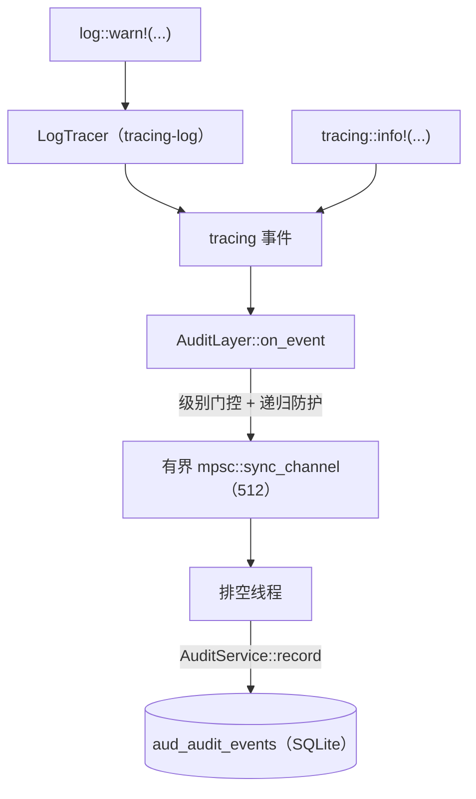

# DBFlux 审计系统

DBFlux 将所有重要操作记录到存储在 SQLite 中的统一审计追踪里。其覆盖范围包括查询执行、连接生命周期、Hook 执行、脚本运行、MCP 治理决策与配置变更。

## 存储位置

所有审计事件都存放在统一的数据库中：

```
~/.local/share/dbflux/dbflux.db
```

数据表：`aud_audit_events`

同一个数据库还存放其他全部运行时状态（配置文件、历史记录、会话）。表结构由 `dbflux_storage/src/migrations/` 中的迁移系统管理。

## 事件结构

每条审计事件都是一个 `EventRecord`（`dbflux_core/src/observability/types.rs`），包含以下字段：

| 字段 | 类型 | 说明 |
|-------|------|-------------|
| `id` | `i64` | 插入时自动分配 |
| `ts_ms` | `i64` | Unix 时间戳，单位为毫秒 |
| `level` | `EventSeverity` | `trace`、`debug`、`info`、`warn`、`error`、`fatal` |
| `category` | `EventCategory` | 事件所属领域（见下文） |
| `action` | `String` | 具体的操作标识符（如 `query_execute`） |
| `outcome` | `EventOutcome` | `success`、`failure`、`cancelled`、`pending` |
| `actor_type` | `EventActorType` | 事件的触发者类型 |
| `actor_id` | `Option<String>` | 执行者的标识（MCP 客户端 ID、Hook 名称等） |
| `source_id` | `EventSourceId` | 事件的产生位置 |
| `connection_id` | `Option<String>` | 连接配置文件 ID |
| `database_name` | `Option<String>` | 目标数据库名称 |
| `driver_id` | `Option<String>` | 驱动 ID（如 `postgres`、`mongodb`） |
| `object_type` | `Option<String>` | 受影响对象的类型（如 `table`、`collection`） |
| `object_id` | `Option<String>` | 具体对象的 ID 或名称 |
| `summary` | `String` | 供人工阅读的事件摘要 |
| `details_json` | `Option<String>` | 以 JSON 对象形式附加的结构化上下文 |
| `error_code` | `Option<String>` | 失败时的错误码 |
| `error_message` | `Option<String>` | 失败时的错误信息 |
| `duration_ms` | `Option<i64>` | 执行耗时，单位为毫秒 |
| `session_id` | `Option<String>` | 会话关联 ID |
| `correlation_id` | `Option<String>` | 跨组件关联 ID |

### 事件类别

| 类别 | 字符串 | 记录内容 |
|----------|--------|-----------------|
| `Query` | `query` | SQL 执行、MongoDB 查询、扫描操作 |
| `Connection` | `connection` | 连接、断开、重连的生命周期 |
| `Hook` | `hook` | `PreConnect`、`PostConnect`、`PreDisconnect`、`PostDisconnect` |
| `Script` | `script` | Lua、Python、Bash 脚本执行 |
| `Mcp` | `mcp` | AI 客户端的工具调用与策略判定 |
| `Governance` | `governance` | 策略求值结果 |
| `Config` | `config` | 配置文件变更、设置修改 |
| `System` | `system` | 应用启动、panic、迁移 |
| `ObjectStorage` | `object_storage` | 对象存储的增删改与变更事件（上传、删除、预签名、重命名、创建桶 / 文件夹、回写编辑） |

### 执行者类型

| 类型 | 字符串 | 含义 |
|------|--------|---------|
| `User` | `user` | 操作 DBFlux 界面的用户 |
| `System` | `system` | 后台系统操作 |
| `App` | `app` | 应用自主执行的操作 |
| `McpClient` | `mcp_client` | 通过 MCP 协议接入的 AI 智能体 |
| `Hook` | `hook` | 生命周期 Hook 脚本 |
| `Script` | `script` | 用户编写的脚本 |

### 各分类的必填字段

校验由 `AuditService::validate_event()` 在写入前执行：

| 类别 | 除 `action` + `summary` 外必填的字段 |
|----------|--------------------------------------|
| `Query` | `connection_id`、`driver_id`、`duration_ms`（执行类事件） |
| `Connection` | `connection_id` |
| `Hook` | `object_type`、`object_id`、`connection_id` |
| `Script` | `object_type`、`object_id` |
| `Mcp` | `actor_id`、`object_id`（工具名称） |
| `Config` | `object_type`、`object_id` |
| `ObjectStorage` | `connection_id`、`object_type`、`object_id` |
| `Governance`、`System` | 无附加字段 |

## 隐私与脱敏

默认情况下，`AuditService` 按以下设置运行：

- **`redact_sensitive = true`**：`details_json` 与 `error_message` 中的敏感值（密码、令牌、连接字符串）在写入前会被替换为 `[REDACTED]`。
- **`capture_query_text = false`**：完整查询文本一律不存储。取而代之的是存储一个 SHA256 指纹加上原始长度，格式为 `[FINGERPRINT:<16-char-hex>]`，并附带 `query_length`。这样可以避免查询中的敏感数据泄漏到审计日志里。
- **`max_detail_bytes = 65536`**：超过 64 KiB 的载荷会被拒绝，以防存储膨胀。

这些设置可在运行时通过 `AuditService::set_*()` 方法修改。MCP 服务器会通过治理设置暴露其中的一部分。

## 查看审计事件

### 在 DBFlux 界面中

前往 **Workspace** → 审计。统一的审计视图支持：

- 按执行者、工具 / 操作、日期范围、判定结果、类别筛选
- 将筛选结果导出为 CSV 或 JSON

当驱动通过通用的核心抽象（`CollectionPresentation`、`CollectionChildInfo`、`EventStreamTarget`）声明外部事件流时，同一个 `AuditDocument` 界面骨架也会被复用于展示这些事件流。界面不得针对具体驱动做特例处理来打开或渲染这些流。

### 直接通过 SQLite 查询

该数据库就是一个标准的 SQLite 文件，可直接查询：

```bash
sqlite3 ~/.local/share/dbflux/dbflux.db
```

常用查询：

```sql
-- 最近 24 小时的全部事件
SELECT id, datetime(ts_ms/1000, 'unixepoch') as ts, level, category, action, outcome, actor_id, summary
FROM aud_audit_events
WHERE ts_ms > (unixepoch('now') - 86400) * 1000
ORDER BY ts_ms DESC;

-- 仅 MCP 工具调用
SELECT id, datetime(ts_ms/1000, 'unixepoch') as ts, actor_id, object_id as tool, outcome, summary
FROM aud_audit_events
WHERE category = 'mcp'
ORDER BY ts_ms DESC;

-- 全部失败的操作
SELECT id, datetime(ts_ms/1000, 'unixepoch') as ts, category, action, actor_id, error_message
FROM aud_audit_events
WHERE outcome = 'failure'
ORDER BY ts_ms DESC
LIMIT 50;

-- 按连接查询事件
SELECT id, datetime(ts_ms/1000, 'unixepoch') as ts, action, driver_id, duration_ms, summary
FROM aud_audit_events
WHERE category = 'query' AND connection_id = 'your-connection-id'
ORDER BY ts_ms DESC;

-- 按类别与结果分组统计
SELECT category, outcome, count(*) as count
FROM aud_audit_events
GROUP BY category, outcome
ORDER BY category, outcome;
```

### 通过 MCP 工具（AI 客户端）

MCP 工具面提供三个审计工具（归类为 `read` 执行类别）：

```
query_audit_logs    — 按执行者、工具、日期范围、判定结果筛选事件
get_audit_entry     — 按 ID 检索单条事件
export_audit_logs   — 将筛选结果导出为 CSV 或 JSON
```

### 通过 Rust API

```rust
use dbflux_audit::{AuditService, AuditQueryFilter, AuditExportFormat};

let service = AuditService::new_sqlite_default()?;

// Query recent events
let filter = AuditQueryFilter {
    category: Some("mcp".to_string()),
    start_epoch_ms: Some(start_ms),
    limit: Some(100),
    ..Default::default()
};
let events = service.query(&filter)?;

// Export to CSV
let csv = service.export(&filter, AuditExportFormat::Csv)?;

// Export extended (all fields including details_json)
let json = service.export_extended(&filter, AuditExportFormat::Json)?;
```

## 生成审计事件

### 来自服务层

使用 `EventSink` trait。所有发出审计事件的组件都接受一个 `Arc<dyn EventSink>`：

```rust
use dbflux_core::observability::{
    EventOrigin, EventRecord, EventSink,
    types::{EventCategory, EventSeverity, EventOutcome},
    actions,
};

// Build the event
let event = EventRecord::new(
    now_epoch_ms(),
    EventSeverity::Info,
    EventCategory::Query,
    EventOutcome::Success,
)
.with_typed_action(actions::QUERY_EXECUTE)
.with_summary("SELECT executed on users table")
.with_actor_id("my-actor-id")
.with_origin(EventOrigin::local())
.with_connection_context("my-profile-id", "mydb", "postgres")
.with_object_ref("table", "users")
.with_duration_ms(42);

// Emit through the sink (injected via constructor or DI)
event_sink.record(event)?;
```

### 规范的操作常量

操作字符串定义在 `dbflux_core/src/observability/actions.rs` 中。请使用常量，不要直接写字符串：

| 常量 | 字符串 | 类别 |
|----------|--------|----------|
| `QUERY_EXECUTE` | `query_execute` | 查询 |
| `QUERY_EXECUTE_FAILED` | `query_execute_failed` | 查询 |
| `CONNECTION_CONNECT` | `connection_connect` | 连接 |
| `CONNECTION_DISCONNECT` | `connection_disconnect` | 连接 |
| `HOOK_EXECUTE` | `hook_execute` | Hook |
| `HOOK_EXECUTE_FAILED` | `hook_execute_failed` | Hook |
| `SCRIPT_EXECUTE` | `script_execute` | 脚本 |
| `SCRIPT_EXECUTE_FAILED` | `script_execute_failed` | 脚本 |
| `MCP_AUTHORIZE` | `mcp_authorize` | MCP |
| `MCP_APPROVE_EXECUTION` | `mcp_approve_execution` | MCP |
| `MCP_REJECT_EXECUTION` | `mcp_reject_execution` | MCP |
| `MCP_TOOL_EXECUTE` | `mcp_tool_execute` | MCP |
| `MCP_TOOL_EXECUTE_FAILED` | `mcp_tool_execute_failed` | MCP |
| `SYSTEM_PANIC` | `system_panic` | 系统 |

### 必填字段清单

在调用 `record()` 之前，请确认：

1. 已设置 `action` 且非空（使用 `actions` 中的常量）
2. 已设置 `summary` 且非空（供人工阅读，一句话）
3. 已填入类别特有字段（见上表）
4. 若提供 `details_json`，其必须是合法的 JSON 对象——不能是数组或基本类型
5. `details_json` 小于 64 KiB

### 失败事件

对于失败事件，将结果设为 `EventOutcome::Failure`，并填入 `error_code` 与 `error_message`：

```rust
let event = EventRecord::new(ts_ms, EventSeverity::Error, EventCategory::Query, EventOutcome::Failure)
    .with_typed_action(actions::QUERY_EXECUTE_FAILED)
    .with_summary("Query failed: syntax error")
    .with_connection("profile-id", Some("mydb"), Some("postgres"))
    .with_error("42601", "syntax error at or near \"SELEC\"");
```

`error_message` 若包含敏感模式会被脱敏。请使用 `error_code` 承载稳定的、供程序读取的错误标识。

## 保留与清理

事件可按保留策略清理：

```rust
// Delete events older than 90 days, in batches of 500
let stats = service.purge_old_events(90, 500)?;
println!("Deleted {} events in {} batches", stats.deleted_count, stats.batches);
```

清理操作分批进行，以避免长时间写入事务。它不会自动运行——请将其加入定时后台任务或运维手册。

## 从 tracing 到审计的桥接

tracing 桥接会捕获所有 DBFlux crate 中由 `log::*!` 与 `tracing::*!` 宏发出的结构化事件，并写入同一张 `aud_audit_events` 表，无需改动调用点。

### 事件流转



### 桥接允许的类别

经桥接捕获的所有事件，其类别一律设为 `System`。这是 V1 阶段的取舍：自由格式的日志事件不携带其他类别所要求的结构化字段（`connection_id`、`object_type`、`object_id`），若路由到 `Connection` 或 `Config`，会导致 `validate_event` 将其拒绝。`dbflux_core/src/observability/tracing_bridge/category.rs` 中的 `PREFIX_CATEGORY_MAP` 会把模块前缀映射到预期类别，仅供文档说明之用；运行时解析出的类别一律强制归为 `System`。

### 捕获阈值

只有级别不低于所配置的 `log_capture_min_level` 的事件才会写入审计存储。`TRACE` 与 `DEBUG` 是硬性过滤项——无论阈值如何配置，都不会写入。

阈值以 `u8` 序号形式存放在 `Arc<AtomicU8>` 中，更新时无需重新初始化订阅者。映射关系如下：

| 严重级别 | 序号 |
|----------|---------|
| Trace    | 0       |
| Debug    | 1       |
| Info     | 2       |
| Warn     | 3       |
| Error    | 4       |

默认阈值为 `Info`（序号 2）。

### 设置阈值

在 DBFlux 界面中：**设置 → 审计 → 日志捕获 → 最低日志级别** 下拉框。选择级别并保存后，该值会持久化到 `cfg_audit_settings.log_capture_min_level`（该列由迁移 014 添加），并以原子方式应用于桥接——无需重启。

直接在 SQLite 中设置：

```sql
UPDATE cfg_audit_settings SET log_capture_min_level = 'warn';
```

有效取值：`trace`、`debug`、`info`、`warn`、`error`。

### 丢弃计数器

当有界通道已满（默认 512 条事件，可通过 `BridgeConfig::queue_capacity` 配置）时，桥接会丢弃新到的事件而不是阻塞，并递增一个 `Arc<AtomicU64>` 丢弃计数器。这样可以避免审计路径给应用代码带来背压。当前丢弃数可通过 `BridgeHandle::drop_count()` 获取，并经 `AuditService::dropped_log_event_count()` 暴露用于可观测性，但在 V1 阶段不会持久化，也不会在界面中展示。

### 启动窗口期

从进程启动到 Sink 安装完成之间存在一个短暂的窗口：此期间事件会被捕获到排空通道中，但尚未刷入 SQLite——Sink 是在 `AppState` 构造完成且首次读取审计设置之后才安装的。该窗口内处于在途状态的事件会保留在有界通道中，待 Sink 安装后再投递。若通道在启动窗口期内被填满，事件会被丢弃并计入计数。

### 递归防护

`dbflux_core::observability::tracing_bridge` 自身发出的事件被排除在桥接之外，以防止桥接自身的诊断信息回流形成反馈循环。该限制由 `AuditLayer::on_event` 中检查的 `BRIDGE_INTERNAL_TARGET` 常量强制执行。

### 目标白名单

只有 `target` 以 `dbflux` 开头的事件才会镜像到审计存储。`gpui`、`blade_graphics`、`naga`、`wgpu`、`hyper`、`tokio` 等上游依赖会大量输出 `INFO` 级别的跟踪信息（渲染循环的纹理与缓冲区生命周期、surface 呈现模式、HTTP 请求生命周期等），若不加以过滤，这些运维噪音会淹没审计日志，而对事后排查毫无价值。

这些事件仍会经过 fmt 层，并按 `RUST_LOG` 的设置在 stderr（或日志文件）中保持可见。该门控位于 `layer.rs` 的 `passes_target_gate` 中，在构造记录之前执行。

若要审计来自非 `dbflux` 来源的事件，请将该次输出包装到 dbflux 模块中，并以 dbflux 目标重新发出——桥接有意不放行上游目标。

### 具名跟踪字段

桥接会识别跟踪事件上的以下具名字段，并将其映射到 `EventRecord` 的对应字段：

| 跟踪字段 | `EventRecord` 字段 |
|---------------|---------------------|
| `message` | `summary` |
| `category` | `category`（强制归为 `System`） |

`actor_type`、`actor_id`、`connection_id`、`database_name`、`driver_id`、`action`、`outcome` 与 `details_json` 这些字段同样会被识别，并映射到 `EventRecord` 中的同名字段。

未识别的字段会以 JSON 对象的形式累积到 `details_json` 中。若消息超过 512 个字符，会用 `…` 截断，完整消息存放在 `details_json["message"]` 里。

桥接还会把 `correlation_id` 直接映射到 `EventRecord.correlation_id`（而不是放进 `details_json`），从而实现面向用户的错误 toast 与其对应审计记录之间的跨组件关联。

### 面向用户的错误事件

面向用户的错误（存储失败、驱动错误、网络问题、配置持久化失败）通过 `dbflux_ui_base::user_error` 的 `report_error` / `report_error_async` 上报。每次调用都会发出一个流经桥接的跟踪事件，同时推送一条 toast 通知。

跟踪事件的结构：

| 跟踪字段 | 取值 |
|---------------|-------|
| `target` | `dbflux_ui::user_error` |
| `action` | `user_error` |
| `outcome` | `failure` |
| `kind` | `ErrorKind` 的字符串形式（`storage`、`network`、`auth`、`hook`、`driver`、`user`、`config`） |
| `correlation_id` | UUID v7，用于将 toast 与审计记录关联起来 |
| `message` | toast 中显示的可读摘要 |

`correlation_id` 字段由 `AuditFieldVisitor` 提取到 `EventRecord.correlation_id` 中。注意：该访问器把 `record_str`（Display 标记符 `%val`）与 `record_debug`（Debug 标记符 `?val`）都交由同一个 `record_string_by_name` 分发器处理，因此将来新增的类型化槽位无论调用方使用哪种标记符都能被识别。

从界面回到审计文档有两条路径：

- **每条 toast 上的「在审计中查看」操作** — 发出 `OpenAuditRequested(Some(correlation_id))`。工作区会打开（或聚焦）审计文档，并应用匹配的关联筛选，使用户看到的正是与该 toast 绑定的那一条事件。
- **点击状态栏错误徽标** — 发出 `OpenAuditRequested(None)`。工作区会打开审计文档，并应用默认的用户错误筛选（在最近时间窗口内 `target = dbflux_ui::user_error`），便于用户浏览近期所有面向用户的失败。

两个事件都经由 `AppStateEntity::request_open_audit` 流转，因此工作区只需订阅一次。

从 `EventSeverity` 到日志级别的映射：

- `EventSeverity::Info` 与 `EventSeverity::Warn` — 以 `WARN` 级别发出；会做限流（5 令牌桶，每 2 秒补充 1 个，按级别分别计算）
- `EventSeverity::Error` 与 `EventSeverity::Fatal` — 以 `ERROR` 级别发出；不限流

### 启用桥接

桥接通过在编译 `dbflux_core` 时启用 `tracing-bridge` 特性来开启（`dbflux`、`dbflux_mcp_server` 默认开启）。在进程启动时调用一次 `init_tracing(BridgeConfig { .. })`：

```rust
use dbflux_core::observability::tracing_bridge::{init_tracing, BridgeConfig, FmtWriter};

let handle = init_tracing(BridgeConfig {
    include_audit_layer: true,
    fmt_writer: FmtWriter::Stderr,
    env_filter_default: "info",
    ..BridgeConfig::default()
})?;

// Later, after AuditService is ready:
handle.install_sink(Arc::new(audit_service));
```

`dbflux_driver_host` 使用 `include_audit_layer: false`，因为驱动宿主进程是临时性的，且无法访问审计用的 SQLite 数据库。

### 关键文件

| 文件 | 职责 |
|------|------|
| `crates/dbflux_core/src/observability/tracing_bridge/mod.rs` | `init_tracing`、`BridgeHandle`、`BridgeConfig`、`LevelCode` |
| `crates/dbflux_core/src/observability/tracing_bridge/layer.rs` | `AuditLayer`、`AuditFieldVisitor`、级别门控 |
| `crates/dbflux_core/src/observability/tracing_bridge/category.rs` | `PREFIX_CATEGORY_MAP`、`resolve_category`、`BRIDGE_INTERNAL_TARGET` |
| `crates/dbflux_storage/src/migrations/mod_014_audit_settings_log_capture_min_level.rs` | 为 `cfg_audit_settings` 添加 `log_capture_min_level` 列 |

## 外部审计事件上报（RPC 驱动与认证提供程序）

外部 RPC 驱动（协议 v1.2+）与认证提供程序（协议 v1.3+）可将审计事件作为中间响应帧回传给宿主应用。宿主应用在写入 `aud_audit_events` 之前会执行严格的净化处理。

### 宿主主导的策略

宿主应用掌握全部身份、关联与限流字段。外部服务永远无法伪造自身身份，也无法声明其无权使用的审计类别。

| 字段 | 来源 |
|-------|--------|
| `actor_type` | 始终为 `ExternalDriver` 或 `ExternalAuthProvider` |
| `source_id` | 始终为 `ExternalDriver` / `ExternalAuthProvider` 加上已注册的 `socket_id` |
| `actor_id` | 始终为 `rpc:<socket_id>` |
| `connection_id` | 由宿主应用依据会话上下文提供（可能为 `None`） |
| `database_name` | 由宿主应用依据会话上下文提供（可能为 `None`） |
| `driver_id` | 始终为 `rpc:<socket_id>` |
| `correlation_id` | 由宿主应用生成；驱动为每个会话一个，认证提供程序为每个请求一个 |
| `ts_ms` | 由服务提供，但若与宿主挂钟时间的偏差超过 5 分钟则会被钳制 |

`correlation_id` 在结构上就保证了由宿主应用生成，因为 `AuditEventEmitDto`（IPC 载荷类型）根本没有 `correlation_id` 字段。外部服务无法提供该值——这个字段在设计时（ADR-3）就被有意从 DTO 中省略，而不是先接收再校验丢弃。因此，「驱动 DTO 携带伪造的 correlation_id、宿主在运行时覆盖它」这种情形在类型层面就不可能发生；存入的值始终由宿主的关联 ID 分配逻辑产生。

### 类别白名单

驱动可上报 `Connection`、`Query` 与 `System` 事件。认证提供程序只能上报 `Connection` 事件。任何携带未授权类别的帧都会被静默丢弃。

### 限流

每个外部服务（按 `socket_id` 计）通过令牌桶限制为每 60 秒 100 个事件。超出配额的帧会被丢弃，并计入 `AuditService::external_audit_dropped_count()`。

### 启用开关

- **驱动**：驱动必须在其 hello 响应中包含 `DriverCapability::AuditEmit`（协议 v1.2+）。未声明该能力的驱动所发送的帧会被静默丢弃。
- **认证提供程序**：提供程序必须在其 hello 响应中设置 `audit_emit_opt_in: true`（协议 v1.3+）。未选择启用的提供程序所发送的帧会被静默丢弃。

### 每个上报帧的必填字段

发出的 `AuditEventEmitDto` 必须带有非空的 `action` 与 `summary`。未通过此检查的帧会被静默丢弃。

### 传输机制

上报的帧以 `done=false` 的中间帧形式，夹在正常的响应序列中到达。传输层（`dbflux_driver_ipc` 中的 `RpcClient`、`dbflux_ipc` 中的 `RpcAuthProvider::dispatch_request_loop`）会在它们到达调用方之前将其拦截。调用方只会看到最终帧。

### 关键文件

| 文件 | 职责 |
|------|------|
| `crates/dbflux_ipc/src/audit.rs` | `AuditEventEmitDto`、`ExternalAuditEmitter` trait、`ExternalAuditSource` |
| `crates/dbflux_app/src/rpc_services/external_audit.rs` | `ExternalAuditSink`、令牌桶限流器、净化流水线 |
| `crates/dbflux_driver_ipc/src/transport.rs` | `RpcClient::send_raw` 拦截驱动的上报帧 |
| `crates/dbflux_ipc/src/auth_provider_client.rs` | `dispatch_request_loop` 拦截认证提供程序的上报帧 |

## 架构

```
[服务层]
  |  通过 EventSink trait 发出 EventRecord
  v
AuditService              (dbflux_audit/src/lib.rs)
  |  校验 → 生成查询文本指纹 → 脱敏敏感值 → 强制大小限制
  v
SqliteAuditStore          (dbflux_audit/src/store/sqlite.rs)
  |  委托给 AuditRepository
  v
AuditRepository           (dbflux_storage/src/repositories/audit.rs)
  |  插入 aud_audit_events
  v
~/.local/share/dbflux/dbflux.db
```

关键文件：

| 文件 | 职责 |
|------|------|
| `crates/dbflux_core/src/observability/types.rs` | `EventRecord` 及全部枚举类型 |
| `crates/dbflux_core/src/observability/actions.rs` | 规范的操作字符串常量 |
| `crates/dbflux_audit/src/lib.rs` | `AuditService` — 校验、预处理、记录 |
| `crates/dbflux_audit/src/query.rs` | `AuditQueryFilter` |
| `crates/dbflux_audit/src/export.rs` | CSV / JSON 导出（基础版与扩展版） |
| `crates/dbflux_audit/src/redaction.rs` | 敏感值脱敏逻辑 |
| `crates/dbflux_audit/src/purge.rs` | 基于保留策略的事件清理 |
| `crates/dbflux_audit/src/store/sqlite.rs` | SQLite 存储适配器 |
| `crates/dbflux_storage/src/repositories/audit.rs` | `AuditRepository` + `AuditEventDto` |
