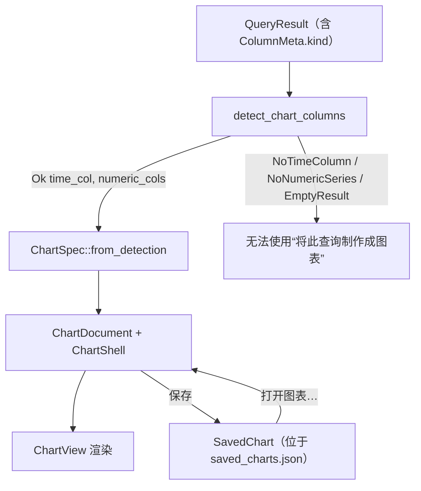

# DBFlux 图表

DBFlux 可以将查询结果转换为图表。图表引擎完全不依赖特定驱动程序：它只检查每个驱动程序都会填充的结构化列元数据，而不会查看驱动程序标识符或数据库特定的类型名字符串。本文档介绍受支持的图表类型、引擎如何自动检测坐标轴、图表如何持久化存储，以及如何从界面创建图表。

关于仪表盘（由共享时间范围的已保存图表组成的网格）、可视化存储表（`viz_*`），以及用于导入/浏览上游仪表盘的驱动程序接缝，请参阅 [`DASHBOARDS.md`](./DASHBOARDS.md)。

## 概述

图表引擎位于 `dbflux_components` crate 的 `crates/dbflux_components/src/chart/` 目录下。其 `mod.rs` 描述了完整的处理流程：

1. `detect` —— 仅依据 `ColumnKind` 的语义，从 `QueryResult` 中自动检测合适的列。
2. `spec` —— 图表与序列的规格类型，以及基于检测结果或手动选择列的构造函数。
3. `decimate` —— LTTB（Largest-Triangle-Three-Buckets）降采样，以在大数据集上保持绘制流畅。
4. `axis` —— 数值轴与时间轴的刻度生成与标签格式化。
5. `legend` —— 图例行中的元素工厂。
6. `engine` —— `ChartView`，即持有图表状态并负责绘制画布的 GPUI 实体。

独立的图表文档界面位于 `crates/dbflux_ui_document/src/chart_document/`（`mod.rs`、`render.rs`、`pane.rs`）。一个 `ChartDocument` 持有一个查询、一个连接、一份图表规格，以及一个 `ChartShell`，并通过 `crates/dbflux_components/src/result_panel/` 中的共享 `ResultPanel` 框架完成其渲染。

## 图表类型

图表类型由 `crates/dbflux_components/src/chart/spec.rs` 中的 `ChartKind` 枚举定义：

| 变体 | 说明 |
| --- | --- |
| `Line` | 折线图。默认类型（`#[default]`）；也是每个 `ChartSpec` 构造函数所选择的类型。 |
| `Bar` | 柱状图。 |
| `Scatter` | 散点图。 |
| `Area` | 填充式折线图；系列线与基线之间的区域会被填充阴影。其几何形状与悬停行为和折线图相同。 |
| `StackedBar` | 堆叠柱状图。每个 X 位置为每个系列显示一根柱子，按累加方式堆叠，而非并排分组。Y 轴在渲染时按最大堆叠总和重新缩放。 |
| `Pie` | 饼图。没有 X/Y 轴；每个可见系列成为一块扇形，其大小由该系列 Y 值之和决定。 |

`ChartKind` 在所属 `ChartSpec.kind` 字段上带有 `#[serde(default)]` 语义，因此早于 `kind` 字段出现的序列化图表规格在反序列化时会回退为 `Line`。

## ColumnKind 与坐标轴自动检测

### ColumnKind

自动检测完全由 `crates/dbflux_core/src/query/types.rs` 中定义的 `ColumnKind` 枚举驱动：

| 变体 | 含义 |
| --- | --- |
| `Timestamp` | 日期/时间或时间戳列。 |
| `Float` | 浮点数值列。 |
| `Integer` | 整数数值列。 |
| `Text` | 文本/字符串列。 |
| `Unknown` | 驱动程序无法对该列进行分类。 |

每个驱动程序负责为其返回的每一列设置 `ColumnMeta::kind`（参见 `CLAUDE.md` 中的“新增驱动程序”规则）。保留为 `Unknown` 的列永远不会被用作图表的坐标轴或序列。

### 自动检测规则

`crates/dbflux_components/src/chart/detect.rs` 中的 `detect_chart_columns` 会按以下顺序对 `QueryResult` 应用这些规则：

1. 如果结果包含零行，返回 `EmptyResult`。
2. 选取最左侧 `kind == Timestamp` 的列作为 X 轴。若不存在这样的列，返回 `NoTimeColumn`。
3. 按列顺序收集所有其他 `kind == Float` 或 `kind == Integer` 的列，作为数值型 Y 序列。若没有剩余列，返回 `NoNumericSeries`。
4. 否则返回 `Ok { time_col, numeric_cols }`。

上述结果的类型为 `ChartDetection` 枚举，其变体包括 `Ok`、`NoTimeColumn`、`NoNumericSeries` 和 `EmptyResult`。

### 为何从不检查 `type_name` 与驱动程序标识符

`detect.rs` 的模块级文档说明，检测模块是查询结果模型与图表引擎之间的边界，它检查的是 `ColumnKind` 值——而非 `type_name` 字符串或驱动程序标识符。`detect_chart_columns` 函数只读取 `column.kind`；它从不读取 `column.type_name`、`column.name` 或任何驱动程序 ID。这让引擎与具体驱动程序完全解耦，符合 `CLAUDE.md` 中“驱动程序/界面解耦”的规则：驱动程序只需用正确的 `ColumnKind` 对列进行分类，就能使其可用于绘制图表。

由于 `Unknown` 既非 `Timestamp`，也非 `Float`/`Integer`，未分类的列既不能成为自动检测出的 X 轴，也不能成为自动检测出的序列。这是有意为之：它迫使驱动程序对列进行分类，而不是让引擎从类型字符串中猜测。

### 坐标轴类型推断

构建 `ChartSpec` 时，X 轴的类型由 X 列的 `ColumnKind` 推断得出：`Timestamp` 映射为 `AxisKind::Time`（刻度格式化为日期/时间），其他情况映射为 `AxisKind::Numeric`（十进制刻度）。`AxisSpec.unit` 字段目前始终为 `None`；它是为将来由驱动程序提供的单位元数据预留的向前兼容接缝。

### 数值提取

当引擎从单元格中提取数值时（`engine.rs` 中的 `extract_f64`），它会处理多种 `Value` 形态：

- `Value::Int` → 转换为 `f64`。
- `Value::Float` → 在有限时直接使用；非有限值会被丢弃。
- `Value::Decimal`（以字符串形式存储以保留精度）→ 有损解析为 `f64`，丢弃非有限或无法解析的值。将 `NUMERIC`/`DECIMAL` 列归类为 `ColumnKind::Float` 的驱动程序（例如 PostgreSQL 的 `NUMERIC`、MSSQL 的 `DECIMAL`）会走这条路径。
- `Value::Bool` → `true` 映射为 `1.0`，`false` 映射为 `0.0`，因此某些驱动程序归类为 `Integer` 的 `BIT`/`BOOLEAN` 列（例如 MSSQL 的 `BIT`）仍可绘制。
- `Value::Text` 仅在时间轴上作为 RFC 3339 时间戳进行解析。
- `Value::Null` 以及所有其他形态不产生数值。

## 已保存的图表

一个已持久化的图表是一条 `SavedChart` 记录，定义于 `crates/dbflux_components/src/saved_chart.rs`。已保存的图表通过 `SavedChartsRepository` 存储在统一的 SQLite 数据库中——即 `viz_saved_charts` 表及其相关的 `viz_saved_chart_*` 表——并由 `SavedChartManager`（`crates/dbflux_ui_base/src/saved_chart_manager.rs`）管理内存缓存。写入操作先写入存储库；缓存仅在成功后更新。

`SavedChart` 持久化以下字段：

- `id`、`name`、`profile_id` —— 标识、显示名称，以及所属的「连接配置」。
- `source` —— 一个 `SavedChartSource`，可以是 `Query { query }`（在 `ChartDocument` 中执行的查询字符串），或 `Collection { collection_ref, time_window }`（集合浏览来源）。
- `chart_spec` 与 `bindings` —— 完整的渲染配置（`ChartSpec` 与 `BindingSpec`）。
- `time_range_preset`、`refresh_policy`、`created_at`、`updated_at`。

仅持久化查询字符串（或集合引用）；原始结果数据从不存储。

### 打开已保存的图表

`Workspace::open_saved_chart`（位于 `crates/dbflux_ui/src/ui/views/workspace/actions.rs`）按来源类型分流：

- `Query` 来源通过 `ChartDocument::from_saved` 打开一个独立的 `ChartDocument`。`from_saved` 与 `validate_saved_source` 会拒绝 `Collection` 来源；工作区会在分配实体前先对来源进行校验。
- `Collection` 来源不会打开 `ChartDocument`；它们会通过 `open_collection_document` 以图表模式重新打开底层的 `DataDocument`。

### 去重

已打开的图表文档通过 `crates/dbflux_ui_document/src/dedup.rs` 中的 `DocumentKey::Chart { saved_chart_id: Uuid }` 变体进行去重。在打开已保存的图表前，`open_saved_chart` 会调用 `tab_manager.find_by_key(&DocumentKey::Chart { ... })`，并激活已有的标签页，而不是打开重复的标签页。通过临时性的“将此查询制作成图表”操作创建的图表文档尚未关联到已保存的 ID，因此在保存之前不会被去重。

## 在界面中创建图表

有两个入口。

### 将此查询制作成图表

数据网格的上下文菜单提供“将此查询制作成图表”项。该项由 `crates/dbflux_ui_document/src/data_grid_panel/context_menu.rs` 中的 `can_chart_from_context_menu` 控制，需要同时满足：

1. 面板的来源是一个带有非空原始查询的 `QueryResult`；且
2. 对当前结果调用 `detect_chart_columns` 返回 `Ok`。

选择该项会调用 `Workspace::open_chart_from_query`，它构造一个以查询和连接为种子的 `ChartDocument::new`，通过 `ChartDocument::into_pane` 将其包装为 `PaneHandle`，并以新标签页形式打开。非空查询会使文档在首次渲染时自动执行。

### 打开图表…

“打开图表…”命令会列出当前连接配置的已保存图表（由 `build_saved_chart_palette_items` 构建），并通过上文所述的 `open_saved_chart` 打开所选图表。

### 保存

在 `ChartDocument` 内部，工具栏上的“保存图表”按钮会打开名称提示，然后调用 `confirm_save`；该函数根据最后一次结果构建 `ChartSpec`（检测成功时使用 `detect_chart_columns` / `ChartSpec::from_detection`），并将 `SavedChart` 以 upsert 方式写入应用状态的 `saved_charts` 管理器。保存时若已存在 `saved_chart_id` 则会复用，因此记录会被覆盖而非重复创建。

## 限制

以下限制基于当前代码，而非假设：

- 自动检测至少需要一个 `Timestamp` 列才能选出 X 轴；若没有，`detect_chart_columns` 会返回 `NoTimeColumn`，且“将此查询制作成图表”不可用。（通过 `BindingSpec` / `ChartSpec::from_bindings` 的手动选择可以使用非时间戳的 X 列，此时该列被归类为 `AxisKind::Numeric` 轴。）
- 带有 `ColumnKind::Unknown` 的列完全被排除在自动检测之外。
- 来源为 `Collection` 的已保存图表无法作为 `ChartDocument` 打开；它们会改为以图表模式重新打开底层的 `DataDocument`。将 `Collection` 来源传给 `ChartDocument::from_saved` 会返回错误。
- 在本版本中 `AxisSpec.unit` 始终为 `None`；驱动程序尚未提供单位元数据。
- 每个 `ChartSpec` 构造函数（`from_detection`、`from_bindings`、`from_manual_selection`）生成的规格均为 `kind = ChartKind::Line`；其他图表类型在构造之后选择。
- 序列降采样使用的 LTTB 阈值，其默认值为 10,000 个点（`default_decimation_threshold`）。
