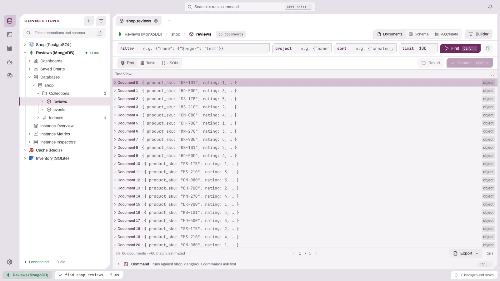
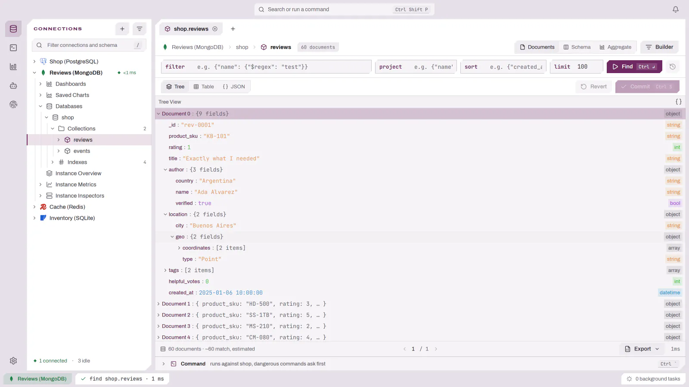

# 文档集合

文档数据库中的集合以树形式打开，每个文档是一个可折叠的节点。**表格**和 **JSON** 显示同一页数据；可用“树 / 表格 / JSON”切换控件或按 `t` 切换。你选择的视图在该标签页中翻页和刷新后保持不变。表格先显示 `_id`，其余字段按页面返回的顺序排列。

<picture>
  <source media="(prefers-color-scheme: dark)" srcset="../images/documents/collection-dark.webp">
  
</picture>

- 嵌套对象显示其字段数，数组显示其长度。在对象列上按 `e` 会就地展开为列组；在对象或数组上按 `Enter` 会进入其中，并以行列出内容，同时显示路径；按 `Backspace` 返回上一级。

<picture>
  <source media="(prefers-color-scheme: dark)" srcset="../images/documents/tree-view-dark.webp">
  
</picture>

- 页脚统计文档数。当驱动只能估计匹配的文档数时，该数量会标注为估计值。
- 支持该功能的驱动（MongoDB）会提供一个包含 `filter`、`project`、`sort` 和 `limit` 四个栏位的查询栏，每个栏位接受宽松 JSON，并根据集合样本补全字段路径。按 `Ctrl+Enter` 或点击 **查找** 运行查询；历史按钮可再次运行之前的查询。
- 位于“文档”旁边的 **结构** 视图会对集合抽样，并列出每个字段路径的类型分布、出现率和值摘要。样本大小可以调整，包含多种类型的字段会被标记，点击某个值会将其加入筛选。结构视图只显示抽样控件和字段表，不显示查询栏、文档页脚以及标题中的文档数。
- 支持运行聚合管道的驱动（MongoDB）会在“结构”之后提供 **聚合** 视图。将管道写成由阶段组成的 JSON 数组，允许宽松键名（`[{ $match: { status: 'paid' } }, { $group: { _id: '$region' } }]`），然后点击 **运行** 或按 `Ctrl+Enter` 运行。无法解析的管道，或某个阶段不是只指定一个 `$` 运算符的文档，会在编辑器下方报告，并且不会运行。结果文档显示在各自独立的树、表格和 JSON 视图中（默认打开树视图），与“文档”页面分开，并且为只读：无法编辑、删除或提交。每次运行最多显示 1,000 个文档，结果被截断时页脚会注明。包含 `$out` 或 `$merge` 阶段的管道会写入集合，因此运行前会像其他危险查询一样要求确认。历史按钮可取回同一标签页中之前的管道。
- 支持该功能的驱动（MongoDB）会在集合标题栏中提供 **构建器** 按钮。它会在右侧栏中打开一个可视化查询构建器，该构建器与查询栏的栏位保持同步，可以用 `$count`、`$sum` 和 `$avg` 对文档分组，并按集合保存查询。构建器处于 Aggregate 模式时，查询栏和聚合视图显示其管道摘要，而不是栏位和管道编辑器，**运行管道** 会在聚合视图中运行该管道。在其他文档驱动上，该按钮处于禁用状态。参见查询构建器指南中的[文档集合](QUERY_BUILDER.md#文档集合)。
- 在表格上打开行检查器的快捷键或行操作，在集合上会打开 **文档** 面板：先显示文档大小，然后以 `键 : 值` 行组成的树显示其字段，值按类型着色，右侧显示简短类型（`oid`、`obj`、`str`、`arr`、`date`、`dec`、`bool` 等）。对象和数组单击即可展开或折叠；顶层字段默认展开。展开按钮会在 JSON 编辑器中打开该文档。面板会跟随所选行；带有已暂存但未提交编辑的字段会显示新值，并像已编辑的单元格一样高亮。
- 使用 MongoDB 时，表格中的编辑会先暂存：已编辑的单元格显示旧值和新值，单元格菜单提供 **撤销更改** 和 **移除字段**，**提交**（`Ctrl+S`）会针对每个文档仅对已修改路径写入 `$set` / `$unset`。JSON 视图会替换整个文档；树中的编辑会立即写入。写入前，DBFlux 会重新读取文档：如果页面加载后该文档已在服务器上被修改，会出现一张卡片说明你的更改能否叠加应用，显示确切的更新语句，并提供 **重新加载文档** 或 **应用我的更改**。
- 提供原生控制台的驱动（MongoDB）会把它停靠在集合下方：按 `` Ctrl+` `` 显示或隐藏。它一次运行一条 shell 命令，例如 `db.orders.find({"status": "paid"})`，针对集合所在的数据库执行，并把文档按每行一个 JSON 对象打印出来。写入数据的命令会刷新屏幕上的文档。参见[控制台](CONSOLE.md)。
