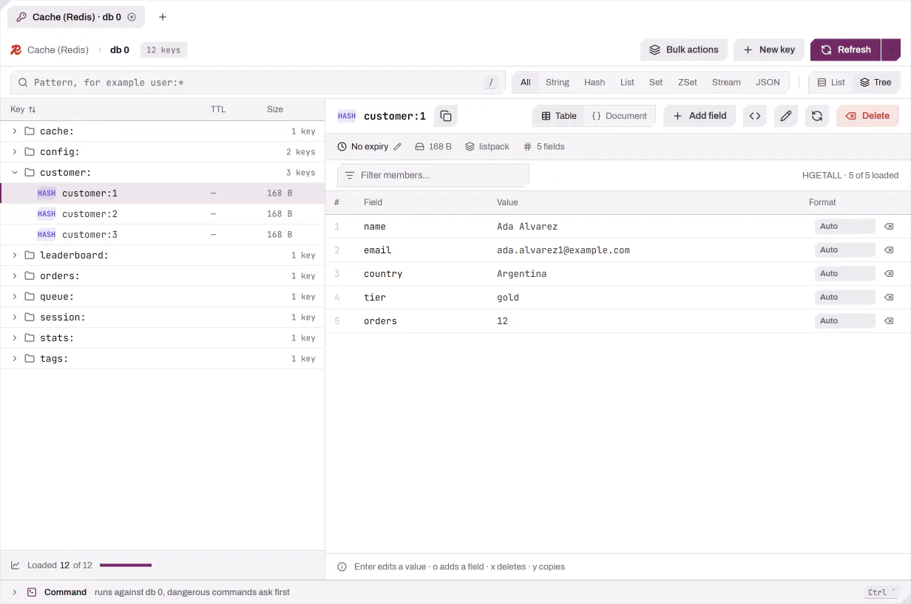
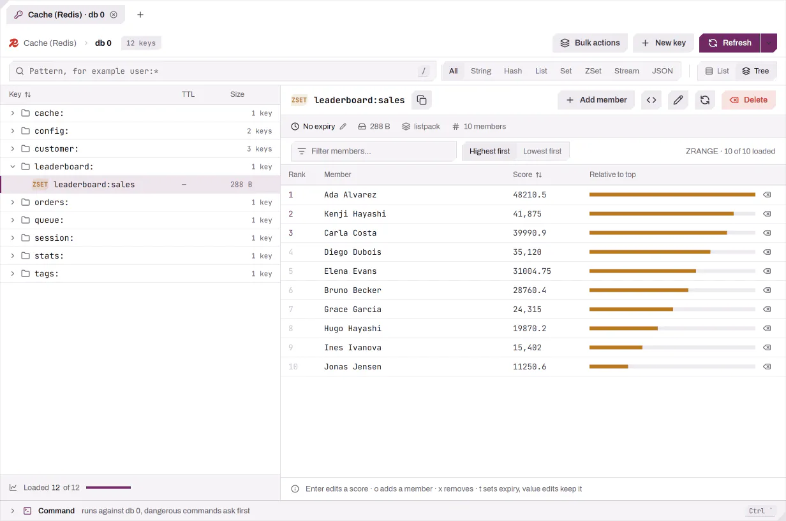

# 键值视图

键值数据库会以键浏览器的形式打开：左侧是键列表，右侧是所选键的值，下方是命令控制台。

<picture>
  <source media="(prefers-color-scheme: dark)" srcset="../images/key-value/browser-dark.webp">
  
</picture>

- **键列表。** 键按页加载；**加载更多**（`Ctrl+J`）继续扫描，底栏会对照数据库的键总数显示“已加载 N / 总数”。**树**按连接的命名空间分隔符（除非连接设置指定了其他分隔符，否则为 `:`）把键分组到文件夹中，并对每一层排序；**列表**按名称排序显示所有键。文件夹计数只涵盖已加载的键，在整个键空间扫描完成之前显示为“≥ N 个键”。TTL 与大小两列只为屏幕上可见的行填充，每个滚动位置一次批量请求；少于一分钟的 TTL 以红色显示。
- **模式与类型。** 模式字段接受通配符（`user:*`）；普通文本会匹配键中的任意位置。类型过滤（全部、String、Hash、List、Set、ZSet、Stream、JSON）在服务器端执行，因此覆盖整个键空间。过滤搜索会持续扫描，直到得到一页匹配项；**停止**结束搜索，**搜索整个键空间**会一直读取到末尾。
- **过期。** 点击值标题栏中的 TTL，或按 `t`，即可设置过期：**永不**、**之后**（一段时长，如 `1h`、`24h`、`7d`、`30d` 或任意 `1h30m` 形式的值）或**于**某个本地日期时间。应用之前会显示绝对的过期时间。编辑值会保留键的过期时间。
- **查看方式。** 字符串值可以显示为自动、JSON（格式化并带行号）、文本、MsgPack 或十六进制，并可先执行可选的解压步骤（gzip、zstd、snappy、lz4）。检测只针对你打开的值执行。超过预览上限的值会先显示其大小，并提供**预览前 64 KB**与**仍然加载**。
- **集合。** 哈希、列表与集合显示成员表，每个值带有格式标记。有序集合按排名分页，可按最高或最低优先，并显示相对于最高分的条形。流在起始与结束 ID 之间分页，可按最新或最早优先，每个字段一列，旁边显示消费组：读取者、待处理条目、最后投递的 ID，以及把待处理条目转给另一个读取者的**认领**。

<picture>
  <source media="(prefers-color-scheme: dark)" srcset="../images/key-value/sorted-set-dark.webp">
  
</picture>

- **批量删除。** **批量操作 → 删除匹配该模式的键**会按当前模式与类型扫描整个数据库，列出前几个匹配项及总数，并要求你重新输入该模式。**先导出键**会把键及其值保存到 JSON Lines 文件。键以 `UNLINK` 分批删除，删除操作会记录到审计日志中。
- **控制台。** `` Ctrl+` `` 打开一个控制台，对当前打开的数据库执行命令，并提供编辑器的危险命令确认、审计记录、通过 `Up`/`Down` 浏览的查询历史以及命令补全。参见[控制台](CONSOLE.md)。

在侧边栏中，键值连接的每个数据库都会显示其键数，没有键的数据库会折叠成一行“N 个空数据库”。
