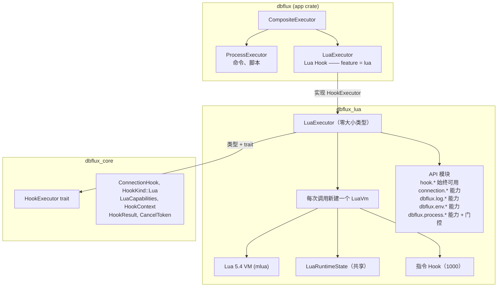

# 嵌入式 Lua 运行时

`dbflux_lua` crate 是 DBFlux 为连接 Hook 提供的 Lua 5.4 沙箱运行时。本文档介绍该 crate 的架构、暴露给 Hook 脚本的 Lua API、沙箱与超时模型，以及运行时如何接入应用。

---

## 这个 crate 的职责

借助 `dbflux_lua`，用户可以编写在连接生命周期事件（连接前、连接后、断开前、断开后）中执行的 Lua 脚本。这些 Hook 是通用的：它们可以驱动 SSO 登录流程、准备环境、记录审计日志，或在连接打开前后触发外部工具。

该 crate 只对外暴露一个公开类型：`LuaExecutor`。其余部分 —— VM 工厂、API 模块、共享状态 —— 全部是 crate 内部实现。从外部看，你调用 `executor.execute_hook(hook, context, cancel_token, parent_cancel_token, output, detached)`，并得到一个 `HookResult`。最后一个 `detached: Option<&DetachedProcessSender>` 参数，用于让执行器把长时间运行的分离进程交还给调用方。

---

## 架构概览



核心设计原则是：**每一次 Hook 执行都会创建一个全新的 Lua VM**。没有 VM 池化，运行之间也不会泄漏状态。这让沙箱天然安全 —— 即便脚本以某种方式破坏了 VM 状态，执行结束后也会被直接丢弃。

---

## 依赖

| 依赖 | 版本 | 用途 |
| --- | --- | --- |
| `mlua` | 0.10 | Lua 5.4 绑定。启用的 feature：`lua54`、`send`（使 `Lua` 满足 `Send`）、`vendored`（从源码编译 Lua） |
| `dbflux_core` | workspace | trait（`HookExecutor`）与类型（`ConnectionHook`、`HookContext` 等） |
| `log` | 0.4 | 供 Lua 回调在 Rust 侧输出日志 |

`vendored` feature 很关键 —— 它意味着无需在系统上安装 Lua。Lua 5.4 解释器由 C 源码编译并静态链接。这消除了一个部署依赖，但会让二进制体积增加约 200 KB。

---

## 沙箱

### 加载了什么

只有四个 Lua 标准库：

```rust
let stdlib = StdLib::TABLE | StdLib::STRING | StdLib::MATH | StdLib::UTF8;
let lua = Lua::new_with(stdlib, LuaOptions::default())?;
```

这让脚本可以调用：

- **table**：`table.insert`、`table.remove`、`table.sort`、`table.concat`、`table.pack`、`table.unpack`
- **string**：`string.format`、`string.find`、`string.gsub`、`string.sub`、`string.len`、`string.match`、`string.rep`，以及模式匹配
- **math**：`math.floor`、`math.ceil`、`math.random`、`math.sqrt`、`math.abs`、`math.max`、`math.min`、`math.pi`
- **utf8**：`utf8.char`、`utf8.codepoint`、`utf8.len`

此外，还有不需要加载任何库的 Lua 内置函数：`type()`、`tostring()`、`tonumber()`、`pairs()`、`ipairs()`、`next()`、`select()`、`pcall()`、`xpcall()`、`error()`、`setmetatable()`、`getmetatable()`、`rawget()`、`rawset()`、`rawequal()`、`rawlen()`。闭包、局部变量、元表、全部控制流 —— 让 Lua 之所以成为 Lua 的那些东西都能正常使用。

### 屏蔽了什么

| 库 | 屏蔽原因 |
| --- | --- |
| `io` | 文件读写。不能让 Hook 读取任意文件或往磁盘写入。 |
| `os` | 系统调用：`os.execute()` 等于一个完整的 shell 逃逸口子，`os.remove()` 可以删除文件。连 `os.getenv()` 也被受控的 `dbflux.env.get()` 取代。 |
| `debug` | `debug.sethook()` 可能干扰指令计数中断；`debug.getlocal()` 与 `debug.getinfo()` 可以窥探内部状态。 |
| `package` | `require()`、`dofile()`、`loadfile()` 会允许从磁盘加载任意代码。 |
| `coroutine` | 本身并不危险，但会让超时/取消模型复杂化（协程可以让出执行权，从而越过指令 Hook）。 |

沙箱是「允许列表，而非黑名单」。只有显式加载的四个库，加上注册进来的 API 函数。不在上表中的东西，在 Lua VM 里就不存在。

### 内存限制

每个 VM 在创建时都会被强制设置 16 MiB 的内存上限（`engine.rs` 中的 `lua.set_memory_limit(16 * 1024 * 1024)`）。分配超过该上限的脚本会以内存错误失败，而不会被允许耗尽宿主的内存。

---

## Lua API

### `hook.*` —— 始终可用

这是核心的控制流 API。每个 Lua Hook 脚本都通过这些函数告知自己的结果。

```lua
-- 读取当前阶段
local phase = hook.phase  -- "pre_connect", "post_connect", ...

-- 声明结果
hook.ok()           -- 成功（如果什么都不调用，默认就是成功）
hook.warn("msg")    -- 成功，但向用户提示一条警告
hook.fail("msg")    -- 失败，中止连接流程
```

结果是一个只有三个状态的简单状态机：`Ok`、`Warn(msg)`、`Fail(msg)`。**多次调用会相互覆盖** —— 只有脚本退出前的最后一次调用有效。如果脚本执行完毕却一个都没调用，结果默认为 `Ok`。

结果到 `HookResult` 的映射如下：

| 结果 | `exit_code` | `stderr` | `warnings` |
| --- | --- | --- | --- |
| `Ok` | `0` | 空 | `[]` |
| `Warn(msg)` | `0` | 空 | `[msg]` |
| `Fail(msg)` | `1` | `msg` | `[]` |

### `connection.*` —— 连接元数据

受 `capabilities.connection_metadata` 控制（默认：**true**）。

```lua
connection.profile_id     -- "550e8400-e29b-41d4-a716-446655440000"
connection.profile_name   -- "Production DB"
connection.db_kind        -- "Postgres", "SQLite", "MongoDB", "Redis", "MySQL"
connection.host           -- "db.example.com" 或 nil（SQLite 没有主机）
connection.port           -- 5432 或 nil
connection.database       -- "myapp" 或 nil
```

所有取值都是在创建 VM 时获取的**静态快照**，脚本无法修改它们。这是有意的设计 —— Hook 只是观察连接，而不是配置连接。

### `dbflux.log.*` —— 日志

受 `capabilities.logging` 控制（默认：**true**）。

```lua
dbflux.log.info("Starting SSO flow")
dbflux.log.warn("Token expires in 5 minutes")
dbflux.log.error("AWS CLI not found")
```

每次调用会做两件事：

1. 把 `[LEVEL] message` 追加到内部日志缓冲区（该缓冲区会成为 `HookResult` 的 `stdout`）
2. 以对应级别转发给 Rust 的 `log` crate，并加上 `[lua]` 前缀

当调用方提供了输出通道时，同一行日志也会立即流式推送到界面。但日志缓冲区仍然是最终 `HookResult` 的主要持久化输出。

### `dbflux.env.*` —— 环境变量

受 `capabilities.env_read` 控制（默认：**true**）。

```lua
local home = dbflux.env.get("HOME")          -- "/home/user" 或 nil
local profile = dbflux.env.get("AWS_PROFILE") -- "production" 或 nil

if not dbflux.env.get("DATABASE_URL") then
    hook.fail("DATABASE_URL is not set")
end
```

只读。没有 `set()` 或 `unset()` —— Hook 无法修改环境变量。它取代了 `os.getenv()`，后者需要加载不安全的 `os` 库。

### `dbflux.process.*` —— 受控的进程执行

受 `capabilities.process_run` 控制（默认：**false**），必须显式选择启用。

即便启用，进程 API 还受到允许列表系统的**双重门控**。你不能运行任意程序 —— 只能运行预定义类别中的特定工具。

```lua
local result = dbflux.process.run({
    program = "aws",
    allowlist = "aws_cli",
    args = { "sso", "login", "--profile", "prod" },
    timeout_ms = 120000,
    cwd = "/home/user",
    stream = true,
})

if not result.ok then
    hook.fail("AWS SSO login failed: " .. result.stderr)
end

dbflux.log.info("AWS SSO login succeeded")
hook.ok()
```

**输入选项：**

| 字段 | 类型 | 必填 | 说明 |
| --- | --- | --- | --- |
| `program` | string | 是 | 裸命令名（不含路径分隔符） |
| `allowlist` | string | 是 | 必须匹配一个已知的允许列表名称 |
| `args` | string[] | 否 | 命令参数 |
| `timeout_ms` | integer | 否\* | 单个进程的超时（毫秒）。在此之上，Hook 级超时仍然生效。 |
| `cwd` | string | 否 | 工作目录 |
| `stream` | boolean | 否 | 在进程仍在运行时，把 stdout/stderr 流式推送给调用方 |
| `detached` | boolean | 否 | 把启动的进程交还给调用方并立即返回，而不是等待它退出 |

\* 对于非分离的 `run`，当没有 Hook 级超时时，`timeout_ms` 实际上是必填的：既没有 `timeout_ms` 又没有 Hook 级超时的调用会失败，并抛出运行时错误 `"dbflux.process.run requires a timeout_ms when no hook-level timeout is set"`。分离的 `run` 不受此限制。

**返回值：**

| 字段 | 说明 |
| --- | --- |
| `ok` | boolean。若进程被分离，或退出码为 0 且未超时，则为 `true` |
| `detached` | boolean。若进程以分离方式交出，则为 `true`（此时下面的 output/exit 字段为空或 nil） |
| `exit_code` | integer/nil。进程退出码 |
| `stdout` | string。捕获到的 stdout |
| `stderr` | string。捕获到的 stderr |
| `timed_out` | boolean。若触发了单进程超时，则为 `true` |

**可用的允许列表：**

| 允许列表 | 允许的程序 |
| --- | --- |
| `aws_cli` | `aws`、`aws.exe` |
| `python_cli` | `python`、`python.exe`、`python3`、`python3.exe` |
| `ssh_cli` | `ssh`、`ssh.exe` |
| `cloudflared` | `cloudflared`、`cloudflared.exe` |
| `gcloud_cli` | `gcloud`、`gcloud.cmd`、`gcloud.exe` |
| `az_cli` | `az`、`az.cmd`、`az.exe` |

`program` 必须是**裸命令名**。带路径的写法会在检查允许列表之前就被拒绝：任何包含 `/` 或 `\`、由多个路径片段组成、或以 `~` 开头的程序名，都会以运行时错误 `"Program '...' must be a bare command name (no path separators)"` 失败。因此 `program = "/usr/local/bin/aws"` 会被直接拒绝 —— 应改为传入 `program = "aws"`，让它通过 `PATH` 解析。裸命令名与允许列表的匹配不区分大小写。

这一设计服务于一个具体场景：让 Hook 能够触发云厂商 CLI 工具（SSO 登录、隧道搭建、密钥获取），同时又不必打开一个完整的 shell 逃逸口子。程序允许列表是一道易用性与防误用的护栏 —— 它可以防止拼写错误和意外执行非预期的程序。但它**并非**安全隔离边界：掌握 `PATH` 的用户仍然可以用同名程序替换成另一个二进制。这些硬编码的允许列表会随新用例的出现而扩充。

---

## 超时与取消

中断机制分为三层，理解它们如何配合很重要。

### 第 1 层：Lua 指令 Hook（instruction hook）

```rust
lua.set_hook(
    HookTriggers::new().every_nth_instruction(1_000),
    move |_lua, _debug| { ... }
);
```

每执行 1000 条 Lua 指令，该 Hook 就会触发并检查：

1. 取消令牌是否已被设置？→ `RuntimeError("Lua hook cancelled")`
2. 超时是否已到？→ `RuntimeError("Lua hook timed out")`

这可以拦截死循环、失控的计算，以及长时间运行的纯 Lua 代码。1000 条指令的间隔，是在响应性（检查得越频繁越好）与性能（检查本身也有开销）之间取得的平衡。

**局限**：该 Hook 只在执行 Lua 字节码指令时触发。如果脚本调用了阻塞式的 Rust 函数（例如 `dbflux.process.run`），那么在该函数返回之前，指令 Hook都不会触发。这正是需要下一层的原因……

### 第 2 层：共享进程执行器

在 `dbflux.process.run` 内部，进程执行被委托给共享的 `dbflux_core::execute_streaming_process()` 辅助函数。该辅助函数会：

- 为 stdout 与 stderr 各自启动读取线程
- 通过通道推送输出数据块
- 以较短的间隔检查取消令牌与超时
- 在取消或超时时杀掉子进程
- 对于单进程超时返回常规的结果表，对于 Hook 级的取消/超时则抛出 Lua 运行时错误

这让 Lua Hook 与非 Lua 脚本 Hook 保持一致。Bash、Python 以及 Lua 触发的子进程，走的是同一条底层进程执行路径。

### 第 3 层：父级取消令牌

连接流程会传入一个父级取消令牌；当整体的连接/断开操作被中止时，它会取消所有 Hook。指令 Hook与共享进程执行器都会在检查 Hook 自身令牌的同时检查这个令牌。

### 超时层级

```
Hook 级超时（例如 30 秒）
  └── 进程级超时（例如 SSO 登录用 120 秒）
        └── 实际上，要让进程超时有意义，就必须小于 Hook 超时
```

如果进程正在运行时 Hook 级超时触发，进程会被杀掉，整个 Hook 以 Lua 超时错误中止，`LuaExecutor` 会将其转换为 `HookResult { timed_out: true }`。

如果触发的是进程级超时，只有该进程被杀掉。脚本会继续执行，可以妥善地处理这次超时：

```lua
local result = dbflux.process.run({ ..., timeout_ms = 5000 })
if result.timed_out then
    dbflux.log.warn("Process timed out, falling back to cached credentials")
end
```

---

## 错误处理

### 错误如何流转

```
脚本执行
    │
    ├─ 正常结束 → 由结果状态（Ok/Warn/Fail）决定 HookResult
    │
    ├─ "Lua hook cancelled" → 向调用方返回 Err(String)
    │                          （唯一会返回 Err 的情况）
    │
    ├─ "Lua hook timed out" → Ok(HookResult { timed_out: true })
    │
    └─ 其他任何 Lua 错误 → Ok(HookResult { exit_code: 1, stderr: error_msg })
```

取消是 `execute_hook` 唯一会返回 `Err` 的情况。超时与运行时错误都属于「这个 Hook 失败了」的正常结果，会被记录在 `HookResult` 中。

### 基于标记串的错误识别

mlua 会把错误包装成多层 `CallbackError` 与 `WithContext`。为了区分取消与超时，代码使用一个递归的 `error_has_message` 函数逐层拆解，寻找 `"Lua hook cancelled"` 和 `"Lua hook timed out"` 这两个精确的标记串（sentinel）。

这是一个务实的变通做法。更干净的方案是自定义错误类型，但在 mlua 的错误模型下，那样做必须和库本身较劲，并不现实。标记串方案之所以可靠，是因为这两个精确的字符串只由我们自己的指令 Hook与共享进程执行路径产生。

---

## LuaCapabilities

定义于 `dbflux_core::connection::hook`：

```rust
pub struct LuaCapabilities {
    pub logging: bool,              // 默认：true
    pub env_read: bool,             // 默认：true
    pub connection_metadata: bool,  // 默认：true
    pub process_run: bool,          // 默认：false
}
```

这些能力在设置界面中按 Hook 配置。默认值刻意偏保守 —— `process_run` 是唯一有风险的能力，且默认为关闭。

能力检查发生在创建 VM 时，而不是调用时。如果 `logging` 为 false，VM 中根本就不会存在 `dbflux.log` 这张表。没有运行期检查 —— 沙箱是结构性的。

---

## 内部架构细节

### LuaRuntimeState

```rust
pub struct LuaRuntimeState {
    pub outcome: Arc<Mutex<LuaHookOutcome>>,
    pub log_buffer: Arc<Mutex<Vec<String>>>,
    pub output: Option<OutputSender>,
    pub detached: Option<DetachedProcessSender>,
    pub cancel_token: CancelToken,
    pub parent_cancel_token: Option<CancelToken>,
    pub hook_started_at: Instant,
    pub hook_timeout: Option<Duration>,
}
```

这是 Lua 回调与执行器都会访问的共享可变状态。之所以需要 `Arc<Mutex<...>>` 模式，是因为被注册为 API 函数的 Lua 闭包会捕获克隆出来的 `Arc`，而执行器需要在脚本执行结束后读取最终状态。

`output` 发送端是可选的。存在时，Lua 的日志调用与 `dbflux.process.run({ stream = true })` 会把实时输出转发到界面，同时仍然在 `HookResult` 中保留最终的缓冲输出。

`cancel_token` 与计时相关的字段也会共享给进程执行，从而让所有层次看到同一份执行上下文。

### LuaVmConfig

`LuaEngine::create_vm()` 接收一个 `LuaVmConfig` 结构体，而不是一长串参数。它把构建新 VM 所需的 Hook 上下文、阶段、能力、取消状态、可选的输出发送端与超时元数据打包在一起。

### LuaVm

```rust
pub struct LuaVm {
    pub lua: Lua,
    pub state: LuaRuntimeState,
}
```

把 Lua VM 与共享状态打包在一起，便于执行器同时访问两者。在 `vm.lua.load(&script).exec()` 执行完毕后，执行器会读取 `vm.state.log_buffer` 与 `vm.state.outcome` 来构造 `HookResult`。

### `dbflux` 表的延迟初始化模式

```rust
fn ensure_dbflux_table(lua: &Lua) -> LuaResult<Table> {
    let globals = lua.globals();
    match globals.get::<Table>("dbflux") {
        Ok(table) => Ok(table),
        Err(_) => {
            let table = lua.create_table()?;
            globals.set("dbflux", table.clone())?;
            Ok(table)
        }
    }
}
```

每个 `register_*_api` 函数都会调用它来获取或创建 `dbflux` 全局表。这样各项能力就能彼此独立地注册，互不知晓 —— 各自只需把自己的子表挂到共享的父表上。

---

## 脚本编写风格指南

基于测试用例与 API 设计，下面是编写 Lua Hook 的惯用方式。

### 基础 Hook

```lua
dbflux.log.info("Pre-connect hook for " .. connection.profile_name)

if connection.db_kind == "Postgres" and hook.phase == "pre_connect" then
    local db_url = dbflux.env.get("DATABASE_URL")
    if not db_url then
        hook.fail("DATABASE_URL environment variable is not set")
        return
    end
end

hook.ok()
```

### SSO 登录 Hook

```lua
local result = dbflux.process.run({
    program = "aws",
    allowlist = "aws_cli",
    args = { "sso", "login", "--profile", connection.profile_name },
    timeout_ms = 120000,
})

if not result.ok then
    hook.fail("AWS SSO login failed: " .. result.stderr)
    return
end

dbflux.log.info("AWS SSO login completed successfully")
hook.ok()
```

### 按阶段分支

```lua
if hook.phase == "pre_connect" then
    dbflux.log.info("Establishing tunnel...")
    -- 初始化逻辑
elseif hook.phase == "post_disconnect" then
    dbflux.log.info("Cleaning up...")
    -- 清理逻辑
end
```

### 错误处理模式

```lua
-- 对可能失败的操作使用 pcall
local ok, err = pcall(function()
    -- 有风险的操作放在这里
end)

if not ok then
    hook.fail("Unexpected error: " .. tostring(err))
    return
end
```

### 约定

- **在 `hook.fail()` 之后使用 `return`** —— `hook.fail()` 只是设置一个标志，脚本会继续执行。如果不返回，后续代码可能会调用 `hook.ok()` 把失败状态覆盖掉。最后一次调用生效。
- **多打日志** —— `dbflux.log.info()` 的输出会显示在结果面板中。这是传递进度和排查问题的唯一途径。
- **检查 `result.ok`，而不是 `result.exit_code`** —— `ok` 字段同时考虑了退出码与超时。在某些边界情况下 `exit_code` 可能是 `nil`。
- **不要依赖 `hook.phase` 在编辑器中缺失** —— 从代码编辑器的运行按钮执行脚本时（而非作为连接流程的一部分），阶段默认为 `"pre_connect"`。依赖阶段的逻辑应当妥善处理这一点。

---

## 限制

### 不支持异步

一切都是同步且阻塞的。Lua VM 运行在后台线程上，而 `dbflux.process.run` 会阻塞该线程，直到共享进程执行器完成。对多数 Hook 用例（调用 CLI 工具、环境检查）来说这没问题。但你无法发起异步 HTTP 请求或并行操作。

### 无网络访问

没有 HTTP 客户端、Socket 库或网络 API。与外部服务交互的唯一途径，是通过 `dbflux.process.run` 调用已列入允许列表的 CLI 工具。这是有意为之 —— 一个沙箱化的 HTTP 客户端需要仔细做 URL 过滤，并且会显著扩大攻击面。

### 无文件读写

没有 `io.open`，没有 `os.rename`，Lua 自身也无法直接读写文件。如果你需要外部数据，就必须经由已列入允许列表的进程（例如 Python 或某个云 CLI）来获取。

### 无持久状态

每次 Hook 执行都会创建全新的 VM，无法在两次调用之间保存状态。如果需要持久状态，就通过外部进程写入文件，并在下一次调用时读回来。

### 没有 `require()`

`package` 库未加载，因此 `require()` 并不存在。你无法把 Lua 代码拆分到多个文件，也无法使用第三方 Lua 库。所有 Hook 逻辑都必须自包含在一个脚本中。

### 没有 `os.time()` 与 `os.clock()`

`os` 库被完全屏蔽。如果需要计时，只能在外部测量。这也意味着 `math.randomseed(os.time())` 无法使用 —— `math.random()` 使用的是 mlua 提供的种子（具体取决于实现）。

### 允许列表有限

进程允许列表是硬编码的。新增一个工具需要改代码、重新构建并发布新版本。目前还没有用户可配置的允许列表机制。现有的六个允许列表覆盖了最常见的用例（云 CLI、SSH、Python 脚本）。

### 内存有上限

每个 VM 的 Lua 分配内存上限为 16 MiB。试图在内存中构造超大数据结构的脚本会撞上这个上限并失败。这是沙箱护栏，不是可按 Hook 调节的设置。

### 输出由 API 驱动

传递进度与诊断信息的受支持方式是 `dbflux.log.*`。这些输出会被缓冲进最终的 `HookResult`，也可以在调用方请求时实时流式输出。

---

## 如何接入应用

### feature 开关

可选的 `dbflux_lua` 依赖及其 `lua` feature 定义在 app crate 的 `crates/dbflux_app/Cargo.toml` 中：

```toml
dbflux_lua = { workspace = true, optional = true }
# ...
[features]
lua = ["dbflux_lua"]
```

二进制 crate `crates/dbflux/Cargo.toml` 并不直接依赖 `dbflux_lua`。它的 `lua` feature 只是转发给 app 与 UI crate，并且属于默认集合：

```toml
[features]
lua = ["dbflux_app/lua", "dbflux_ui/lua"]
default = ["sqlite", "postgres", "mysql", "mongodb", "redis", "dynamodb", "cloudwatch", "influxdb", "mssql", "lua", "aws", "mcp"]
```

`lua` feature 位于默认集合中，因此常规构建始终启用它。不需要 Lua 的构建可以将其关闭（可减少约 200 KB 的二进制体积）。

### CompositeExecutor

`crates/dbflux_app/src/hook_executor.rs` 定义了这个分发器（并从 `crates/dbflux_app/src/lib.rs` 重新导出）：

```rust
#[derive(Clone)]
pub struct CompositeExecutor {
    process: ProcessExecutor,
    #[cfg(feature = "lua")]
    lua: dbflux_lua::LuaExecutor,
}
```

`HookKind::Lua` 会被路由到 `LuaExecutor`；`HookKind::Command` 与 `HookKind::Script` 则交给 `ProcessExecutor`。若未启用 `lua` feature，Lua Hook 会返回一个错误字符串。

### 与运行按钮的集成

代码编辑器的运行按钮（`execution.rs`）使用 `CompositeExecutor` 执行脚本。对于 Lua 脚本，它会用编辑器内容以内联方式构造一个 `ConnectionHook`，启用 `LuaCapabilities::all_enabled()` 并设置 30 秒超时；然后把输出通道传给 `execute_hook`，并在脚本仍在运行时把实时输出渲染到结果面板中。最终的 stdout（日志缓冲区）与 stderr 仍会保留在已完成的文本结果里。

---

## 测试

所有测试都在 crate 内部（而非单独的 `tests/` 目录）。目前的覆盖范围包括：

- `executor.rs`：正常结果、运行时错误、基于文件的脚本、取消、超时、能力门控、允许列表强制，以及流式进程输出行为
- `engine.rs`：Hook 阶段、连接元数据、隐藏不安全库、可选 API 的可见性，以及 VM 构造行为
- `api/dbflux.rs`：进程选项校验、spawn 之前已过期 Hook 超时的处理、实时日志事件格式化，以及取消期间的流式部分 stdout/stderr

### 运行测试

```bash
cargo test -p dbflux_lua           # 全部测试
cargo test -p dbflux_lua -- timeout  # 按名称运行指定测试
```

部分测试会启动真实进程（`echo`、`sleep`、`python3`）并带超时，因此会花上一两秒。与进程相关的测试使用 `cfg!(target_os = "windows")` 来选择对应平台的命令。

---

## 经验与陷阱

### mlua 的错误包装问题

mlua 会把错误包装成多层：`CallbackError { cause: WithContext { context: "...", cause: RuntimeError("实际消息") } }`。当你想识别某个特定错误（例如 "Lua hook cancelled"）时，只匹配最外层的变体是不够的 —— 必须递归地逐层拆解。`error_has_message` 函数做的就是这件事，但这种方式很脆弱。一旦 mlua 改变了包装行为，标记串检测就会静默失效。

更好的做法可能是使用 mlua 的 `Error::external()`，配合一个实现了 `std::error::Error` 的自定义错误类型；不过目前的标记串方案在多个 mlua 版本间一直表现稳定。

### 1000 条指令间隔

指令 Hook每执行 1000 条指令触发一次。这意味着：

- 一个什么都不做的紧凑循环，要经过约 1000 次迭代才会触发取消检查
- 就超时精度而言，1000 条指令大约只相当于几微秒，因此超时精度非常好
- 设得过低（例如每条指令都检查）会明显影响计算型脚本的性能
- 设得过高（例如每 100000 条）会让取消显得迟钝

1000 是在取消响应性与单次检查开销之间取得的平衡。

### process_run 的超时分层

三层超时（指令 Hook、共享进程执行器、单进程超时）容易让人困惑。关键认识是：**进程级超时是可恢复的**（脚本会继续执行），**Hook 级超时则不可恢复**（Hook 直接失败）。因此，应当始终给 `dbflux.process.run` 调用设置一个小于 Hook 超时的 `timeout_ms`，让脚本能够妥善地处理失败。

### 为何不直接放开 `os.execute()`？

直接加载 `os` 库、让用户想跑什么就跑什么，看起来更简单。问题在于 `os.execute()` 既不能捕获输出，也没有超时、取消和程序过滤。`dbflux.process.run` API 提供了这一切。允许列表是在一个运行用户脚本的界面应用中，为限制 Hook 能启动哪些程序所付出的代价。它是一道易用性/防误用的护栏，而非安全隔离边界 —— 通过 PATH 替换，仍然可以把允许名称背后的二进制换成另一个。

### 每次执行都新建 VM —— 成本与安全性的权衡

每次 Hook 调用创建一个全新的 Lua 5.4 VM，开销约为 0.5 毫秒。对于一个在每次连接生命周期中最多执行 4 次的动作，这点开销可以忽略。它带来的好处 —— 运行之间完全隔离 —— 远超过这点成本。采用 VM 池化能省下几微秒，却会引入难以察觉的状态泄漏问题。
