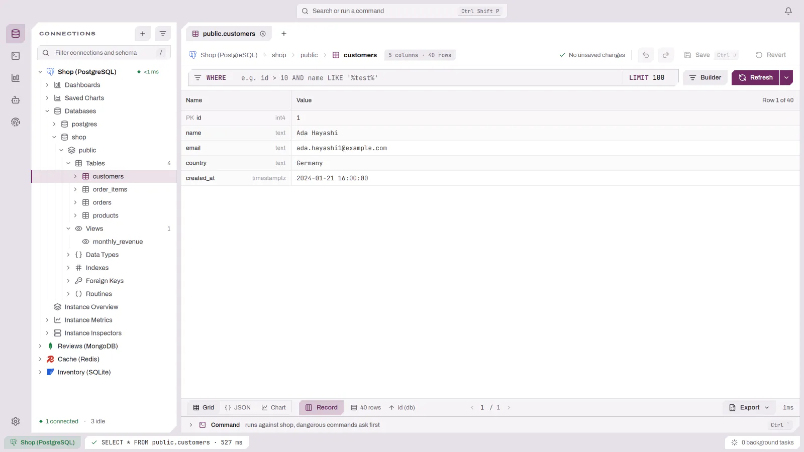
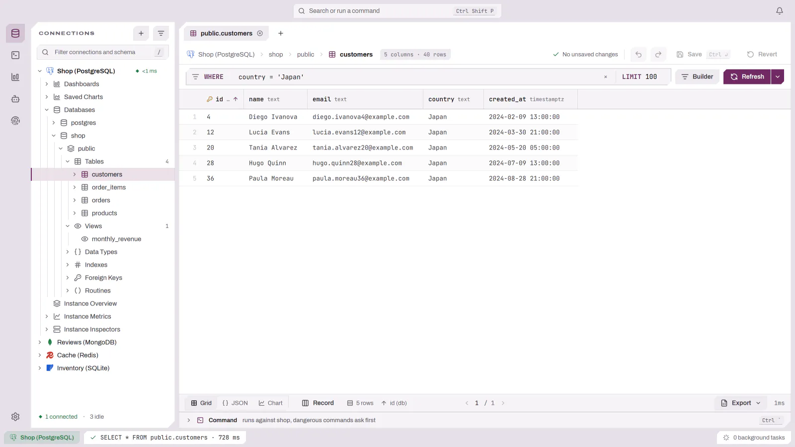
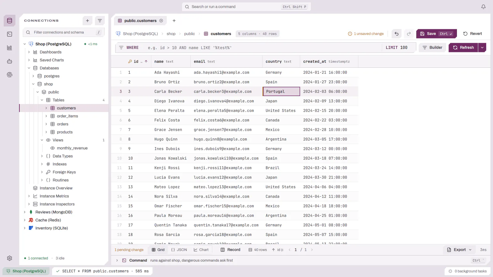

# 处理结果

结果渲染在文档内的结果标签页中。视图模式根据数据库类别自动选择：

- 关系型数据库使用**表格视图**。
- 文档集合（例如 MongoDB、DynamoDB）使用**表格视图**，同一页数据还可用**树**和 **JSON** 视图查看（见[文档集合](DOCUMENTS.md)）。
- Redis 使用**键值视图**（见[键值视图](KEY_VALUE.md)）。

当驱动声明了事件流呈现方式时，事件流类型的容器会作为事件流打开。

## 浏览数据网格

当结果面板获得焦点时：

- `j`/`k`（或 `Down`/`Up`）— 选择下一项 / 上一项。
- `h`/`l`（或 `Left`/`Right`）— 左移 / 右移一列。
- `g`/`Shift+g`（或 `Home`/`End`）— 选择第一项 / 最后一项。
- `Ctrl+d`/`Ctrl+u`（或 `PageDown`/`PageUp`）— 向下 / 向上翻页。
- `[` / `]` — 结果上一页 / 下一页。
- `f` 聚焦工具栏；`/` 聚焦搜索 / 筛选框。
- `z` 切换面板。
- `m`（或 `Shift+F10`）打开行 / 单元格上下文菜单。

## 记录视图

按 `i`，或使用结果状态栏中的「记录」切换，可将当前行显示为占满结果区域的
「名称 / 值」列表，标题会标出该行在结果中的位置。字段的编辑方式与网格单元格完全相同，
因此未保存的更改、保存行和还原在两种布局下行为一致；`Up`/`Down` 在字段间移动，
`Left`/`Right` 在行间移动。再按一次 `i` 返回网格。

<picture>
  <source media="(prefers-color-scheme: dark)" srcset="../images/results/record-view-dark.webp">
  
</picture>

## 列标题菜单

右键点击列标题可打开仅针对该列的菜单：升序或降序排序、清除排序，以及全部筛选运算符，
全部在一个平铺列表中。左键点击列标题仍然循环切换排序。

## 值面板

右键点击单元格并选择 **查看值**，或按 `v`，即可在右侧检查器栏中打开该单元格。面板会以
JSON、XML 或纯文本显示值（根据内容检测，且仅在确实能解析时），并提供格式化、压缩和自动换行。
可以直接在面板中编辑：**保存** 会直接提交该行，**还原** 会放弃更改。在网格中移动时面板会
跟随所选单元格，但在有未保存更改时不会跟随。

## 行检查器

按 `Ctrl+Space`，或右键点击某行并选择 **检查行**，即可在右侧检查器栏中打开所选行。它列出该行的
每一列及其值，标出主键列和外键列，并在 **引用** 下列出每个单列外键指向的表，解析完成后显示被引用的行。
在网格中移动时检查器会跟随所选行；标题中的固定按钮可让它停留在当前行。当结果可编辑时，底部的
**编辑**、**复制** 和 **删除** 作用于被检查的行。再次按 `Ctrl+Space` 或点击关闭按钮即可关闭。

## 筛选结果

数据网格工具栏有一个 `WHERE` 筛选输入框，会带上你输入的条件重新执行查询。对于 SQL 连接，它支持两种写法：

- **原生 `WHERE`** — 输入一个普通条件（例如 `status = 'active'`）。这是默认行为。
- **关系型（ORM 风格）路径** — 输入一个沿外键前进的点分路径，例如 `created_by.email LIKE '%@acme.com'` 或 `created_by.organization.name = 'Acme'`。DBFlux 会依据表的外键元数据解析该路径，并自动连接到被引用的表，无需手工编写 JOIN。

当关系型筛选解析成功时，会显示一个标签，说明它添加了多少个连接。如果某一段存在歧义或无法解析，会出现内联错误，并附一个 **在构建器中打开** 链接，用于打开可视化查询构建器，并预填已解析出的连接。不含点号的输入始终保持原生 `WHERE` 行为。

筛选输入框同样提供 Schema 感知自动补全（导航方式与构建器相同，参见[Schema 感知自动补全](QUERY_BUILDER.md#schema-感知自动补全)）。

<picture>
  <source media="(prefers-color-scheme: dark)" srcset="../images/results/filtering-dark.webp">
  
</picture>

## 编辑与增删改查

在数据网格中：

- `o` — 添加行。
- `x` — 删除选中的行。
- `r` — 重命名 / 编辑（随上下文而定）。
- `y` — 复制选中的行。
- `Ctrl+c`（`Cmd+c`）— 把选中的单元格复制到剪贴板。

<picture>
  <source media="(prefers-color-scheme: dark)" srcset="../images/results/editing-dark.webp">
  
</picture>

### 结果何时可编辑

普通的表浏览在表有主键时可编辑。由**构建器**（SELECT 模式）产生的结果同样可编辑，但前提是该结果可证明绑定到单一表：结果与唯一的底层表 1:1 映射，且该表的每个主键列都以原始名称被投影出来。此后，编辑和删除会依据投影出的主键值构造 `WHERE`。

允许 JOIN：来自源表的列可编辑，被连接的列则为只读。

构建器结果在以下任一情况成立时会回退为**只读**，并在工具栏给出原因提示：

- 查询使用了聚合，或使用了 `GROUP BY` / `HAVING`。
- 投影是跨 JOIN 的通配符。
- 某个主键列缺失，或以别名形式被投影。
- 表的键尚未从 Schema 缓存加载完成（键加载完成后，网格会自动升级为可编辑）。

在编辑器中手写的自由 SQL 始终保持只读；内联编辑只适用于普通表浏览和构建器生成的 SELECT。

### 聚合结果

当结果来自分组（`GROUP BY`）查询时，各行显示聚合后的输出，编辑功能被禁用 — 添加行、删除行、编辑单元格和检查行都不可用，并给出解释性提示。分页按分组后的行数计算（而不是底层行数），因此总页数是准确的。聚合列保持正确的列类型，因此仍能正常绘制图表。

## 复制为查询

结果上下文菜单中包含 **复制为查询**，它使用驱动自身的查询生成器，根据选中的行生成驱动专属的变更语句（对于非 SQL 驱动则是信封）。

## 导出

在结果面板中按 `Ctrl+e`（`Cmd+e`），或从命令面板执行 **导出结果**。可用格式取决于结果形态，包括：

- **CSV**
- **JSON（美化）** 与 **JSON（紧凑）**
- **文本**
- **二进制**（用于二进制形态的结果）
