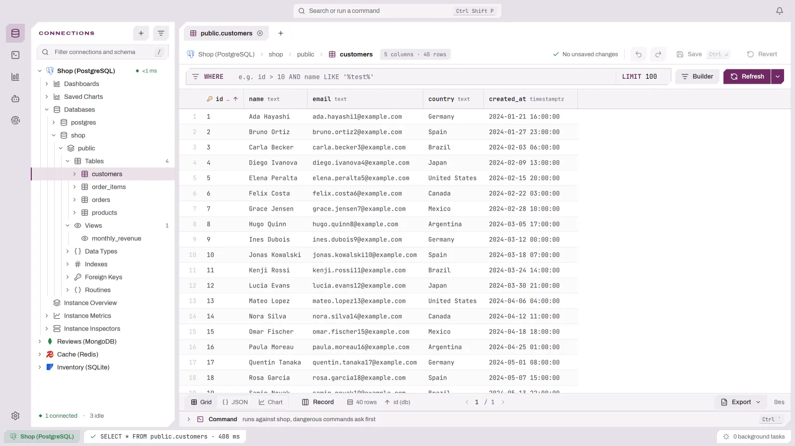

# DBFlux 使用指南

使用指南按任务拆分为多个页面。如果你刚开始使用 DBFlux，请从[快速开始](GETTING_STARTED.md)读起，它会带你从首次启动走到第一个查询；否则请直接选择与当前任务对应的页面。

<picture>
  <source media="(prefers-color-scheme: dark)" srcset="../images/usage/main-window-dark.webp">
  
</picture>

- [快速开始](GETTING_STARTED.md) — 首次启动、创建连接并执行第一个查询。
- [连接到数据库](CONNECTIONS.md) — 连接管理器、驱动、SSH 隧道、代理、AWS SSO 与取值来源。
- [浏览 Schema](SCHEMA_BROWSER.md) — 侧边栏、Schema 树、例程与 Schema 关系图。
- [执行查询](EDITOR.md) — 查询标签页、执行、脚本、危险查询确认与查询历史。
- [可视化查询构建器](QUERY_BUILDER.md) — 无需编写 SQL 即可构建 SELECT、UPDATE 与 DELETE。
- [处理结果](RESULTS.md) — 数据网格、记录视图、筛选、编辑与导出。
- [键值视图](KEY_VALUE.md) — 键、值、过期时间与命令控制台。
- [文档集合](DOCUMENTS.md) — 文档的表格、树与 JSON 视图。
- [CSV 和 TSV 文件](CSV_FILES.md) — 以表格或文本形式打开、编辑和保存分隔符文件。
- [图表](CHARTS.md)与[仪表盘](DASHBOARDS.md) — 为结果绘制图表并构建仪表盘。
- [键盘快捷键](KEYBOARD.md) — 全部默认键位，包括 Vim 模式。
- [设置](SETTINGS.md) — 每个设置项与连接 Hooks。
